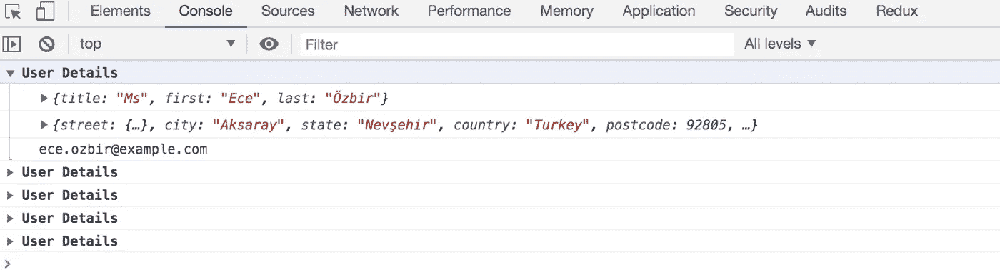

# 在浏览器控制台中高效管理日志记录的超级有用的方法

> 原文：<https://javascript.plainenglish.io/super-useful-way-to-efficiently-manage-logging-in-browser-console-217a88f0307e?source=collection_archive---------8----------------------->

## 避免弄乱你的浏览器控制台

Photo by [Sam Dan Truong](https://unsplash.com/@sam_truong?utm_source=medium&utm_medium=referral) on [Unsplash](https://unsplash.com?utm_source=medium&utm_medium=referral)

今天我们将看到一个非常有用的控制台方法，它有助于以有效的方式管理浏览器控制台日志。

如果你有一个遍历条目的循环，并且你想在每次迭代中看到变量值，你可以使用`console.groupCollapsed`方法。

它让我们可以很容易地看到输出，而不会弄乱控制台。

如果运行这段代码，您将看到如下所示的输出

这将避免混淆哪个日志属于哪个迭代，从而有助于在调试时修复问题。

今天到此为止。我希望你学到了新东西。

**别忘了直接在你的收件箱** [**订阅我的每周简讯，里面有惊人的技巧、诀窍和文章。**](https://yogeshchavan.dev/)