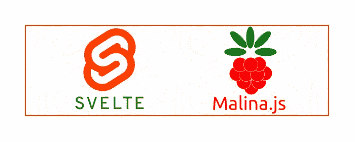
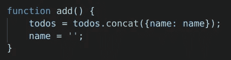
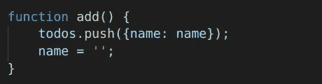
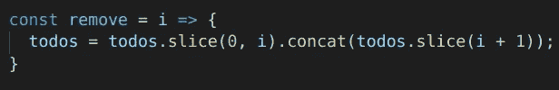
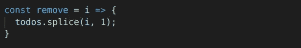

# 我在 Svelte.js 和 Malina.js 里创建了同一个 app，区别如下。

> 原文：<https://javascript.plainenglish.io/svelte-js-and-malina-js-b33c55253271?source=collection_archive---------0----------------------->



我喜欢 Svelte.js。既然我已经试过了，我想尝试另一种方法来检测变化/突变，当前的变化检测器是 Svelte 的关键之一，没有它 Svelte 就不是它自己。所以为了体验另一个变化检测器，我做了一个 Svelte 的小“姐妹”是 [Malina.js](https://github.com/malinajs/malinajs) ，它不是检查变量是否变化，而是检查绑定是否变化(*绑定检查*)。下面是几个如何更好的例子。

为了能够看出区别，我在 Svelte.js 和 [Malina.js](https://github.com/malinajs/malinajs) 上做了同样的 todo-app(*Svelte 使用数组的代码样式取自* [*官方 svelte-todomvc*](https://github.com/sveltejs/svelte-todomvc/blob/master/src/TodoMVC.svelte) )。

链接:[苗条待办事宜](https://svelte.dev/repl/3db994685aba408c897b40b25de41178?version=3.23.2)，[玛丽娜待办事宜](https://malinajs.github.io/repl/#/gist/e668fb17894a3a6993d109c9ee235003?version=0.6.36)。

让我们从函数“add”开始，在这里我们将 todo 项追加到数组中:



Svelte on the left. [Malina](https://github.com/malinajs/malinajs) on the right.

删除项目的代码:



Svelte on the left. [Malina](https://github.com/malinajs/malinajs) on the right.

你可以注意到 [Malina.js](https://github.com/malinajs/malinajs) 的代码更加紧凑，它检测突变，所以你可以使用 [Malina.js](https://github.com/malinajs/malinajs) 中的任何方法。

最有趣的情况是，当我们选择一个项目`on:click={() => active=todo}`，在这之后 todo-object 出现在两个地方——数组`todos`和变量`active`,并在两个地方呈现。所以如果你变异了这个对象`bind:value={active.name}`，Svelte 不会检测到，需要手动触发更新，Svelte:

```
<input on:keydown={enterEdit} bind:value={active.name} />const enterEdit = (e) => {
  if(e.keyCode == 13) active=null;
  todos=todos;  // trigger updating todos
}
```

在[马利纳](https://github.com/malinajs/malinajs)中:

```
<input on:keydown|enter={active=null} bind:value={active.name} />
```

这里不需要额外的代码，它像预期的那样工作——active . name 由输入更改并自动呈现在列表中，因为更改检测器检查绑定。你也可以通知一个事件修饰符 *"enter"* ，它只对键 *"Enter" -* 起作用，这很有帮助，我认为如果 Svelte 有它就好了(vue.js 也有)。

再举一个例子就是改变(反转) *todo.name* ，苗条:

```
const reverse = todo => {
  let newName = todo.name.split("").reverse().join("");
  todos = todos.map(item => ({
    name: item==todo?newName:item.name
  }));
}
```

[Malina.js](https://github.com/malinajs/malinajs) ，换个名字就行了:

```
const reverse = todo => {
  todo.name = todo.name.split("").reverse().join("");
}
```

所以你可以看到 Svelte 里面的代码看起来像是纯 JS，但是我不能自由使用 JS。

**Svelte** 为*提供了一种不可变的方式*——但这只是隐藏“赋值”的面具，因为赋值触发了更新，而不是不可变。所以写`todos=todos`就够了，之后那个苗条触发更新。

所以 Svelte 中不变性的主要原因是为了让 JS 看起来更自然，为了逃离毫无价值的`todos=todos`，这类似于来自其他框架的命令`setValue/setState`。

[**Malina.js**](https://github.com/malinajs/malinajs) 让我改变对象和数组，它的工作方式和我对 JavaScript 的期望一样。

## 还有什么不同？

这是构建 DOM 的另一种方式，让我们来看看这个小片段:

```
<div class="some class">
  <span on:click={click}>
    <b>a lot of <i>html</i> can be here</b>
  </span>
</div>
```

编译后它在 **Svelte** 中的样子(Svelte 一个元素一个元素地构建它):

```
div = element("div");
span = element("span");
b = element("b");
t0 = text("a lot of ");
i = element("i");
i.textContent = "html";
t2 = text(" can be here");
attr_dev(div, "class", "some class");
...
insert_dev(target, div, anchor);
append_dev(div, span);
append_dev(span, b);
append_dev(b, t0);
append_dev(b, i);
append_dev(b, t2);
...
dispose = listen(span, "click", click, false, false, false);
```

[**看起来怎么样 Malina.js**](https://github.com/malinajs/malinajs) :

```
$element.innerHTML = `<div class="some class"> <span> <b>a lot of <i>html</i> can be here</b> </span> </div>`;$element.childNodes[0].childNodes[1].addEventListener('click', ...);
```

作为一个操作插入一个模板，`node.cloneNode(true)`用于`#each`和`#if` *(Solid.js 工作方式类似)*中的可重复块。

它提供了更小的包大小和略好的性能*(在 Firefox 中重新渲染列表的速度提高了两倍)*，例如，我编译了相同的 [TodoMVC](https://github.com/malinajs/todomvc) 应用程序:

*   **Svelte:****3.7 kb**gzipped(*去掉了一代 uuid 等于*)，
*   **Malina:2.7 kb**gzipped([source](https://github.com/malinajs/todomvc))。

最后改变的是事件绑定的样式，它取自 **Angular** ，所以在 Malina.js 中它看起来像`on:click={reverse(todo)}`而在 Svelte 中它是`on:click={() => {reverse(todo)}}`，但是它还没有最终决定。

## [今天能做什么](https://github.com/malinajs/malinajs)

Malina.js 太年轻了*(我两周前才开始使用)*，所以它还没有太多的功能，但最重要的功能是简单的应用程序和小工具所需要的。

目前有:绑定、绑定事件、类/风格、if-else 块、for-each 块、自定义指令/动作、反应(检测变化)，所有这些你都可以在[的例子中看到](https://malinajs.github.io/repl/)。

## 试试 [Malina.js](https://github.com/malinajs/malinajs)

*   你可以在 REPL *(也是用*[*malina . js*](https://github.com/malinajs/malinajs)*—短短 140 行代码)在线试试*
*   如果你不想安装 **nodejs** 之类的东西:`docker run — rm -it — user ${UID} -p 7000:7000 -p 35729:35729 -v `pwd`:/app/src lega911/malina`，你也可以通过 **docker** 运行它，并实时重载
*   或者通过 npm/npx 安装模板:

```
npx degit malinajs/template myapp
cd myapp
npm install
npm run dev
# open http://localhost:7000/
```

## 结论

Malina.js 就像另一个变化探测器的苗条身材。它有助于更自由地使用 JavaScript，具有更多预期的行为。更简单的 JavaScript 使开发过程更容易。

感谢您的阅读，请留下反馈。

*Rich 说过 Svelte 不仅仅是一个编译器，它是一种语言，Svelte-language，但是我仍然想使用 JavaScript。*

## 链接

*   [github 上的 malina . js](https://github.com/malinajs/malinajs)
*   [在线编辑 REPL](https://malinajs.github.io/repl/)
*   [todo MVC 的来源](https://github.com/malinajs/todomvc)
*   [TodoMVC](http://malina-todomvc.surge.sh/)

## **简单英语的 JavaScript**

喜欢这篇文章吗？如果有，通过 [**订阅我们的 YouTube 频道**](https://www.youtube.com/channel/UCtipWUghju290NWcn8jhyAw) **获取更多类似内容！**