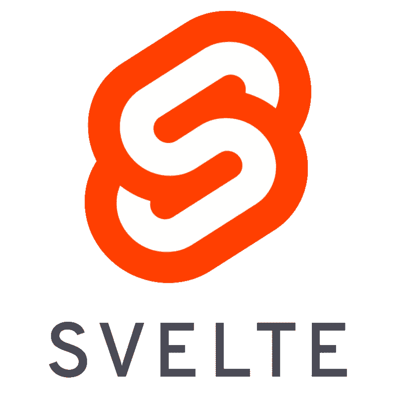

# 苗条地跑起来

> 原文：<https://javascript.plainenglish.io/svelte-tutorials-1-1f49699da2c0?source=collection_archive---------8----------------------->

## 反应性、道具、逻辑导论

这篇文章是苗条教程系列之一。

1.  [本帖]与苗条的人一起跑步
2.  [如何苗条地处理事件](https://medium.com/@kim.jangwook/svelte-tutorials-2-e965737edf63)
3.  [如何将数据绑定到瘦组件中](https://medium.com/@kim.jangwook/how-binding-data-into-svelte-component-3909c9fb3bdb)
4.  [细长组件的生命周期](https://medium.com/javascript-in-plain-english/lifecycle-of-the-svelte-component-ef00c1969a4a)

## 介绍

Svelte 是一个构建快速 web 应用程序的工具。它类似于 React 和 Vue，都是用于轻松构建 web 应用程序的工具，但还是有所不同。

Logo of the Svelte

> 在构建时运行苗条。

这种差异保证了 Svelte 的高速度。Svelte 不需要很长的首次加载时间，浏览器也不需要支付使用 Svelte 的费用。

因此，使用 Svelte，您可以轻松地将基于 Svelte 的源代码添加到现有的应用程序中。当然，您也可以轻松地创建新应用程序。

## 成分

组件是指由 HTML、CSS、JavaScript 组成的封装代码块。

Svelte 应用程序由一个或多个组件组成，每个组件文件都有。纤细的伸展。

## 你好世界

1.  您可以在标记部分使用变量。
2.  你可以在花括号区域使用简单函数。

## 速记属性

1.  如果变量名和属性名相同，可以将`attribute={variable}`替换为`{variable}`。
2.  您可以在属性中使用变量和文字值。

## 范围样式

1.  你可以像 HTML 一样使用`<style>`标签。
2.  风格规则是`scoped`。

## 嵌套组件

1.  使用`import`语句，你可以很容易地使用另一个组件。
2.  风格规则是`scoped`。段落样式不适用于嵌套组件上的段落标记。

## HTML 标签

1.  如果你想要 html 字符串作为变量，你应该使用`{@html variable}`语句。

## 反应

1.  您可以将函数绑定到`on:click`事件。
2.  您可以声明通过改变其他变量的值来计算的反应变量或反应函数。如果要使用这个，使用`$:`语句。
3.  在 svelte 中，`push`和`splice`等数组方法不起作用。

## 小道具

1.  要将一个变量传递给另一个瘦组件，应该在加载的组件上使用`export`语句。
2.  如果你想声明一个`props`的默认值，你只需要在声明`export`语句时分配值。
3.  要使用属性的对象，使用`spread`语法而不是指定每一个。

## 逻辑 1:条件，循环

1.  如果要使用逻辑，从`{# ...}`开始，继续`{:...}`并以`{/ ...}`语句结束。
2.  当你修改一个`each`块的值时，它会在块的末尾添加/删除项目。如果您不指定一个惟一的标识符(在这个例子中，它意味着`thing.id`，您可能不会得到您想要的结果。

## 逻辑 2:等待块

大多数现代 web 应用程序都使用异步请求来获取数据。Svelte 支持以加价的方式达成承诺。

比如降价？为什么不用 [Markdium](https://markdium.dev/) 试着在 Markdown 介质上写呢！

## 用简单英语写的 JavaScript 的注释

我们总是有兴趣帮助推广高质量的内容。如果你有一篇文章想用简单的英语提交给 JavaScript，用你的中级用户名发邮件到[**submissions@javascriptinplainenglish.com**](mailto:submissions@javascriptinplainenglish.com)给我们，我们会把你添加为作者。

我们还推出了三种新的出版物！为我们的新出版物献上一点爱心吧，请跟随他们:[**AI in Plain English**](https://medium.com/ai-in-plain-english)，[**UX in Plain English**](https://medium.com/ux-in-plain-english)，[**Python in Plain English**](https://medium.com/python-in-plain-english)**——谢谢，继续学习！**