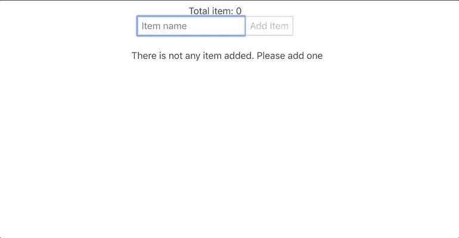
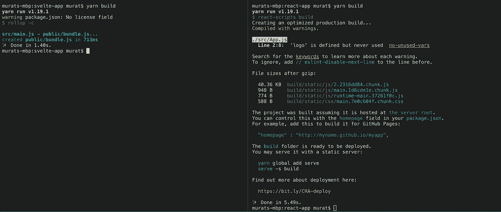
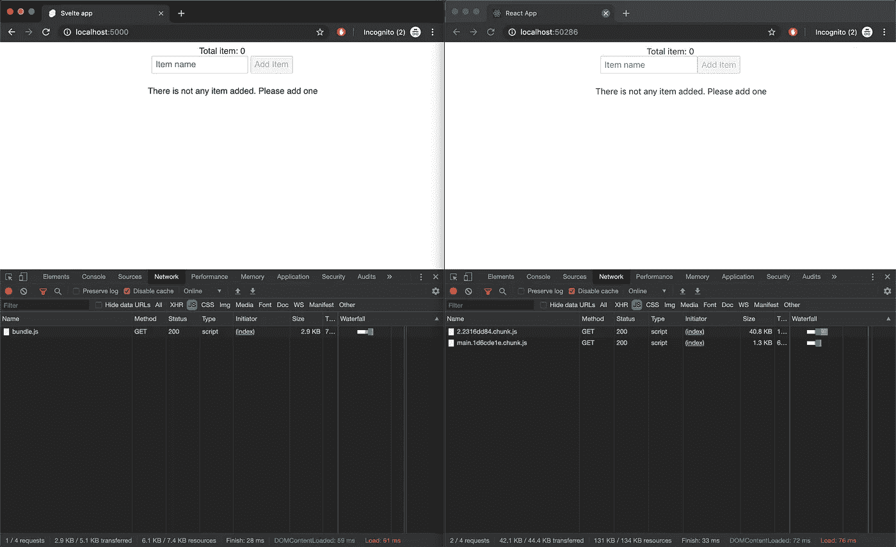

# 苗条与反应:第一印象

> 原文：<https://javascript.plainenglish.io/svelte-vs-react-first-impression-1ce5d3ee6889?source=collection_archive---------0----------------------->


Photo by [Coffee Geek](https://unsplash.com/@coffeegeek?utm_source=medium&utm_medium=referral) on [Unsplash](https://unsplash.com?utm_source=medium&utm_medium=referral)

3 年前，Rich Harris 创建了一个名为 Svelte 的框架。对这个新框架最大的影响是它不适用于像 ReactJS、VueJS 或 AngularJS 这样的虚拟 DOM。

我在 Svelte 和 React 中创建了完全相同的待办事项列表应用程序。我所指的不仅仅是它的功能或视觉性，而且我没有使用任何第三方库，也没有使用它们的内部 API 来管理一个工作的应用程序。

我们的 todo 应用程序将有列表，添加和删除项目。每个项目都将存储在全局状态中。此外，还有一些组件将订阅全局存储，并在更改时显示当前值

> Svelte 和 React 源代码都在 [github](https://github.com/muratcatal/svelte-vs-react-todolist) 上



Todo list

# SvelteJS

```
$ npx degit sveltejs/template svelte-todo-list
```

## Svelte 简介

*   在 DOM 上工作，没有虚拟 DOM
*   Svelte 有文件。苗条的延伸
*   用 svelte 文件编写的每个都是 css 范围的。
*   您可以使用它的内部存储 API。不需要安装外部库
*   使用默认配置按汇总生成。但是，您也可以使用 Parsel 和 Webpack。
*   您可以很容易地订阅任何变量，但是它有一些检测数组突变的方法。(这个我不喜欢)
*   你可以像写一个 html 文件一样，在 svelte 文件中写 javascript、html 和样式。(有细微差别)
*   您可以使用 **on:** 前缀访问 DOM 事件，例如，单击 ={} / >上的<按钮
*   您不需要将回调从孩子传递给父母。您可以使用 createEventDispatcher。
*   您以{#}开头，以{/}结尾，例如{#if}…{/if}

## ReactJS

```
$ npx create-react-app react-todo-list
```

## 关于 ReactJS 的简要信息

*   使用虚拟 DOM
*   您可以使用 React 的内部全局状态管理，称为上下文 API
*   您编写的是纯 javascript，没有块元素语法可以像 Svelte 一样做出特殊反应(#if，#每个……)
*   DOM 事件只是 javascript 事件，所以您可以像使用纯 javascript 一样使用 onClick*(click 的 standart DOM 事件是 onClick！但是，您的 OnCLICK oNCLiCk 也将由浏览器呈现。)*
*   文件扩展名为。射流研究…

## 一些代码比较

让我们比较一下 Svelte 和 reaction 的一些要点。

## App.svelte

```
<script>
  import TodoHeader from "./TodoHeader.svelte";
  import TodoList from "./TodoList.svelte";
  import { itemStore } from "./store";
</script><style>
  main {
    font-family: sans-serif;
    text-align: center;
  }
</style><main>
  <div>Total item: {$itemStore.length}</div>
  <TodoHeader />
  <TodoList />
</main>
```

## App.js

```
import React from 'react';
import './App.css';
import { TodoHeader } from './TodoHeader';
import { TodoList } from './TodoList';
import { TodoListProvider } from './store';
import { Total } from './Total';function App() {
  return (
    <TodoListProvider todoList={[]}>
      <Total />
      <TodoHeader />
      <TodoList />
    </TodoListProvider>
  );
}export default App;
```

应用程序文件是这两个框架的入口点。两者之间没有太大的区别，它们都有要渲染的组件。 ***这里唯一的区别在于全局样式绑定*** 。在反应中，用于反应的包装组件。ContextAPI 是所有子级的父级，而在 Svelte 中，不需要全局状态的包装器。

SVE te/store . js

```
import { writable } from "svelte/store";const createItemStore = () => {
    const { subscribe, update } = writable([]);return {
        subscribe,
        addItem: newItem => update(items => {
            if (!items.find(item => item === newItem)) {
                items.push(newItem);
            }
            return items;
        }),
        removeItem: removedItem => update(items => {
            const newItems = items.filter(item => item !== removedItem);
            return newItems;
        })
    };
};export const itemStore = createItemStore();
```

reactor/store . js

```
import React, { useState } from 'react';export const TodoListContext = React.createContext({});export const TodoListProvider = ({ todoList, children }) => {
    const [todos, setTodos] = useState(todoList);const addItem = (item) => {
        if (!todos || !todos.find(listItem => listItem === item)) {
            setTodos([...todos, item])
        }
    };
    const removeItem = (item) => {
        setTodos(
            todos.filter(listItem => listItem !== item)
        )
    };return (
        <TodoListContext.Provider
            value={{
                todoList: todos,
                addItem,
                removeItem
            }}
        >
            {children}
        </TodoListContext.Provider>
    )
}export const TodoListConsumer = TodoListContext.Consumer;
```

这两家商店做同样的事情。它们都有改变存储数据的操作方法。然而，在 React 中使用上下文 API 和创建类似于 Svelte 的相同结构可能会有些痛苦。如上例所示，首先，我们从 createContext 创建了一个上下文，在我们的 Provider 中，我们必须使用钩子在本地存储值。在 Svelte 中事情更简单，你只需要创建一个可写的存储，初始化它的值，然后用它的动作返回你的值。

苗条/丰满

```
<script>
  import { itemStore } from "./store";
  const handleRemoveItem = item => {
    itemStore.removeItem(item);
  };
</script><style>
  ul {
    list-style-type: none;
  }
</style><ul>
  {#each $itemStore as item}
    <li>
      {item}
      <button on:click={() => handleRemoveItem(item)}>Remote Item</button>
    </li>
  {/each}
  {#if $itemStore.length === 0}
    <div>There is not any item added. Please add one</div>
  {/if}
</ul>
```

反应/分解

```
import React, { useContext } from 'react';
import { TodoListContext } from './store';export const TodoList = () => {
    const todoListContext = useContext(TodoListContext);
    const handleRemove = (item) => {
        todoListContext.removeItem(item);
    }const { todoList } = todoListContext;return (
        <ul>
            {todoList && todoList.map(todoList => {
                return (
                    <li>
                        {todoList}
                        <button onClick={handleRemove.bind(null, todoList)}>Remote Item</button>
                    </li>
                )
            })}
            {(todoList.length === 0) && (<div>There is not any item added. Please add one</div>)}
        </ul>
    )
}
```

迫使我编写第一个苗条应用程序的是在组件中使用条件和循环。我不喜欢在循环或条件中使用语法而不是纯 javascript。但是，访问商店项目只需要导入，而不需要任何外部挂钩或层来访问全局存储，这是 Svelte 和 React 之间的关键区别。

苗条/肥胖的头

```
<script>
  import { onMount } from "svelte";
  import { itemStore } from "./store";
  let value;
  onMount(() => {
    value = "";
  });
  const handleAddItem = () => {
    itemStore.addItem(value);
    value = "";
  };
</script><style>
  .disabled {
    color: graytext;
  }
</style><input type="text" bind:value placeholder="Item name" />
<button on:click={handleAddItem} disabled={!value} class:disabled={!value}>
  Add Item
</button>
```

反应/至主管

```
import React, { useContext, useState } from 'react';
import { TodoListContext } from './store';export const TodoHeader = () => {
    const todoListStore = useContext(TodoListContext);
    const [itemName, setItemName] = useState('')const handleAddItem = (e) => {
        e.preventDefault();
        todoListStore.addItem(itemName);
        setItemName('');
    }return (
        <>
            <input placeholder="Item name" type="text" value={itemName} onChange={(event) => setItemName(event.target.value.trim())} />
            <button onClick={handleAddItem} disabled={!itemName} className={!itemName && 'disabled'}>Add Item</button>
        </>
    )
}
```

在 Svelte 中，您不需要将输入的值存储在外部状态中。Svelte 使将关键字绑定到任何现有属性变得更加容易，它还有一个附加特性，即您可以使用反应性声明跟踪适当的更改，而无需为值(而不是数组)付出额外的努力。

## 结果

此外，让我们分享一些我在开发过程中遇到的关于构建过程、困难和便利的结果。

我遵循完全相同的模式，同时开发两者。我没有使用任何外部库，只使用了内部 API 的两个框架支持。存在连接到全局状态的组件。有些组件订阅了全局状态变量。

## 我喜欢苗条的❤️

*   建筑真的很快。但这也可能是因为使用了 Rollup 作为捆绑器，我认为用 Webpack 测试捆绑也是不错的。
*   同样，相对于 React，包的大小确实很小。然而，这也可能是因为 Rollup 的树摇动性能。
*   它的商店使用非常灵活。您可以在 store 中修改您的组件，并开始轻松地订阅或变更 store 值。❤️
*   我喜欢在一个组件中编写的所有样式都是作用域 css。
*   绑定一个条件样式有简单的语法，你不需要为类绑定创建一个逻辑。(*class:disabled =变量)*

## 我不喜欢苗条💔

*   我真的不喜欢在一个文件中编写模板，比如#each，#if。我不喜欢使用新的方法，因为我可以完全用 JavaScript 来完成。
*   当你使用反应性声明来订阅一个变量变化时，Svelte 不能检测数组上的突变。Svelte 为这种情况提供了一些简单的方法。
*   一些开发人员可能喜欢在一个组件中编写模板，但这仍然是我不喜欢的。此外，这种方法导致使用我在第 1 项中提到的循环、条件等的模板。
*   你应该给列表中的每一个条目一个唯一的 id，否则每当你想对列表中的条目进行操作时，一个错误的条目就会被影响。
*   DOM 事件中的使用风格，比如 *on:click* 是我不喜欢的事情之一。我更喜欢使用 onClick 作为普通的 DOM 事件。*(点击的标准 DOM 事件是 onclick！然而，您的 OnCLICK oNCLiCk 也将由浏览器呈现。)*

## 生产构建比较

SvelteJS 在默认设置中使用 Rollup 和 ReactJS Webpack，我没有接触过它们的配置，它们都有默认配置。苗条的建造时间是**1.40 秒**，而 React 建造时间是**5.49 秒**。苗条赢了！❤️



Build Times

这两个应用程序都是由服务 npm 包提供的。Svelte 将其包导出到公共文件夹，而 react 应用程序将它们放入构建文件夹。

```
serve -s build  // this is for react app
serve -s public // this is for svelte app
```

当我检查网络选项卡时，Svelte 的包在 gzip 之后只有 2.9 KB，而 React 的包在 gzip 之后只有 42.1 KB。这里再次苗条的 w️️ins 与它的捆绑大小在生产❤️



Svelte vs React in production build instead of size

*如果你喜欢我的文章，可以鼓掌支持我，关注我。
我也在*[*LinkedIn*](http://www.linkedin.com/in/muratcatal)*上，欢迎所有邀请。*