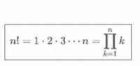

# JavaScript 中的尾调用——会卷土重来吗？

> 原文：<https://javascript.plainenglish.io/tail-calls-in-javascript-will-there-be-a-comeback-63ac3a0523a5?source=collection_archive---------3----------------------->

## JavaScript 从 Node 开始得到尾部调用。JS 6.17.1 但是它们还会被支持吗？

[Pixabay](https://www.pexels.com/de-de/@pixabay) via [pexels](https://www.pexels.com/de-de/foto/abgeschlossen-barb-drahte-barriere-baustelle-209717/) (CC0)

下一个级别可能不会出现在 JavaScript 中，但是其他语言支持它。

为了解决周期性任务，您有两种选择。迭代或递归。当您决定进行迭代时，可以使用循环结构，如 for 循环、forEach 循环等等。如果你选择递归，你将采用一种允许函数调用自身的机制。迭代的部分在于函数本身的反复调用。

我们可以用一个数学例子来说明这一点。函数是一个数学函数，它定义了从 1 到 n 的所有自然数。

这种数学运算很快就会得出相当大的数字。10 的教职员工已经超过 300 万。映射成数学术语就会造成这个定义。

但是也可以声明数学递归:

主要的关键方面是澄清两种表示是平等的。可能会出现一个比另一个更适合的情况，但这取决于具体情况和你的任务说明。在代码中使用函数通常会导致递归的出现。这就更容易理解计算 4！还包括 3 的计算！。

# 选哪个？递归还是迭代？

对于编码的部分，我们必须选择一个，尽管两种方法基本上是一样的，我们一次只能实现一个。两者都有优点和缺点需要注意。

## 递归

这是在 JavaScript 中使用递归实现数字功能的方法。

这里明显的优点是可读性，因为我们用一个已经递归格式化的解决方案来处理这个问题。选择递归时要小心。同一函数的每个新调用都需要随机存取存储器。一些环境具有有限的 RAM，或者如果您主要使用递归，您很容易陷入堆栈溢出的困境。这种情况通常发生在你没有正确定义你的分类检查的时候。

## 循环

这是循环的方式。只要因子低于初始输入值，简单的 for 循环迭代。例如，输入 4 将迭代 3 次，结果为 4 * 3 * 2 * 1 = 24；

我们没有开销，也不用担心堆栈溢出。反对这种解决方案的是源代码的可读性。原因不在于循环结构，而在于这样一个事实，即函数是一个递归场合，我们必须在读取代码时将这个递归移植到迭代结构中。这种转换需要时间，并且会减慢阅读过程。

考虑两种方法的相等性将会得出这样的结论:如果两种方法相等，那么每一次递归都可以转化为一次迭代，反之亦然。这意味着编译器可以将我们的代码编译成编码/读取最差的部分。然后，我们可以为递归问题递归地编写代码，并让编译器将代码编译成迭代语句。我们不用再读书了。我们不会看到编译后的代码。这只是为了运行应用程序。

由于 JavaScript 将这一原则用于其他几个代码部分，如 async & await 或 yield，它们被映射到一个状态机中，所以这并不困难。

# 使用尾部调用进行转换

当我们使用*结束递归*，更好地被称为尾调用[1]时，我们可以实现我们的理论。这个名字来源于这个函数的最后一次调用是递归调用。仔细检查*X2 _ 1 _ 递归. js* 的最后一行可以清楚地看到，这个函数不能处理尾部调用。

如果忽略 return 语句，那么正在发生的最后一个动作是与 n 相乘。递归调用已经发生并被求值。为了将此转换为尾调用，我们必须在两者之间实现一个参数。然后，该参数将保存一个临时结果，并将该值传递给该函数的下一次调用。一个流行的名称是“累加器”，我们可以用 acc 来缩短它。一旦我们完成了所有这些步骤，最后一行将会像这样。

我们将新的参数 acc 传递到函数中，并且必须改变整个函数的递归函数。

这样做，我们就可以满足我们的需求，编写递归，在编译后转换成迭代。

为了解释这一点:我们必须在堆栈中覆盖函数的参数，并从函数的开始处继续执行代码。这给人一种函数递归调用自身的印象，但实际上，有一个*跳转到*的跳转指令。

# JavaScript 中对尾部调用的支持

我在这里解释的听起来很容易理解，也很容易实现。现实世界看起来完全不同。

节点中的编码。JS，你会很快找到不同版本的支持。[2]

*   直到 6.4.0 才完全支持尾部调用
*   6.17.1 和 7.5.0 & 7.10.1 也获得了支持
*   从 8.2.1 开始，他们又开始踢尾巴了

这不是唯一的节点。JS 故障但更多的是谷歌 chrome 的 V8 引擎。它们与 Node.JS 有着相似的支持历史。它被淘汰的主要原因是缺乏调试支持。调用函数在源代码中，但不再在堆栈中，这导致了混乱，因为看起来函数只被调用了一次。在错误查找和调试过程中会产生更多的问题。

safari 浏览器是一款支持尾部调用的浏览器！【6】，【7】

自 2016 年以来，TC39 提案[3]中对此进行了公开讨论。一些开发人员强烈希望 JavaScript 支持尾部调用优化。目前有一个通过使用预定义的关键字显式选择加入的尾部调用的活动提案。该提案称之为句法尾调用。他们将尾调用优化称为适当尾调用(PTC)。

使用类似于 *return continue* 的语句来声明尾部调用，开发人员可以选择是否利用这种调用堆栈优化。在我看来，这可能是一个好的解决办法。它允许争论双方的开发者得到他们想要的。开发人员必须有意识地得到他想要的东西，因为利用尾部调用是显而易见的。因此，这种解决方案假定编码者知道他或她在做什么。

有些人可能会抱怨说，他们希望以含蓄的方式来完成。不幸的是，不管将来会有什么样的解决方案。不会让所有人都满意。虽然，我觉得这是一个合适的妥协。语法尾调用仍然处于提议状态，这个主题也是很久以前提出来的，并且有许多不同的意见，在我们看到它在浏览器中实际实现之前，可能还需要几年时间。

但是最重要的是，如果你看了我的第一个[链接](https://www.geeksforgeeks.org/tail-recursion/)，你会发现其他语言也支持它，你可以带着在这里学到的知识回去！[1]

# 结论

甚至因为最后一部分和长时间的讨论，我认为负责人正在使用一种策略，把一切都掩盖起来。讨论从 2016 年开始，当我研究 TC39 的计划时，我认为这不再是一个相关的话题。有价值的是以这里提到的优化方式编写代码，知道递归和迭代结构之间的区别。

如果您在特定节点中工作。6.17.1 到 7.10 的 JS 版本，坚持 ES2015/ES6 的 ES 版本，只坚持 safari 或使用另一种语言你会节省自己很多学习这种编码方式的时间。节点使用的 V8 引擎。JS 没有进一步追求这种特性。[5]

关于 TCO 的不确定未来，参见堆栈溢出中的这个回答: [ES6 尾部递归优化](https://stackoverflow.com/questions/42788139/es6-tail-recursion-optimisation-stack-overflow)。

为你自己节省大量的时间，专注于重要的主题。

# 继续读

 [## JavaScript ECMAScript 历史-隐藏的特性

### 关于 ECMAScript 版本中不流行的技巧的 JavaScript 历史指南

towardsdatascience.com](https://towardsdatascience.com/javascript-ecmascript-history-the-hidden-features-acb38af57be8)  [## JavaScript Async Await:承诺未来不再回调！

### 对承诺的回调直到异步等待

medium.com](https://medium.com/javascript-in-plain-english/javascript-async-await-promisify-the-future-to-callback-never-again-6762707e18e5)  [## JavaScript ES6 模块导入导出

### ES6 模块导入导出业务用 JavaScript 和 JS 遗留代码

medium.com](https://medium.com/javascript-in-plain-english/javascript-es6-modules-import-export-129a90e83ad6) 

# 链接

【1】尾叫[https://www.geeksforgeeks.org/tail-recursion/](https://www.geeksforgeeks.org/tail-recursion/)

[2]尾音优化节点 js es 2015【https://github.com/nodejs/CTC/issues/3 

[3]讨论 TC39【https://github.com/tc39/proposal-ptc-syntax 号

[4]堆栈溢出 post 到 TCO [ES6 尾部递归优化](https://stackoverflow.com/questions/42788139/es6-tail-recursion-optimisation-stack-overflow)

[5] Chrome 平台状态[https://www.chromestatus.com/feature/5516876633341952](https://www.chromestatus.com/feature/5516876633341952)

[6] Safari 支持 Tail calls[https://medium . com/indigoag-eng/Tail-call-optimization-in-the-wild-26 a10e 450 c 73 #:~:text = Safari % 20 does！，即% 20 支持% 20tail % 2Dcall %优化](https://medium.com/indigoag-eng/tail-call-optimization-in-the-wild-26a10e450c73#:~:text=Safari%20does!,that%20supports%20tail%2Dcall%20optimization)。

[7] Safari 支持尾部调用[https://iryl . info/2020/09/19/improve-your-recursion-performance-with-Tail-call-optimizations/](https://iryl.info/2020/09/19/improve-your-recursions-performance-with-tail-call-optimizations/)