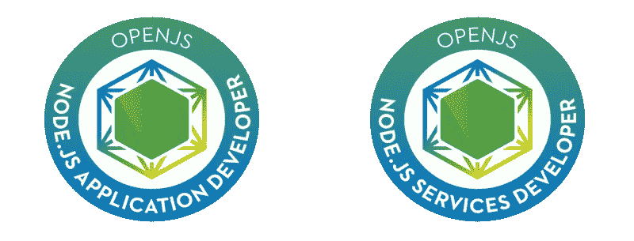

# OpenJS Node.js 应用程序开发人员认证:您需要知道的一切

> 原文：<https://javascript.plainenglish.io/taking-the-openjs-node-js-application-developer-certification-4081681bdfc4?source=collection_archive---------6----------------------->

几个月前，Linux 基金会公布了预期的 Node.js 认证: [OpenJS Node.js 应用开发者](https://training.linuxfoundation.org/certification/jsnad/)和 [OpenJS Node.js 服务开发者](https://training.linuxfoundation.org/certification/jsnsd/)。在这里，您可以找到关于认证要求、主题、流程和价格的所有必要信息。到目前为止，当您获得考试优惠券时，您将获得一次免费的第二次机会。

[考生手册](https://training.linuxfoundation.org/go/JSNAD/CandidateHandbook)和[提示文件](https://training.linuxfoundation.org/go/JSNAD/Tips)是我推荐你仔细阅读的两份重要文件。

当我第一次开始寻找有关考试的信息时，除了这两篇帮助我理解考试过程和从中期待什么的文章，我没有找到太多可用的信息。

*   [一篇关于节点认证过程的博客文章](https://www.nearform.com/blog/node-js-developer-certification-what-to-expect/)
*   [参加考试的人对认证过程的印象](https://dev.to/kryz/node-js-certification-first-impressions-21a1)

在这篇文章中，我想分享一下我获得 OpenJS Node.js 应用程序开发人员认证的经验。

# 考试准备

我的方法是跟踪这个资源:

 [## 嘿 Node 的 Node.js 认证学习指南

### JSNAD 和 JSNSD 考试是由 OpenJS 基金会创建的两个新工具，开发人员可以使用它们来演示…

www.nodecertification.com](https://www.nodecertification.com/) 

*   在那里你可以找到考试中 13 个主题的链接。
*   有些链接有点旧了，所以在阅读时要注意这一点。
*   请务必阅读每个主题的官方文档(您可以在它们旁边找到相关链接)。请务必阅读适用于 node 10.x .版本的指南，因为这是用于认证的指南。
*   编写代码并测试每一个主题，确保理解每个主题的方法和原因。我在这个 [GitHub 库](https://github.com/amcereijo/node-certification)中编译了一组例子，这些例子基于我对一些用例的阅读和测试，这些用例是我为了涵盖一些主题而编造的。

请务必阅读所有的主题，并尝试几乎所有的东西。在考试期间，你将有机会接触到官方文件。在文档中寻找一些具体的概念是可以的，否则你会花费更多的时间，并且不能按时完成要求的任务。

回顾了所有这些资源之后，这一点非常重要。但是有扎实的 javascript 基础也很重要。你需要知道类似 ***作用域和闭包、异步任务和错误处理(同步和异步)*** *这样的事情。*请注意，你将会被问到很多关于这些概念的问题，在考试过程中，你会发现很好地理解这些概念是必需的。有很多非常好的书可以学习 javascript。其中一些甚至可以免费在线阅读，比如:

*   [面向缺乏耐心的程序员的 JavaScript】](https://exploringjs.com/impatient-js/toc.html)
*   [雄辩的 Javascript](https://eloquentjavascript.net/)
*   [你不知道 JS](https://github.com/getify/You-Dont-Know-JS/blob/1st-ed/README.md)；请注意，第二个版本仍在另一个分支中进行。

# 参加考试

考试信息:

*   该考试不像其他认证考试那样有单项或多项选择题或完成或诸如此类的内容。在这次考试中，你将在“真实”的环境中编写真实的代码。
*   考试将会有一系列包含主题的练习。每个主题可以有一到两个练习。
*   该环境将基于浏览器(推荐 Chrome ),由一个扩展支持，您需要安装该扩展来监控您的活动，更多信息[请点击此处](https://training.linuxfoundation.org/wp-content/uploads/2020/01/JSNAD-Important-Tips-v1.3.pdf)。在浏览器中，您将加载一个虚拟 CentOs 系统，其中有 3 个不同的选项可供您编写代码:vim、VSCode 和 WebStorm。你需要选择一个你想在考试中使用的。当你登录系统时，它会显示一个打开的浏览器，其中有一个页面列出了考试的主题(它帮助我记住了从 1 到 13 中的哪个数字是每个主题，并可以选择哪个主题开始或继续)。
*   你必须有一个摄像头，在一个位置，让审查者看到你所有的时间(你的脸和手)。你需要向摄像机出示你的个人身份证(以证明你是谁),并显示你当时所在的房间。

您可能遇到的问题(我已经全部解决了):

*   确保你的浏览器只有一个带标签的窗口。否则，屏幕共享将不起作用(最小化其他窗口浏览器无效)。
*   一定要有良好的照明和一个可以清楚显示你的 id 的网络摄像头。
*   按键绑定一团糟(至少对我来说)。它们警告您某些键绑定可能不起作用，并且您有一个可用的窗口键盘。
*   有时环境会冻结。我每次打开聊天窗口和评论者聊天时都会遇到这种情况。大多数时候，当你关闭窗口时，它会再次工作，如果没有，在菜单右上方有一个选项可以刷新环境(别担心，更改不会丢失)。这是考试中最令人沮丧的部分，因为它让你走得更慢，你可能习惯于工作(我认为这可能是他们提供免费重考的主要原因之一)。

一些建议:

*   您应该从最简单的主题或者完成速度最快的主题开始(让测试、缓冲、事件和控制流任务到最后)。
*   每次练习大约有 6 到 7 分钟的时间。其中一些可以在更短的时间内完成，但其他的需要更多的时间。因此，阅读该声明，如果您确定如何实现它，请执行它，如果不确定，请执行下一步，稍后再回来。如果你被困在某个练习中，去做下一个。
*   务实一点，找到与陈述相比较的最简单的解决方案。忘记测试，写一些额外的代码来看看你的代码是否有效，任务完成后删除它。
*   注意你的时间。你没有计时器。考官会在还剩 10 分钟的时候提醒你。我建议你检查一下你开始的时间，并保持跟踪时间。如果你有智能手表，评论者可以要求你摘下它。

# 自己的看法，值得吗？

考了之后，我觉得很值得，只因为一个简单的原因:

*   你将被迫阅读一些官方文件，否则你可能永远也不会阅读。在你花了这么多时间阅读和尝试之后，你会对一些主题有更自信的了解，比如事件、流、包管理器、子进程和事件错误处理。

如果你想知道是否有必要参加一些考试培训，我认为没有必要。如果您每天都在使用 Node.js，那么您在 JavaScript 方面会有一些经验。阅读所有的主题，花时间写代码和测试。你能通过考试。

也许你需要免费重考，因为第一次真的很难适应考试环境。我认为一个好的选择是稍微准备一下考试，只是为了对所有的话题都感到舒服，并且尝试一次，这样你就可以知道环境和你将被问到的问题的类型。这样，如果你第一次尝试失败了，你可以带着更多的注意力和更多的信息完成你的训练，同时对考试是什么样的和你将面临什么样的任务有一些想法。

最后，我认为考试环境必须改善，让我们能够更轻松地完成任务。我已经在考试后的调查中留下了对此的评论。

希望这对你有帮助。如果你想获得认证，我祝你好运。如果你有任何问题让我知道。

[*西班牙文版*](https://medium.com/p/9ade7a9976ac) *为本帖*

*更多内容请看*[***plain English . io***](http://plainenglish.io/)