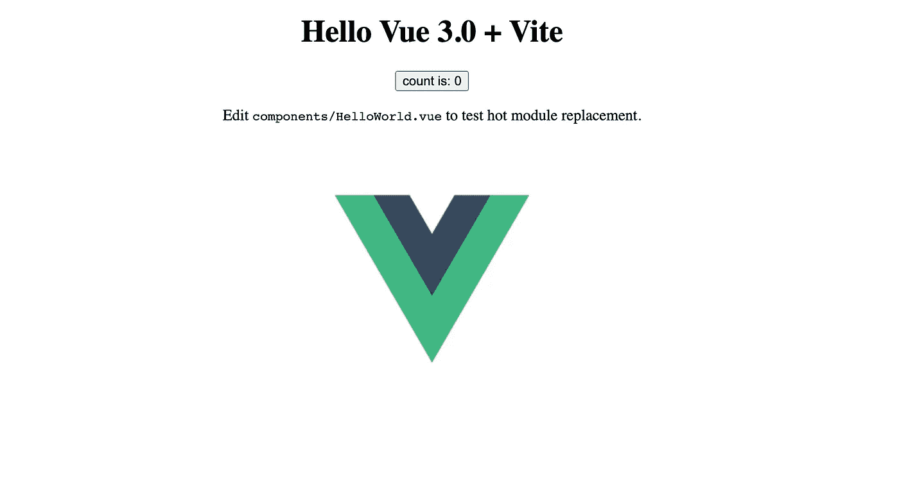

# 如何使用新的 Vue.js 3 <teleport>功能</teleport>

> 原文：<https://javascript.plainenglish.io/vue-js-3-teleport-feature-d69cecfc0507?source=collection_archive---------3----------------------->

## Vue.js 3 有很多新功能值得期待，还有< 【 is one that I’m excited about.

# What is the teleport feature in Vue.js 3?

teleport provides a way for any component to render any content, including other components anywhere in the DOM, including outside of the mounted App.

# Why will teleport be useful

It’s surprisingly difficult to get full-screen modals to render from a component, nested deep inside the DOM. With teleport, you can push a model component into the 【 of the DOM.

Another interesting use case that I am looking forward to trying out is modular apps. A platform like WordPress, allows modules to render into different hooks in the UI and a similar concept can be envisioned with teleport.

# Example of how to use teleport in Vue.js 3

Here is 【 Notice the 【 , we will use that in a moment, it’s also interesting to see that it is outside of 【

The App.vue file, which imports a component called 【 is shown below. At the moment I rendering the 【 component under the Vue Logo.

And the result is as you would expect, the Vue Logo and rendered below, the 【 component.

Now let’s use the 【 feature to push the component into the 【 . To do so I simply wrap the component in 【 tags and provide a 【 attribute which tells view which selector to teleport to.

The result is the component is rendered into another div, not associated with the parent component, but more interestingly outside the mounted app with all reactive functionality still working.

# Installing and using VueJS 3

If you want to start using VueJS, I have written an article on [如何安装 Vue JS 3 CLI](https://medium.com/@simonjcarr/how-to-install-the-vuejs-3-cli-2009f8c20206) 。

# 结论

传送将使我们今天已经完成的任务变得更加容易，但是实现起来很痛苦。它还为我们的应用程序增加新功能提供了机会，我期待着有机会亲自体验一下。

如果你对传送功能有什么想法，请在评论中分享。