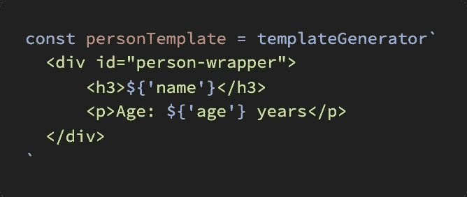

# JavaScript 中的模板文字:完全指南

> 原文：<https://javascript.plainenglish.io/template-literals-in-javascript-the-complete-guide-e23f64c13aa1?source=collection_archive---------1----------------------->

## 揭秘奇怪但非常实用的语法



Source: The author

# **目录**

*   公式
*   功能和参数
*   多行字符串
*   标记的模板文字

我们走吧！

# 基础知识—模板中的表达式

顾名思义，模板字面量是用来创建模板的，我们可以很容易地用 JavaScript 表达式填充它们。

它们是传统方法的替代方法，在传统方法中，字符串、数字和其他对象与传统的“+”运算符组合在一起。

所以表达式意味着我们可以在其中运行真正的 JS 代码，而不只是像你可能已经知道的那样嵌入变量。

**模板中的变量:**

```
let name = "Max"
let age = 21let desc = `${name} is ${age} years old`
```

**而且还有更复杂的操作:**

```
`Pi times e is: ${Math.PI * Math.E}` 
```

# 功能和参数

如你所见，我们真的可以在模板中执行一些 JavaScript 代码。这也适用于函数及其参数

```
function greet() {
  *return* ‘Hi there!’
}console.log(`Message: ${greet()}`)
// "Message: Hi there!"
```

**添加参数:**

```
function greet(name) {
  *return* ‘Hi there, ‘ + name
}console.log(`Message: ${greet("Max")}`)
// "Message: Hi there, Max"
```

# 多行字符串和模板

即使没有我在本文中提到的所谓的**模板文字**，我们几乎在所有可以想象的编程语言中都需要模板。

关于模板，我指的是变量内容、函数参数等的模板。然后用相应的变量填充这个模板。

因此，我们可以通过简单地使用链接变量和其他数据类型的函数，在 JavaScript 中构建一个模板。基本到此为止。

```
let name = "Max"
let age = 21const person = name + "is "+ age + "years old"
```

当这些模板变得如此之长，以至于我们宁愿用几行来制作它们时，问题就来了。只有当我们使用操作符来连接时，这才是可能的，我们不能中断字符串。

```
const person = name + "is "
+ age + "years old"
+ "and he likes to do "+ hobby
```

有了模板文字，我们不再有这个问题:

```
const person = `${name} is ${age} \
years old and he \
likes to do ${hobby}`
```

我们只需要考虑用 **"\"** 标记换行符，否则换行符之前的整行都将被解释为空白。

# 带标签的模板文字——这变得很奇怪

我们还可以将**模板文字传递给函数**，使用一种非常规的语法，您可能以前在 [styled-components](https://medium.com/javascript-in-plain-english/how-to-use-react-js-props-with-styled-components-db11fc83f5c9) 中见过。

```
function person() {
  *return* ‘a person’
}const name = ‘Max’
const age = 21const description = person`He is ${name} and ${age} years old`
```

我们只需将模板直接添加到我们想要传递给它的函数中。
如果我们现在记录**描述**,“一个人”就会出现。

没意思，所以我们应该开始看看我们到底传递了什么参数。
**重要:**我们的模板中有**两个**变量(姓名，年龄)，但总是传递变量个数+一个包含模板中字符串的数组作为第一个参数。自动地。我将把这个数组命名为“字符串”。

```
function person(strings, name, age) {
  *return* ‘a person’
}
```

**姓名**和**年龄**果然只包含“Max”和“21”但是**字符串**有意思:`['This man is ', ' and he is ', ' years old']`

数组由模板中的字符串组成，所有不可变的东西。所以我们从左到右得到模板的**硬编码部分，作为数组的条目。**

## 让我们用它来构建一个模板生成器

尤其是在有 Node.js 的后端区域，恰好我们要动态生成 HTML 代码。多亏了带标签的模板文字，我们可以非常容易地做到这一点，甚至可以使用对象作为数据源。

让我们仔细检查所有的部分。完整的和工作的源代码可以在最后找到。

**定义我们的模板，调用生成器-函数:**

```
const personTemplate = templateGenerator`
  <div id=”person-wrapper”>
    <h3>${‘name’}</h3>
    <p>Age: ${‘age’} years</p>
  </div>
`
```

**我们的数据源将是这个对象:**

```
const john = {
  name: ‘John Doe’,
  age: 21,
}
```

**调用函数，保存完成的模板:**

```
const johnsTemplate = personTemplate(john)console.log(johnsTemplate)
```

**发电机本身，所有神奇的事情都发生在这里:**

```
function templateGenerator(strings, …keys) {
  *return* function (data) {
    let template = strings.slice() keys.forEach((key, i) => {
      template[i] = template[i] + data[key]
  })
  *return* template.join(``)
  }
}
```

*   数组 ***strings*** 包含了我们模板的所有字符串。
*   ***键*** 是一个由对象的姓名和年龄组成的数组。
*   ***数据*** 包含对象。
*   ***模板*** 是 ***字符串的副本。***
*   然后， ***forEach*** 循环将来自对象的相应条目添加到数组中每个元素的末尾(模板的一部分)。
*   最后，模板被转换成一个字符串并返回

**输出:**

```
<div id=”person-wrapper”>
  <h3>John Doe</h3>
  <p>Age: 21 years</p>
</div>
```

**完整代码:**

## 简单英语的 JavaScript

喜欢这篇文章吗？如果有，通过 [**订阅我们的 YouTube 频道**](https://www.youtube.com/channel/UCtipWUghju290NWcn8jhyAw) **获取更多类似内容！**