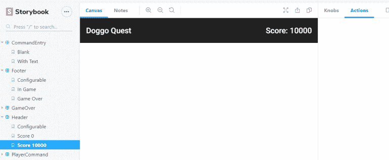
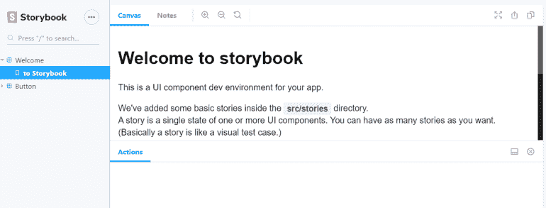
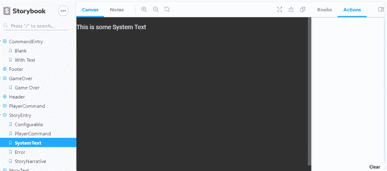
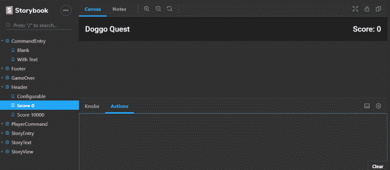
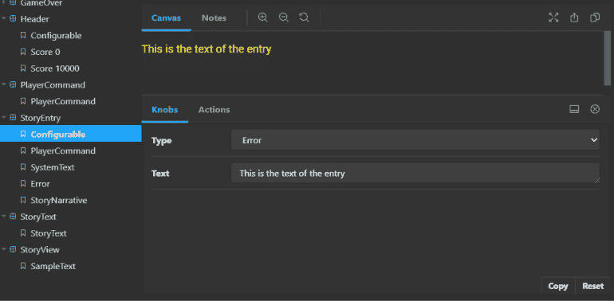

# 在故事书中测试角度组件

> 原文：<https://javascript.plainenglish.io/test-angular-components-in-storybook-35c7e34ec8bb?source=collection_archive---------6----------------------->

## 测试和定制角度组件的主要方式

您是否曾经想要一种快速的方法来检查项目中角度构件的外观和行为？Storybook 是一个免费的库，集成到您的 Angular 项目中，允许您查看应用程序中的任何组件，调整配置值，并确保组件行为正常。

Storybook 减少了实验之间的时间间隔，增加了开发人员在开发过程中发现组件意外变化的几率。

# 什么是故事书？

[Storybook](https://storybook.js.org/) 是一个前端 JavaScript 库，几乎无法解释。我称之为“JavaScript 组件测试平台”。

本质上，Storybook 会生成一个网页，用于测试 Angular 应用程序中的组件或其他用户界面框架中的等效组件。

Storybook 从您的源代码中读取单独的故事定义(稍后将详细介绍)，并在侧栏中填充您已经定义的场景。然后，用户可以单击一个故事，与该场景中的组件进行交互。

这样做的一个用途是运行 Storybook 来检查更改后组件的外观和行为。这有助于确保一个领域的变化不会对另一个组件产生意料之外的影响。这也有助于那些不经常使用或只在耗时的操作后才可见的组件。

Storybook 的另一个用途是让开发人员生成一个静态网页，供质量保证或产品管理人员使用。他们可以利用这一点来验证组件在孤立状态下的外观和行为是否正确。

# 安装故事书

首先，让我们在我们的开发机器上全局安装 Storybook，通过命令行运行`npm i @storybook/cli -g`到 **g** 全局**I**install story book 命令行界面(CLI)。这将允许你在你的机器上的任何地方使用故事书。

接下来，在命令行中导航到现有 Angular 应用程序的根目录。出于本文的目的，我将从我的 [Doggo Quest 游戏开发项目](https://killalldefects.com/2020/02/08/connect-angular-components-with-events-services-and-binding/)的早期版本开始。如果你想跟着做，你可以在 GitHub 上查看[相应的标签。](https://github.com/IntegerMan/DoggoQuest/tree/AngularEventEmitters)

一旦进入应用程序，运行`getstorybook init`将 Storybook 安装到应用程序中。这将扫描您的应用程序，并确定它是一个角度的应用程序。之后，它将:

*   修改 package.json 和 package-lock.json 以引用 Storybook
*   从普通角度构建中排除 stories.ts 文件
*   用几个定义好的角度行为的文件创建一个故事书目录
*   创建几个示例故事文件

现在，如果您运行`npm run storybook`，您应该会看到如下内容:

这是示例故事文件的结果。请随意删除这些文件，因为您应该不需要它们来运行它们，以确保故事书开箱即用。

# 你的第一个故事

好了，我们已经确定我们可以在 Angular 应用程序中安装和运行 Storyboard。让我们把它应用到我们的具体应用中。

我们将首先确定一个简单的独立组件进行测试。在我的例子中，应用程序有一个显示游戏名称和当前分数的标题。

该组件确实依赖于有角度的材料，这将为我们造成一个小障碍，但它将是如何解决故事书中一些常见问题的一个很好的说明。

我将从进入组件的目录并添加一个名为`header.stories.ts`的新文件开始。这里我取组件名，然后以`.stories.ts`结尾，它告诉 Storybook 扫描这个文件寻找故事。

我的故事文件如下:

在第 5 行，我声明了一个名为“Header”的故事集合。这些故事都将与`header.component`有关，所以我认为称它们为 header 才是正确的。

接下来，在第 7 行和第 13 行，我开始了两个不同的故事，一个是 0 分的游戏，另一个是 10000 分的游戏。注意，我为每个故事提供了`HeaderComponent`，但是我在第 10 行和第 16 行为每个案例提供了不同的`Score`值。

这里的`Score`是在我的组件上定义的`@Input()`，Storybook 将在构造时直接在我的组件上设置该属性。这就是“得分 0”情况与“得分 10000”情况呈现不同的原因。

这里还有一个注意:在第 6 行，我使用`addDecorator`为故事导入`AppModule`。这是必要的，因为组件本身依赖于模块定义中定义的东西。如果没有这个，组件将不会在 Storybook 中呈现，您将会在用户界面中看到一个错误。

# 导入自定义 CSS

您可能会注意到，您的故事在 Storybook 中呈现得不好，尤其是如果您的应用程序使用了像我这样的黑色主题。

对此你可以做一些事情。

首先，如果您添加一个`.storybook/preview-head.html`文件，您可以添加任何自定义导入或 CSS 内联，如下所示:

理想情况下，您应该只使用它来定制您在应用程序的`index.html`页面中定义的任何导入或类。

# 黑暗主题

虽然自定义导入有助于组件正确渲染，但如果您的主要问题是黑暗，而应用程序的其余部分是光明的，这可能会有点不和谐。

幸运的是，故事书附带了一个黑暗主题，你不用做太多额外的工作就可以实现。

只需在您的`.storybook`目录中添加一个`manager.ts`文件，并赋予它以下内容:

一旦你重新启动 Storybook，你会看到类似下面的截图:

这还差不多！

# 开始使用故事书旋钮

虽然您现在应该已经准备好为应用程序中的每个组件创建故事板，但是还有一个功能您应该知道:旋钮。

Knobs 是 Storybook 的一个附加组件，允许您对故事进行更改，并查看这些更改对渲染组件的影响。可以把它看作是一种测试组件在不同设置下的行为方式。

首先，我们将通过从命令行运行`npm i @storybook/addon-knobs --save-dev`来安装旋钮。

接下来，我们需要编辑`.storybook/main.js`,将新的插件添加到列表中:

我们现在应该已经准备好使用旋钮了。

# 给故事添加旋钮

让我们来看看一个示例组件，以及我们如何将旋钮集成到该组件的故事中。

具体来说，让我们看看`story-entry.component`，它将根据条目的*类型*以及提供给它的*文本*进行不同的渲染。在 Doggo Quest 中，这是故事展示的中心构件，所以这是一个非常重要的测试组件。

它的故事文件如下所示:

首先，请注意，我们在第 10 行添加了另一个名为`withKnobs`的装饰器，以声明该组件依赖于 Knobs 系统来获取组件中的值。

接下来，让我们看看从第 14 行开始的`StoryEntry`定义。一个`StoryEntry`需要一个`StoryEntryType`和一个`Text`参数。由于前者相当复杂，让我们跳到第 20 行的`Text`参数。

在第 20 行，我们调用了一个名为`text`的旋钮函数，告诉它我们想要一个新的可配置的字符串属性，该属性在用户界面中应该被标记为`Text`，初始值为“这是条目的文本”。

当组件在这个故事中呈现时，用户将能够定制一个`Text`属性的值，组件的文本将因此而改变。

故事书旋钮也让我们使用许多其他类型的旋钮，包括布尔、数字、日期等等。更多细节见[文档](https://github.com/storybookjs/storybook/tree/master/addons/knobs)。

现在让我们回头看看第 14 行的`select`语法。使用 select，我们定义了一个下拉列表，用户可以从中进行选择，将每个值的类型指定为泛型类型参数，然后为对象提供映射到其特定值的属性定义。Storybook 使用这些属性作为值的标签，这对于像这样的枚举很有帮助，例如，`Error`比`3`更有意义。最后，我们指定初始选项来指定。

是的，select 语法很难读懂，但是结果对测试人员来说是一个非常直观的体验。

# 静态故事书网站

有时，您与质量保证、产品管理或其他不直接与源代码打交道的团队一起工作。这些用户通常可以从使用 Storybook 中受益，但是不一定拥有技术技能或者访问源代码来运行 story book。

幸运的是，Storybook 允许你建立一个独立的网页，然后你可以分发给利益相关者在本地进行实验。

简单地运行`npm run build-storybook`，你的故事书应用程序将被构建到`storybook-static`目录中。您可以将该文件夹部署为独立的 web 应用程序，并指导利益相关者访问`index.html`，以便获得使用 Storybook 的完整体验，而不必与 Angular 或 npm 进行角力。

如果构建静态故事书文件似乎很乏味，那么这将是一个非常简单的命令，可以作为持续集成过程的一部分进行自动化。让您的构建管道运行`npm run build-storybook`，然后对`storybook-static`目录的结果做您想做的任何事情。

# 结论和下一步措施

希望这篇文章充分说明了 Storybook 的价值，它为您提供了一个查看组件的中心位置，一种使用旋钮查看不同状态的组件的方法，以及一种为您的质量保证和设计团队提供应用程序视觉风格的独立测试平台的方法。

这篇文章甚至没有涵盖故事书的一些更高级的特性和[插件](https://storybook.js.org/addons/)，比如:

*   自动化用户界面测试
*   可达性分析
*   将故事联系在一起
*   文档和测试人员可见的注释

您可以使用 Storybook 做很多事情，团队正在不断改进和发展它，以更好地服务于 web 开发社区——无论您使用哪种 JavaScript 框架。

*原载于 2020 年 2 月 10 日*[*【https://killalldefects.com】*](https://killalldefects.com/2020/02/09/test-angular-components-in-storybook/)*。*