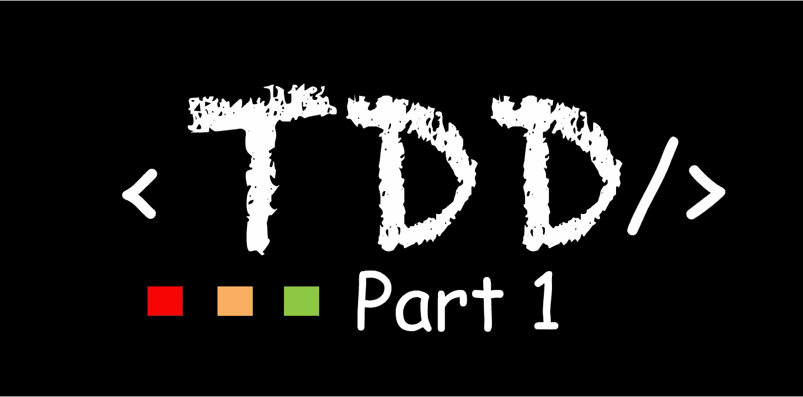
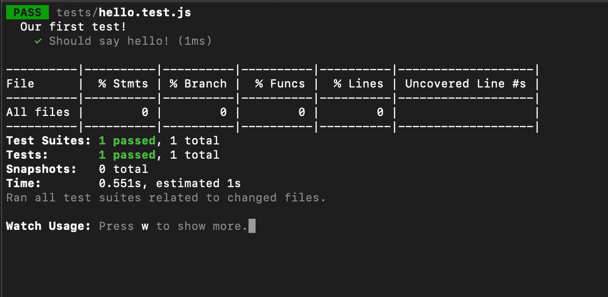

# React 第 1 部分中的测试驱动开发(TDD)

> 原文：<https://javascript.plainenglish.io/test-driven-development-tdd-in-react-part-1-edb4270761aa?source=collection_archive---------1----------------------->

## 这篇文章解释了如何用 Jest 和 Enzyme 快速设置 React TDD 应用程序。



# 在我们开始真正的交易之前，了解以下内容是很重要的

-什么是测试驱动开发？

-为什么我必须进行测试驱动开发(TDD)？

-我们有哪些 TDD 工具，哪一个最适合 React 项目？

什么是测试驱动开发？

测试驱动开发(TDD)是一个软件开发过程，它依赖于一个非常短的开发周期的重复:需求被转化为非常具体的测试用例，然后软件被改进以便通过测试。[维基百科](https://en.wikipedia.org/wiki/Test-driven_development)

**测试类型**

-单元测试:在单元测试中，我们测试以确保组件在给定输入时产生预期的输出。

-集成测试:在这里，在给定的时间，将单个的测试单元作为一个组进行组合和测试。

-性能测试:在性能测试中，我们测试系统的速度。

-可用性测试:在这里，我们从客户的角度测试产品，测试产品的易用性。

-验收测试:验收测试用于测试产品是否满足客户的要求。

回归测试:回归测试测试以确保修改是否正常工作，或者某些功能是否由于修改而中断。

为什么我必须进行测试驱动开发(TDD)？

TDD 有助于减少开发人员交付给产品的 bug 数量。因为您首先编写测试，然后在确定代码行为符合预期之前编写通过测试的代码，所以很容易根据预期行为找出错误代码。

**我们有哪些 TDD 工具，哪种最适合 React 项目？**

**JavaScript 测试工具**

1.玩笑

2.酶

3.茉莉

4.摩卡

我选择 Jest 和 Enzyme 作为我的 React 应用程序，因为它们易于集成，并且 React 支持 Jest 开箱即用。

**什么是好的测试**

1.每个测试都应该独立于其他测试

2.任何行为都应该只在一个测试中指定

3.没有不必要的断言。意思是不要测试你不需要测试的东西

4.一次只测试一个代码单元

5.避免不必要的先决条件

> 现在我们知道了关于测试驱动开发(TDD)的**什么**和**为什么**，所以让我们做**如何**

注意:为了简单起见，我将为我的项目使用 create-react-app 和 yarn 来安装包。我假设你已经在你的电脑上安装了 create-react-app，如果没有的话，请先安装 create-react-app。

```
npm install -g create-react-app
```

第一步:

```
create-react-app tdd-setup
```

步骤 2:(安装所需的依赖项)

```
yarn add enzyme enzyme-adapter-react-16 enzyme-to-json
```

或者

```
npm install enzyme enzyme-adapter-react-16 enzyme-to-json
```

第三步

添加到您的 **package.json** 文件中的依赖项列表

```
"@babel/core": "^7.4.5","@babel/plugin-proposal-class-properties": "^7.4.4","@babel/plugin-proposal-object-rest-spread": "^7.4.4","@babel/preset-env": "^7.4.5","@babel/preset-react": "^7.0.0","babel-cli": "^6.26.0"
```

那就跑

```
npm install or yarn install
```

第四步

在你的根目录下创建 **jest.config.json** 文件，它的内容应该是这样的

```
{ "setupFiles": [ "raf/polyfill", "<rootDir>/tests/setup.js" ], "snapshotSerializers": [ "enzyme-to-json/serializer" ], "collectCoverage": true}
```

第五步

创造**。根文件夹中的 babelrc** 文件，内容应该是这样的

```
{ "presets": [ "@babel/env", "@babel/react" ], "plugins": [ "@babel/plugin-proposal-class-properties", "@babel/plugin-proposal-object-rest-spread" ]}
```

第六步

在你的根目录下创建一个名为 **tests** 的文件夹，并添加 **setup.js (tests/setup.js)** ， **setup.js** 的内容应该是这样的

```
import Enzyme from "enzyme";import Adapter from "enzyme-adapter-react-16";Enzyme.configure({ adapter: new Adapter() });
```

第七步

在您的 **package.json** 文件中替换

```
"test": "react-scripts test"
```

随着

```
"test": "jest --config=jest.config.json --watch"
```

第八步

在测试文件夹中创建 **hello.test.js** 文件，让内容看起来像这样

```
import React from 'react';const greetme = "Hello!";describe("Our first test!", () => { it("Should say hello!", () => { expect(greetme).toBe("Hello!"); });});
```

第九步

我们现在可以运行我们的第一个测试

```
yarn test
```

或者

```
npm test
```

如果一切都是平等的，我们应该在我们的终端看到这一点



我们现在已经到了这一部分的结尾。

**注意:按照步骤操作后，如果出现错误，您可能需要删除 node_modules 文件夹并重新安装。**

> 本系列接下来是**认证**(签到、注册、忘记密码、重置密码)，敬请关注。

感谢阅读。