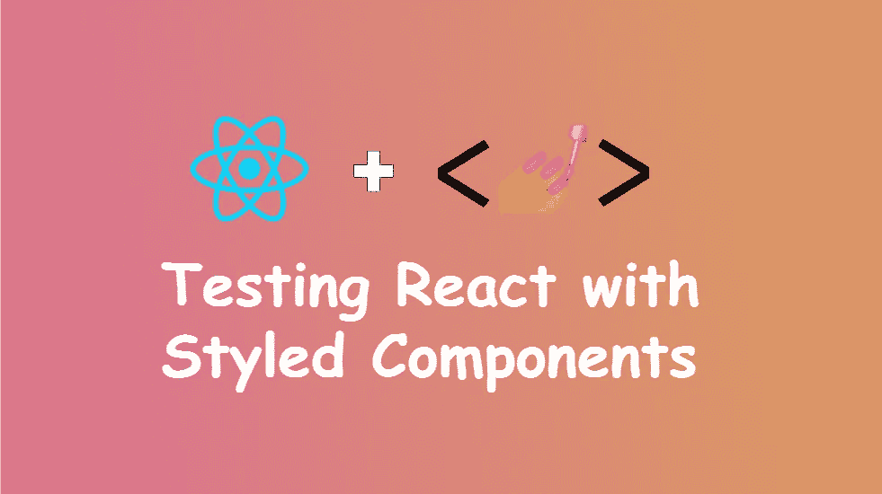
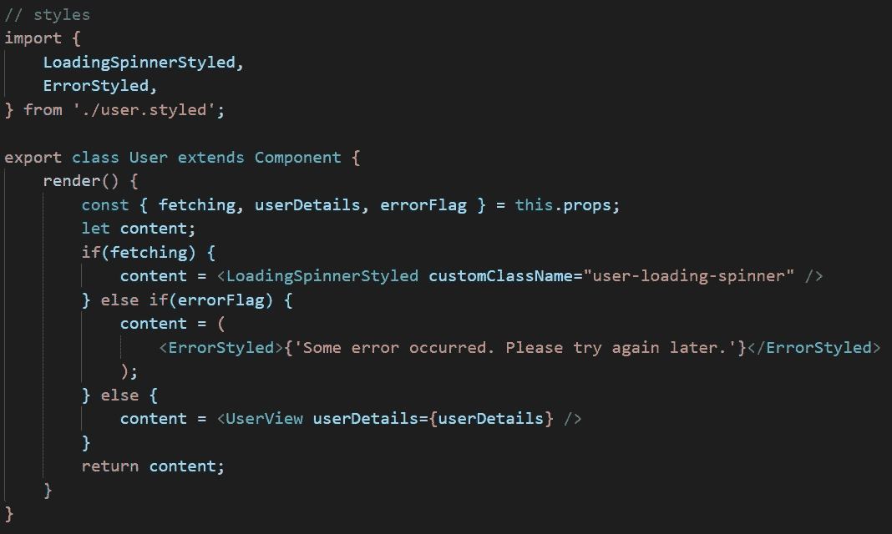
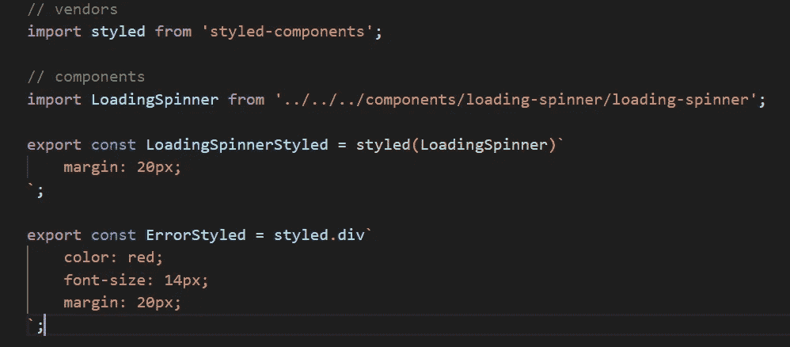
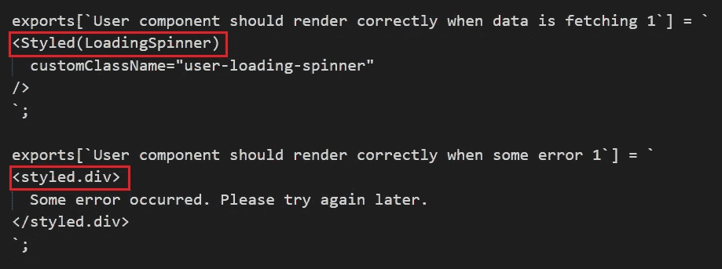
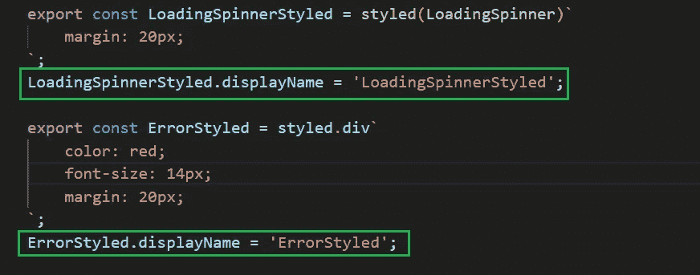
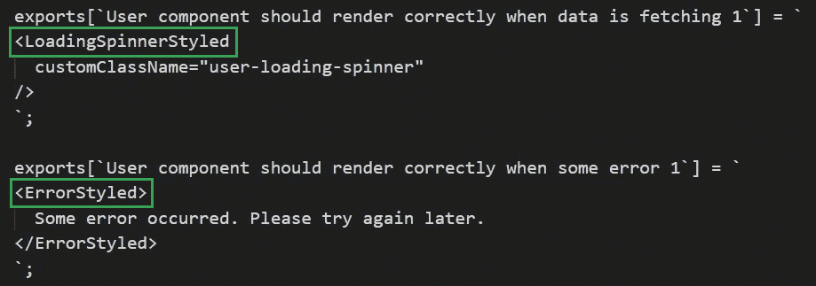
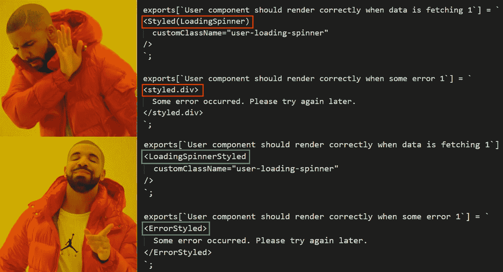

# 使用“displayName”有效反应中的测试样式组件

> 原文：<https://javascript.plainenglish.io/test-styled-components-in-react-efficiently-using-displayname-53281a0c1f2d?source=collection_archive---------5----------------------->

## 如何摆脱测试快照中风格怪异的组件名称

Created using powerpoint

# 介绍

如果你练习了 [TDD](https://en.wikipedia.org/wiki/Test-driven_development) 并且在你的 React 应用程序中使用了 [**风格的组件**](https://styled-components.com/) ，这个帖子可能适合你。

这需要一些关于单元测试的先前知识反应代码。如果你想了解单元测试的基础，请在这里查看。

## 开始吧

相关代码示例请参见 [github](https://github.com/anuk79/UnitTestingReactWithStyledComponents) 。如果需要，可以克隆存储库以进行后续操作。有两个文件夹具有相同的示例，其中一个使用 displayName 作为样式化组件，而另一个则不使用。我们将从不包含 displayName 的代码开始，以了解这些问题。

请在此处查看代码-[https://github . com/anuk79/unittestingreactvertyledccomponents/tree/master/src/pages/无显示名称/用户](https://github.com/anuk79/UnitTestingReactWithStyledComponents/tree/master/src/pages/without-display-name/user)

主组件是 **user.jsx** ，它使用了一些样式化的组件。

code in user.jsx

样式化元件档案包含下列程式码:

code in user.styled.js

# 问题陈述

在单元测试时，当我们浅渲染**用户**组件并生成快照时，我们将不会得到样式化组件的确切名称，相反，我们得到如下内容:

snapshot generated when not using displayName

**我们的预期**加载 pinnerstyle，ErrorStyled

**实际生成的东西**:Styled(loading pinner)，styled.div

## 这对单元测试过程有何影响？

当我们尝试为任何断言遍历组件树，并且目标组件是样式化组件时，我们不能简单地使用使用样式化组件名称的直接方法。

让我们假设**包装**是**用户**组件的浅渲染输出，并且我们试图测试**加载 pinnerStyled** 组件是否确实存在于**用户**组件中。所以我们根本不能做如下的事情:

`expect(wrapper.find('LoadingSpinnerStyled').length).toBe(1);`

然而，如果我们将**loading pinnerstyled**组件导入到我们的测试文件中，我们可以如下进行测试:

`expect(wrapper.find(LoadingSpinnerStyled).length).toBe(1);`

请注意，在上面的语句中，组件名称周围没有单引号。这意味着我们使用实际的组件来遍历组件树，而不仅仅是名称(这是使用 enzyme 的好处之一)。

或者，如果我们想要避免那些额外的导入到测试文件中，我们将不得不测试如下的代码:

`expect(wrapper.find('Styled(LoadingSpinner)').length).toBe(1);`

那么，如果你想避免这两种可能的情况，该怎么做呢:

1.  测试文件中所有相关样式组件的显式导入
2.  使用不太明显的标识符来遍历生成的组件树中的样式化组件

# 解决办法

正如本文的标题所示，我们可以通过为所有样式化的组件指定**显示名称**来解决上述所有问题。

您可以通过在每个组件旁边添加一行来分配显示名称，如下所示:

user.styled.js

现在，当组件被浅渲染时，请看输出:

snapshot generated after using displayName for styled components

它现在包含了我们想要的名字，并且使快照和单元测试更具可读性和可维护性。

查看这里的代码—[https://github . com/anuk 79/UnitTestingReactWithStyledComponents/tree/master/src/pages/with-display-name/user](https://github.com/anuk79/UnitTestingReactWithStyledComponents/tree/master/src/pages/with-display-name/user)

# 结论

React 提供的 **displayName** 是一个推荐的特性，对单元测试和代码调试有很大帮助。

# 参考

点击[https://hacker noon . com/improving-component-names-in-react-developer-tools-4894247510 C5](https://hackernoon.com/improving-component-names-in-react-developer-tools-4894247510c5)了解更多关于 **displayName** 的信息

感谢阅读。我希望这有所帮助。如果您有任何问题或建议，请随时回复。

祝你学习愉快，度过愉快的一天！