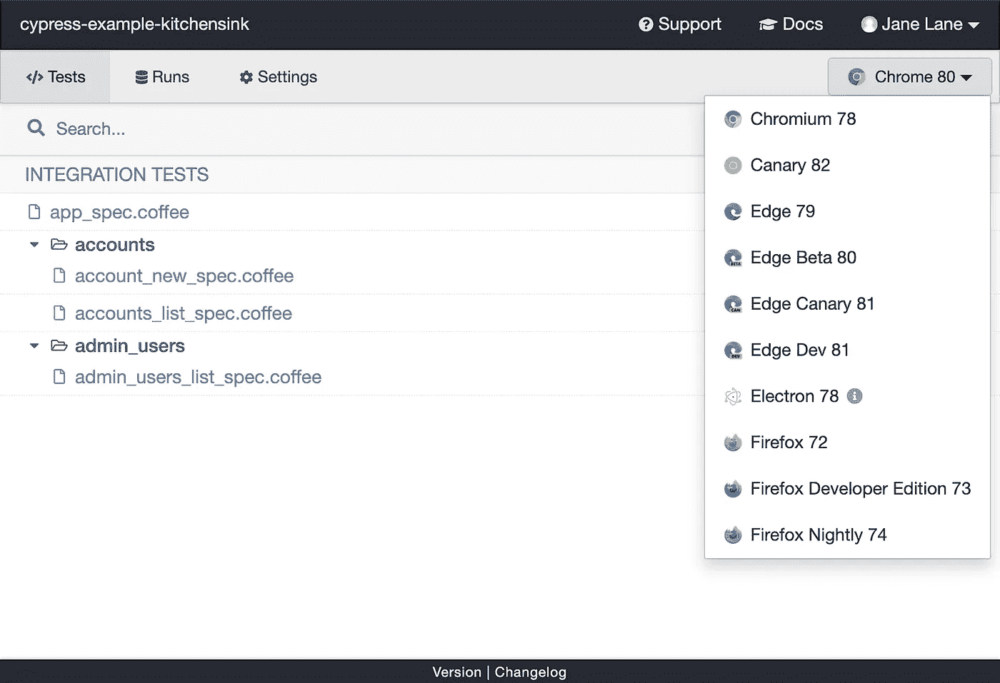

# React 中的测试，第 5 部分:使用 Cypress 的端到端测试

> 原文：<https://javascript.plainenglish.io/testing-in-react-part-5-end-to-end-testing-with-cypress-bd2bf8d3385f?source=collection_archive---------8----------------------->


Photo by [Mick Haupt](https://unsplash.com/@rocinante_11?utm_source=unsplash&utm_medium=referral&utm_content=creditCopyText) on [Unsplash](https://unsplash.com/?utm_source=unsplash&utm_medium=referral&utm_content=creditCopyText)

> 本文是 React 中测试系列的一部分:
> 
> [React 中的测试，第 1 部分:类型&工具](https://medium.com/javascript-in-plain-english/testing-in-react-part-1-types-tools-244107abf0c6)
> 
> [React 中的测试，第 2 部分:React 测试库](https://medium.com/javascript-in-plain-english/testing-in-react-part-2-react-testing-library-f32432b93c6c)
> 
> [React 中的测试，第 3 部分:Jest & Jest-Dom](https://medium.com/javascript-in-plain-english/testing-in-react-part-3-jest-jest-dom-7a8a03ae60b)
> 
> [React 中的测试，第 4 部分:酶](https://medium.com/javascript-in-plain-english/testing-in-react-part-4-enzyme-9b030ad616ae)
> 
> **React 中的测试，第 5 部分:使用 Cypress 的端到端测试**
> 
> [React 中的测试，第 6 部分:React 测试库、Jest、Enzyme 和 Cypress 的真实测试](https://medium.com/javascript-in-plain-english/testing-in-react-part-6-real-world-testing-with-react-testing-library-jest-enzyme-and-cypress-9c73436d95d8)

与测试渲染组件(如 React 测试库、Enzyme 和 Jest)不同，端到端测试从头到尾测试 web 应用程序的整个工作流。这就是赛普拉斯的用武之地。如果您需要快速回顾一下这些测试类型之间的区别，我建议您快速回顾一下本系列的第 1 部分。

Cypress 是用 JavaScript 编写的，可以测试任何在浏览器中运行的东西。它可以用来编写端到端测试、集成测试和单元测试。此外，Cypress 可以用于设置、编写、运行和调试这些测试，这是一个不小的成就。在 Cypress 之前，端到端测试是通过许多工具的实现来处理的，其中的核心是 Selenium。

Cypress 有两个主要组成部分——一个免费的测试运行程序，和一个付费的仪表板服务(有一个免费层)。出于这个博客的目的，我们将关注使用免费测试运行器的实现。

# 安装 Cypress

我们没有介绍前面工具的安装，因为它们是简单的 CLI 命令。柏树有点不同。Cypress 是一个桌面应用程序，这个应用程序将运行您的测试。我强烈建议你在继续之前看一下[安装指南](https://docs.cypress.io/guides/getting-started/installing-cypress.html#Opening-Cypress)，因为有多个选项可以从命令行安装和打开桌面应用程序。

在您的应用程序中安装 Cypress 将会为您创建一个`cypress/integration`文件夹——这是您编写测试的地方。

# 测试不同的浏览器

Cypress 桌面应用程序将尝试找到您计算机上所有可用的兼容浏览器，并允许您在它们之间切换以运行测试。鉴于 Chrome 和 Safari 这两个最流行的浏览器之间(以及所有浏览器之间)可能出现的明显差异，这真是太棒了。



Credit: [Cypress Documentation](https://docs.cypress.io/guides/getting-started/installing-cypress.html#Switching-browsers)

当您运行 Cypress 测试时，Cypress 会自动启动一个浏览器。你可以在这里找到兼容浏览器的完整列表。

在这个列表中，有一个明显的缺席浏览器——Safari。不可否认，这很麻烦，因为 Safari 的市场份额及其众所周知的怪癖使得在开发阶段进行彻底测试变得更加必要。这对你和 Cypress 来说可能是一个障碍，尤其是如果你没有像 [BrowserStack](https://www.browserstack.com/) 或 [Sauce Labs](https://saucelabs.com/) 这样的 UI 测试工具。如果是这种情况，我建议您看看 Selenium 作为替代。

# 编写端到端测试

*测试应该写在安装时为您创建的* `*cypress/integration*` *文件夹中。*

## 访问应用程序

关于编写端到端测试，首先要知道的是，Cypress 测试实际上是访问网站，而不是呈现组件和测试节点。

```
describe('example.com', () => {   
   it('Visits Example.com', () => {         
      cy.visit('https://example.com')   
   }) 
})
```

您可以看到，我们不是在导入或安装组件，而是在访问一个 URL。在编写测试之后，可以使用 Cypress 桌面应用程序与测试进行交互并对测试进行评估。它的命令日志将显示所采取的行动(在本例中，`visit`)。该应用程序(example.com)将被加载到 Cypress 的应用程序预览窗口中，测试要么通过，要么失败。

## 查询被访问的应用程序

该过程的其余部分看起来与我们之前介绍的测试工具没有太大的不同。Cypress 中的查询与使用 RTL 和酶的查询非常相似。出于这个原因，我们不打算逐一查看各个查询命令。你可以在这里找到完整的列表。使用查询命令将如下所示:

```
describe('example.com', () => {   
   it('Visits Example.com', () => {         
      cy.visit('https://example.com');
      cy.get('#query-btn');
   });
});
```

在上面的例子中，我们查询 ID 为`query-btn`的节点，如果找到它，就会返回。在这一点上，这种模式应该看起来很熟悉，我们采取的步骤也是如此:加载要测试的内容→在加载的内容中找到节点→在节点上创建动作/事件→测试节点的断言。

## 在被查询的节点上触发事件

在给定节点上激发(RTL)或模拟(酶)一个事件实际上在 Cypress 中更容易，但看起来类似于在 RTL 激发一个事件。您可以在这里找到最常用操作的列表[，在这里](https://example.cypress.io/commands/actions)找到完整的列表[。单击我们在上面查询的按钮非常简单:](https://docs.cypress.io/api/events/catalog-of-events.html#Cypress-Events)

```
describe('example.com', () => {   
   it('Visits Example.com', () => {         
      cy.visit('https://example.com');
      cy.get('#query-btn').click();
   });
});
```

## 做出断言

最后，我们将断言一些关于节点的东西，以便获得所需的有意义的评估。Cypress 提供的最流行的断言列表可以在[这里](https://example.cypress.io/commands/assertions)找到，完整列表在[这里](https://docs.cypress.io/guides/references/assertions.html#Chai)。同样，Cypress 中的断言看起来与我们之前看到的非常相似:

```
describe('example.com', () => {   
   it('Visits Example.com', () => {         
      cy.visit('https://example.com'); cy.get('#query-btn').click(); cy.url().should('include', '/example-url/clicked')
   });
});
```

我们在这里不讨论语法和细节，因为正如我所说的，这个模式现在应该看起来非常熟悉。您通过`mount`、`render`或`visit`获得您想要测试的东西，您使用类似`get`、`find`或`children`的调用来查询其中的节点，您触发类似`click`、`type`或`setState`的事件，然后您做出一个断言来测试行为是否具有预期的结果。

# 核心

尽管我们介绍的每个工具都遵循相同的模式，但是在不同的情况下，细微的差别是最佳的。Cypress 的核心是测试一个*流*,而不是单一的功能或组件。Cypress 测试将最接近地模拟实际的用户体验，并且应该牢记这一点。

最后，我们有这个系列的大结局。我们将通过一个实际的应用程序，我已经建立和集成 Jest，反应测试库，酶，和 Cypress。我们将讨论真实世界实现的测试覆盖和最佳实践。

> **之前的**:[React 中的测试，第 4 部分:酶](https://medium.com/javascript-in-plain-english/testing-in-react-part-4-enzyme-9b030ad616ae)
> 
> **接下来**:[React 中的测试，第 6 部分:React 测试库、Jest、Enzyme 和 Cypress 的真实测试](https://medium.com/javascript-in-plain-english/testing-in-react-part-6-real-world-testing-with-react-testing-library-jest-enzyme-and-cypress-9c73436d95d8)

## 资源

*   [柏树官方文档](https://www.cypress.io/)
*   [Cypress 端到端测试](https://www.youtube.com/watch?v=7N63cMKosIE)