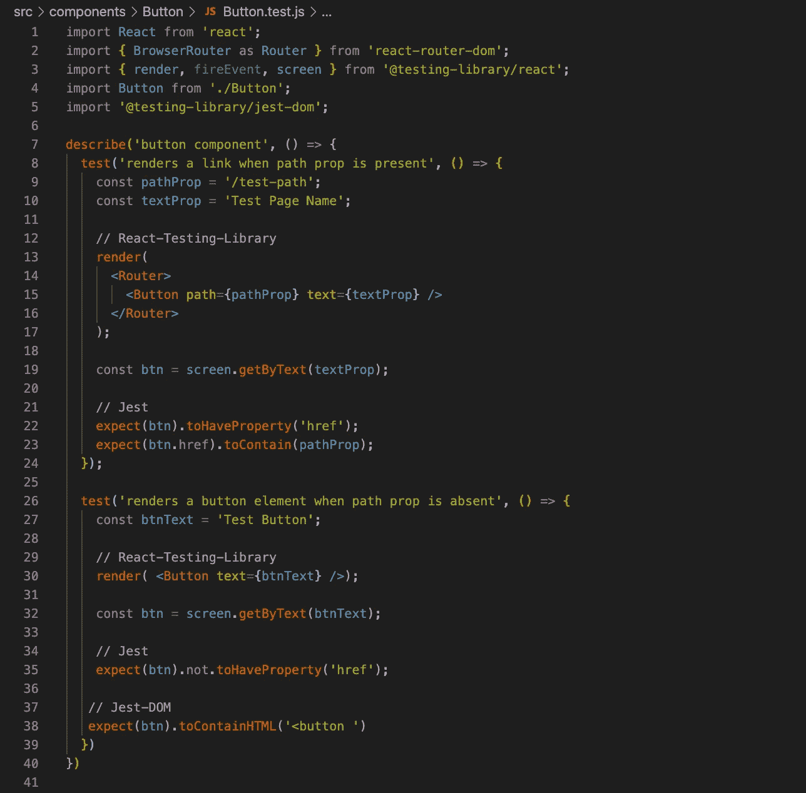

# React 中的测试，第 6 部分:React 测试库、Jest、Enzyme 和 Cypress 的真实测试

> 原文：<https://javascript.plainenglish.io/testing-in-react-part-6-real-world-testing-with-react-testing-library-jest-enzyme-and-cypress-9c73436d95d8?source=collection_archive---------4----------------------->


Photo by [Martin Reisch](https://unsplash.com/@safesolvent?utm_source=unsplash&utm_medium=referral&utm_content=creditCopyText) on [Unsplash](https://unsplash.com/s/photos/circle?utm_source=unsplash&utm_medium=referral&utm_content=creditCopyText)

> 本文是 React 中测试系列的一部分:
> 
> [React 中的测试，第 1 部分:类型&工具](https://medium.com/javascript-in-plain-english/testing-in-react-part-1-types-tools-244107abf0c6)
> 
> [React 中的测试，第 2 部分:React 测试库](https://medium.com/javascript-in-plain-english/testing-in-react-part-2-react-testing-library-f32432b93c6c)
> 
> [React 中的测试，第 3 部分:Jest & Jest-Dom](https://medium.com/javascript-in-plain-english/testing-in-react-part-3-jest-jest-dom-7a8a03ae60b)
> 
> [React 中的测试，第 4 部分:酶](https://medium.com/javascript-in-plain-english/testing-in-react-part-4-enzyme-9b030ad616ae)
> 
> [React 中的测试，第 5 部分:使用 Cypress 的端到端测试](https://medium.com/javascript-in-plain-english/testing-in-react-part-5-end-to-end-testing-with-cypress-bd2bf8d3385f)
> 
> **React 中的测试，第 6 部分:React 测试库、Jest、Enzyme 和 Cypress 的真实测试**

到目前为止，我希望您对不同的工具、它们所扮演的角色、测试类型之间的差异以及全面的测试基础设施的重要性有了较高的理解。现在有趣的部分来了——利用我们所学的，并实际将其集成到应用程序中。

# 该应用程序

我将使用一个我用 React 开发的名为 Propertii 的应用程序，它允许建筑管理员和租户连接并管理建筑维修。请随意使用下面的链接来克隆这个项目，或者使用您自己的链接。

> [**【proper tii】前端**](https://github.com/bbennett7/properti-web-app)**——**[**proper tii 后端**](https://github.com/bbennett7/properti-server)**——**[**proper tii 直播现场**](https://properti-web-app.herokuapp.com/)


无论您选择什么样的 repo，都要通过运行`yarn add react-testing-library enzyme cypress —-dev`来安装所需的依赖项。

# 用 Jest & React 测试库进行单元测试

您可能还记得，单元测试是最快、最低级的测试形式。通俗地说，单元测试测试一个代码单元(通常是一个函数)在给定特定输入的情况下是否返回预期值。无论这个函数是*实际上*接收您期望它在应用程序中接收的内容，还是正确地呈现到 DOM，都超出了范围。这里我们想知道的是，对于方程`a + b = c`，给定`a = 1`和 `b = 2`，那么`c = 3`？


首先，导航到`src/components/Button`。在这个目录中，创建一个`Button.test.js`文件，我们将在这里为`Button.js`中的代码编写测试。你会在`Button.js`中看到我们有一个组件来呈现一个按钮，然而这个按钮的`jsx`是以它的`props`为条件的。这对 RTL 和杰斯特的测试来说是完美的。首先将下面的导入添加到您的测试文件中:

```
import React from ‘react’;
import { render, fireEvent, screen } from ‘@testing-library/react’;
import Button from './Button';
```

接下来，我们问自己，我们想测试什么？这对测试套件的可读性和可维护性很重要。我们想要测试组件的条件(在本例中，是有还是没有`path prop`)，所以我们将从测试条件的一个状态开始:

***注*** *:我把便于复制粘贴的文字，以及文件的截图全部包含进去，看它凑在一起。*

```
test(‘renders a link when path prop is present’, () => {})
```


使用 React 测试库，我们将呈现`Button`组件，并为其查询 RTL `screen`:

```
const pathProp = '/test-path';
const textProp = 'Test Page Name';// React-Testing-Library
render(<Button path={pathProp} text={textProp} />);
const btn = screen.getByText(textProp);
```


使用 Jest，我们现在可以断言关于使用 RTL 查询的元素的期望:

```
// Jest
expect(btn).toHaveProperty('href');
```

此时，如果您使用`yarn test`运行您的测试，您将会看到它失败了:


这是因为我们测试的*只是作为`Button`组件的*单元，所以测试不知道在应用程序的更高级别使用的`Router`。为了模拟这一点，我们必须将`BrowserRouter`导入到测试文件中，并将呈现的组件包装在其中:

```
// Add to imports:
import { BrowserRouter as Router } from 'react-router-dom'; // Replace existing render:
render(
  <Router>
    <Button path={pathProp} text={textProp} />
  </Router>
);
```

现在，当测试运行时，您会看到它通过了。当`path prop`出现时，我们知道`Link`被渲染。这太棒了。现在，为了增加覆盖率，让我们确保链接指向我们传入的路径:

```
expect(btn.href).toContain(pathProp);
```

测试再次运行，仍然通过。此时，您的测试文件应该如下所示:


现在让我们也测试一下，以确保当一个`path prop`被*而不是*传递时，一个`button`元素被呈现。我们想要为此创建一个单独的测试，但是由于它与初始测试相关，我们将把它们都包装在一个`describe`块中。

```
describe('button component', () => {}
```

在这个`describe`块中，在初始测试之后，我们将添加下一个测试。这一次，我们将渲染没有的`Button`组件*。既然不应该是渲染一个`Link`，我们就不需要把它包在`Router`里。我们将断言现在存在*而不是*和`href`属性，并且存在的 HTML 元素是一个`button`。为了做出第二个断言，我们将使用 Jest Dom matcher。首先，我们需要通过在命令行中运行以下命令来更新 Jest Dom 的最新版本:*

```
yarn add --dev @testing-library/jest-dom
```

将新的导入添加到文件的顶部:

```
import '@testing-library/jest-dom';
```

最后，编写测试:

```
test('renders a button element when path prop is absent', () => {
  const btnText = 'Test Button';

  // React-Testing-Library
  render( <Button text={btnText} />); const btn = screen.getByText(btnText); // Jest
  expect(btn).not.toHaveProperty('href'); // Jest-DOM
  expect(btn).toContainHTML('<button ')
})
```

对于您的`Button`组件，您现在应该有两个通过的测试，每个都有两个断言。



# 用 Jest & Enzyme 进行单元测试

在进入集成测试之前，我想深入研究一下用酶进行的单元测试，因为它的操作与 RTL 非常不同。酶允许你操纵和测试状态，这在 React 中有时是必要的。然而，这意味着我们测试的是代码的*实现*，而不是 UX，因此应该牢记这一点。

导航到`src/containers/MgmtHome`，并在目录中创建一个`MgmtHome.test.js`文件。将我们的导入添加到文件的顶部:

```
import React from 'react';
import { mount } from 'enzyme';
import MgmtHome from './MgmtHome';
```

你会在一开始就看到酶抛出了一个错误:


因为我们正在用 Enzyme 测试代码的实现，我们需要更加完整地充实测试环境。首先添加两个额外的开发依赖项:

```
yarn add enzyme-adapter-react-16 jest-canvas-mock —-dev
```

在您的`src`目录中，创建一个名为`setupTests.js`的新文件。将以下代码复制并粘贴到该文件中:

```
import { configure } from 'enzyme';
import Adapter from 'enzyme-adapter-react-16';
import 'jest-canvas-mock';configure({ adapter: new Adapter() });
```

再次启动您的测试，您将看到您不再得到先前的错误。相反，我们得到一个错误，因为我们没有在文件中运行测试。回到`MgmtHome.test.js`，让我们开始编写测试。我们将测试利用状态的扩展任务切换。

```
describe('MgmtHome', () => {
  it('toggles rendering expanded task info in state', () => { }) it('toggles hiding expanded task info in state', () => { })
})
```

这个应用程序调用数据库获取任务列表，并将它们设置为 state。对于我们的测试，我们需要模拟这些任务。这可以通过模仿实际的 API 调用或者仅仅是模仿对象来实现。因为我们没有测试 API 功能，所以我们不会在这里模拟它。我们将创建几个模拟的任务对象，我们可以在测试中设置它们的状态:

```
// Add mock tasks
  const mockTasks = [
    {
      id: 1,
      urgency_level: 'High',
      task: {
        name: 'First Task',
        notes: 'This is the first task.',
        status: 'Open'
      },
      resident: {
        first_name: 'Joe',
        last_name: 'Smith',
        email: '[joe@example.com](mailto:joe@example.com)',
        unit: 1
      }, 
      property : {
        id: 1,
        name: 'First Property'
      }
    },
    {
      id: 2,
      urgency_level: 'Low',
      task: {
        name: 'Second Task',
        notes: 'This is the second task.',
        status: 'Open'
      },
      resident: {
        first_name: 'Jane',
        last_name: 'Doe',
        email: '[jane@example.com](mailto:jane@example.com)',
        unit: 2
      }, 
      property : {
        id: 2,
        name: 'Second Property'
      }
    }
  ] // Set mock tasks to state
  const wrapper = mount(<MgmtHome />); wrapper.setState({
    openTasks: [...mockTasks],
    expandedTask: '',
    activeUpdate: false,
    activeUpdateId: '',
    loading: false
  })
```

然后我们需要找到要点击的`svg`元素(在本例中，任务的`id`为 2)，检查状态，再次点击，然后再次检查状态:

```
const secondTaskToggle = wrapper.find('svg').findWhere(s => s.props().id === 2)it('toggles rendering expanded task info in state', () => {
  secondTaskToggle.simulate('click'); expect(wrapper.state().expandedTask).toEqual('2');
})it('toggles hiding expanded task info in state', () => {
  secondTaskToggle.simulate('click');

  expect(wrapper.state().expandedTask).toEqual('');
})
```

下面是我们最后的测试文件，我们通过了所有的测试。


# Jest & Enzyme 集成测试

这不是一个非常复杂的应用程序，所以集成测试的机会是有限的。但是我们有用于各种容器的`Button`组件。所以我们要测试这个。请记住，集成测试比单元测试更高级，因为它测试的是一组组件，而不是单个的功能或组件。

在`src/pages/Landing`目录中，创建一个名为`Landing.test.js`的新文件，并将您的导入添加到顶部:

```
import React from 'react';
import { BrowserRouter as Router } from 'react-router-dom';
import { mount } from 'enzyme';
import Landing from './Landing';
```

我们将简单地测试登录页面是否正确地呈现了`Button`组件，或者与该组件集成。我们将`props`向下传递给`Button`组件，并需要确保它按照预期呈现。

应该有两个按钮——一个用于注册，一个用于登录。我们将从`Landing`容器中获取文本和`path props`，并使用它们来做出我们的断言:

```
describe('Landing page', () => {
  const wrapper = mount((
    <Router>
      <Landing />
    </Router>
  ));const authButtons = wrapper.find('a.button');it('properly renders the sign up button', () => {
    const signUp = authButtons.at(0); expect(signUp.props().href).toEqual('/signup')
    expect(signUp.html()).toContain('Sign Up')
  })it('properly renders the sign in button', () => {
    const signIn = authButtons.at(1); expect(signIn.props().href).toEqual('/signin')
    expect(signIn.html()).toContain('Sign In')
  })
})
```


# 使用 Cypress 进行端到端测试

在端到端测试中，我们在浏览器中测试用户流*。这是事情变得真正有趣的地方。在继续之前，我建议您退出 Jest 测试运行程序，并在您的终端中运行`yarn run cypress open`。Cypress 将在您的计算机上打开，并将向项目中添加一套示例测试文件，这对了解 Cypress 测试是什么样子非常有帮助。*

我们将使用 Cypress 测试用户登录流。在`cypress/integration`目录中，创建一个名为`login.spec.js`的新文件。在这个新文件中，我们将开始编写测试。我们将它包装在一个`describe`块中，并声明`it`将做什么:

```
describe('Login', () => {
  it('authenticates a user', () => {

  });
});
```

现在我们可以开始编写测试代码了。Cypress 测试将从实际访问浏览器中的网页开始。该应用程序设置为在开发中使用`port 3000`上的`localhost`，因此我们的访问方法如下所示:

```
cy.visit('http://localhost:3000/');
```

对于我的样式表，我总是使用 CSS 的动态扩展语言 [Sass](https://levelup.gitconnected.com/5-features-of-sass-that-will-make-you-love-css-25e707253ea5) 。动态特性对于造型来说很好，但是对于测试来说就不那么好了。我们将使用`data-test-id`约定在需要的地方添加测试选择器。导航到`src/pages/Landing/Landing`，在`Button`的标志上添加`dataTestId={‘signIn’}`作为道具:


然后导航到`src/components/Button/Button`，在这里我们将把`dataTestId`添加到我们的`props`析构中，并将它作为值赋给`Button`上的一个`data-test-id`属性。


接下来，在`src/pages/Home/Home`中，我们将把`data-test-id=“header”`添加到标题`div`中:


现在，回到编写测试…

在告诉 Cypress 访问浏览器中的页面后，我们将使用我们添加的第一个`data-test-id`来选择`Button`中的标志并单击它:

```
cy.get('[data-test-id="signIn"]').contains('Sign In').click();
```

这应该会将我们带到登录页面。我有用于测试该应用程序的虚拟帐户，因此我们将使用其中一个帐户登录。我们将选择电子邮件输入，模拟键入虚拟帐户电子邮件地址，然后对密码输入进行同样的操作。

```
const emailInput = cy.get('input[name=email');
emailInput.type('[Alex@Hamilton.com](mailto:Alex@Hamilton.com)');const passwordInput = cy.get('input[name=password');
passwordInput.type('Password1');
```

如果您以前没有使用过 Cypress，请观看在 Cypress 中运行的测试。第一次看到自动化是非常酷的。接下来，我们将找到提交`button`并点击它。这个页面上只有一个`button`元素，所以我们可以使用:

```
cy.get('button').click();
```

最后，我们将做出我们的断言。我们知道这个帐户是一个有效的虚拟帐户，所以在这个流中，我们希望用户被验证并登录。我们将通过断言我们已经被重定向到用户的主页来检查这一点:

```
cy.get('[data-test-id="header"]').should('contain', 'Home');
```

仅此而已。简单得令人难以置信。您的`login.spec.js`文件现在应该看起来像下面这样。作为一个额外的挑战，通过注销用户来结束测试——这样，当您再次运行测试时，您不会从主页上的登录用户开始(该应用程序基于用户的身份验证状态利用重定向)。


对于新开发人员来说，前端测试可能是一个令人生畏的开始过程，但是一旦你投入进去，它真的非常简单。有了这个项目或你一直在跟进的任何项目中已经建立的基础设施，现在花一些时间继续尝试——这是最好的学习方式。您可以在 [GitHub](https://github.com/bbennett7/properti-web-app/tree/testing) 中查看包含所有测试和配置的分支。

> **之前的**:[React 中的测试，第 5 部分:与 Cypress 的端到端测试](https://medium.com/javascript-in-plain-english/testing-in-react-part-5-end-to-end-testing-with-cypress-bd2bf8d3385f)

## **资源**

*   [Jest 文档](https://jestjs.io/docs/en/getting-started)
*   [Jest Dom 文档](https://github.com/testing-library/jest-dom)
*   [React 测试库文档](https://testing-library.com/docs/react-testing-library/intro)
*   [酶文档](https://enzymejs.github.io/enzyme/)
*   [柏树文档](https://www.cypress.io/)