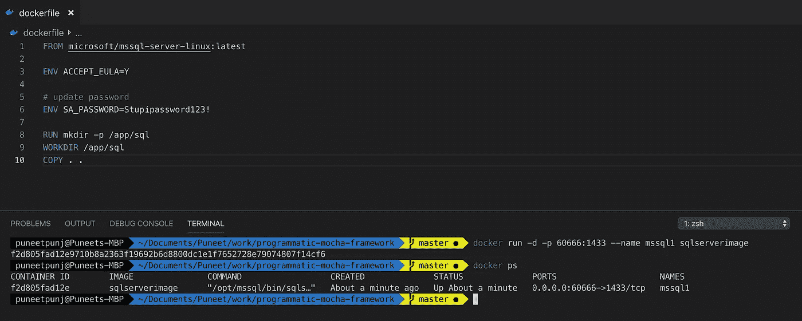
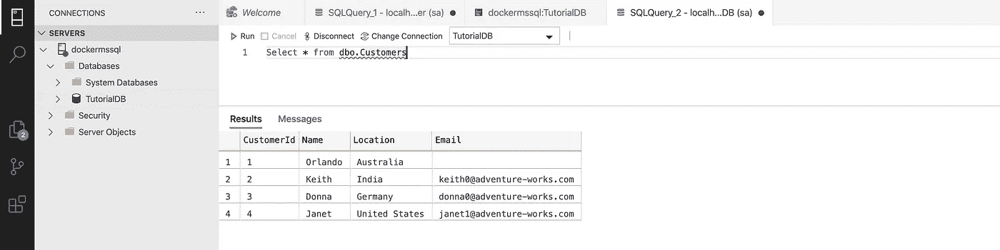
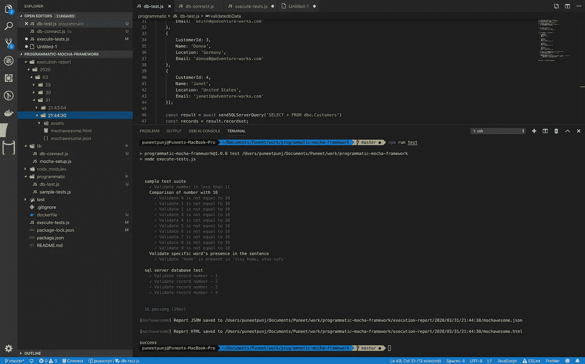

# 用 JavaScript 测试 Microsoft SQL Server

> 原文：<https://javascript.plainenglish.io/testing-microsoft-sql-server-database-using-javascript-6b5337e4a151?source=collection_archive---------5----------------------->

## MSSQL 测试并没有那么难


Photo by [Johny vino](https://unsplash.com/@johnyvino?utm_source=medium&utm_medium=referral) on [Unsplash](https://unsplash.com?utm_source=medium&utm_medium=referral)

当我在之前的职位上开始测试 **Microsoft SQL Server** 数据库时，通常没有太多可用的文档。所以我不得不花额外的时间去理解和建立一个端到端的测试。

本文的目的是分享如何为 MSSQL Server 编写自动化测试的知识。不用在 sql developer 或 Azure data studio 中编写查询，整个端到端测试可以使用 node.js `mssql`包自动化。

我会使用程序化的 Mocha 测试方法，设置可以在[上一篇文章](https://medium.com/@punjpuneet/introduction-to-programmatic-approach-to-mocha-testing-framework-e10d1947148e)中找到。

`git clone https://github.com/puneetpunj/programmatic-mocha-framework.git`

*出于本文的目的，我将启动一个新的数据库来获取连接细节并显示实际的测试，否则，如果您已经运行了 SQL Server，请随意跳过这一部分并使用您自己的连接细节。*

# 安装 SQL Server 数据库

先决条件— [Docker](https://docs.docker.com/install/)

让我们从在`programmatic-mocha-framework`中创建`dockerfile`开始

```
cd programmatic-mocha-framework// create new file and name it as dockerfile
touch dockerfile
```

将这段代码复制到 dockerfile 中

dockerfile for SQL Server

执行以下 docker 命令，您的 SQL Server 数据库将启动并运行。更多详情请查看[微软文档](https://docs.microsoft.com/en-us/sql/linux/sql-server-linux-configure-docker?view=sql-server-ver15)

```
docker build -t sqlserverimage .docker run -d -p 60666:1433 --name mssql1 sqlserverimagedocker ps
```



Confirmation of Docker Container running SQL Server

# 向数据库添加数据

下载 [Azure Data Studio](https://docs.microsoft.com/en-gb/sql/azure-data-studio/download?view=sql-server-2017) 并使用下面的连接细节

```
Server: localhost,60666
Login Type: SQL Login
User: sa
Password: Stupidpassword123!
```

成功登录后，执行以下查询，以便在数据库中添加一些数据行。更多详情请参考[微软文档](https://docs.microsoft.com/en-us/sql/azure-data-studio/quickstart-sql-server?view=sql-server-ver15)。

```
// Start by creating new database and name it as TutorialDBUSE master
GO
IF NOT EXISTS (
 SELECT name
 FROM sys.databases
 WHERE name = N'TutorialDB'
)
 CREATE DATABASE [TutorialDB];
GO
IF SERVERPROPERTY('ProductVersion') > '12'
 ALTER DATABASE [TutorialDB] SET QUERY_STORE=ON;
GO // Create new table in above database --- Create a new table called 'Customers' in schema 'dbo'
-- Drop the table if it already exists
IF OBJECT_ID('dbo.Customers', 'U') IS NOT NULL
 DROP TABLE dbo.Customers;
GO
-- Create the table in the specified schema
CREATE TABLE dbo.Customers
(
 CustomerId int NOT NULL PRIMARY KEY, -- primary key column
 Name nvarchar(50) NOT NULL,
 Location nvarchar(50) NOT NULL,
 Email nvarchar(50) NOT NULL
);
GO // Add rows -- Insert rows into table 'Customers'
INSERT INTO dbo.Customers
 ([CustomerId], [Name], [Location], [Email])
VALUES
 ( 1, N'Orlando', N'Australia', N''),
 ( 2, N'Keith', N'India', [N'keith0@adventure-works.com](mailto:N'keith0@adventure-works.com)'),
 ( 3, N'Donna', N'Germany', [N'donna0@adventure-works.com](mailto:N'donna0@adventure-works.com)'),
 ( 4, N'Janet', N'United States', [N'janet1@adventure-works.com](mailto:N'janet1@adventure-works.com)')
GO
```

一旦数据成功插入，执行`select * from dbo.Customers`



Select query returns all 4 records

# 构建一个库文件来与数据库交互

首先，通过运行`npm i mssql`添加 mssql 包

在`lib`目录下新建一个文件，命名为`db-connect.js`。通常，您不会在此文件中硬编码凭据，它们必须在中定义。env 或参数存储或机密管理器，但为了这个例子，我已经把它们添加到这个文件本身。将以下代码复制到 db-connect.js

db-connect.js

# 添加新的测试文件

编程方法的最大优势之一是基于计划/程序的测试的清晰分离，并独立运行它们。实现这一点的方法是在`programmatic`目录下添加新文件`db-test.js`。创建文件后，复制以下代码:

db-test.js

# 更新执行文件以包含新的测试

更新后的`execute-tests.js`看起来如下:

execute-tests.js

# 执行测试

执行命令将保持不变`npm run test`



Output of mssql execution

感谢阅读，代码可在 git [这里](https://github.com/puneetpunj/programmatic-mocha-framework)获得。