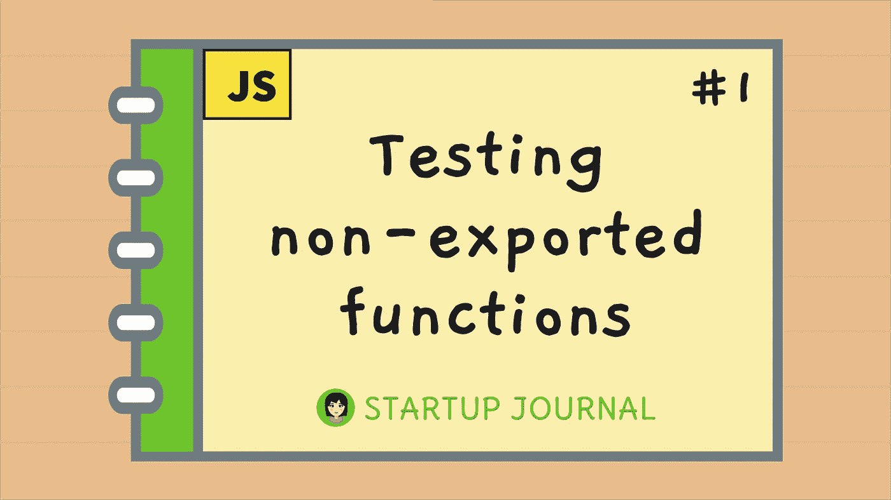

# 在 JavaScript 中测试非导出函数

> 原文：<https://javascript.plainenglish.io/testing-non-exported-functions-in-javascript-8644966c52e6?source=collection_archive---------3----------------------->



最近，我终于将单元测试集成到了我的创业项目中。我已经解决了 [Jest](https://jestjs.io/) 的问题，我会在另一篇日志中详细讨论这个问题。在编写我的测试时，我遇到了一个进退两难的困境，即试图为非导出函数编写单元测试😖

# 测试导出的函数

测试导出的函数非常简单。

```
*// utils.js*
export function sayHi() {
  return '👋';
}
```

单元测试可能是这样的:

```
*// utils.test.js*import { sayHi } from './utils.js';describe('sayHi', () => {
  it('returns wave emoji', () => {
    expect(sayHi()).toBe('👋');
  });
});
```

# 非出口功能

现在，如果函数没有导出呢？

```
function saySecret() {
  return '🤫';
}
```

哎呀，没有办法测试它！🤷‍♀️

```
*// utils.test.js**// ❌*
import { saySecret } from './utils.js';saySecret; *// undefined*
```

# Rewire 简介

然后我发现了这个叫做 [Rewire](https://github.com/jhnns/rewire) 的漂亮包！这是他们的官方描述:

Rewire 为模块添加了一个特殊的 setter 和 getter，这样你就可以修改它们的行为来进行更好的单元测试。你可以

*   *为流程等其他模块或全局注入模拟*
*   ***检查私有变量***
*   *覆盖模块内的变量。*

第二点正是我所需要的！

# 为 Vue 应用程序安装 Rewire

我没有用`rewire`，而是用了一个叫`babel-plugin-rewire`的包。本质上是 ES6 版的`rewire`，所以我可以用`import`。以下是他们的描述:

*受 rewire.js 启发，用巴别塔将其概念转移到 es6。*

# 步骤 1:安装软件包

```
*# Yarn*
yarn add -D babel-plugin-rewire*# Npm*
npm install babel-plugin-rewire --save-dev
```

# 步骤 2:添加到 babel 配置

*babel.config.js*

```
module.exports = {
  plugins: ['babel-plugin-rewire'],
};
```

# 第三步:使用它

好了，现在它已经安装好了，让我们再来看看我们未导出的函数。

```
function saySecret() {
  return '🤫';
}
```

现在，我们可以使用`rewire`来获取我们的非导出函数:

```
*// utils.test.js*import utilsRewire from './utils.js';describe('saySecret', () => {
  it('returns shh emoji', () => {
    const saySecret = utilsRewire.__get__('saySecret'); *// 👈 the secret sauce* expect(saySecret()).toBe('🤫');
  });
});
```

# 非导出函数必须在导出函数中调用

我需要指出一件重要的事情！为了测试非导出函数，需要在导出函数中使用它。

❌:所以它不会自己工作。

```
function saySecret() {
  return '🤫';
}
```

✅你需要**也**在同一个文件的一个导出函数中调用这个。

```
function sayHi(password) {
  if (password) {
    saySecret(); *// 👈 Calling the non-export function*
  }
}
```

现在，你真的能测试它吗👍

```
*// utils.test.js*import utilsRewire from './utils.js';describe('saySecret', () => {
  it('returns shh emoji', () => {
    const saySecret = utilsRewire.__get__('saySecret'); expect(saySecret()).toBe('🤫');
  });
});
```

# 警告！带重新布线的 Vuex

令我沮丧的是，在我最终设置好`rewire`并成功地为我的非导出函数添加了测试之后。当我打开我的 Vue 应用程序时，我得到了这个错误:

*❌未捕获错误:[vuex]动作应该是带有“处理程序”函数的函数或对象，但模块“编辑器”中的“actions.default”是{}。*

🤦‍♀️和许多开发商一样，当一个开发商遇到障碍时，你就关闭项目，放弃！不要！这不是开发者的方式——你去 LinkedIn，开始寻找新的职业😖还是没有😂让我们看看谷歌怎么说！

通常，我会告诉初级开发人员谷歌一下。但即使是谷歌搜索也是一项需要时间磨练的技能。知道搜索什么很重要。所以我要分享我用过的术语:

*   *(复制&粘贴错误)*
*   *Rewire 不支持 Vuex*

幸运的是，在第二次搜索中，我找到了解决方案！原来 GitLab 也有同样的问题，甚至贴出了[的解决方案](https://gitlab.com/gitlab-org/gitlab-foss/-/issues/52179)。让我复制并粘贴他们的发现:

*[Rewire]将默认导出添加到任何还没有导出的模块中。这导致了我们当前对 Vuex 资源使用* `*import * as getters from './getters.js'*` *的模式的问题，因为 default 最终会成为一个意外的数据类型(object，而不是 function)。因此，我们不得不为我们的每个 getters 添加* `*export default function() {}*` *，以确保这不会导致 Vuex 抱怨。*

太好了，他们不仅解释了问题，还提供了解决方案👏

# 1.我有问题的代码

在我的 Vue 应用程序中，我有与 GitLab 相同的模式。毫不奇怪，我在那里工作，所以我只是引用了工作中的相同模式😅。这是我最初的设置:

```
*// actions.js*export const someAction = () => {};*// store/index.js*import * as actions from './actions';export default {
  actions,
};
```

# 2.解决方案

使用从 GitLab 找到的解决方案，我所要做的就是添加一个默认导出，如下所示:

```
*// actions.js*export default function() {} *// 👈 Add this!*export const someAction = () => {};
```

# 替代解决方案

当然，我可以通过遵循不同的模式来避免这种默认导出。在官方 [Vuex](https://vuex.vuejs.org/guide/structure.html) 指南上，他们有一个[购物车示例](https://github.com/vuejs/vuex/blob/dev/examples/shopping-cart/store/modules/cart.js)你可以参考。他们有这样的东西:

```
*// modules/cart.js*const actions = {
  someAction() {},
};export default { *// 👈 no problem cause there's the default!*
  actions,
};*// store/index.js*import cart from './modules/cart';export default new Vuex.Store({
  modules: {
    cart,
  },
});
```

# 熟练导致结果！

也许以后，我会改变它，但这就是我现在所拥有的，所以我会离开它😅在编程中，我很早就知道总是有多种解决方案。通常没有最好的方法，只有适合你的方法👍

我喜欢我目前的设置。而且说实话，我对这种方式更有经验(注意，我在 GitLab 工作)。所以对我来说，这是我最好的方式。当你在创业时，熟练是关键。你不想把时间花在转动轮子上来学习一些东西。**一切都是为了结果。选择你更熟悉的工具并开始生产💪**

# 初学者友好资源

如果你来自我的[花絮](https://www.samanthaming.com/tidbits/)社区，你会熟悉我的更适合初学者的帖子。然而，在我的日志系列中，一些主题会更深入一些。因为它们是我在建立自己的创业项目时遇到的话题。我从中学到了很多，所以我想继续分享知识。为了能够快速地制作这些帖子，我经常不能打下基础——所以我提前向更多的初学者道歉😓但是不要烦恼！我们都曾是初学者，只要我们努力，我们都能提高水平！🧗‍♀️

以下是我要做的，我将链接一些资源，这些资源可能会帮助你更多地关注我的条目。再次感谢你阅读我的日志，迫不及待地想分享更多！

## JavaScript 第 1 部分中的单元测试——为什么要进行单元测试？

## Jest 速成班 JavaScript 中的单元测试

# 资源

*   [GitHub:对未导出的函数进行 Jest 测试](https://github.com/speedskater/babel-plugin-rewire/issues/183)
*   [用 Rewire](https://shipshape.io/blog/unit-testing-private-non-exported-functions-with-rewire/) 测试私有的非导出函数的单元
*   [堆栈溢出:使用 babel-plugin-rewire 测试私有的非引用函数](https://stackoverflow.com/questions/59002536/using-babel-plugin-rewire-to-test-private-non-referenced-functions)
*   [GitLab:移除 babel-plugin-rewire](https://gitlab.com/gitlab-org/gitlab-foss/-/issues/52179)

**感谢阅读**samanthaming.com
欲了解更多帖子，请访问[❤](https://www.samanthaming.com/)

🎨 [Instagram](https://www.instagram.com/samanthaming/) |🌟推特👩🏻‍💻[SamanthaMing.com](https://www.samanthaming.com/)