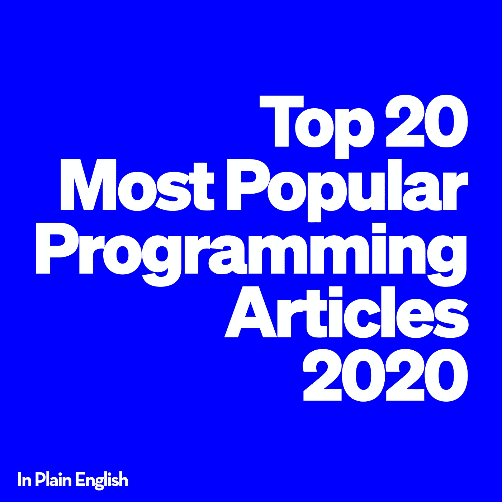

# 我们 2020 年最受欢迎的 20 篇编程文章

> 原文：<https://javascript.plainenglish.io/the-20-most-popular-programming-articles-of-2020-289d22fbd35e?source=collection_archive---------1----------------------->

## 以下是用浅显英语写的 20 篇阅读量最大的 JavaScript 文章。为你的下一篇文章寻找灵感——别再找了！

作为世界上最受欢迎的科技出版物之一的编辑，我经常被问到的一些问题是:“我应该写些什么”，以及“我如何才能写出人们会喜欢的东西？”好吧，不管你来这里是因为你想要这些问题的答案，还是你来这里只是为了阅读一些有趣的东西，这里有 2020 年最受欢迎的简单英语 JavaScript 文章。

以下文章是按照获得的掌声数量排列的。这意味着根据浏览量可能会有不同的顺序，尽管掌声通常是一篇文章受欢迎程度/表现如何的良好晴雨表。

## 1. [**32 搞笑代码评论那人居然写了**](https://medium.com/javascript-in-plain-english/30-funny-code-comments-that-will-make-you-laugh-1c1b54d4ab00)

 [## 人们实际上写的 32 个有趣的代码注释

### 这里没什么严重的。读这个只是为了好玩！

medium.com](https://medium.com/javascript-in-plain-english/30-funny-code-comments-that-will-make-you-laugh-1c1b54d4ab00) 

通过[异或](https://medium.com/u/b72c46f02815?source=post_page-----289d22fbd35e--------------------------------)

*喜欢:12.3k*

## 2. [**像高级前端开发者一样使用 Chrome dev tools**](https://medium.com/javascript-in-plain-english/use-chrome-devtools-like-a-senior-frontend-developer-99a4740674)

 [## 像高级前端开发者一样使用 Chrome DevTools

### 如果你选择 Chrome 作为你的开发环境，你必须知道的 6 个技巧。

medium.com](https://medium.com/javascript-in-plain-english/use-chrome-devtools-like-a-senior-frontend-developer-99a4740674) 

由 [bitfish](https://medium.com/u/dac47b3482f4?source=post_page-----289d22fbd35e--------------------------------)

*喜欢:7.8k*

## 3. [**7 个不使用打字稿的好理由**](https://medium.com/javascript-in-plain-english/7-really-good-reasons-not-to-use-typescript-166af597c466)

 [## 不使用 TypeScript 的 7 个非常好的理由

### 有很多理由使用 TypeScript，但我会给你 7 个不使用的理由。

medium.com](https://medium.com/javascript-in-plain-english/7-really-good-reasons-not-to-use-typescript-166af597c466) 

迈克尔·克拉斯诺夫

*喜欢:7.1k*

## 4. [**请停止使用 JavaScript 中的类，成为一个更好的开发者**](https://medium.com/javascript-in-plain-english/please-stop-using-classes-in-javascript-and-become-a-better-developer-a185c9fbede1)

 [## 请停止使用 JavaScript 中的类，成为一个更好的开发者

### 在这篇文章中，我将谈论为什么在 JavaScript 中使用类是一个坏主意，以及有哪些…

medium.com](https://medium.com/javascript-in-plain-english/please-stop-using-classes-in-javascript-and-become-a-better-developer-a185c9fbede1) 

迈克尔·克拉斯诺夫

*喜欢:5.8k*

## 5. [**在 JavaScript**](https://medium.com/javascript-in-plain-english/stop-using-console-log-in-javascript-d29d6c24dc26) 中停止使用 console.log()

 [## 停止在 JavaScript 中使用 console.log()

### 有更好的选择

medium.com](https://medium.com/javascript-in-plain-english/stop-using-console-log-in-javascript-d29d6c24dc26) 

作者[哈莎·瓦丹](https://medium.com/u/8be6309d249e?source=post_page-----289d22fbd35e--------------------------------)

*喜欢:5.4k*

## 6.[**JSON . stringify()的 5 个秘密特性**](https://medium.com/javascript-in-plain-english/5-secret-features-of-json-stringify-c699340f9f27)

 [## JSON.stringify()的 5 个秘密特性

### 如果您知道这些特性，字符串化会很容易。

medium.com](https://medium.com/javascript-in-plain-english/5-secret-features-of-json-stringify-c699340f9f27) 

作者[普拉蒂克·辛格](https://medium.com/u/c096db4ed502?source=post_page-----289d22fbd35e--------------------------------)

*喜欢:5.2k*

## 7. [**我从伟大开发者那里偷来的 19 样东西**](https://medium.com/javascript-in-plain-english/19-things-i-stole-from-great-developers-85511ff56570)

 [## 我从伟大的开发者那里偷来的 19 样东西

### 伟大的开发人员每天都在做什么

medium.com](https://medium.com/javascript-in-plain-english/19-things-i-stole-from-great-developers-85511ff56570) 

由[丹尼尔·安德森](https://medium.com/u/d3e42a522f8c?source=post_page-----289d22fbd35e--------------------------------)

*喜欢:5.1k*

## 8. [**能打败这个游戏**](https://medium.com/javascript-in-plain-english/you-dont-know-javascript-until-you-can-beat-this-game-aa7fd58befb) 才算懂 JavaScript

 [## 直到你能打败这个游戏，你才知道 JavaScript

### 每次都把钱押在获胜的马上，你就能成为真正的 JavaScript 鉴赏家

medium.com](https://medium.com/javascript-in-plain-english/you-dont-know-javascript-until-you-can-beat-this-game-aa7fd58befb) 

由[梅尔特·穆塔兹](https://medium.com/u/6f0837f07b9e?source=post_page-----289d22fbd35e--------------------------------)

*喜欢:4.3k*

## 9. [**停止在代码中使用‘else’关键字**](https://medium.com/javascript-in-plain-english/stop-using-the-else-keyword-in-your-code-907e82b3054a)

 [## 停止在代码中使用“else”关键字

### 从今天开始，不要在 JavaScript 代码中使用它

medium.com](https://medium.com/javascript-in-plain-english/stop-using-the-else-keyword-in-your-code-907e82b3054a) 

由[钟和丹](https://medium.com/u/7bea6a19463b?source=post_page-----289d22fbd35e--------------------------------)

*喜欢:4.1k*

## 10. [**大多数前端开发者不知道的 11 个前端招数**](https://medium.com/javascript-in-plain-english/11-frontend-tricks-that-most-frontend-developers-dont-know-about-68dc48199ed6)

 [## 大多数前端开发人员不知道的 11 个前端技巧

### 你可以用 HTML/JS/CSS 做一些有趣的技巧

medium.com](https://medium.com/javascript-in-plain-english/11-frontend-tricks-that-most-frontend-developers-dont-know-about-68dc48199ed6) 

由[丹尼尔·安德森](https://medium.com/u/d3e42a522f8c?source=post_page-----289d22fbd35e--------------------------------)

*喜欢:4k*

## 11. [**30 个让你开怀大笑的编程笑话**](https://medium.com/javascript-in-plain-english/30-programming-jokes-that-will-make-you-laugh-98f9e20c34e9)

 [## 30 个让你发笑的编程笑话

### 与所有程序员相关的笑话和迷因列表

medium.com](https://medium.com/javascript-in-plain-english/30-programming-jokes-that-will-make-you-laugh-98f9e20c34e9) 

由[尼哈尔·汗](https://medium.com/u/b1c60b289d9e?source=post_page-----289d22fbd35e--------------------------------)

*喜欢:2.9k*

## 12. [**20 种节省你时间的 JavaScript 速记技巧**](https://medium.com/javascript-in-plain-english/20-javascript-shorthand-techniques-that-will-save-your-time-f1671aab405f)

 [## 20 种节省您时间的 JavaScript 速记技巧

### 任何编程语言的速记技术都有助于您编写更加简洁和优化的代码。速记…

medium.com](https://medium.com/javascript-in-plain-english/20-javascript-shorthand-techniques-that-will-save-your-time-f1671aab405f) 

阿米塔夫·米什拉

*喜欢:2.9k*

## 13. [**为什么 JavaScript 中的代理很神奇**](https://medium.com/javascript-in-plain-english/why-proxies-in-javascript-are-fantastic-db100ddc10a0)

 [## 为什么 JavaScript 中的代理如此神奇

### 4 个实际例子帮助您掌握 JavaScript 的这一强大特性

medium.com](https://medium.com/javascript-in-plain-english/why-proxies-in-javascript-are-fantastic-db100ddc10a0) 

由 [bitfish](https://medium.com/u/dac47b3482f4?source=post_page-----289d22fbd35e--------------------------------)

*喜欢:2.9k*

## 14. [**开发者应该知道的 11 件事 GET vs POST**](https://medium.com/javascript-in-plain-english/get-vs-post-are-you-confident-about-the-differences-189562fac0a7)

 [## 关于 GET 和 POST，开发人员应该知道的 11 件事

### 如果你认为 GET 是获取数据和保存数据，我不得不说还有很多关于它们的东西…

medium.com](https://medium.com/javascript-in-plain-english/get-vs-post-are-you-confident-about-the-differences-189562fac0a7) 

由 [CBernardes](https://medium.com/u/e0cdd4b7e94d?source=post_page-----289d22fbd35e--------------------------------)

*喜欢:2.7k*

## 15.[**2021 年你需要的 JavaScript cheat sheet**](https://medium.com/javascript-in-plain-english/a-javascript-cheatsheet-you-need-in-2020-d81b3dd89e09)

 [## 2021 年你需要的 JavaScript Cheatsheet

### 我很确定我不是唯一一个在面试中遇到一些不舒服的技术问题并感到…

medium.com](https://medium.com/javascript-in-plain-english/a-javascript-cheatsheet-you-need-in-2020-d81b3dd89e09) 

作者:[斯蒂芬尼·西蒙](https://medium.com/u/342176065bdc?source=post_page-----289d22fbd35e--------------------------------)

*喜欢:2.6k*

## 16. [**是否应该停止使用对象和数组来存储数据？**](https://medium.com/javascript-in-plain-english/stop-using-objects-and-arrays-to-store-data-289c3edaaa33)

 [## 是否应该停止使用对象和数组来存储数据？

### ES6 以集合和映射的形式有其他处理数据结构和值的方法

medium.com](https://medium.com/javascript-in-plain-english/stop-using-objects-and-arrays-to-store-data-289c3edaaa33) 

作者[阿努拉格·卡努里亚](https://medium.com/u/eea6e41ec675?source=post_page-----289d22fbd35e--------------------------------)

*喜欢:2.5k*

## 17. [**软件开发者必备的 10 个 GitHub 回购**](https://medium.com/javascript-in-plain-english/10-essential-github-repos-for-software-developers-6a42ebba279)

 [## 软件开发人员必备的 10 个 GitHub Repos

### 惊人的编码资源、免费课程、面试准备、编程最佳实践等等

medium.com](https://medium.com/javascript-in-plain-english/10-essential-github-repos-for-software-developers-6a42ebba279) 

由[苏尼尔·桑德胡](https://medium.com/u/a7b125868703?source=post_page-----289d22fbd35e--------------------------------)

*喜欢:2.5k*

## 18. [**7 个没人说的免费 API**](https://medium.com/javascript-in-plain-english/7-free-apis-that-nobody-is-talking-about-cf974e15917)

 [## 7 个没人谈论的免费 API

### 使用这些 API 创建独特而有趣的应用程序

medium.com](https://medium.com/javascript-in-plain-english/7-free-apis-that-nobody-is-talking-about-cf974e15917) 

作者:阿努拉格·卡纳里亚

*喜欢:2.5k*

## 19. [**停止对 API 使用 REST**](https://medium.com/javascript-in-plain-english/stop-using-rest-for-apis-d697727ae6dd)

 [## 停止对 API 使用 REST

### GraphQL 更好

medium.com](https://medium.com/javascript-in-plain-english/stop-using-rest-for-apis-d697727ae6dd) 

作者[哈莎·瓦汉](https://medium.com/u/8be6309d249e?source=post_page-----289d22fbd35e--------------------------------)

*喜欢:2.5k*

## 20. [**设置大规模 React 应用**](https://medium.com/javascript-in-plain-english/setting-up-a-large-scale-react-application-2d50bc8a5ddb)

 [## 设置大规模的 React 应用程序

### 如何整理文件和文件夹？如何实施风格指南？使用什么类型的系统、棉绒机和测试机？如何…

medium.com](https://medium.com/javascript-in-plain-english/setting-up-a-large-scale-react-application-2d50bc8a5ddb) 

布鲁诺·桑帕约

*喜欢:2.4k*

[https://youtube.com/sunilsandhu](https://www.youtube.com/sunilsandhu)

***对了，我现在有 YouTube 频道了！*** [***点击这里立即订阅！***](https://www.youtube.com/channel/UCtipWUghju290NWcn8jhyAw?sub_confirmation=true)

# 奖金！(前 21-30 名)

## 21. [**单页应用如何打破网页设计**](https://medium.com/javascript-in-plain-english/how-single-page-applications-broke-the-web-design-bd18d4ddcdab)

 [## 单页应用如何打破网页设计

### web 最初是围绕用超链接将文档连接在一起的概念而设计的。总的想法是…

medium.com](https://medium.com/javascript-in-plain-english/how-single-page-applications-broke-the-web-design-bd18d4ddcdab) 

由[欧文](https://medium.com/u/680ab6f6b2eb?source=post_page-----289d22fbd35e--------------------------------)

*喜欢:2.4k*

## 22. [**你必须了解这 14 个 JavaScript 函数**](https://medium.com/javascript-in-plain-english/you-must-understand-these-14-javasript-functions-1f4fa1c620e2)

 [## 你必须理解这 14 个 JavaScript 函数

### 在参加任何 JavaScript 面试之前，您应该能够理解并手写这些函数。

medium.com](https://medium.com/javascript-in-plain-english/you-must-understand-these-14-javasript-functions-1f4fa1c620e2) 

由 [bitfish](https://medium.com/u/dac47b3482f4?source=post_page-----289d22fbd35e--------------------------------)

*喜欢:2.3k*

## 23. [**TypeScript 4.0 终于交付了我一直等待的**](https://medium.com/javascript-in-plain-english/typescript-4-0-i-want-a-list-of-generic-params-with-good-labels-c6087d2df935)

 [## TypeScript 4.0 最终交付了我一直在等待的东西

### 标签良好的通用参数列表！

medium.com](https://medium.com/javascript-in-plain-english/typescript-4-0-i-want-a-list-of-generic-params-with-good-labels-c6087d2df935) 

纳撒尼尔·凯斯勒

*喜欢:2.2k*

## 24. [**我从构建我的第一个大型应用**](https://medium.com/javascript-in-plain-english/lessons-i-learnt-from-building-my-first-large-scale-app-281c56df8571) 中学到的经验

 [## 我从构建我的第一个大型应用程序中学到的经验

### 8 个月前，我开始开发一个电子应用程序。为了完成这项任务，我必须构建 3 个独立的子应用程序来运行…

medium.com](https://medium.com/javascript-in-plain-english/lessons-i-learnt-from-building-my-first-large-scale-app-281c56df8571) 

作者:维克多·奥莱坦

*点赞:2.1k*

## 25.[**JavaScript 中的函数比你想象的**](https://medium.com/javascript-in-plain-english/function-in-javascript-has-much-more-secrets-than-you-think-b3bf64055c99) 有更多的秘密

 [## JavaScript 中的函数比你想象的有更多的秘密

### 高级 JavaScript 程序员必须知道的事情。

medium.com](https://medium.com/javascript-in-plain-english/function-in-javascript-has-much-more-secrets-than-you-think-b3bf64055c99) 

由 [bitfish](https://medium.com/u/dac47b3482f4?source=post_page-----289d22fbd35e--------------------------------)

*喜欢:2.1k*

## 26. [**为我改变 JavaScript 的 6 个工具**](https://medium.com/javascript-in-plain-english/the-6tools-that-changed-javascript-for-me-3ee1faf40585)

 [## 改变我的 JavaScript 的 6 个工具

### 3 个主流，2 个默默无闻，1 个正在崛起

medium.com](https://medium.com/javascript-in-plain-english/the-6tools-that-changed-javascript-for-me-3ee1faf40585) 

埃德加·罗德里格斯

*喜欢:2k*

## 27. [**每个 Web 开发人员都应该知道的 11 个 JavaScript 概念，让他们的技能更上一层楼**](https://medium.com/javascript-in-plain-english/11-javascript-concepts-every-web-developer-should-know-to-take-their-skills-to-the-next-level-37ef6693111a)

 [## 每个 Web 开发人员都应该知道的 11 个 JavaScript 概念，让他们的技能更上一层楼

### 不了解这些概念，就无法掌握 JavaScript。

medium.com](https://medium.com/javascript-in-plain-english/11-javascript-concepts-every-web-developer-should-know-to-take-their-skills-to-the-next-level-37ef6693111a) 

艾米·j·安德鲁斯

*喜欢:2k*

## 28. [**4 个你从未听说过的强大 JavaScript 运算符**](https://medium.com/javascript-in-plain-english/4-powerful-javascript-operators-youve-never-heard-of-487df37114ad)

 [## 你从未听说过的 4 个强大的 JavaScript 操作符

### 他们看起来很相似，但绝对不是。

medium.com](https://medium.com/javascript-in-plain-english/4-powerful-javascript-operators-youve-never-heard-of-487df37114ad) 

安东尼·希门尼斯

*喜欢:2k*

## 29. [**3 开发商一边忙着让你马上赚钱**](https://medium.com/javascript-in-plain-english/3-developer-side-hustles-that-will-make-you-money-right-now-96aa59fdc2a0)

 [## 3 开发商方面的努力将让你马上赚钱

### 如何从今天开始看到你的钱包随着你的编码技能越来越大。

medium.com](https://medium.com/javascript-in-plain-english/3-developer-side-hustles-that-will-make-you-money-right-now-96aa59fdc2a0) 

皮耶罗·博雷利

*喜欢:1.9k*

## 30.我读了整个 React API。以下是我对新开发者的建议

 [## 我阅读了整个 React API。以下是我对新开发者的建议

### 我阅读了整个 React API，这里是我对新手学习 React.js 和有经验的程序员采用 React 的建议…

medium.com](https://medium.com/javascript-in-plain-english/i-read-the-entire-react-api-here-is-my-advice-to-new-developers-d040507e6c23) 

由 [ThankGod Ukachukwu](https://medium.com/u/65765c134173?source=post_page-----289d22fbd35e--------------------------------)

*喜欢:1.8k*

# 结论

我们做到了！2020 年 JavaScript 用简单英语发表的最喜欢的前 20(或 30)篇文章。鉴于 2020 年是多么疯狂和悲惨，最受欢迎的文章似乎应该归入笑话集。毕竟，我们都可以开怀大笑！

恭喜那些上榜的人！🎉

更重要的是，我想花点时间感谢你们每一个在过去一年里贡献了一篇文章的人。是你们让这本书成为了一股正义的力量。

我还要感谢关注我们出版物并参与其中的每一个人。如果你喜欢这种列表，一定要留下一些掌声——如果是这样，我们一定会从 2021 年起每月举办一次！

非常爱！❤️

*你愿意为 2021 年的简明英语做贡献吗？* [***点击这里了解***](https://medium.com/javascript-in-plain-english/https-medium-com-javascript-in-plain-english-join-our-team-b0854ead7d14) ***！***