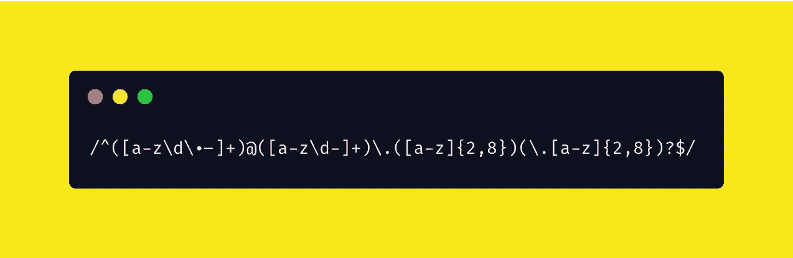

# 对前端开发人员最有用的 3 个正则表达式

> 原文：<https://javascript.plainenglish.io/the-3-most-useful-regexes-for-front-end-developers-61b1b4bb4498?source=collection_archive---------6----------------------->

## 锚、小组和积极前瞻



# > Regex 检测仪

*   以下所有示例都可以在 [**regexr**](https://regexr.com/) 上运行/测试

# > t1；速度三角形定位法(dead reckoning)

## 了解以下 Regex

*   **锚**如^，$
*   **人物** **设定**如【a-z】、【A-Z】
*   **量词**如*、+、？
*   **交替**如{5}、{2、} {1，3}
*   **等组**(ABC)
*   **积极前瞻**如(？=abc)
*   **交替**如 ab | cd

> 希望你喜欢


Photo by [Ramiz Dedaković](https://unsplash.com/@ramche?utm_source=medium&utm_medium=referral) on [Unsplash](https://unsplash.com?utm_source=medium&utm_medium=referral)

# > 1:有效电子邮件 Regex

```
^([a-zA-Z0-9._%-]+@[a-zA-Z0-9.-]+\.[a-zA-Z]{2,6})*$
```

> 可从底部获取高级有效电子邮件 Regex

# 说明

```
**Anchors**^ (Caret) : beginning
$ (Dollar) : ends
```

# 词典

```
**Character Set**[a-zA-Z0-9._%-] // from the regex abovea-z : **Range --** Matches a character in the range "a" to "z" 
(Case Sensitive)
A-Z : **Range --** Matches a character in the range "A" to "Z"(Case Sensitive)
0-9 : **Range --** Matches a character in the range "0" to "9"
. : **Character --** Matches a "." character
_ : **Character --** Matches a "_" character
% : **Character --** Matches a "%" character
- : **Character --** Matches a "-" character**Cheat Sheet
[abc] : ANY** OF "a" , "b" , or "c"
**[^abc] : NOT** "a" , "b" , or "c"
**[a-g] : Characters** between "a" & "g"
```

```
**Quantifiers**
[a-zA-Z0-9._%-]+ // from the regex above**a* :** 0 or more of the preceding token ***important***
**a+ :** 1 or more of the preceding token ***important***
```

```
**Alternation** a-zA-Z]{2,6} // from the regex above**a{5} :** exactly 5
**a{2,} :** two or more
**a{1,3} :** between 1 & 3 (1 , 2 or 3)
```

# 问题

无效的电子邮件地址，例如

```
12glipms12um_1%-@gmail.edu.df12glipms12um_1%-@gmail.edu
```

正在通过上述 regex 测试……**ALERT！**💥

# 高级有效电子邮件正则表达式

```
**(Advanced) Quantifiers
a? :** 0 or 1
```

因此，如果`()`组重复一次以上，该字符串将被取消测试资格

# > 2:密码强度

```
(?=(.*[0-9]))(?=.*[!@#$%^&*()-_+=~`|:;\"'<>,./?])(?=.*[a-z])(?=(.*[A-Z]))(?=(.*)).{8,}
```

*   在你进一步深入之前，你会在这个正则表达式中看到很多**正面的回望** `?=(..)`。
*   有正面和负面的前瞻，它们都适用于字母位置不固定的情况

# 词典

```
For example,
in the **>1: Valid Email Regex,** (example above) **You know the position of letters
e.g.,** <email User Name> @ <email Provider> . <extension>**However,** the position of letters is not fixed for the **passwords**
e.g., Gwl213ed!@ , skwenfklEq!@!12 etc...
They are thousands of possibilities for the combination of **passwords** and it's actually better to be unpredictableIn conclusion, **Positive lookaround is good to use when
the position of letters are not predictable / fixed**
```

```
**Groups & Positive Lookahead
(abc) :** capturing group
**(?=abc) :** positive lookahead
```

**组**

**捕获组:**将多个令牌分组在一起，并创建一个用于提取子字符串或使用回溯的捕获组

**积极前瞻**

**正向前瞻:**匹配主表达后的组，但不将其包含在结果中

语法是`X(?=Y)`，意思是“寻找`X`，但是只有在后面跟着`Y`的情况下才匹配

或者

`X(?=Y)(?=Z)`、

1.  查找`X`
2.  检查`Y`是否紧接在`X`之后(如果不是，跳过)
3.  检查`Z`是否也紧接在`X`之后(如果不是，跳过)
4.  如果两个测试都通过，则`X`匹配，否则继续搜索

```
**It's faster reading from the back
(?=(.*[0-9])).
             ^
             | Dot "."** matches any character except line breaks **| (e.g,** Given **`hel\nlo\n1`, "."** has 6 matches except   
               for \n (newline)**(?=(.*[0-9])).
    ^^^^^^^****Same dot**
any characters (".") 0 or more
and **numbers** [0-9] afterTherefore, both
"**helloworld1**" & "**123**" --> **true**
```

## 换句话说，

```
(?=(.*[0-9]))(?=.*[!@#$%^&*()-_+=~`|:;\"'<>,./?])(?=.*[a-z])(?=(.*[A-Z]))(?=(.*)).{8,}
```

可以分解成多个积极的观察

```
(?=(.*[0-9])) : looks for numbers
(?=.*[!@#$%^&*()-_+=~`|:;\"'<>,./?]) : looks for special characters
(?=.*[a-z]) : looks for lowercase letters
(?=(.*[A-Z])) : looks for upper case letters
(?=(.*)) : looks for everything**5 groups of positive lookaround** is greedily looking for its matches and regex test passes only if all of the criteria are matched
```

最后但并非最不重要的是，

```
.{8,} // from the regex above**. :** is the only regex out of positive lookaround & it is actual starting point of this regex. It looks for any character except newline &**{8,} :** **Alternation** represents 8 or more letters (>1 example above)
```

# > 3:日期(年-月-日)

```
([12]\d{3}-(0[1-9]|1[0-2])-(0[1-9]|[12]\d|3[01]))
**for regexr**or([12]\\d{3}-(0[1-9]|1[0-2])-(0[1-9]|[12]\\d|3[01]))**for JavaScript additional \ in front of `\d` because we use it as a string in RegExp in JavaScript**
```

# 词典

```
**Alternation
ab | cd :** match ab or cd([12]\\d{3}-(0[1-9]|1[0-2])-(0[1-9]|[12]\\d|3[01]))
```

可分解为 3 部分(用`\`隔开)

```
([12]\\d{3}-
(0[1-9]|1[0-2])-
(0[1-9]|[12]\\d|3[01]))
```

就像一堆`if-statement`

```
**([12]\\d{3} :** The first letter is either 1 or 2 **[12]** 
               then followed by 3 digits **\\d{3}****2 IF-STATEMENTS (starts with 0 | starts with 1)
(0[1-9]|1[0-2]) :** if starts with 0 then the next digit should be in  
                  a range of 1 to 9
                  if starts with 1 then the next digit should be in  
                  a range of 0 to 2**3 IF-STATEMENTS (starts with 0 | starts with 1 or 2 | starts with 3)****(0[1-9]|[12]\\d|3[01])) :** if starts with 0 then the next digit 
                          should be in a range of 1 to 9
                          if starts with 1 or 2 then the next digit  
                          can be any digits `\d` [0-9]
                          if starts with 3 then the next digit 
                          should be 0 or 1
```

> 快乐编码！

## **来自 JavaScript 的普通英语注释**

我们已经推出了三种新的出版物！请关注我们的新出版物:[**AI in Plain English**](https://medium.com/ai-in-plain-english)[**UX in Plain English**](https://medium.com/ux-in-plain-english)[**Python in Plain English**](https://medium.com/python-in-plain-english)**——谢谢，继续学习！**

**我们也一直有兴趣帮助推广高质量的内容。如果您有一篇文章想要提交给我们的任何出版物，请发送电子邮件至[**submissions @ plain English . io**](mailto:submissions@plainenglish.io)**，并附上您的 Medium 用户名，我们会将您添加为作者。另外，请让我们知道您想加入哪个/哪些出版物。****

********

****Photo by [Christopher Gower](https://unsplash.com/@cgower?utm_source=medium&utm_medium=referral) on [Unsplash](https://unsplash.com?utm_source=medium&utm_medium=referral)****