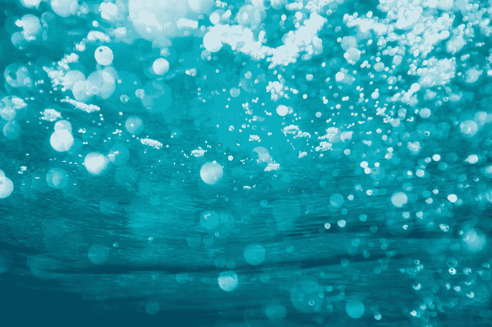
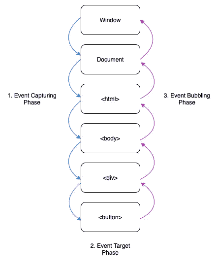
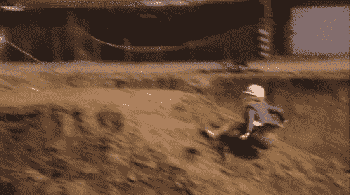
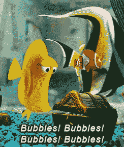

# 解释了 JavaScript 中事件传播的 3 个阶段

> 原文：<https://javascript.plainenglish.io/the-3-phases-of-event-propagation-explained-f76348b5343f?source=collection_archive---------1----------------------->

## 什么是事件冒泡？什么是事件捕获？



Photo by [Sime Basioli](https://unsplash.com/@simebasioli?utm_source=unsplash&utm_medium=referral&utm_content=creditCopyText) on [Unsplash](https://unsplash.com/s/photos/bubbles?utm_source=unsplash&utm_medium=referral&utm_content=creditCopyText)

JavaScript 中事件传播的三个阶段对于理解如何使用事件至关重要，此外，这也是 JavaScript 技术面试中另一个极其常见的问题。

**这三个阶段依次是 1)事件捕获阶段，2)目标阶段，以及 3)事件冒泡阶段。**

*本质上，事件首先通过父元素向下传递，直到到达目标元素(捕获阶段)。当事件到达目标时，它在那里触发(目标阶段)，然后沿着链向上返回(冒泡阶段)，沿途调用处理程序。(via*[*JavaScript . info*](https://javascript.info/bubbling-and-capturing)*)*

目标元素指的是触发事件的确切点。例如，如果你点击了一个`<div>`中的按钮，那么相应的`<button>`标签就是目标。这个元素可以作为`event.target`访问，并且在事件传播的各个阶段不会改变。



# 什么是事件捕获？



Going down - just like event capturing!

事件捕获是第一个阶段，当事件从顶部(`window`)一直向下移动到事件目标时，就像瀑布一样。这在处理事件时很少使用，大多数情况下这发生在幕后。如果放置一个处理程序，通常是在事件冒泡阶段，因为一个元素离目标越近，元素的上下文就越多。

当事件处理程序设置了`onClick`(或不同的`on<event>`)或`addEventListener(event, handler)`时，只有目标阶段和事件冒泡阶段会捕捉到它。如果我们想在捕获阶段捕获一个事件，我们需要显式地将`{capture: true}`或者仅仅是隐含的`true`添加到事件监听器的末尾。

```
element.addEventListener("click", e => alert('Capturing'), {capture: true})
// or this way also works
element.addEventListener("click", e => alert('Capturing'), true)
```

# 目标阶段是什么？

虽然官方有三个阶段，但是当到达`event.target`元素时发生的第二个“目标”阶段并不像其他阶段那样单独处理。当事件捕获和事件冒泡处理程序从目标元素开始和结束时，它们都会自动触发这个阶段。

# 什么是事件冒泡？



Bubbles going up — just like event bubbling

事件冒泡包括运行目标元素的处理程序，然后向上“冒泡”到下一个父元素的处理程序，然后是上一个父元素的处理程序，依此类推。你可以认为这类似于气泡在水中上升的概念。这意味着如果我们有一个嵌套在`<div>`中的`<p>`，嵌套在`<form>`中的`<p>`，处理程序将按顺序运行它们:`<p> -> <div> -> <form>`。这种冒泡将一直持续到元件的顶部，通过`html`、`document object`直到`window`。几乎所有事件都会冒泡，只有少数例外，比如`focus`。

```
<form onClick="alert('You clicked the form!')">
  <div onClick="alert('You clicked the div!')">
    <p>If you click me, the other handlers will still run!</p>
  </div>
</form>
```

如果出于某种原因，我们需要在事件目标的处理程序完成运行后停止向上传播，我们可以使用`event.stopPropagation()`。如果我们想阻止传播和当前目标的处理程序运行，我们也可以使用`event.stopImmediatePropagation()`。不建议这样做，因为这些情况可以用其他方式处理，它们可能会导致无法预料的副作用，但是知道它们的存在还是很好的。

下面是一个代码示例，它有助于说明活动中的事件传播阶段:

Courtesy of [javascript.info](https://javascript.info/bubbling-and-capturing)

# 简单英语的 JavaScript

喜欢这篇文章吗？如果有，通过 [**订阅解码，我们的 YouTube 频道**](https://www.youtube.com/channel/UCtipWUghju290NWcn8jhyAw) **获取更多类似内容！**