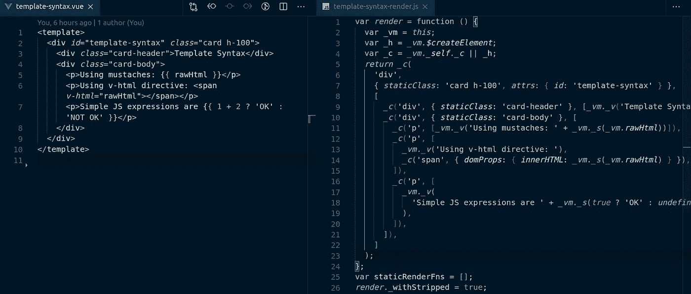
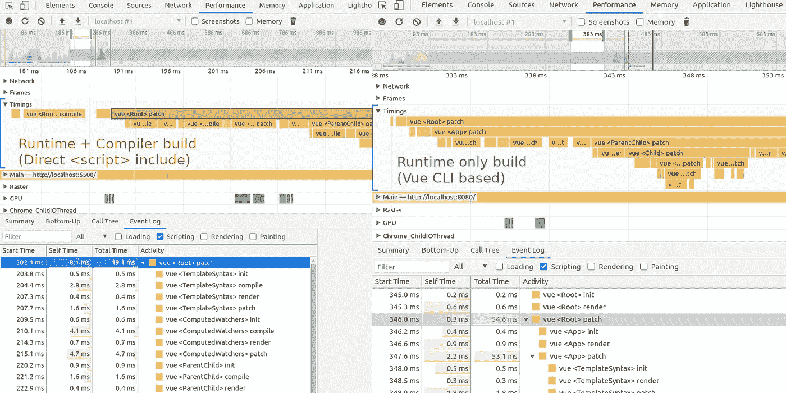

# Vue 组件渲染的 4 个阶段

> 原文：<https://javascript.plainenglish.io/the-4-phases-of-vue-component-rendering-b6ee26c9bec1?source=collection_archive---------8----------------------->

Photo by [K8](https://unsplash.com/@k8_iv?utm_source=unsplash&utm_medium=referral&utm_content=creditCopyText) on [Unsplash](https://unsplash.com/s/photos/onion?utm_source=unsplash&utm_medium=referral&utm_content=creditCopyText)

> *[*萨古尔*](https://github.com/saghul) “剥得越多，哭得越厉害”😆*

*Vue JS 是简单但功能强大的库+框架。JavaScript 开发人员可以通过解码 Vue 代码库来提高他们的技能。Vue 解剖博客是我解码的尝试。*

*Vue 经历了四个阶段*

1.  *init —包括初始化、创建前和创建的生命周期挂钩*
2.  *编译—将模板转换为内部函数*
3.  *render —返回虚拟 DOM 节点*
4.  *修补—将虚拟 DOM 与上一个虚拟 DOM 进行比较，并在浏览器 DOM 中呈现增量*

*当我们更喜欢做快速原型时，我们直接在 html 文件中包含 [Vue 库](https://vuejs.org/v2/guide/installation.html#Direct-lt-script-gt-Include)(完整构建—运行时+编译)。这种方法的缺点是每次都要执行编译阶段。*

*模板部分中编写的代码将被转换为 render JS 函数，如下所示*

**

*Vue template to render function*

*当我们使用 Vue CLI 时，Vue 模板将在构建过程中被转换为渲染 JS 函数。这种方法有双重优势。*

1.  *我们只需要 Vue 运行时库——更小的 Vue 包。*
2.  *排除了编译阶段—改进了整体处理。*

**

*No compile step in Vue CLI based runtime*

***初始化阶段执行的活动***

***编译阶段执行的活动***

***渲染和修补阶段执行的活动***