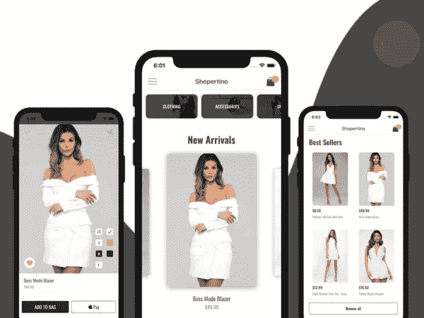
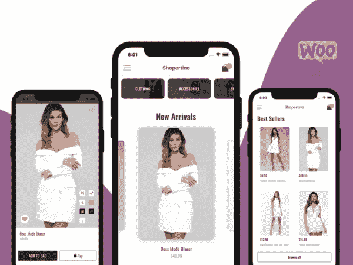

# 2019 年 5 个最好的本地电子商务模板

> 原文：<https://javascript.plainenglish.io/the-5-best-react-native-ecommerce-templates-of-2019-be8ca8e9b95b?source=collection_archive---------3----------------------->

建立在线商店、电子商务网站和应用程序已经成为现代世界的一种增长趋势。由于从数字或在线营销吸引客户的最大可行性和效率，在线商店和电子商务网站正在快速增长。在不久的将来，很有可能每个现实世界的商店都将在在线商店应用程序或网站上建立自己的商店。应用程序商店中发布的电子商务应用程序增长迅速。移动电子商务应用已经成为当今发展的趋势。随着越来越多的客户从 PC 平台转向移动平台，几乎所有在线商店都需要有自己的移动应用程序。这就是 React 本地电子商务模板派上用场的地方。

此外，它们有助于节省开发时间，并使我们能够快速有效地创建和发布我们自己的电子商务应用程序。在 React Native 之上，提供了跨平台应用程序开发特性。这意味着带有现成的高端 React 原生模板的相同应用程序将可用于 iOS 和 Android，而无需单独开发。

在这里，我们为您提供了五个最佳的 React 本地电子商务模板供您选择，这将鼓励您为您的下一个电子商务应用程序选择合适的模板。

## React 本机 Shopify 模板

你是 Shopify 的店主还是为 Shopify 公司工作？然后，你必须在 App Store 和 Google Play 上推出一款原生移动应用，以提升你的销售和业务权威。通过购买我们的 React 原生 Shopify 模板，您现在就可以为您的 Shopify 商店推出一款移动应用程序，不会有任何问题。

*   节省 3 个月的设计和开发时间
*   节省数千美元
*   节约能源和努力工作
*   不要为雇佣设计师、开发人员、自由职业者等失败而烦恼。

通过快速移动，将任何 Shopify 商店转换为移动原生应用程序，以保持在竞争中的领先地位。我们的 [React Native Shopify 模板](https://www.instamobile.io/app-templates/react-native-shopify-app/)为您提供完美的项目样板，让您可以毫不费力地将移动应用程序发送到应用程序商店。

## React 本机电子商务模板

[React 原生电子商务模板](https://www.instamobile.io/app-templates/react-native-ecommerce-app-template/?ref=4094&campaign=myblog)是一个流行的电子商务模板，它将帮助您在几分钟内启动 iOS 和 Android 的购物移动应用程序。这个构建良好的模板具有完整的后端集成功能(Firebase)。这个购物应用模板提供了可扩展、干净和全面的源代码，对于每个人来说都是一个很好的入门工具包，无论他们是希望学习 React Native 还是构建一个完整的生产购物应用。最值得注意的功能包括一个带有旋转木马和产品网格视图的主屏幕，带有产品详细信息的产品屏幕，照片库，大小和颜色选择器，社交媒体共享按钮，基于类别进行搜索的搜索屏幕，具有完整历史记录和重新订购功能的购物车等。对于支付网关，有 stripe 集成以及 iOS 的 Apple pay 和 Android 的 Google pay。

此外，动态数据库系统与 Firebase (Firestore)、用户管理功能、照片存储的集成将使 React 本地开发人员的工作变得容易得多。最重要的是，代码库高度模块化，并针对 Android 和 iOS 平台进行了优化。还有一个脸书 SDK 的集成。干净的界面和通过集成流行的 React 本地插件包的动态导航是加分项。因此，该模板满足了轻松高效地开发电子商务应用程序的所有要求。

## React 原生 WooCommerce 应用

购买我们华丽的购物应用程序模板，在您现有的 WooCommerce 店面的支持下，为 iOS 和 Android 制作一个原生移动应用程序。通过下载我们的 [React Native WooCommerce 应用程序的完整源代码，](https://www.instamobile.io/app-templates/react-native-woocommerce/?ref=4094&campaign=medium)你将节省几个月的辛苦工作和数千美元。应用程序模板完全端到端工作，包括支付&订单和**它自动连接到你的 WooCommerce 商店。**

在 Instamobile，我们的使命是通过向开发者和创业者提供全功能的 React 原生入门套件，帮助他们更快地推出移动应用。这种 React Native WooCommerce 是为 WooCommerce 上运行的现有电子商务商店创建原生移动应用程序的最有效方式。

我们已经编写了所有必要的代码，包括 WooCommerce 后端集成和支付支持，这样你就不需要重新发明轮子了。我们努力为您创建最好、最实惠的 WooCommerce 移动应用构建器，因此您无需重新发明轮子或处理定期/每月付款。

## 带 Firebase 的购物应用

这个完全编码的[电子商务 iPhone 应用程序模板](https://www.instamobile.io/app-templates/e-commerce-iphone-app-with-firebase-backend/?ref=4094&campaign=medium)，自动与 Firebase 后端集成，将允许您在几分钟内将您的原生购物应用程序发布到应用程序商店。

## 特征

*   产品类别屏幕
*   单一产品屏幕
*   产品列表屏幕
*   购物车视图屏幕
*   签出功能
*   Apple Pay 支持
*   通过 Stripe 的信用卡支付支持
*   自动端到端 Firebase 数据库后端集成
*   实时产品更新
*   由 rockstar mobile 开发人员编写的干净、灵活且可扩展的代码

## 购物应用程序模板

特色— [React 原生购物 App 模板](https://www.instamobile.io/app-templates/shopping-app-template/?ref=4094&campaign=medium)

*   全面运行的 Apple Pay 和 Android Pay 功能
*   送货地址和送货选项支持
*   与 Visa、Amex 和 MasterCard 的支付集成。
*   首页提要，布局灵活
*   单一产品屏幕，多张图片幻灯片
*   全功能购物车，带有“添加到购物车”按钮
*   类别页面，突出显示所有产品目录
*   结帐屏幕，从购物车中动态生成
*   灵活的旋转视图，模块化，可以在任何地方使用
*   故事视图模块，可扩展和模块化
*   网格视图模块，在应用程序的任何地方展示产品系列
*   搜索功能
*   侧栏/抽屉导航
*   用于客户登录和注册的入职屏幕
*   高度可定制化——应用程序模板的主题是模块化的，可以轻松地更改文本、颜色、字体、间距等。
*   屏幕之间精美的动画过渡
*   快速，可靠和超级干净的代码

## 结论

以上是令人兴奋和信息丰富的收集最好的反应原生电子商务模板，你可以找到今天。你可以玩转概念，学习可以转化为财务上可行的想法和发布的电子商务应用。有了从这些电子商务模板中获得的 UI 主题元素、组件、屏幕和后端功能的数量，您就可以获得一个现成的应用程序，并可以根据需要进行定制。因此，这些模板不仅可以帮助你开发一个成熟、强大和动态的电子商务应用程序，还可以帮助你了解 React Native 的动态。

## 公开

这篇文章包括附属链接；如果您从本文提供的不同链接购买产品或服务，我可能会收到报酬。