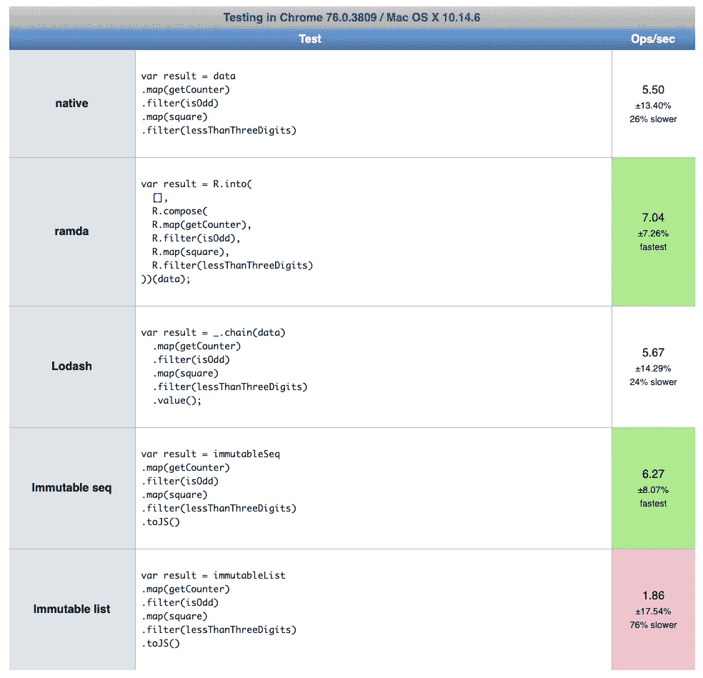
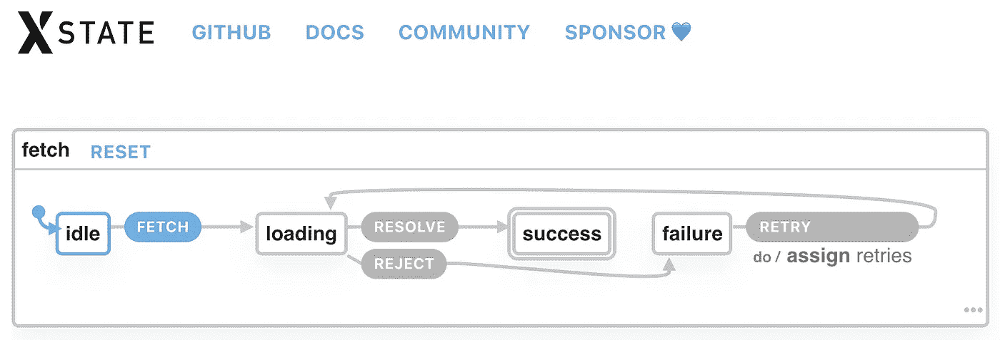

# 改变我的 JavaScript 的 6 个工具

> 原文：<https://javascript.plainenglish.io/the-6tools-that-changed-javascript-for-me-3ee1faf40585?source=collection_archive---------0----------------------->

## 我花了很长时间寻找驯服 JavaScript 的工具，并且找到了它们

## 3 个主流，2 个默默无闻，1 个正在崛起


Photo by [Anna Elfimova](https://unsplash.com/@askonya?utm_source=unsplash&utm_medium=referral&utm_content=creditCopyText) on [Unsplash](https://unsplash.com/s/photos/happy?utm_source=unsplash&utm_medium=referral&utm_content=creditCopyText)

我已经用静态类型的语言编码很多年了，我从汇编语言开始，到 C 语言，经过 Visual Basic 和 C#，但是当我转向 JavaScript 时，我对软件的所有理解都改变了。

# 我对 JavaScript 的第一次体验

当我第一次决定尝试 JavaScript 时，我用 Sublime Text 编码，它完全是关于文本编辑、多光标、微插件的，打开速度比 Visual Studio 快得多；我不需要等待智能感知或编译器，我输入，保存，代码就可以运行了，瞧！

脚本语言的速度很快，但有一件小事也发生了变化:**我的手指每小时可以输入的错误数量激增**。

我喜欢 C#，我喜欢 IDE，智能感知，自动完成，并诚实地利用“面向编译器的开发”了很多。我只是通过阅读编译器和 Intellisense 在我出错时指出的内容来学习。

正如您现在可能认为的那样，我很快对来自静态类型和编译语言的 JavaScript 有了一种偏见:语法很奇怪，没有任何东西可以缓存我的错误，当时的作用域很乱，库缺乏自动发现能力(没有智能感知)，承诺不存在，框架也没有像今天这样被采用。

# 我的第一个框架

在我第一次使用 JavaScript 多年后，当我主要使用 C#时，我找到了一份全职使用 AngularJS 的工作。我觉得 AngularJS 使项目更加结构化，并将编程中常见的“良好实践”带到了 JavaScript 中。

在 2 年的时间里，那个项目教会了我许多关于 JavaScript 的课程，但我仍然觉得没有什么事情像我预期的那样顺利。

# 不可解析的 JavaScript

我觉得 JavaScript 是不可驯服的:运行时异常仍然是一种规范，我的大部分代码大部分时间都在重复，可读性仍然是一个问题，表达意图不仅是一个挑战，也是一种奢侈，我过去编程经验中的知识似乎很少能在 JavaScript 中很好地工作，最糟糕的是:我仍然觉得自己是一个糟糕的 JavaScript 程序员。

在尝试应用我的面向对象编程知识以及从 C#到 JavaScript 的其他好东西时，我一直关注着一切是如何转变的，这花了我一段时间，但就在结束之前，我决定改变我的想法。

# 忘却一切

我进入了一种新的思维状态，我的前提如下:*将面向对象的编程原则和设计模式应用于 JavaScript 是浪费时间，JavaScript 并不完全是为此而设计的，我会努力做我认为最好的事情，忘掉 OOP。*

我开始积累自己的一套好的实践，过了一段时间，我开始觉得我有机会尝试 JavaScript 了；最后，我开始编写更少的代码，更少的错误，进行有用的抽象，一切开始变得美好，与此同时，我遇到了一篇文章，关于…函数式编程。

# 函数式编程

在贪婪地阅读了我所能找到的关于函数式编程的一切之后，我设法将我的每一个好的 JavaScript 实践映射到一个函数式编程概念，但是函数式编程不仅包含了我所有的经验，而且超出了我最大的梦想。

我开始应用和展示每一个概念，每一个提交，每一个新手的错误，我的团队一点都没有意识到这一点，我们已经应用 OOP 将近 2 年了，随着 AngularJS，在项目结束时改变范例是必然的死亡，我纠正并继续使用 OOP。谢天谢地，项目结束了，我可以进入一份新工作，一份团队有更多函数式编程经验的新工作。

在工作之余，我练习函数式编程，并试图发现如何使用每一个可用的库。我终于感觉到了对 JavaScript 的控制，为了获得对 JavaScript 的控制，我必须放弃它。

# 放弃 JavaScript

在学习了一些函数式编程的基础知识后，我决定尝试其他比 AngularJS 更适合 FP 的框架(此时 Angular 2 已经出现了)。

我开始接触现代框架，接触到榆树，我喜欢榆树！TypeScript 呢？我真不敢相信我会如此高兴再次使用微软工具，尽管我完全放弃了 Windows。这段时间正是我所需要的。

回想起来，在用我自己的方式尝试了一些事情之后，我可以绝对肯定，我在 JavaScript 上的糟糕表现很大一部分是因为我自己缺乏与我思考软件的自然方式更相关的工具知识，因此，在使用公司的技术堆栈时，我感觉自己像一条离开水的鱼。

在给你我目前的工具链之前，给你一个建议:自己练习你想掌握的语言，没有任何强加的限制，之后，找一份符合你偏好的工作，否则，你可能会感到痛苦，因为你将为自己使用错误的工具，因此，永远不会发挥你的潜力。

# 我的 JavaScript 工具链

您肯定知道其中的一些工具，但是为了完整起见，我将尝试对所有这些工具进行简要的解释。


Banner from [TypeScript home page](https://www.typescriptlang.org/)

# 以打字打的文件

从[他们自己的主页](https://www.typescriptlang.org/):

> TypeScript 是 JavaScript 的类型化超集，它编译成普通 JavaScript。

是什么让我在每个项目中都使用 TypeScript？

## 编译错误

在编译时捕获错误是一件好事，这需要几秒钟吗？值得。愚蠢的错误、无法解释的运行时错误、出现得太晚的错误所带来的挫败感降低了我对这一职业的热爱，但打字稿再次带来了快乐。

## 类型

表现力和依从性，意图和一致性，设计和力量，类型需要时间来掌握，但男孩，他们是值得的。每一个。单身。时间。我太想念打字了。TypeScript 既兼容面向对象类型，也兼容函数类型，太棒了。

当你有了类型，那么多的对话就消失了，你为那些试图理解和使用你的代码的人节省了那么多时间，你变得能够发现整个库的用途而不需要阅读手册，并且你可以确信，由于类型约束，事情将会按照它们应该被使用的方式被使用。

TypeScript 中的类型还有很长的路要走，但是今天的类型系统已经为前端带来了如此强大的功能。没有一个类型系统感觉就像试图用脚跑赢一辆赛车。它提供了 JavaScript 所缺少的工程感，我使用类型来设计和执行接口的正确使用，我花在编写类型安全的每一个小时(好吧，这主要是我的看法)。

## 减少了我的挫败感

多亏了 TypeScript，我每小时的错误，因此我的挫折感，大大减少了，只是这一部分使它是值得的。

TypeScript 也随着版本变得越来越好，它很快采用了新的 ECMAScript 特性。

所以，是的，我放弃了用普通的 JavaScript 编码，我觉得这对我的理智是一种危险。TypeScript 拥有 JavaScript 的所有优点，并有许多机制使 JavaScript 实际上是可行的。


Banner from [@code Twitter](https://twitter.com/code)

# Visual Studio 代码

这不是一个 IDE，而是一个文本编辑器，最好的文本前端编辑器，从[他们的主页](https://code.visualstudio.com/):

> 代码编辑。重新定义。免费。基于开源构建。到处跑。

我为什么选择 VSCode？

## 到处跑

这种说法是正确的，我已经在我需要使用的每个操作系统上可靠地使用了 VSCode，它速度很快，到处都有好东西，不需要担心平台支持。

## 智能感知

是的。用 JavaScript 它能创造奇迹，但是用 TypeScript，它就像上帝一样，快速、可靠，并且在编译之前就能发现错误！我认为这是 VSCode 最好的特性之一，它就像有了另一双眼睛。

## 减少了我的挫败感

Sublime 当时的每个插件都很慢，并且缺乏智能感知，VSCode 很快，并且随着发布会越来越快，我真的很惊讶这么好的软件是免费的。

一切按预期运行，它拥有我能想到的所有特性，那些不应该是核心的，都是扩展，老实说掌握它是值得的。

最后，用一句话来描述我的 VSCode 代码体验:我没有抱怨。


Banner from [Xpgraph blog post](https://xpgraph.com/react-is-the-new-black)

# 反应

来自[他们的主页](https://reactjs.org/):

> 用于构建用户界面的 JavaScript 库

如前所述，我从 AngularJS 开始，这是一个包含完整电池的前端框架，但对我来说，做出反应是不可避免的，原因如下:

## 不是一个框架

没错，它不是一个框架，这是我最喜欢的事情之一，我通常编写小程序，我不需要一个大框架，我只需要一点酱帮我构建小 ui。

## 包含函数式编程

最大的卖点是 React 包含了函数式编程，符合我对 JavaScript 的新看法。

React 努力做到简洁，我对此表示赞赏；React 用最少的语法表达复杂的概念，像`useState`和高阶组件就是几个例子，说明拥有正确的抽象比拥有一堆可能最终会用错的工具要好得多。

## 全部加起来+打字稿

我不使用 Svelte 或 Vue 的原因是我不喜欢模板，我喜欢类型。在模板文件中，你没有类型脚本，也没有 JavaScript，你有类似模板脚本的东西，一些帮助你做事情的特别标记，非类型化的，对每件事情都有不同的推理。

我确实喜欢 React 的全部特性。意思是我用 [JSS](https://cssinjs.org/?v=v10.1.1) 代替 CSS，用 [TSX](https://www.typescriptlang.org/docs/handbook/jsx.html) 代替 HTML + JS，在 TypeScript 中，所有 CSS、HTML、JS 都在一个文件中，我喜欢它，一切都有智能感知、编译错误、类型，没有上下文切换。

在我看来，小组件是 CSS + HTML + JS 的混合体，将它们都合并到 TypeScript 中对我有利。

更好的一面呢？它的性能随着每个新版本不断提高，更多的 JSS 被传输到静态 CSS，更多的 TSX 被优化，等等，所以你可以习惯性地编程，随着时间的推移，传输程序提高了输出。

在我工作过的公司中，我们在小程序中编写高层次的概念，而不是低层次的东西，我相信公司不会付钱给程序员来优化任何东西，他们想要快速可用和可靠的软件。


Photo by [Paxson Woelber](https://unsplash.com/@paxsonwoelber?utm_source=unsplash&utm_medium=referral&utm_content=creditCopyText) on [Unsplash](https://unsplash.com/s/photos/ram?utm_source=unsplash&utm_medium=referral&utm_content=creditCopyText)

# 拉姆达

现在让我们变得奇怪，我不指望你知道这个，从[他们的主页](https://ramdajs.com/):

> 面向 JavaScript 程序员的实用函数库。

我可以写几个小时关于 Ramda 的文章，我会尝试总结为什么我在我的项目中 100%使用 Ramda 的最大卖点:

## 连接

很多人曾经或正在使用 Lodash 作为他们的工具带，但 Lodash 对我来说是一个大问题，所有的论点都是落后的。如果你考虑可组合的软件，你会很快意识到如果你想组合两个 Lodash 函数，你需要一个中间的“辅助”变量。我宁愿不要。

另一方面，Ramda 的设计考虑到了构图，在 curry 和 pipe 的帮助下，关注精心制作的统一界面。

## 代码可重用性

我在上面抱怨过总是重复代码，大部分代码都是小的实用函数，如果我开始另一个项目，我必须重新编写它们，所以我在寻找一个好的实用程序库。

现在我几乎不考虑抽象函数，使它们更加可重用，因为所有通用的可重用函数都在 Ramda 中，有一个非常强大的功能优先的接口。

## 纯函数，无副作用且不可变

多用途皮带应该包含纯粹的功能，这意味着这些功能需要:没有副作用，并且将数据视为不可变的。这些东西与实用程序库不一致，见鬼，甚至在 JavaScript 内置数组函数中也不一致，不信我？看看这个:

```
import { sort, asc } from 'ramda';

console.group('Native sort');

const naiveArray = [3, 2, 1];
console.log(naiveArray.sort());
console.log(naiveArray); // [1, 2, 3] <- should be 3, 2, 1... but it isn't

console.groupEnd();

console.group('Ramda sort');

const iCareAboutThisArray = [3, 2, 1];
console.log(sort(asc)(iCareAboutThisArray)); // [1, 2, 3]
console.log(iCareAboutThisArray); // [3, 2, 1] <- thanks Ramda!

console.groupEnd();
```

如果在应用了`sort`之后，你还指望`naiveArray`行为保持不变，你能估计出发现它需要多长时间吗？好吧，对不起，我不想让你癫痫发作。

在我的每一段代码中，我都非常重视这些东西，所以 Ramda 在每个函数中内置这些东西的事实是…令人惊讶的。

## 换能器

传感器的实用描述；

换能器消除了组合多个阵列功能的性能损失。

我认为图像胜于文字，传感器很难理解:



[https://jsperf.com/native-vs-ramad-vs-lodash-vs-immutable](https://jsperf.com/native-vs-ramad-vs-lodash-vs-immutable)

Ramda 充满了传感器函数，这意味着它非常有性能，你可以堆叠多个`filter`、`map`和 21 个其他函数，它只会迭代数组并应用函数一次，而不是 N 次。

## 缺少一样东西

Ramda 很棒，但是所有的好东西都是有代价的…如果你想打字稿的话。

Ramda 的类型的类型、类型推断、类型解析的复杂程度是通过屋顶的；最重要的是，主要贡献者对 TypeScript 根本不感兴趣。

他们似乎是一群了不起的开发人员，在不需要 TypeScript 的情况下驯服了 JavaScript，对将这个了不起的库移植到 TypeScript 毫无兴趣。

那么它是如何与 TypeScript 一起工作的呢？值得庆幸的是，其他开发人员承担了向库提供类型的任务，他们非常精通 TypeScript 类型系统(我几乎不理解那些签名)，但似乎每个版本都工作得更好。

提供准确且可推断的 TypeScript 类型是一项艰巨的挑战，这些类型不会出现在对 JavaScript 高级类型特性进行了大量改进的库中，但它们正在实现，大多数函数现在都可以在 TypeScript 中无缝使用，但最高级的函数需要一些帮助来确定类型的结果。

尽管如此，Ramda 仍然是我有幸使用过的制作最好的实用程序库之一，在我驯服 JavaScript 的旅程中，它让我思考了很多。谢谢，拉姆达。


# FP-TS

虽然只要我们停留在 JavaScript 领域，Ramda 就是一个令人惊奇的解决方案，但是一旦我完全采用了 TypeScript，它就变得……难以使用，类型推断也不太好，所以我寻找其他考虑到 TypeScript 的解决方案，或者更好的是用 TypeScript 编写的解决方案。

幸运的是我在他们的主页上找到了图书馆的奇迹 fp-ts:

> TypeScript 中的类型函数编程
> 
> 在 TypeScript 中为开发人员提供流行的模式和来自类型化函数语言的可靠抽象。

fp-ts 是一个杰作，老实说，它给 TypeScript 带来了这么多，而且以一种不引人注目的方式，它的类型完全符合习惯。

为什么我在 100%的项目中使用 fp-ts？

## 管

我故意避免谈论 Ramda 的`pipe`,因为 fp-ts 版本对 TypeScript 来说更习惯，一般来说更智能，因为类型分析的本质是从左到右的。

这是没有管道的代码:

```
 function main() {
  const text = "hello";
  const aux = doubleSay(text);
  const aux1 = capitalize(aux);
  const aux2 = exclaim(aux1);

  return aux2;
}

console.log(main()); // Hello, Hello!

function main2() {
  return exclaim(capitalize(doubleSay("hello")));
}

console.log(main2()); // Hello, Hello!

function doubleSay(text: string) {
  return text + ", " + text;
}

function capitalize(text: string) {
  return text[0].toUpperCase() + text.substring(1);
}

function exclaim(text: string) {
  return text + "!";
}
```

在`main`中，我需要有中间变量来分配中间结果，而在`main2`中，从右到左读取执行顺序相当笨拙。

这是拉姆达管道的代码:

```
import { pipe } from 'ramda';

function main() {
  return pipe(
    doubleSay,
    capitalize,
    exclaim)
    ('hello');
}

console.log(main()); // => 'Hello, hello!'

function doubleSay(text: string) {
  return str + ', ' + str;
}

function capitalize(text: string) {
  return str[0].toUpperCase() + str.substring(1);
}

function exclaim(text: string) {
  return str + '!';
}
```

使用 pipe，我们不需要中间变量，所有的数据流，但是，当使用 Ramda 的`pipe`时，TypeScript 大多数时候会产生错误，因为输入值被放在最后，因此，无法推断出第一个函数的输入是什么，等等，因为 TypeScript 从左到右进行推断，并且对于 Ramda 的`pipe`来说，推断应该从左到右和从右到左进行，Ramda 的`pipe`类似于 Haskell 等函数式语言的类型推断系统中的常见功能

现在看 fp-ts 版的`pipe`:

```
import { pipe } from 'fp-ts/lib/pipeable';

function main() {
  return pipe(
    'hello',
    doubleSay,
    capitalize,
    exclaim
  );
}

console.log(main()); // => 'Hello, hello!'

function doubleSay(text: string) {
  return str + ', ' + str;
}

function capitalize(text: string) {
  return str[0].toUpperCase() + str.substring(1);
}

function exclaim(text: string) {
  return str + '!';
}
```

不同的是`fp-ts`把`pipe`的输入放在第一位，让 TypeScript 推理很开心。在 JavaScript 领域，Ramdas 的方法是 100%有效的惯用代码，但 TypeScript 缺乏从右到左的推理使其“无效”或通常难以使用，所以我通常倾向于使用 fp-ts 版本的`pipe`而不是 Ramda 的。

## 选项，TasksEither 和其他 FP 数据结构

我很自豪地宣布，我很少再遇到`undefined`和`null`错误了，因为最终，我有了一个习惯的、完全受支持的`Option`实现。

`Option`基本上是一个数据包装器，表示可能有也可能没有值。

另一方面，`Either`，允许更容易地分叉代码，事情可以向左或向右。

让我给你举个例子:

```
type Context = {
  token?: string;
  log: (token: string) => string;
};

function logging(ctx: Context): 'no-token-error' | 'log-error' | 'no-errors' {
  const result = ctx.log(ctx.token);

  // ...

  return 'no-errors';
}
```

哦，多好的代码啊。这么小的代码不会有什么问题。

```
type Context = {
  token?: string;
  log: (token: string) => string;
};

function logging(ctx: Context): 'no-token-error' | 'log-error' | 'no-errors' {
  const result = ctx.log(ctx.token);

  // ...

  return 'no-errors';
}

console.log(logging({
  // token: undefined
  log: (token) => {
    throw new Error('no token');
  }
})); // Error: no token

console.log(logging({
  token: '@codingedgar',
  log: (token) => {
    throw new Error('random error')
  }
})); // Error: random error

console.log(logging({
  token: '@codingedgar',
  log: (token) => 'good code'
})); // no-errors
```

除了一切。但我们没那么傻，我们可以改进，扔点`if`和`try...catch`表情就都搞定了。

```
type Context = {
  token?: string;
  log: (token: string) => string;
};

function logging(ctx: Context): 'no-token-error' | 'log-error' | 'no-errors' {
  if (!ctx.token) {
    return 'no-token-error'; // early return due to no token
  } else {
    try {
      let result = ctx.log(ctx.token);
      // ...
      return 'no-errors'; // success branch
    } catch (e) {
      return 'log-error'; // late return due error
    }
  }
}

console.log(logging({
  // token: undefined
  log: (token) => {
    throw new Error('no token');
  }
})); // Error: no token

console.log(logging({
  token: '@codingedgar',
  log: (token) => {
    throw new Error('random error')
  }
})); // Error: random error

console.log(logging({
  token: '@codingedgar',
  log: (token) => 'good code'
})); // no-errors
```

现在成功了。通过这个例子，我向你展示了 JavaScript 和 TypeScript 都不能指导你检查这种情况，也许 TypeScript 用`--strictNullChecks`会有一点帮助，但是函数返回类型不能代表错误但这还不是全部，分支都搞砸了，我返回早期错误和晚期错误，以及中间的成功？现在看看这个:

```
import { pipe } from 'fp-ts/lib/pipeable';
import * as O from 'fp-ts/lib/Option';
import * as E from 'fp-ts/lib/Either';

type Context = {
  token: O.Option<string>;
  log: (token: string) => E.Either<Error, string>;
};

function logging(ctx: Context): 'no-token-error' | 'log-error' | 'no-errors' {
  return pipe(
    ctx.token,
    O.map( // only if token exists execute this function
      token => ctx.log(token) // for sure there's a token
    ),
    O.fold(
      () => 'no-token-error' as const, // if no token
      E.fold(
        () => 'log-error' as const, // if log error returned error
        result => {
          // ...
          return 'no-errors' as const; // if log succeeded
        }
      )
    ) // all returns at the end
  );
}

console.log(logging({
  // token: undefined
  log: (token) => {
    throw new Error('no token');
  }
})); // Error: no token

console.log(logging({
  token: '@codingedgar',
  log: (token) => {
    throw new Error('random error')
  }
})); // Error: random error

console.log(logging({
  token: '@codingedgar',
  log: (token) => 'good code'
})); // no-errors
```

正如你在这个例子中看到的，`Option`和`Either`都强迫我们以一种显式的方式处理分支，没有“遗漏分支”，我们可以用`Either`的左分支来表示错误，我们只在最后返回。

如果预计会出现“错误”，为什么要使用`try...catch`？这是预期的行为，`try...catch`是“意外出错”的惯用说法，但对于预期的逻辑分支，要么是完美的抽象，事情可以向左(错误)或向右(成功)。

这些数据结构帮助我们构建更高级的数据流模式，比如铁路编程，如果你不知道我在说什么，看看这个页面:[https://fsharpforfunandprofit.com/rop/](https://fsharpforfunandprofit.com/rop/)。

最后但同样重要的是，我将提到`TaskEither`，任务基本上是围绕`Promise`的包装器，但是有了更单一的接口，这个奇怪的词是什么意思？这意味着它更适合一个标准接口，而不是那些奇怪的 Promise 实例方法，比如`then`，你可以使用已经建立的`map`、`chain`、`ap`、`fold`等等。

好吧，如果你还不熟悉函数式编程，当然`ap`和`fold`在你的代码库中还没有很好地建立起来，但是一旦你熟悉了，你会注意到函数的一致性，所有的意思都是一样的，不管封闭的数据结构是什么，你都不会在意你是映射一个`Array`、`Object`、`Option`、`Either`还是`TaskEither`，`map`的意思是一样的，它有每个数据结构的细节，但是`map`是`map`在所有的情况下，你都是一致的

这些只是一堆函数式数据结构中的 3 个，它们使你的代码真正表达意图，更简洁，最终更可靠。


# x 状态

让我介绍一下 XState，它应该已经取代了 Redux。从[他们的主页](https://xstate.js.org/docs/):

> 现代网络的 JavaScript 和类型脚本[有限状态机](https://en.wikipedia.org/wiki/Finite-state_machine)和[状态图](http://www.inf.ed.ac.uk/teaching/courses/seoc/2005_2006/resources/statecharts.pdf)。

很久以来，我的 Redux 商店缺少了一些东西，我试图制作一些小的中间件来帮助我驯服 Redux，但它感觉…不完整。直到我中了头彩，找到了 XState。

为什么我在 100%的 React 项目中使用 XState？

## 有限状态机

我的问题是 Redux 只是图片的一半，没有注意到我在每个 React 组件中制作小状态机，并使用 Redux 实现扩展状态(或无限状态)，一旦我发现 XState，我所有的设计问题都遇到了一个有价值的竞争者。

应该显示按钮吗？启用？显示文本 A 还是 B？所有这些“领域”规范只不过是一些状态，有限的，预先指定的；如果您显式地编写这样的状态，那么读取和升级组件就成了一件乐事。

使用 AngularJS 和 templates，我的状态由一堆交织在一起的变量组成，这些变量是无法读取的；使用 React 和 Redux，所有数据都在一个地方，但状态不以任何方式表示，而是对数据的解释，但使用 XState，我的状态实际上是显式的。看看这台机器:

```
const fetchMachine = Machine({
  id: 'fetch',
  initial: 'idle',
  context: {
    retires: 0
  },
  states: {
    idle: {
      on: {
        FETCH: 'loading'
      }
    },
    loading: {
      on: {
        RESOLVE: 'success',
        REJECT: 'failure'
      }
    },
    success: {
      type: 'final'
    },
    failure: {
      on: {
        RETRY: {
          target: 'loading',
          actions: assign({
            retires: (context) => context.retires + 1
          })
        }
      }
    }
  }
});
```

如果你像我一样是一个图形人，也许可以尝试使用 XState 可视化工具:



我需要向你解释这台机器的行为吗？不，我没有。它就在那里，肉眼可见，没有怪异的曼波舞。

# 希望你喜欢

我希望我的旅程能对你有所帮助。如果你喜欢这篇文章，也许你会喜欢[订阅我的简讯](http://eepurl.com/hg7AeP)和其他的:

1.  [通过测试用例叙述:Redux Action Retry](https://medium.com/javascript-in-plain-english/narrated-by-test-cases-redux-action-retry-b2e004c4c823) ，在本文中，你会发现 TypeScript、ramda 和 fp-ts 在运行。
2.  [避免箭头功能的两种情况](https://medium.com/javascript-in-plain-english/you-should-never-use-an-arrow-function-in-any-of-these-two-situations-8bc2fbbc39b8)。
3.  管理层是如何限制你作为开发人员的潜力的。

## 用简单英语写的 JavaScript 的注释

我们已经推出了三种新的出版物！请关注我们的新出版物:[**AI in Plain English**](https://medium.com/ai-in-plain-english)[**UX in Plain English**](https://medium.com/ux-in-plain-english)[**Python in Plain English**](https://medium.com/python-in-plain-english)**——谢谢，继续学习！**

**我们还推出了一个 YouTube，希望你能通过 [**订阅我们的英语频道**](https://www.youtube.com/channel/UCtipWUghju290NWcn8jhyAw) 来支持我们**

**一如既往,“简明英语”希望帮助推广好的内容。如果您有一篇文章想要提交给我们的任何出版物，请发送电子邮件至[**submissions @ plain English . io**](mailto:submissions@plainenglish.io)**，并附上您的媒体用户名和您感兴趣的内容，我们将会回复您！****