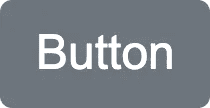

# 使用样式化组件进行样式化的高级方法

> 原文：<https://javascript.plainenglish.io/the-advanced-way-to-style-with-styled-components-98fb70c1eecc?source=collection_archive---------1----------------------->

## 更深入地了解样式化组件的威力


Photo by [Austin Distel](https://unsplash.com/@austindistel?utm_source=medium&utm_medium=referral) on [Unsplash](https://unsplash.com?utm_source=medium&utm_medium=referral)

# 我的旅程

我喜欢[风格的组件](https://styled-components.com/)。它使得 React 中的样式如此简单。

```
import styled from 'styled-components';const Button = styled.button`
  display: inline-block;
  padding: 6px 12px;
  font-size: 16px;
  font-family: Arial, sans-serif;
  line-height: 1.5;
  color: white;
  background-color: #6c757d;
  border: none;
  border-radius: 4px; :not(:disabled) {
    cursor: pointer;
  } :hover {
    background-color: #5a6268;
  }
`;const App = () => {
  return (
    <Button onClick={() => alert('clicked!')} type="button">
      Button
    </Button>
  );
};
```



Styled Components Button

在[学习了基础知识](https://medium.com/@changmander/the-modern-way-to-style-with-styled-components-c3c51b750b5f)之后，我开始将我的代码库移植到样式化的组件中。在这样做的过程中，我逐渐发现了一些问题和低效之处。这里那里都有我想做的小事，但是以我所拥有的知识却做不到。其中许多，我用迂回的方式解决了，所以它们不是主要问题。但是，对我来说，深入研究样式化组件文档已经足够了。幸运的是，样式化组件的贡献者已经发现了它们。

# 样式对象

有时我们被迫通过`style`道具使用样式对象。这可能是因为代码库只是部分迁移到样式化的组件，或者因为一些第三方库使用它，这在基于钩子的库中很常见，如 [React Dropzone](https://github.com/react-dropzone/react-dropzone) 或 [React Table](https://github.com/tannerlinsley/react-table) 。样式组件可以将这些样式对象合并到样式组件样式中。

```
const StylePropButton = styled(Button)`
  ${props => props.$style ?? {}}
`;const App = () => {
  return (
    <StylePropButton
      $style={{ backgroundColor: '#007bff' }}
      onClick={() => alert('clicked!')}
      type="button"
    >
      Primary
    </StylePropButton>
  );
};
```


Style Prop Button

该组件接受一个内联样式对象，然后通过简单地将该对象返回到模板文本中，将该对象合并到样式化的组件样式中。结果是两种截然不同的反应样式之间的无缝集成。

注意，我把道具命名为`$style`而不是`style`。这可以防止样式被应用两次。如果道具名是`style`，按钮也将通过内联样式进行样式化，因为样式化组件将道具传递给底层组件。名称以`$`为前缀的道具，称为瞬态道具，仅由定义的样式组件使用，不会传递给底层组件。

那么为什么要这样做呢？你可以直接使用`style`属性，而不是将样式对象合并到样式组件样式中。主要优势是处理特异性。通过样式化的组件，内联样式总是比外部 CSS 具有更高的优先级。该方法将阻止使用内联样式，而是通过样式化的组件将它们转换成外部 CSS。然后，您可以轻松地覆盖那些您认为合适的样式，而不需要使用`!important`。

# 动态组件

有时，您希望应用相同的样式，但应用于不同的底层组件(DOM 元素、React 组件或样式化组件)。您可以用`css`定义一个可组合的样式，并用该可组合的样式创建一个新的样式化组件。但是有一个更简单的方法！样式化的组件带有一个特殊的`as`属性，允许你重新定义使用相同样式渲染的组件。

```
const App = () => {
  return (
    <Button as="a" href="https://styled-components.com/">
      Link
    </Button>
  );
};
```

这将向 DOM 呈现以下内容。

```
<a
  href="[https://styled-components.com/](https://styled-components.com/)"
  class="sc-bdnylx bPvsWA"
>
  Link
</a>
```

就像这样，用一个单独的道具，你已经渲染了一个锚标签而不是一个与`Button`风格相同的按钮！

# 属性

有时候某些道具会一遍又一遍的重复。在我们的例子中，`type`几乎总是`button`，所以不必每次都定义它会很有帮助。这个问题可以通过定义一个 React 组件`Button`来解决，该组件返回默认类型为 prop 的样式化组件`Button`。但是，像以前一样，有一个本地风格的组件方法来实现这一点。

```
const AttributeButton = styled(Button).attrs(props => {
  const { type = 'button' } = props;
  return { type };
})`...`;const App = () => {
  return (
    <AttributeButton onClick={() => alert('clicked!')}>
      Button
    </AttributeButton>
  );
};
```

Styled Components `attrs`函数允许您定义 Styled Components 将拥有的附加属性，而无需在使用时显式定义它。在这种情况下，如果没有设置，type 将默认为`button`。

`attrs`函数也可以接受静态道具的对象。但是，如果以这种方式定义，则用户不能覆盖该值，因为属性优先。

# 属性类型

由于样式化组件是有效的 React 组件，它们也支持`propTypes`和`defaultProps`！

```
const PropTypesButton = styled(Button)`...`;
PropTypesButton.propTypes = {
  onClick: PropTypes.func.isRequired,
  type: PropTypes.oneOf(['button', 'submit', 'reset']),
};
PropTypesButton.defaultProps = {
  type: 'button',
};const App = () => {
  return (
    <PropTypesButton onClick={() => alert('clicked!')}>
      Button
    </PropTypesButton>
  );
};
```

就像 React 组件一样，这将有助于验证正确数据，并在样式化组件无效时发出警告。

# 全局样式表

在将我的代码库迁移到样式化组件时，我仍然为我的全局样式导入了一个 CSS 样式表。这是我代码库中剩下的最后一个非风格组件样式，作为一个喜欢一致性的人，我必须找到一个替代品。原来，样式化组件使用`createGlobalStyle`支持全局样式。

```
import { createGlobalStyle } from 'styled-components';const GlobalStyle = createGlobalStyle`
  *, *::before, *::after {
    box-sizing: border-box;
  }

  a {
    text-decoration: none;
  }
`;const App = () => {
  return (
    <>
      <GlobalStyle />
      <Button onClick={() => alert('clicked!')} type="button">
        Link
      </Button>
    </>
  );
};
```

问题解决了。请注意，与常规样式的组件不同，全局样式不接受子样式。毕竟是全球**风格。**

# 巴别塔整合

通过样式化组件进行样式化的最大优势之一是通过一些独特的、自动生成的类名来实现样式的本地化。然而，这确实引入了一个不幸的副作用——在一个完全通过样式化组件进行样式化的复杂应用程序中，很难知道哪个 DOM 元素是由 JSX 的哪一行生成的。幸运的是，Styled Components 提供了一个名为`[babel-plugin-styled-components](https://www.npmjs.com/package/babel-plugin-styled-components)`的 babel 插件。这个插件将使用文件名和样式化组件变量名为你的每个样式化组件添加一个开发者友好的类名，允许你容易地跟踪你的组件。

```
<button
  type="button"
  class="App__Button-sc-1r1t5ph-0 iFtKFk"
>
  Button
</button>
```

要启用这个插件，只需将其添加到您的`babel.config.js`中。

```
module.exports = {
  presets: [],
  plugins: ['babel-plugin-styled-components'],
};
```

对于基于零配置项目构建的代码库，如 [Create React App](https://github.com/facebook/create-react-app) ，Styled Components 还提供了一个 babel 宏，可以达到同样的效果。

```
import styled from 'styled-components/macro';const Button = styled.button`...`;
```

# Jest 集成

为了测试，Styled Components 还有一个叫做`[jest-styled-components](https://www.npmjs.com/package/jest-styled-components)`的 Jest 插件。这非常有用，因为唯一自动生成的类名使得快照测试非常容易失败。有了这个插件，可预测的类名和 CSS 样式一起被创建。

```
*// Button.test.js*
import React from 'react';
import { render } from '@testing-library/react';
import 'jest-styled-components';

import Button from '../Button';

test('snapshot', () => {
  const { container } = render(<Button />);
  expect(container.firstChild).toMatchSnapshot();
});*// __snapshots__/Button.test.js.snap*
exports[`snapshot 1`] = `
.c0 {
  display: inline-block;
  padding: 6px 12px;
  font-size: 16px;
  font-family: Arial, sans-serif;
  line-height: 1.5;
  color: white;
  background-color: #6c757d;
  border: none;
  border-radius: 4px;
}.c0:not(:disabled) {
  cursor: pointer;
}.c0:hover {
  background-color: #5a6268;
}<button
  class="c0"
/>
`;
```

如果您不喜欢快照，更喜欢直接测试单个样式，`jest-styled-components`用`toHaveStyleRule`匹配器扩展了 Jest 的`expect`，这样您可以手动检查一个元素是否具有预期的样式。

```
test('should have style', () => {
  const { container } = render(<Button />);
  expect(container.firstChild).toHaveStyleRule(
    'background-color',
    '#6c757d'
  );
  expect(container.firstChild).toHaveStyleRule(
    'background-color',
    '#5a6268',
    {
      modifier: ':hover',
    }
  );
});
```

# Stylelint 集成

最后是林挺。Styled Components 提供了几个库来与`[stylelint](https://stylelint.io/)`集成，确保你用最好的 CSS 标准编写。`[stylelint-processor-styled-component](https://www.npmjs.com/package/stylelint-processor-styled-components)s`从样式化组件中提取样式，用于`stylelint`到 lint，`[stylelint-config-styled-components](https://www.npmjs.com/package/stylelint-config-styled-components)`禁用与样式化组件冲突的`stylelint`规则。要集成，将这两个库添加到您的`stylelint.config.js`中。

```
module.exports = {
  extends: ['stylelint-config-styled-components'],
  processors: ['stylelint-processor-styled-components'],
};
```

要运行，将以下内容添加到您的`package.json`并运行`npm run test:css`。

```
{
  "scripts": {
    "lint:css": "stylelint './src/**/*.js'",
  },
}
```

# 最后的想法

这就是你想要知道的关于风格化组件的一切！它为各种你甚至不知道将要面对的场景提供了造型解决方案。它提供了与 React 生态系统中常用工具的集成。它提供了一个成熟的样式框架，简化并增强了开发人员的体验。现在你知道了，开始像专家一样使用样式化的组件吧！

# 资源

*   [官方风格组件文档](https://styled-components.com/)
*   [本文 Github 回购](https://github.com/mjchang/medium/tree/master/styled-components-2)
*   [本文的 code sandbox](https://codesandbox.io/s/github/mjchang/medium/tree/master/styled-components-2)