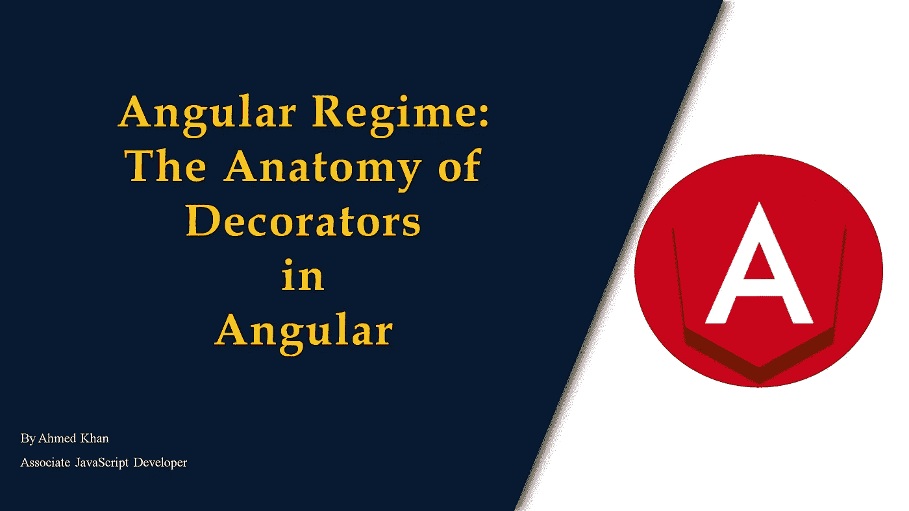
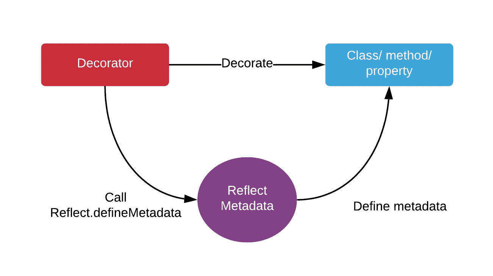
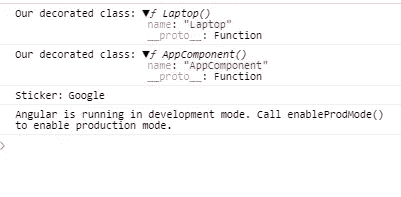

# 棱角分明的装饰家剖析

> 原文：<https://javascript.plainenglish.io/the-anatomy-of-decorators-in-angular-d7972bf9e865?source=collection_archive---------3----------------------->

## 一个深入指导装修在角



# 介绍

Angular 的潜在机制绝对值得探索。当我们开始使用 Angular 时，你不可避免地会遇到装饰者，因为他们在 Angular 框架的生态系统中扮演着至关重要的角色。在很大程度上，装饰者是内置的，你不需要做太多。但是最终，随着你深入框架，你会想要解释 decorators 来利用它的能力来增强你的开发体验，提高可读性，除此之外，最重要的因素之一是 [**关注点分离**](https://en.wikipedia.org/wiki/Separation_of_concerns) 。

**关注点分离**是一种流行的软件设计模式，用于**将一个计算机程序**分成不同的部分，这样每个部分处理一个单独的**关注点。Angular 已经在文件结构层次上实现了这种模式，因为 Html、CSS 和 ts 有单独的文件，但是我们可以通过使用 decorators 来分离类、属性或方法关注点，从而更深入地实现这种模式。**

到本文结束时，您将有望不仅理解装饰者如何在幕后工作，而且理解如何有效和高效地利用他们。

让我们开始吧。

# 定义

根据角度文件:

> **decorator**是一种设计模式，用于在不修改原始源代码的情况下，对一个类进行单独的修改或修饰。

简单地说，有了**decorator，**我们可以在设计时配置和定制我们的类。它们只是函数，可以用来添加元数据、属性或函数到它们所附加的东西上，因此它们没有什么可怕的。

**Decorators 的**函数被调用时带有前缀@符号，后面紧跟着一个类、参数、方法或属性。 **decorator** 函数被提供了关于类、参数或方法的信息，而 **decorator** 函数在其位置返回一些东西或以某种方式操纵其目标。

# 装饰者的结构



Angular decorator structure

上图描述了 decorators 是如何在 angular 中实现的。实现装饰器的底层因素是通过利用 TypeScript 的 [**反射元数据 API**](https://github.com/rbuckton/reflect-metadata) **。**

反射元数据 Api 在 Angular 中处理装饰器和元数据。浏览器不支持，所以 Angular 使用了 TypeScript 编译器来使用 decorators。它是在 angular-polyfills.js 文件中导入的。只有在早期版本的 Angular 中才需要此依赖性。在 Angular 6 之后，从聚合填充中移除了这种依赖性，从而实现了反射元数据过程的自动化。

# 元数据条目

Angular 为此元数据使用了几个条目:

*   **注释**。这对应于 decorators 在类级别设置的元数据。这是一个数组，因为你可以在这个层次上应用几个装饰器。比如**@组件**和**@路由**。
*   **设计:** `**paramtypes**`。这对应于构造函数参数的类型。它只适用于 TypeScript，因为在 ES6 中，不支持这样的参数。使用这种语言，您需要为**参数**属性提供一个静态 getter。
*   **prop 元数据**。这对应于 decorators 在类属性级别设置的元数据。它是一个对象，每个条目名都是属性名。每个条目包含一个数组，因为也可以在一个属性上定义几个装饰器。
*   **参数**。这对应于 decorators 在构造函数参数级别设置的元数据。这是一个数组的数组，因为在一个参数上定义几个装饰符总是可能的。

注意，依赖注入使用设计:`paramtypes`和参数来决定注入什么。

# 装饰者的类型

Angular 中有几种类型的装饰器。让我们一个一个来看。

*   装饰类，例如`@Component`和`@NgModule`
*   类内属性的属性装饰器，例如`@Input`和`@Output`
*   类内方法的方法装饰器，例如`@HostListener`
*   类构造函数内部参数的参数装饰器，例如`@Inject`

每个装饰器都有自己的用途，并且在整个框架中被过度使用。下面我们来详细看看。

## 1.班级装饰者

类装饰器，也称为顶级装饰器，用于通知 Angular 某个特定的类是一个组件或模块。顶级装饰者包括`@Component`和`@NgModule`。

```
import { NgModule, Component } from '@angular/core';@Component({
selector: 'example-component',
template: '<div>Woo a component!</div>',
})export *class* ExampleComponent {*constructor*() {
   console.log('Hi I am a component!');
 }
}@NgModule({
imports: [],
declarations: []
})export *class* ExampleModule {*constructor*() {
   console.log('Hi I am a module!');
 }
}
```

如果您观察上面的代码，您会注意到两个类的结构是相同的。唯一的区别是装潢师。类本身不需要额外的代码来通知 Angular 它是一个组件或模块。装饰者为我们做工作，Angular 处理剩下的。

## 2.财产装饰者

当需要组件通信时，就需要使用属性装饰器。属性装饰器处理父组件和子组件之间的通信。有各种类型的属性装饰器。一些最常用的是:

*   [@输入](https://angular.io/api/core/Input)
*   [@输出](https://angular.io/api/core/Output)
*   [@ViewChild](https://angular.io/api/core/ViewChild)

比方说，你有一辆车和一辆车。如果我们想从父类 vehicle 向子类 car 传递一些数据，我们只需使用带有子类属性的`@input` decorator 来告诉 Angular 这是一个子组件，它将接受来自父类的输入。然后 Angular 的编译器会自动从输入名创建一个输入属性绑定。

```
import { Component, Input } from '@angular/core';@Component({
  selector: 'example-component',
  template: '<div>I am a component!</div>'
})export *class* ExampleComponent {
  @Input()
  exampleProperty: *string*; **//====> Property Binding**
}
```

接下来，通过组件属性传递输入绑定。

```
<example-component[exampleProperty]="exampleData"></example-component>
```

类似地，对于`@output` decorator，我们将添加 decorator 并用事件发射器初始化它，并使用 emit 方法发送事件。

```
import { Component, Input } from '@angular/core';@Component({
  selector: 'example-component',
  template: '<div>I am a component!</div>'
})export *class* ExampleComponent {
  @output()
  examplePropertyOutput = new EventEmitter();**//====> Property      Binding**sendOutput(){
    this.examplePropertyOutput.emit('Hello from child');
  }
}
```

并简单地添加属性绑定。

```
<example-component(examplePropertyOutput)=”fetchOutput($event)”></example-component>
```

## 3.方法装饰者

方法装饰器允许利用特殊的装饰器函数。例如`@hostListener` decorator 观察事件，并允许我们告诉 Angular 在事件被触发时调用 decorator 方法。

```
import { Component, HostListener } from '@angular/core';@Component({
  selector: 'example-component',
  template: 'I am a component!'
})export *class* ExampleComponent {
  @HostListener('click', ['$event']) // ==> Method Decorator
  onHostClick(*event*: *Event*) {
     // call when click event triggered
  }
}
```

## 4.参数装饰器

当我们需要告诉 Angular 在构造函数中注入一个特定的提供者时，就要用到参数装饰器。

```
function logPosition(target: any, propertyKey: string,   parameterIndex: number) {
  console.log(parameterIndex);
}class Cow {
  say(b: string, @logPosition c: boolean) { //==> Paramter Decorator
    console.log(b);
  }
}new Cow().say('hello', false); // outputs 1 (newline) hello
```

另一个例子是@inject() decorator。这个装饰器允许我们装饰我们的类构造函数。

```
import { Component, Inject } from '@angular/core'; 
import { MyService } from './my-service';@Component({   
  selector: 'simple-component',   
  template: 'Woo a component!' 
}) 
export class SimpleComponent {   
  constructor(@Inject(MyService) myService) {               
    console.log(myService); // MyService  
  } 
}
```

但是由于 TypeScript，我们不必自己添加服务，因为 TypeScript 会为我们处理它。

```
import { Component } from '@angular/core';
import { MyService } from './my-service';@Component({
selector: 'simple-component',
template: 'Woo a component!'
})export *class* SimpleComponent {
  *constructor*(*myService*: MyService) {
    console.log(myService); // MyService
  }
}
```

# 创建自定义装饰器

既然我们已经理解了什么是装饰者，那么我们就更容易理解定制装饰者了。让我们开始吧。

装饰者有四种不同的函数签名:

*   类别:`declare type ClassDecorator = <TFunction extends Function>(target: TFunction) => TFunction | void;`
*   财产:`declare type PropertyDecorator = (target: Object, propertyKey: string | symbol) => void;`
*   方法:`declare type MethodDecorator = <T>(target: Object, propertyKey: string | symbol, descriptor: TypedPropertyDescriptor<T>) => TypedPropertyDescriptor<T> | void;`
*   参数:`declare type ParameterDecorator = (target: Object, propertyKey: string | symbol, parameterIndex: number) => void;`

每当我们需要定义一个组件时，我们就使用`@component`装饰器。

```
@Component({
   selector: 'my-app',
   template: '<span>I am a component</span>',
})export *class* AppComponent {
   name = 'Angular';
}
```

decorator 的语法计算出一个函数，该函数接受目标、名称和 decorator 描述符的参数。有两种装饰函数。

*   无返回类型
*   带有返回类型(装饰工厂函数)

## 无返回类型

```
@isTestable 
class MyClass { }function isTestable(target) {    
   target.isTestable = true; 
}
```

## 带有返回类型(装饰工厂函数)

比方说，我们有一台笔记本电脑，我们想用贴纸装饰它。首先，我们将创建一个带有函数的装饰文件。

```
export *function* Sticker(*value*) {
  return *function* decorator(*target*) {
    *target*.prototype.sticker = *value*;
    console.log('Our decorated class:', *target*);
  }
}
```

接下来，创建一个 laptop 类，并通过导入使用其中的装饰器。

```
import { Sticker } from './sticker.decorator';@Sticker('Google')  //=====> added decorator with sticker 'Google'
export *class* Laptop {
   model: *string*  = "Notebook";
}
```

现在，在 app 组件中导入 laptop 类，并简单地打印装饰器中定义的属性。“”无法访问该属性语法因为这个属性是由装饰器定义的，所以它可以通过数组语法访问。

```
export *class* AppComponent {
   title = 'angular-decorators';
   *constructor*(){
    *let* laptop = new Laptop();
    console.log('Sticker:',laptop['sticker'])
  }
}
```

如果您查看控制台，您会看到属性被添加到类中，并且正在打印 google。



所有角度装饰器都使用工厂函数的第二种方法。大多数 angular decorators 的核心功能是将元数据附加到类上。然后，编译器使用这些元数据来构造各种工厂。

# 打字稿如何传送装饰者

我们已经知道装饰器在 JavaScript 中还不可用。只有 Angular 有能力通过打字稿阅读它们。因此，为了检查 TypeScript 如何处理它，我们必须检查编译后的代码。

普通类型脚本类:

```
class SimpleClass {   
  constructor() {     
    console.log('Hello!');   
  } 
}
```

然后 TypeScript 会将它转换成 JavaScript:

```
var SimpleClass = (function() {   
  function SimpleClass() {     
    console.log('Yo!');   
  }  
  return SimpleClass; 
})();
```

现在让我们来装饰我们的班级:

```
@ConsoleGroup('SimpleClass') 
class SimpleClass {   
  constructor() {     
    console.log('Hello!');   
  } 
}
```

然后把它转换成 JavaScript:

```
var SimpleClass = (function() {   
  function SimpleClass() {     
    console.log('Yo!');   
  }   
  return SimpleClass; 
})(); 
SimpleClass = __decorate([ConsoleGroup('SimpleClass')],SimpleClass);
```

`[__decorate](https://books.google.com.pk/books?id=yc7cDgAAQBAJ&pg=PA234&lpg=PA234&dq=__decorate&source=bl&ots=XvR01YTm7K&sig=ACfU3U2Jd6OKg21gU8eACAukGmiWO0D3gw&hl=en&sa=X&ved=2ahUKEwjPkYyB_sfqAhV95eAKHSaQA7YQ6AEwBnoECAkQAQ#v=onepage&q=__decorate&f=false)`是装饰者的助手函数，它将装饰者应用到我们的类中。

# 结论🎉

简而言之，Angular 中的 Decorators 为我们提供了进一步扩展关注点分离设计原则的能力，并使其更加简洁高效。我希望这篇文章对你有帮助，如果你有，请在 [**Medium**](https://medium.com/@mrahmedkhan019) **和**[**Twitter**](https://twitter.com/50shadeofkhan)**上关注我，获取更多关于软件开发文章的通知**。终于！感谢阅读，快乐学习！

[](https://medium.com/javascript-in-plain-english/containerize-your-angular-apps-with-dockers-40cb231bb990) [## 用 Dockers 容器化你的 Angular 应用

### 了解如何为 Angular ⛴构建轻量级和可移植的软件容器

medium.com](https://medium.com/javascript-in-plain-english/containerize-your-angular-apps-with-dockers-40cb231bb990) [](https://medium.com/javascript-in-plain-english/angular-regime-series-a-guide-to-change-detection-strategy-2a8a4da46c5c) [## 角度范围系列:变化检测策略指南

### 开发可持续变化的应用程序

medium.com](https://medium.com/javascript-in-plain-english/angular-regime-series-a-guide-to-change-detection-strategy-2a8a4da46c5c) [](https://medium.com/javascript-in-plain-english/angular-regime-series-tree-shaking-technique-3dc07f5e85a1) [## 树木倾斜地摇晃着

### 用温柔的方式，你可以撼动世界！

medium.com](https://medium.com/javascript-in-plain-english/angular-regime-series-tree-shaking-technique-3dc07f5e85a1) 

## 简单英语的 JavaScript

喜欢这篇文章吗？如果是这样，通过 [**订阅解码获得更多类似内容，我们的 YouTube 频道**](https://www.youtube.com/channel/UCtipWUghju290NWcn8jhyAw) **！**