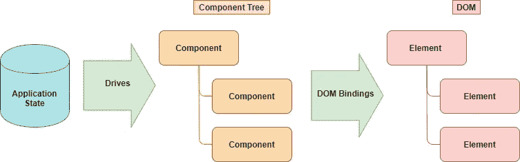
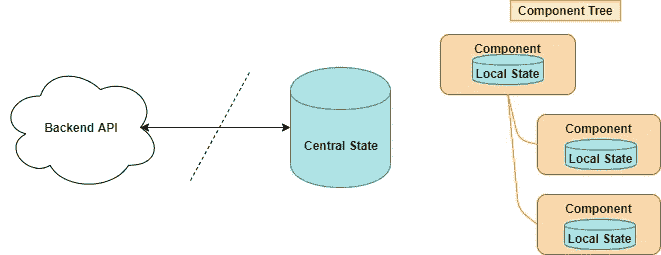
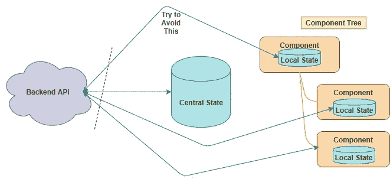
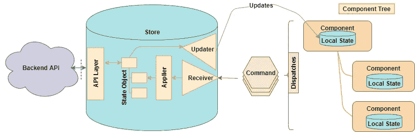
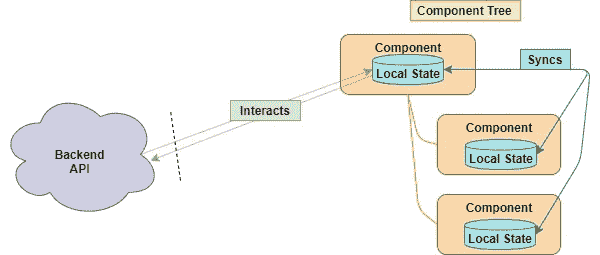

# 如何处理 React、Vue 和 Angular 中的状态管理

> 原文：<https://javascript.plainenglish.io/the-art-of-the-state-e19816732530?source=collection_archive---------3----------------------->

## 同样好的架构适用于任何地方

尽管 React、Angular 和 Vue 之间存在显著差异，但它们共享架构基础。我们可以这样看待这种统一:

这种高层次同样适用于三大巨头 React、Angular 和 Vue(可能还有新兴事物如 [lit-html](https://lit-html.polymer-project.org/) )。

三者共有的一个核心改进是上面提到的 DOM 绑定概念，在这里[会有更全面的描述。](https://medium.com/@matthewcarltyson/modern-ui-explained-in-4-paragraphs-and-2-pictures-2494042b3847)

使用这些框架的应用程序的一个关键复杂性领域是应用程序状态。我问的问题是，处理状态反应的最佳方式是什么[这里](https://medium.com/better-programming/react-state-of-the-state-e30e98abdb01)。我已经得出了我认为这个问题的理想设计原则，跨越了所有三个框架。

简而言之，我提出的原则是:

> 对于业务数据，支持集中状态，对于 UI 状态，支持组件状态。

让我强调一下这个想法中有利于 T7 的部分。倾向于这种想法，不要把业务状态放在组件中，因为这在伦理上是错误的。

我肯定没有在所有三个框架上工作过足够多的应用程序，所以直接告诉我你的经历。

我在这三个方面的经验告诉我，这是一个很好的指导原则，可以处理非常大和复杂的应用程序。

## 两种状态

如果你告诉我屏幕元素的位置，你就是在告诉我用户界面的状态。

如果您告诉我 account total 小部件中有多少钱，您就在谈论业务数据。

这并不是一个严格的区别，因为您可能会将小部件的位置保存到后端，从而将 UI 状态转换成一种业务数据。

此外，业务数据总是驱动 UI 的内容。

看待业务数据的一种更完美的方式是将其视为远程持久数据。

也就是说，来自远程 API 并通过远程 API 返回的数据。出于讨论的目的，我认为业务数据几乎等同于持久 API 数据。

到目前为止，这个想法是这样的:

我们试图 ***避免*** 的主要事情是这样的:

再说一次，不是因为它是错的或者注定要彻底失败。

我们避免让持久数据经过多个角色，仅仅是因为它违反了应用程序设计一个基本原则，这个原则几十年来一直使复杂性易于管理:将数据问题隔离到层。

我认为大多数经验丰富的软件开发人员会看到这一点，并本能地知道在整个组件中散布后端 API 调用将导致难以理解的数据流。

# 将后端调用集中到一个层

因此，我们希望从众多组件中真正调用一个集中且一致的中央数据存储，代表数据层。

## 正规商店

有各种各样的方法可以实现这一点。在 Vue、React 和 Angular 中，有一个标准且相似的方式:

*   反应:Redux
*   角度: [ngrx/store](https://blog.usejournal.com/redux-angular-style-ngrx-store-b2876280708e)
*   Vue: Vuex

其中的每一个都创建了一个以正式方式交互的中央存储，并且包括处理后端 API 交互的能力。

## 指挥观察员

每个中央商店都像是[命令模式](https://en.wikipedia.org/wiki/Command_pattern#:~:targetText=In%20object%2Doriented%20programming%2C%20the,values%20for%20the%20method%20parameters.)的实现，或者在简单的情况下，像是[观察者模式](https://en.wikipedia.org/wiki/Observer_pattern)。Flux 是应用于 UI 架构的一般概念的名称。

在每种情况下，事情都是这样的:

这看起来像是商店概念的一个相当合理的抽象，在所有三个框架中都有体现。

因此，Flux-like Store 实现提供了一种标准化和严格的方法来加强数据访问层。

他们还通过命令观测器给出了更多的形式化的状态变化。简而言之，使用正式的商店比使用直接的集中商店更复杂。

你真的需要那些额外的东西吗？

以下是我对此的看法:不，你可能不需要所有这些，但你也可能不会找到比直接使用中央商店更简单或更快的中央设置，*Angular 中的*除外。

在 Angular 中，如果我可以说的话，中央存储有点笨重，并且其 RxJS 框架架构的控制反转和可观察性使得创建自己的中央状态管理变得很容易。

## 中央商场的简单例子

下面是每个框架使用其官方中心存储的非常简单的例子。

*   简单的**vuex**:[https://jsfiddle.net/n9jmu5v7/1269/](https://jsfiddle.net/n9jmu5v7/1269/)
*   简单**重复**:[https://jsfiddle.net/hganz/gk9kaopr/](https://jsfiddle.net/hganz/gk9kaopr/)
*   简单**ngrx/store**:[https://stackblitz.com/angular/ybkjvpbengb](https://stackblitz.com/angular/ybkjvpbengb)

注意 Vuex 和 Redux 是简单的单页 JSFiddles，而 ngrx/store 是多文件 app。不好，有棱角，[一点都不好](https://blog.usejournal.com/redux-angular-style-ngrx-store-b2876280708e)。

# 作为全局范围和 API 层的根组件

在缺少全局状态的情况下，视图的根组件倾向于充当这个角色。

这里的视图是指随着应用的增长，你会把它分成多个单独加载的页面，每个页面都有一个根组件。默认情况下，根组件充当全局变量空间。

在这种情况下，根组件将负责与树中的子组件交互，以通过从子组件返回到父组件的道具和事件来保持它们与状态同步。

大概是这样的:

我认为这是一个公平的妥协:它将 API 交互集中在根组件中。同样，我们正在努力避免 API 调用分散在代码库中。

根据您使用的框架，这看起来会有很大的不同。最尴尬的将是 React(见[这里](https://medium.com/better-programming/react-state-of-the-state-e30e98abdb01))，因为你将使用“渲染道具”来处理向上的沟通。

在 [Angular](https://angular.io/api/core/EventEmitter) 和 [Vue](https://medium.com/@sky790312/about-vue-2-parent-to-child-props-af3b5bb59829) 中，有强大的事件支持可以减少管理孩子与父母沟通的难度。这些比渲染道具更干净，但是当事件在组件中跟踪时，你仍然要小心爆炸式的复杂性。

# 无状态组件

## 也就是功能组件，也就是“纯”组件

一个有趣的方法是无状态组件。在这种情况下，您采取了极端的做法，从组件中完全消除了状态。组件只是变成了行为声明者。

这里的想法是让组件非常容易思考。我的感觉是，这实际上可能会推高复杂性，而不是消除它，但我没有足够的实际经验来肯定地说。

这些也被称为“功能组件”,以突出它们没有被建模为对象的事实。(也称为“纯”组件，这是一个非常无用和令人困惑的名称，IMO)。

这些类型的组件是可能的:

*   in React:[https://it next . io/React-component-class-vs-stateless-component-e 3797 c 7d 23 ab](https://itnext.io/react-component-class-vs-stateless-component-e3797c7d23ab)
*   在 Vue 中:[https://blog . log rocket . com/how-to-use-stateless-components-in-Vue-js/](https://blog.logrocket.com/how-to-use-stateless-components-in-vue-js/)
*   在 Angular:[https://blog . Angular-university . io/Angular-2-smart-components-vs-presentation-components-what-the-difference-when-use-each-and-why/](https://blog.angular-university.io/angular-2-smart-components-vs-presentation-components-whats-the-difference-when-to-use-each-and-why/)

(在 Angular 中，它们被称为“表象组件”，我觉得这是一个不错的描述符。)

# 保持敏捷

我推动集中式状态/API 访问的最大缺点是，在开始一个新的应用程序时，人们可能会试图强制执行这一硬性规则，从而减缓开发，因为人们处理商店，而不是提供功能。

> 软件生存的基本规则是:让应用程序工作，这样它才能生存，然后在必要时重构。

开发一个有缺陷的应用比让它死掉要好。

在软件领域，理想总是在你的前面——这是它最迷人的地方之一。

除此之外，一旦你在你的架构上安排好了事情，一些客户或项目经理就会走进来把一切都搞砸。

无论如何，我想在这里提出的要点是:

*   整体设计选项在 Vue、React 和 Angular 之间是相似的
*   尝试将 API 调用集中在一个层中
*   尝试只在组件树中共享 UI 状态
*   如果不使用存储，则使用根组件作为 API 层和中央状态
*   如果您/您的团队/您的时间表能够支持复杂性，请使用商店

小附录。

还有几个选项可供选择。这些提供了容易获得的中央存储，但是相当于全局变量。谨慎小心地使用:

window.myState

localStorage.setItem("myState "，" foo ")

马特·泰森是 T4 网站的首席技术官

 [## 马特·泰森

### 马特·泰森(@matttyson)的最新推文:“我喜欢@springframework 的原因:几乎所有你需要添加的东西…

twitter.com](https://twitter.com/matttyson)