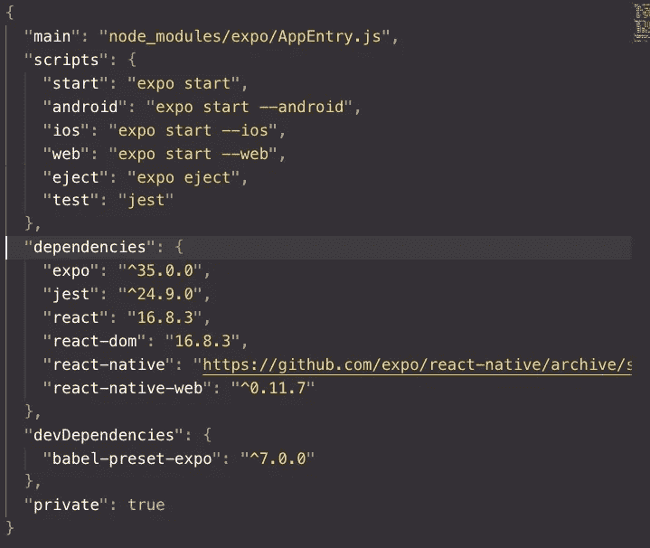

# 新的 React 原生项目中 package.json 内部是什么？

> 原文：<https://javascript.plainenglish.io/the-basics-of-package-json-e8c85df55611?source=collection_archive---------1----------------------->

## 介绍

刚开始时，对反应或反应原生可能会感到不知所措，但你不需要一下子学会所有的东西。一个需要一些基础知识的重要文件叫做 package.json，它包含项目元数据、依赖项和用于生成构建的脚本。

## 什么是 package.json

当我在工作中学习时，我不得不学习使用 package.json 的重要性。这是一个由 NPM(节点包管理器)创建的文件，它包含你的应用程序的所有元数据、依赖关系和脚本。包文件列出的重要内容之一是依赖关系。

依赖项是将在您的应用程序中使用的模块或包。它会跟踪包含哪些包以及版本。这是使用 package.json 的一个基本组件。

## 设置项目

我不会用 expo 安装 npm 或 create-react-native-app，因为已经有很多教程了。在这一节中，我将只展示基础知识。

要开始新项目，您只需键入:

`npm init`

由于我主要是一名移动开发人员，我将向您展示如何在 React Native 中启动一个项目:

`create-react-native-app`

## 主要的

一个重要的属性叫做`main`。Main 是 js 文件或应用程序的入口点。对于使用 Expo 的 React 本地应用程序来说，它是`"main": "node_modules/expo/AppEntry.js"`，但它甚至可以短到`App.js`。这真的取决于你的目录结构，以及你是否使用了`create-react-native-app`。我不使用 Expo，所以我的 packages `main`属性就像是较短的版本。

## 剧本

根据官方 npm [文档](https://docs.npmjs.com/misc/scripts),“`scripts`属性是一个字典，包含在您的包的生命周期中的不同时间运行的脚本命令。”这到底是什么意思？这意味着您可以在使用 package.json 之前或之后运行脚本。

很多时候脚本被用于构建和测试。

React Native 包中的默认脚本有:

我没有在我的任何项目或工作中使用 expo，但它是使用 Expo 的官方 React Native [文档](https://facebook.github.io/react-native/docs/next/getting-started)的一部分。

要执行 React 本地项目，您应该键入`npm run ios`。`npm run`意味着，嘿，让我们执行包中`scripts`对象的脚本。如果你看上面的例子，添加`ios`将执行`expo start --ios`并启动 iOS 模拟器。

这意味着，如果您刚刚运行了`npm install jest --save`并想要运行测试，您只需将`"test": "jest"`添加到脚本对象中。现在您只需输入`npm run test`就可以运行测试了。

## 从属关系

依赖项是项目需要的模块列表。查看 React Native 的全新安装:

这些是在使用 Expo 的 React 本地项目中用作最低限度的包。你可以在 [npmjs](https://www.npmjs.com/) 为你的项目下载很多包。如果你喜欢冒险，我建议你去那里玩，熟悉一下这个网站。

devDependancies 是只在开发过程中需要的包。被认为是 devDependancies 的包的一些例子是 jest、eslint、storybook 和 prettier。

## 结论

当我第一次使用 React Native 时，package.json 文件对我来说非常陌生。我习惯了 Cocoapods、XCode 和为 iOS 创建本地应用程序。所以经过一段时间的试验、查阅文档和理解发生了什么之后，我终于适应了。