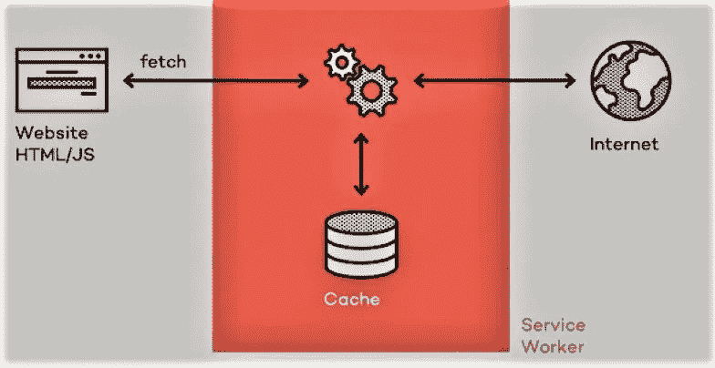
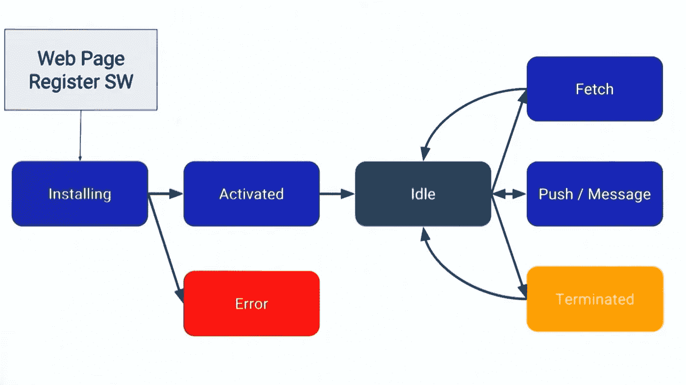
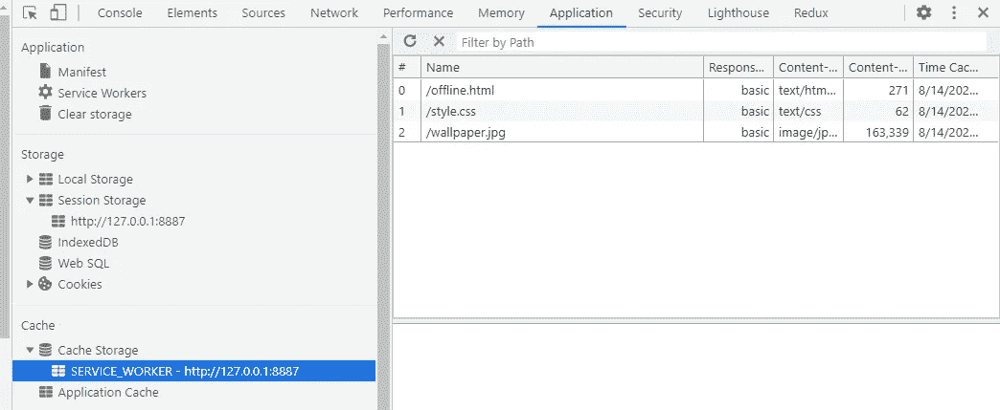

# 服务人员的基本知识

> 原文：<https://javascript.plainenglish.io/the-basics-of-service-workers-e37bd9a697f?source=collection_archive---------0----------------------->

这篇文章是我上一篇关于网络工作者的文章的延伸。在这篇文章中，我将谈论服务工作者。

**Service Worker** 是一个在浏览器后台工作的脚本，无需用户交互。它充当浏览器(web 应用程序)和网络之间的代理服务器，允许您控制如何处理来自页面的网络请求。该脚本可以拦截网络请求，帮助创建有效的离线体验，并更新驻留在服务器上的资产等。

## 先决条件

与服务人员一起工作时，有几点你应该牢记在心。

⦁在开发过程中，您可以使用本地主机，但是要在站点上部署它，您需要在您的服务器上安装 HTTPS。

⦁服务工作器在不使用时被终止，并在下次需要时重新启动，因此您不能依赖服务工作器中的全局状态。如果有一些信息需要保存并在重启时重用，可以使用[索引的数据库](https://developer.mozilla.org/en-US/docs/Web/API/IndexedDB_API)。

⦁服务人员无法直接访问 DOM。相反，它可以通过响应通过 postMessage 接口发送的消息来与其控制的页面进行通信，如果需要，这些页面可以操作 DOM。

## 服务人员生命周期

服务人员的生命周期完全独立于您的网页。

要安装服务人员，您必须首先在主页上注册。注册服务人员将导致浏览器下载服务人员文件，并在后台启动其**安装**步骤。

在**安装**步骤中，您可以缓存资产，稍后再提取。如果安装成功，则服务人员进入**激活**阶段。

在**激活**步骤之后，服务工作者将控制其范围内的所有页面，尽管第一次注册服务工作者的页面在再次加载之前不会被控制。这是因为页面的获取事件不会通过服务工作者，除非页面请求本身通过服务工作者。

一旦服务工作器处于控制状态，它将处于两种状态之一:要么服务工作器将被终止以节省内存，要么它将处理从您的页面发出网络请求或消息时发生的获取和消息事件。

下面是生命周期的简化图

Service Worker Lifecycle

## 注册服务人员

要启动服务人员，您应该首先在主页上注册。这将告诉浏览器您的服务人员 JavaScript 文件所在的位置。

在 index.htm，我们添加了脚本来注册服务人员。这段代码检查服务工作者 API 是否可用，如果可用，那么在页面加载后注册位于 **/sw.js** 的服务工作者。我用于 **sw.js** 的文件位置是在域的根目录。这意味着服务人员的范围将是整个原点。换句话说，这个服务工作者将获取这个域中的所有事件。如果我们将服务工作者文件存储在/public/sw.js，那么服务工作者将只能看到 URL 以/public/(即/public/page1/，/public/page2/)开头的页面的 fetch 事件。

## 安装一个服务人员

注册后，我们进入安装阶段。这是服务人员收到的第一个事件。服务人员一执行就触发它，并且每个服务人员只调用一次。在这个阶段，您会想要缓存一些静态资产。如果所有文件都被成功缓存，则服务工作人员将被安装。如果任何文件下载和缓存失败，则安装步骤将失败，服务人员将不会激活(即不会安装)。

在上面的例子中，服务人员正在监听**安装**事件。 **cache.open** 将创建一个名为“SERVICE_WORKER”的新缓存，然后使用 **cache.addAll** 我们将添加所有想要缓存的 URL。 **events.waitUntil** 延长安装事件的生命周期，直到传递的承诺成功解析或被拒绝。如果承诺被拒绝，安装被认为是失败的，服务人员被放弃。

这里我们缓存了一个图像、一个 CSS 文件和一个离线页面，如果出现网络问题，将会获取该页面。**offline.html**页面使用与主页相同的 CSS 和图像来重用缓存的文件。

您可以通过检查**chrome://inspect/# Service-Workers**或在浏览器的**应用**选项卡中选择**服务工作者**选项来检查您的服务工作者是否已启用

您也可以检查在浏览器中创建的缓存。

⦁对于 **Chrome** ，检查**应用**选项卡的**缓存存储**选项，其中将创建一个缓存‘service _ worker’。它将包含您缓存的所有文件。

⦁对于 **Mozilla** ，检查**存储**选项卡，其中**缓存存储**将包含一个名为‘service _ worker’的缓存。

Service Worker in Chrome Browser

## 服务人员的激活

安装服务人员后，下一步将是其**激活**。一旦激活，服务人员将开始控制其范围内的所有页面。

如果已经创建了旧的缓存静态内容的新版本，那么这个事件是删除旧的缓存静态内容的理想位置(将在后面的小节中讨论)。

## 缓存和返回请求

既然服务工作者已经被激活并控制了其范围内的所有页面，我们的下一步应该是返回缓存的响应。

当用户导航到不同的页面或刷新时，服务工作人员将开始接收获取事件。

我们定义了一个**获取**事件监听器，其中有两个条件。首先，当用户试图导航到 HTML 页面并出现错误(例如:网络错误)时，我们只需从缓存中返回离线页面。在另一种情况下，我们将缓存与请求的 URL 进行匹配，如果我们有匹配的响应，我们将返回缓存的值，否则我们将返回调用 fetch 的结果，这将发出网络请求，如果可以从网络中检索到任何内容，则返回数据。

**caches.match()** 查看请求，并从您的服务人员创建的任何缓存中查找任何缓存结果。 **event.respondWith()** 方法阻止浏览器默认的获取处理，从而允许您自己提供一个承诺作为响应。

要测试这个功能，可以使用 Chrome 内置的开发者工具。移动到**网络**选项卡，将**在线**改为**离线**并刷新页面。

嘣！！您将被重定向到脱机页面(offline.html)。

## 更新服务人员

当用户导航到您的站点时，浏览器会尝试重新下载在后台定义服务人员的脚本文件。如果服务工作者文件与其当前拥有的文件相比有哪怕一个字节的差异，它都认为它是新的。

将安装这个新的服务人员。但是此时，旧的服务工作者仍然控制着当前页面，因此新的服务工作者将进入等待状态。一旦您的 web 应用程序当前打开的页面被关闭，旧的服务人员将被浏览器杀死，然后新安装的服务人员将完全控制。这是它的“激活”事件将被触发的时间。

如果您希望新的服务人员覆盖旧的服务人员，那么使用 **self.skipWaiting()** 。

我们在**激活**事件中做的一个常见任务是缓存管理。在这里，我们可以清除由旧的服务工作人员创建的旧缓存。这里这样做的原因是，如果您要在安装步骤中清除任何旧的缓存，控制所有当前页面的旧的服务工作器将会突然停止服务该缓存中的文件。

上面的代码循环遍历服务工作器中的所有缓存，并删除缓存白名单中未定义的任何缓存。

这是服务工作人员文件( **sw.js** )的组合代码。

## 用例

我们上面讨论的是服务工作者的基本用法，但是服务工作者远不止这些。它们可以用来提供一些独特的功能:

**推送通知**——这些是在用户设备上弹出的消息。它们允许用户选择从网络应用程序中及时更新。

**后台同步** —这允许您推迟操作，直到用户拥有稳定的连接。

**定期同步(未来)** —提供管理定期后台同步功能的应用编程接口。

**地理围栏(未来)** —当设备越过地理围栏时，web 应用程序会收到通知，无需定期查询**地理定位 API** 。

谢谢你抽出时间阅读我的文章。