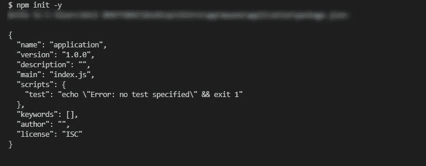

# 用 Webpack 和 Babel 建立 ES6 开发环境的基础

> 原文：<https://javascript.plainenglish.io/the-basics-of-setting-up-an-es6-development-environment-with-webpack-and-babel-153d1bc3b4a5?source=collection_archive---------4----------------------->

## 用 Webpack 设置 JavaScript ES6 开发环境基本配置的 10 个步骤，Babel。


Photo by [Nikita Kachanovsky](https://unsplash.com/@nkachanovskyyy?utm_source=medium&utm_medium=referral) on [Unsplash](https://unsplash.com?utm_source=medium&utm_medium=referral)

## **第一步**

创建一个要向其中引入开发环境的文件夹，然后运行

```
npm init
```

这将在您的文件夹中创建一个 package.json 文件。这将把它定义为一个`nodejs` 项目。完成所有问题，或者您可以使用

```
npm init -y 
```

创建默认的 package.json(如下所示)



Automatic generated package.json

## 第二步

因此，接下来您要做的是安装 webpack 和 webpack-cli。我建议您将 webpack 作为依赖项安装，将 webpack-cli 作为开发依赖项安装。

```
npm install --save webpacknpm install --save-dev webpack-cli
```

## 第三步

在下一步中，创建一个文件夹，并根据自己的喜好命名。在这里，我们创建了一个`app`文件夹和一个`main.js`文件，您可以在其中编写 javascript 代码。

在`main.js`中添加一个简单的 javascript 代码来检查它是否工作。我们正在添加警报。

```
alert(“Life is Beautiful”)
```

## 第四步

现在在根文件夹中创建一个名为`webpack.config.js`的文件，这将是我们的 webpack 配置文件。为了简单起见，我们采用简单的配置。

```
module.exports = {
  entry: ["./app/main.js"],
  output: {
  filename: "bundle.js"
 }
}
```

你可以在这里阅读更多关于配置[的信息。](https://webpack.js.org/concepts/)

## 第五步

现在一切都完成了。我们必须运行并检查它是否工作。对于这一步，现在可以转到 package.json 文件。搜索`"scripts"`并添加`“build”: “webpack --watch”`，你的脚本应该是这样的。

```
"scripts": {
   "build": "webpack --watch"
}
```

## 第六步

在加载了我们的`bundle.js`的根文件夹中创建一个 HTML 文件`index.html`。这是 HTML 文件的样子。

```
<!DOCTYPE html>
<html lang="en">
<head>
  <meta charset="UTF-8">
  <meta name="viewport" content="width=device-width, initial-  scale=1.0">
  <title>ES6 Development Env</title>
</head>
<body>
  <!-- Content Goes here -->
</body>
**<script src="dist/bundle.js" type="text/javascript"></script>**
</html>
```

dist 是 webpack 创建的文件夹，所以记住在呼叫`bundle.js`时保持 dist

## 第七步

现在运行:

```
npm run build
```

在第 5 步中，我们使用了`“build”: “webpack --watch”`，它将监视 js 文件中的变化并相应地更新它。打开您的`index.html`文件，它会显示一个对话框。

让我们无缘无故地把 alert 改成 console.log。并打开 chrome dev 工具的控制台，看到“生活是美好的”打印出来。继续更改`main.js`文件中的文本，并尝试刷新页面。

你会看到变化。恭喜您成功添加了 webpack，现在让我们添加 BabelJS

## 第八步

**巴别塔有必要吗？看了** [**这个**](https://www.reddit.com/r/learnjavascript/comments/ans0mb/is_babel_still_necessary_in_2019/) **Reddit 的帖子，真的不错。**

基线是肯定的，在你的项目中使用 Babel。在您的 webpack 配置文件中添加`mode: “development”`，并添加 babel run

```
npm install --save-dev babel-core babel-loader babel-preset-es2015
```

**babel-core** 和 **babel-loader** 帮助将 ES6 代码转换为 ES5，以便我们的浏览器可以理解我们编写的 ES6，babel-preset-es2015 让我们可以在我们的 web 应用程序中使用 ECMA 脚本的高级功能。

## 第九步

添加这些包后，将模块添加到 module.exports 对象，如下所示

```
const path = require('path');module.exports = {
  mode: 'development',
  entry: './app/main.js',
  output: {
    path: path.resolve(__dirname, 'dist'),
    filename: "bundle.js"
  },
  module: {
    rules: [
    {
      test: /\.js$/,
      exclude: /(node_modules)/,
      loader: 'babel-loader',
    }
   ]
 }
}
```

在某些情况下，您可能会看到加载器代替了规则。你只需要知道从 webpack1 到 webpack2 的规则取代了 it 加载器。module.rule 将被实施，加载程序将在将来折旧。

页（page 的缩写）我们也增加了路径库。

## 第十步

现在去终端启动`npm run build`并在`main.js`文件中添加一些 es6 代码。

```
const need = "World Peace";
console.log(`I want to see ${need}`)const sum = (arr) => {
  let sum = 0;
  for(const ele of arr){
   sum += ele;
  }
  console.log(`The numbers to add are: ${arr}`);
  console.log(`And their sum is ${sum}`);
}sum([10, 20, 30, 40, 50]);
```

它会编译。也就是说恭喜你已经完成了你来这里的目的。

你可以添加任何你想要的库，现在的限制只是你的想象。

你可以在这里找到代码。

# 奖金

## 添加 SASS

运行以下代码。

```
npm install --save sass css-loader sass-loader
```

将 style.scss 添加到您的根文件夹中，并像[这个](https://github.com/chitru/ES6-environment/blob/master/webpack.config.js)一样更改您的 webpack.config.js，您所需要做的就是从`dist` 文件夹中调用您的`bundle.css`到您的`index.html`文件中，您就为一些样式化做好了准备。

当你有耐心和承诺时，美好的事情就会发生。谢谢你坚持到最后。希望你能从邮局得到些什么。

谢谢你。

# 喜欢你读的吗？

如果你想阅读更多像这篇文章这样的信息丰富的文章，我的电子邮件摘要正是你想要的。

[*今天点击加入我的邮件摘要。*](https://upscri.be/zm7qsy)

【JavaScript 用简单英语写的一句话:我们总是对帮助推广优质内容感兴趣。如果你有一篇文章想用简单的英语提交给 JavaScript，用你的中级用户名发邮件到[submissions@javascriptinplainenglish.com](mailto:submissions@javascriptinplainenglish.com)给我们，我们会把你添加为作者。