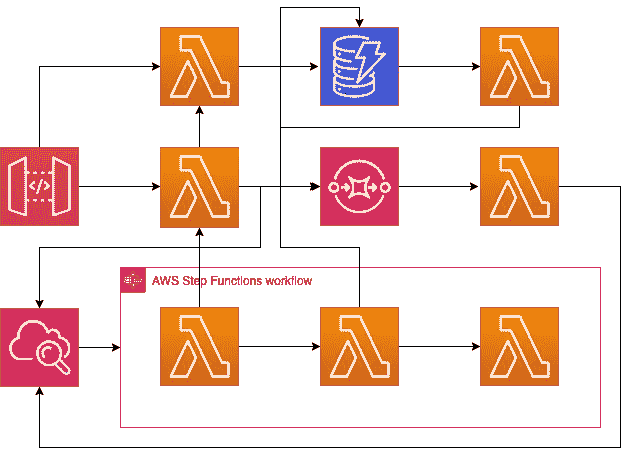
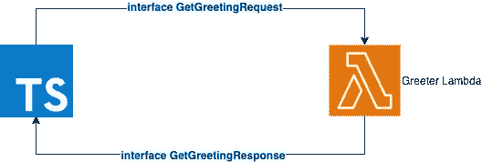
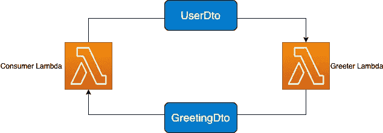
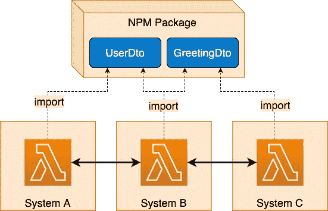

# 可伸缩无服务器应用程序的 TypeScript 之美

> 原文：<https://javascript.plainenglish.io/the-beauty-of-typescript-for-scalable-serverless-applications-b2ffbf811a2a?source=collection_archive---------4----------------------->

无服务器是这个街区的新成员。这似乎是所有可伸缩性问题的神奇解决方案，同时保持低成本。当我们进入这个领域时，我们很快意识到开发和维护大型应用程序可能不像看起来那么简单。实际上，要把它做好是相当困难的。在这篇文章中，我们将探索使用 TypeScript 接口来设置跨无服务器资源的契约。

## 脱钩太棒了！直到它不再…

无服务器架构的一个关键概念是让小的功能块相互分离——就像彼此完全分离一样。每一部分都将以不同的速率扩展，从而提供最佳的使用/成本平衡。例如，在一个电子商务 web 应用程序中，一个负责身份验证的 Lambda 可能比另一个负责处理信用卡交易的 Lambda 被调用更多次。

自然，这些功能块需要通过同步或异步通道(如队列、步骤函数、通知等)相互通信，来回发送数据。人们可以很快看到，随着应用程序的增长，各部分之间的连接数量以指数速度增长。

A theoretical example of a serverless app with too many interconnections

如果您的基础架构像这样混乱，那么很容易做出无意的突破性更改，因为很难跟踪什么调用什么。对 Lambda 的输入格式做一个简单的更改，如果一些调用者没有相应地更新，可能会导致整个系统瘫痪。

## TypeScript 和这一切有什么关系？

> 2019 年，JavaScript 驱动了全球约 66%的 AWS Lambdas([stats](https://thenewstack.io/what-aws-lambdas-performance-stats-reveal/))。

TypeScript 提供了一种独特的机制来声明易于跨多个代码库应用、扩展和共享的接口和类型。使用 TypeScript 将减少开发时间，并几乎消除通信格式错误，因为您将确切地知道发送什么以及从 Lambda 函数中期望什么，即使它是由另一个团队创建的。通过采用“基础设施即代码”的方法满怀信心地维护您的应用程序，在这种方法中，无服务器资源被视为具有定义的输入和输出的另一段代码。

有很多方法可以利用 TypeScript，在这篇文章中，我们将探讨几种方法。

# 请求/响应模式

这是最基本的模式，当您有一个 Lambda 需要某个输入、执行一些处理并输出结果时，这种模式非常有用。这个虽然简单，但是可以预防很多头疼的问题。

Lambda using Request/Response Interfaces with TypeScript

现在，当调用这个函数时，您知道它需要一个形状为`GetGreetingRequest`的对象，并且返回的对象将具有由`GetGreetingResponse`定义的属性。注意，这两个接口都是导出的，所以我们可以在调用 Lambda:

这里我们已经完成了最基本的循环。消费者使用接口来确保输入和输出是预期的。如果后来 Lambda 随着它的接口一起改变了，那么这段代码就不会编译，从而阻止我们使用过时的格式。

## **请求/响应的优点:**

*   提供类型检查和自动完成
*   这很容易实现

## **请求/响应的缺点:**

*   它没有运行时验证
*   部队断言与`Payload as string`
*   业务逻辑与数据表示混合`JSON.stringify`和`JSON.parse`

# DTO 模式

dto 或数据传输对象已经存在了一段时间，但在现代无服务器世界中，它们尤其重要。它们对于跨资源传递数据很有用，例如，lambda 调用其他 lambda，或者将消息分派到 SQS 队列以便稍后处理。

> 数据传输对象的主要目的是通过从发送方和接收方提取打包和解包数据的逻辑，提供可靠传输数据的机制。

在下面的例子中，我们将使用两个 lambdas。这个想法是，第一个 lambda 发送一个带有用户信息的`UserDto`，第二个 lambda 将响应一个包含消息的`GreetingDto`。

**发送 DTO:**

仔细看看`userDto`。它是`UserDto`的一个实例，包含用户的所有属性。最重要的是，它有一个`serialize`方法，抽象出传输数据的逻辑。

**接收 DTO:**

一旦 Greeter lambda 被调用，它就会接收一个对象，但是我们并不知道它是什么类型。有可能是用不正确的输入调用的。因此，我们需要在运行时验证它是否真的与`UserDto`兼容。幸运的是，我们的类有一个静态方法`from`来验证它并返回一个实例。

在欢迎端，我们获取事件，通过一行代码，我们验证并获取用户实例。同样为了额外的安全，它将返回类型声明为`Promise<GreetingDto>`

这里，AWS 处理返回的`GreetingDto`实例，并返回一个带有属性的对象。请注意，没有必要用字符串表示返回。

## **dto 优势:**

*   在运行时验证输入并提供类型检查
*   抽象数据传输逻辑并使其可重用
*   简化与其他系统的通信

## **dto 的缺点:**

*   引入复杂性
*   对于复杂的对象模式，像`joi`或`yup`这样的验证包可能是有用的

# 跨团队和项目同步

关于 TypeScript，我最喜欢的特性之一是能够自己导出类型声明。当有多个团队在一个组织中工作时，这种与 NPM 包的结合尤其强大。

通过拥有一个集中的存储库，每个团队都可以将这些包包含在他们的项目中，以可预测的方式发送和接收数据。如果使用请求/响应模式，您将只需要导出 TypeScript 接口，但是如果您想更进一步，您还可以提供 d to 的实现以及用于 TS 和 JS 的类型声明。

# 超越兰姆达斯

上述模式对其他无服务器资源也很有用，比如 SQS、Step Functions、DynamoDB 和新添加的 CDK。所有这些资源都受益于一个可以可靠传递的可预测对象结构。例如，SQS 可以用一个消息数组来调用 Lambdas，并且每个消息都可以进行类型检查。

# 结论

随着无服务器功能和其他资源越来越流行，很难跟踪变化并确保一切正常工作。TypeScript 为类型检查提供了强大的功能，可以通过多种方式进行分发和应用。这是一个强大的工具，可能是无服务器应用程序成功的关键。