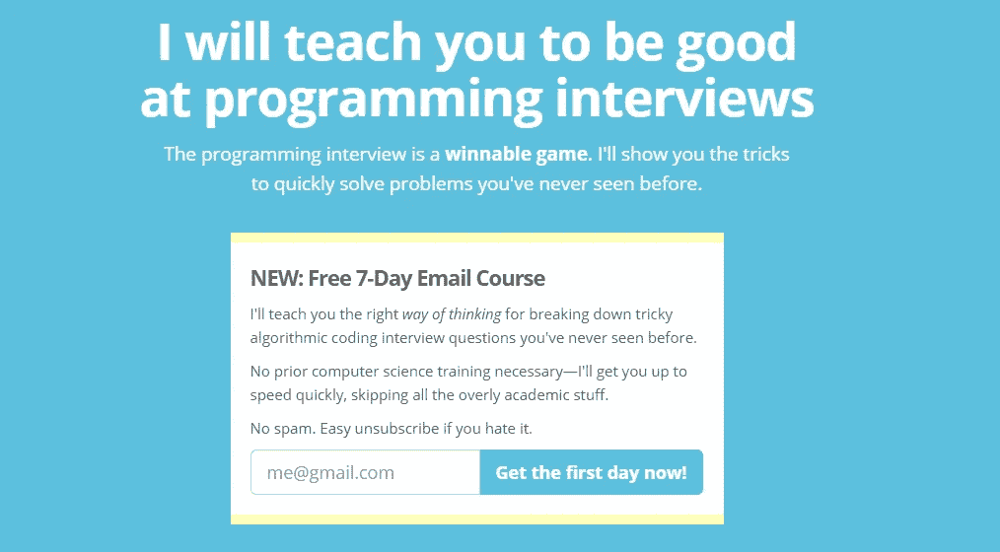
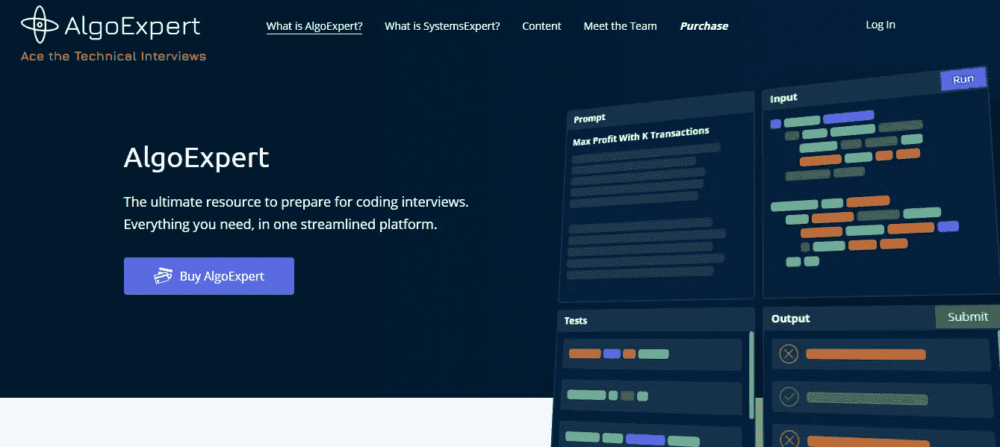
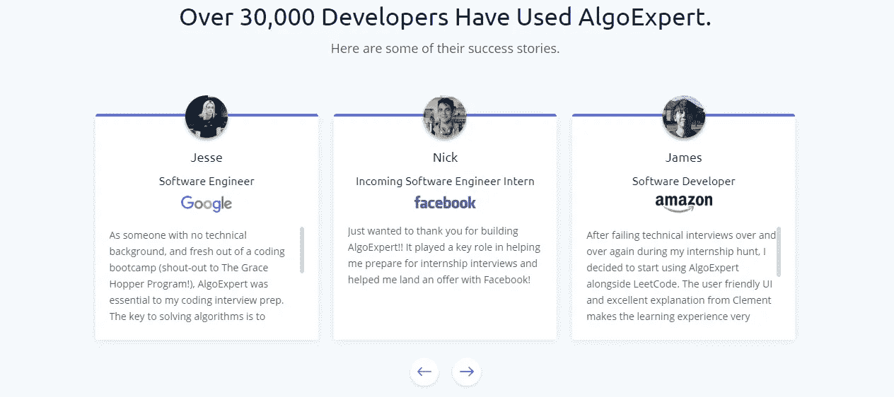
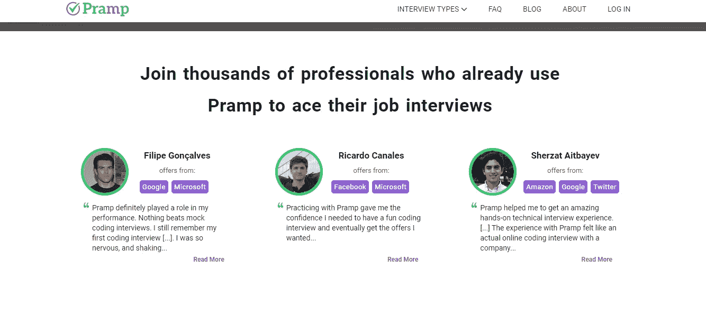
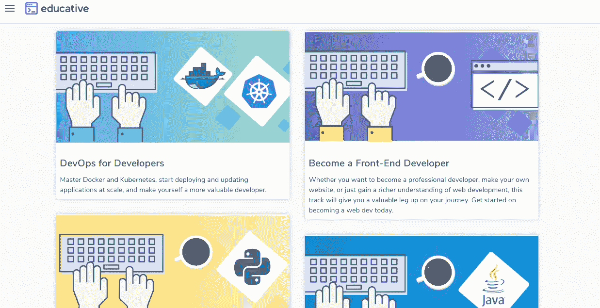

# 2020 年最好的编码面试准备资源

> 原文：<https://javascript.plainenglish.io/the-best-2020-resources-for-your-coding-interview-preparation-eb7513dcf974?source=collection_archive---------1----------------------->

## 在重要面试中避免失败的个人清单

Illustration by Maria Shukshina from [Icons8](https://icons8.com/)

*“早期的成功是一个可怕的老师。你本质上是因为缺乏准备而受到奖励，所以当你发现自己处于必须准备的情况时，你就不能做了。你不知道如何。”*——**克里斯·哈德菲尔德，**[T5【宇航员地球生活指南](https://www.goodreads.com/work/quotes/25488999)

我已经讲过一个故事，这个故事让我对这样一句话产生了共鸣。关于我在国外找工作的旅程。我是如何悲惨地失败了。

因为缺乏准备，我失败了。因为我无知到认为快速复习一下基本语言概念就能让我得到这份工作。

正如宇航员所教导的，要降低生活中失败的风险，只有一个有用的原则。**准备，准备，准备**。

知道你将经历什么，做好准备，试着预测你将感受到的情绪，不要让它们在面试中控制你。

以下是我找到的降低失败风险和在 2020 年编码面试中应用准备原则的最佳资源列表。

## 面试蛋糕

50+小时的编码面试问题准备。包括完整的分解解决方案、“*疑难解答*”列表和“*我们学到了什么*”部分。在这里你会发现面试的所有重要组成部分，如*数据结构*、*算法*、*搜索*和*排序*等。

[Interview cake](https://www.interviewcake.com/)

你也可以访问他们的免费小词汇表文章来熟悉所需的技术词典。

## AlgoExpert(作者选择)

[Algo expert](https://www.algoexpert.io/product)

这看起来非常有趣，可能是一个新工具，因为它最近收到了所有的广告。9 种不同语言的 85 个最佳编程面试问题详细概述: *JavaScript，Python，Swift，C++，Java，C#* ， *Kotlin，Go 和 TypeScript* 。

该工具为代码执行提供了一个很好的环境，支持时空复杂性分析和专业的面试技巧。

此外，他们还为最被低估的面试问题类型之一:系统设计问题提供了令人难以置信的服务。他们提出了一个名为 [SystemExpert](https://www.algoexpert.io/systems/product) 的工具，这基本上是设计大规模应用程序的预备课程。

它以模拟视频采访为特色，为与设计系统相关的所有主题提供了设备齐全的课程，还有真实的代码示例。

截至撰写本文之日，就其价格和优惠而言，我强烈建议您订阅 Algo Expert +System Expert，在一个设备齐全的环境中享受您需要的所有东西。

## LeetCode

[LeetCode](https://leetcode.com/)

一个在所有开发者中非常有名的平台。您可能希望使用真实的编码面试问题来练习您的技能。LeetCode 支持超过 14 种编程语言，将通过该平台为您提供超过 [1600 个面试问题](https://leetcode.com/problemset/all/)，竞赛甚至直接被录用的机会。

## Pramp

[Pramp](https://www.pramp.com/#/)

当你在一个人面前说话时，你会感到焦虑吗？或者也许你害怕在真正的面试官面前看到自己的大脑一片空白。Pramp 会在这方面帮助你。这是一个极好的对等平台，在这里你可以和另一个人练习解决代码问题。

你们中的一个人将扮演采访者，另一个人扮演被采访者。然后角色会互换。

采访是现场的，一对一的视频会议，通过一个协作代码编辑器在他们的网站上进行。他们还负责日程安排和面试准备内容。此外，你可以选择你想在面试中练习的内容，从系统设计到行为问题或简单的代码。

## Educative.io 面试课程集

[Educative.io](https://www.educative.io/learn)

现在，与其列出其他 100 个有效的课程或资源，你可能想浏览一下，**我更喜欢给你另一个单一的地方，在那里你可以学习和练习你需要的一切**。

我在 [Educative.io](https://www.educative.io/) 上看到的那些难以置信的好课程的吸引力如此之低，真是令人疯狂。它们以你能想到的任何主题的课程为特色，只需一个月的订阅或一年的访问。

特别是，他们有丰富的面试准备课程。有解释和练习。

如果你不想花太多的钱，或者你只对短期订阅感兴趣，这个平台是特别推荐的。

以下是我建议你参加的面试准备课程:

## 探索编码面试:编码问题的模式

为了解决任何面试问题，你必须知道的 16 个最重要的模式。从链表反转到 Big-O 符号和滑动窗口算法。

## 探索行为面试

这可以被认为是你接下来几天的面试礼仪。学习如何处理任何行为面试问题，如何展示你最好的个性，以及正确赢得这类面试的适当方式。

## 系统设计面试

回到系统设计上来，这是[为准备和学习如何正确设计、扩展和实现一个容易出错的应用程序的一个很好的课程](https://www.educative.io/courses/grokking-the-system-design-interview)。

# 如何经历这一切

我建议你使用下面列出的资源来准备面试:

*   在 Algo 专家+系统专家或面试蛋糕中选一个。
*   浏览完整的课程，完成每一个主题和挑战，这样你可以获得尽可能多的知识。
*   练习，练习，然后通过你买的课程和 Pramp + Leet 代码挑战练习更多。另外，通过 Educative.io 提供的课程掌握行为面试礼仪。

## 结论

面试变得非常困难。**从长远来看，刷新你对数据结构的记忆不会帮助你得到你梦想中的工作。在这个王国里，准备就是成功，你必须为你可能面临的任何挑战做好充分准备。**

一如既往，感谢您的阅读，并与您认为有效的其他重要资源保持联系。

## 资源

*   [让我失败的最偷偷摸摸的编码面试问题](https://codeburst.io/the-sneakiest-coding-interview-question-that-made-me-fail-73379cfb415)。
*   宇航员的地球生活指南。
*   [面试蛋糕](https://www.goodreads.com/work/quotes/25488999-an-astronaut-s-guide-to-life-on-earth)。
*   [面试蛋糕词汇篇](https://www.goodreads.com/work/quotes/25488999-an-astronaut-s-guide-to-life-on-earth)。
*   [算法专家](https://www.algoexpert.io/product) + [系统专家](https://www.algoexpert.io/systems/product)。
*   [Leet 代码](https://leetcode.com/)。
*   [李特码题](https://leetcode.com/problemset/all/)。
*   [Pramp](https://www.pramp.com/#/) 。
*   [Educative.io](https://www.educative.io/) 。
*   [探寻编码面试:编码问题的模式](https://www.educative.io/courses/grokking-the-coding-interview?aff=x06V)。
*   [摸索行为面试](https://www.educative.io/courses/grokking-the-behavioral-interview)。
*   [钻研系统设计面试](https://www.educative.io/courses/grokking-the-system-design-interview)。