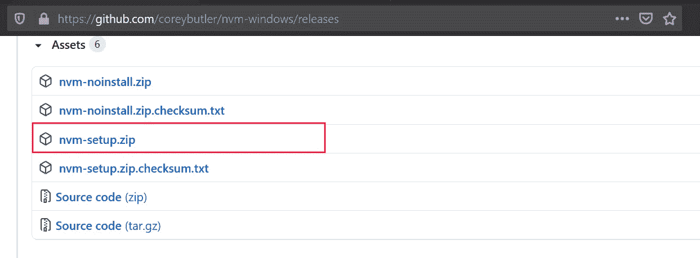
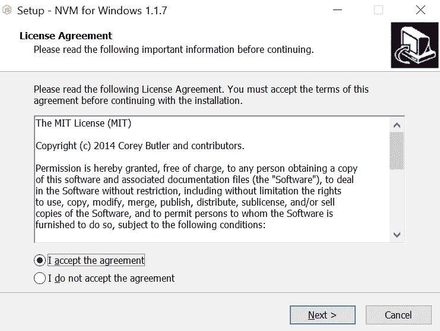
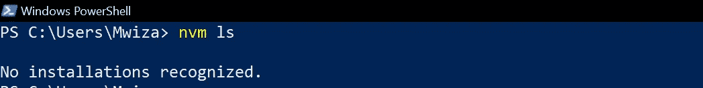
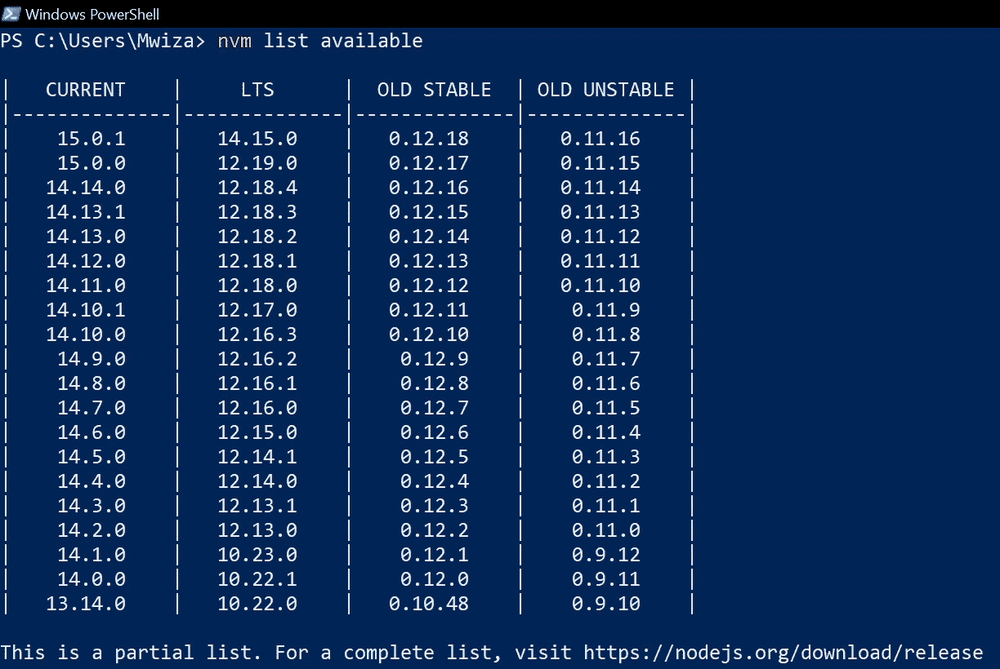

# 在 Windows PC 上安装 Node.js 的最佳方式

> 原文：<https://javascript.plainenglish.io/the-best-way-to-install-node-js-on-a-windows-pc-4481156bf63e?source=collection_archive---------6----------------------->

## 如何在一台 PC 上安装 Node.js 的多个版本


Photo by [Caspar Camille Rubin](https://unsplash.com/@casparrubin?utm_source=medium&utm_medium=referral) on [Unsplash](https://unsplash.com?utm_source=medium&utm_medium=referral)

本文是一个分步指南，介绍了使用节点版本管理器(通常称为 nvm)在 Windows PC 上安装 Node.js 的推荐方法。

Node.js 是一个流行的、开源的、跨平台的 JavaScript 运行时环境。它广泛用于前端和后端软件开发。

如果您是一名前端开发人员，那么您很有可能以某种方式使用过 Node.js。

# 背景

在 Windows PC 上安装 Node.js 的默认且最常见的方式是通过 Node.js 安装程序。通过这种方法安装 Node.js 允许您在计算机上一次只能安装一个版本的 Node.js。

但是，如果您正在处理几个项目，其中每个项目都需要不同版本的 Node.js 才能顺利运行，您该怎么办呢？

使用节点版本管理器，您可以根据您正在处理的不同项目的需要，安装多个版本的 Node.js 并在它们之间切换。

## 使用节点版本管理器的优势

使用节点版本管理器的一些优势包括:

*   允许您试验任何版本的 Node.js，而不会影响计算机上的其他项目
*   每当您想要安装新版本时，都不需要卸载旧版本的 node
*   能够管理和拥有独特的全球国家预防机制包📦

# 安装 nvm-windows

对于本指南，我将使用称为 ***nvm-windows*** 的节点版本管理器。我选择使用 nvm-windows 因为它有微软和谷歌的支持。

**注意:**如果你的机器上碰巧安装了 Node.js，那么现在就卸载它，避免冲突和混淆。还要确保删除这个位置`“C:\Program Files\nodejs”`上的 Node.js 安装相关文件。

nvm-windows 的最新安装程序可以在 coreybutler GitHub 账户[这里](https://github.com/coreybutler/nvm-windows/releases)找到。



1.  下载压缩文件夹***nvm-setup . zip***。

2.然后解压缩 zip 文件夹

3.从你提取的文件夹中双击【nvm-setup.exe】*。您将看到如下安装程序屏幕。*

*4.接受条款，然后单击“下一步”开始安装*

*5.在随后的屏幕提示中，只需使用默认设置来完成安装。*

**

# *运行中的节点版本管理器*

*一旦安装成功完成。继续操作，打开一个新的 PowerShell 终端，然后运行下面的命令列出当前安装的 Node.js 版本。*

```
*nvm ls*
```

*由于 Node.js 尚未安装，您将得到类似于下面的输出。*

**

## *显示可安装的软件包*

*通过运行下面的命令，可以很容易地找到可以安装的 Node.js 包。*

```
*nvm list available*
```

**

# *通过 nvm 安装 Node.js*

*要安装 Node.js 的最新版本，可以运行以下命令。**注意**:另外，节点版本管理器会为正在安装的 Node.js 安装相应的 npm 版本。*

```
*nvm install latest* 
```

*我们可以使用下面的命令安装另一个 Node.js 版本，例如上面列出的*版本 14.1.0* 。*

```
*nvm install 14.1.0*
```

*如果您现在运行`nvm ls`命令，您将获得已安装 Node.js 版本的列表。*

## *选择要使用的 Node.js 版本*

*要选择想要使用的 Node.js 的特定版本，可以运行下面的命令`nvm use <version-number>`。例如，要使用 14.0.1 版，您可以运行以下命令。*

```
*nvm use 14.1.0*
```

*在项目级别更改 Node.js 的版本。只需在项目文件夹的根目录下运行`node use` 命令。*

# *结论*

*在本指南中，我介绍了如何使用节点版本管理器在同一台机器上安装和管理几个版本的 Node.js。此外，我还强调了使用节点版本管理器安装 Node.js 的优势。*

****Nvm-windows*** 还附带了几个 CLI 命令，用于执行重要任务，如安装 Node.js 或在不同版本的 node . js 之间切换。*