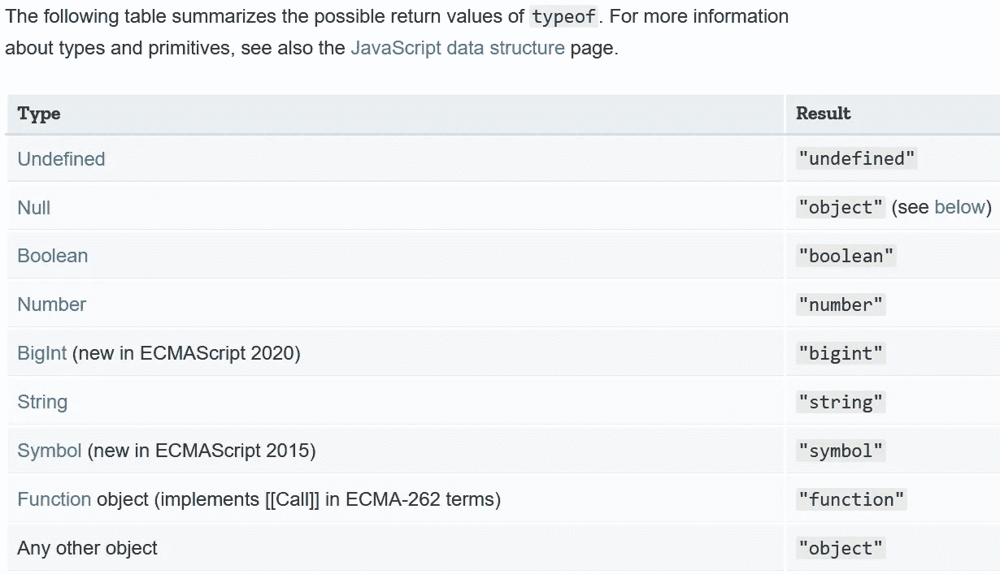

# 在普通 JS 中键入 Check 的最佳方式

> 原文：<https://javascript.plainenglish.io/the-best-way-to-type-check-in-vanilla-js-55197b4f45ec?source=collection_archive---------1----------------------->

## 在 JavaScript 中检查变量类型的最好方法不是`typeof`。以下是为什么使用`Object.prototype.toString.call()`的原因，以及如何将其别名化为自定义的`type_of`函数。


Photo by [Francesca Saraco](https://unsplash.com/@fransaraco?utm_source=medium&utm_medium=referral) on [Unsplash](https://unsplash.com?utm_source=medium&utm_medium=referral)

# 用 JavaScript 中的`typeof`进行类型检查

E 大家都知道`[typeof](https://developer.mozilla.org/en-US/docs/Web/JavaScript/Reference/Operators/typeof)` [关键字](https://developer.mozilla.org/en-US/docs/Web/JavaScript/Reference/Operators/typeof)有些问题，最明显的是`[typeof](https://medium.com/javascript-in-plain-english/how-to-check-for-null-in-javascript-dffab64d8ed5)` [返回](https://medium.com/javascript-in-plain-english/how-to-check-for-null-in-javascript-dffab64d8ed5) `["object"](https://medium.com/javascript-in-plain-english/how-to-check-for-null-in-javascript-dffab64d8ed5)` [为](https://medium.com/javascript-in-plain-english/how-to-check-for-null-in-javascript-dffab64d8ed5) `[null](https://medium.com/javascript-in-plain-english/how-to-check-for-null-in-javascript-dffab64d8ed5)`:



Source: [MDN Docs](https://developer.mozilla.org/en-US/docs/Web/JavaScript/Reference/Operators/typeof)

值得庆幸的是，有一个更好的解决方案可以使用 [vanilla JavaScript](https://snipcart.com/blog/learn-vanilla-javascript-before-using-js-frameworks#definition) ，尽管它有点拗口:`Object.prototype.toString.call()`。

注意，我所说的普通 JS 是指根本不使用任何外部库，只使用 ES5 ( [ECMAScript5](http://speakingjs.com/es5/ch25.html) )特性。

(网站[vanilla-js.com](http://vanilla-js.com/)会开玩笑地让你下载一个空的“香草 JS 库”文件——因为浏览器内置了香草 JavaScript。)

先说`Object.prototype.toString.call()`然后试着用一下。

# 为什么`Object.prototype.toString.call()`有效

EJavaScript 中的非常对象都有一个默认的`.toString()`方法，它依赖于`[Object](https://developer.mozilla.org/en-US/docs/Web/JavaScript/Reference/Global_Objects/Object#Object_instances_and_Object_prototype_object)` [原型](https://developer.mozilla.org/en-US/docs/Web/JavaScript/Reference/Global_Objects/Object#Object_instances_and_Object_prototype_object)(`[Object.prototype.toString()](https://developer.mozilla.org/en-US/docs/Web/JavaScript/Reference/Global_Objects/Object/toString)`方法)。

> **使用** `**toString()**` **来检测对象类**
> 
> `toString()`可以和每一个对象一起使用并允许你得到它的类。
> 
> 要对每个对象使用`Object.prototype.toString()`，您需要对其调用`[Function.prototype.call()](https://developer.mozilla.org/en-US/docs/Web/JavaScript/Reference/Global_Objects/Function/call)`或`[Function.prototype.apply()](https://developer.mozilla.org/en-US/docs/Web/JavaScript/Reference/Global_Objects/Function/apply)`，将您想要检查的对象作为第一个参数传递(称为`thisArg`)。 *—* [*MDN 文档*](https://developer.mozilla.org/en-US/docs/Web/JavaScript/Reference/Global_Objects/Object/toString#Using_toString_to_detect_object_class)

虽然默认的`.toString()`方法可以被覆盖，但是对象原型的版本返回一个字符串，第二个字是 type。

> 如果此方法未在自定义对象中重写，`toString()`将返回“`[object type]`”，其中`type`是对象类型— [MDN 文档](https://developer.mozilla.org/en-US/docs/Web/JavaScript/Reference/Global_Objects/Object/toString#Description)

通过使用`.call()`或`.apply()`，我们可以使用所有对象从`Object`原型继承的原始的`.toString()`方法。

这个原始的`Object.prototype.toString()`方法总是返回包含特定对象类型的字符串``object ${type}``，比如`[Date](https://developer.mozilla.org/en-US/docs/Web/JavaScript/Reference/Global_Objects/Date/Date)`。

接下来我使用`Object.prototype.toString.call()`和`typeof`进行比较。

# `Object.prototype.toString.call()` vs. `typeof`

对于 JavaScript 中的类型检查，U sing `Object.prototype.toString.call()`比`typeof`工作得多，因为它对于`null`工作得很好。

不仅如此，它还返回任何给定对象的特定类型:

# 创建一个`type_of`功能

G 鉴于用 JavaScript 写一个函数是多么容易，为`Object.prototype.toString.call()`做一个`type_of`函数也是超级容易的。

下面是这样做的一个示例，它只返回小写数据类型:

# 对象包装原语？没问题

将`[new](https://developer.mozilla.org/en-US/docs/Web/JavaScript/Reference/Operators/new)` [关键字](https://developer.mozilla.org/en-US/docs/Web/JavaScript/Reference/Operators/new)与 JavaScript 中的`[Number()](https://developer.mozilla.org/en-US/docs/Web/JavaScript/Reference/Global_Objects/Number)` [函数](https://developer.mozilla.org/en-US/docs/Web/JavaScript/Reference/Global_Objects/Number)之类的包装对象一起使用通常被认为是不好的做法。

这样做就创建了所谓的[一个对象包装的原语](https://www.tutorialspoint.com/how-to-get-the-primitive-value-of-string-in-javascript):一个实际上是对象的原语值(所以`typeof`返回`"object"`)。

我们不希望这样的原因是这些对象包装器是在幕后调用的，允许我们访问原语的属性。

一个例子是`"string".length`，其中[字符串](https://medium.com/javascript-in-plain-english/how-to-check-for-a-string-in-javascript-a16b196915ff) `["string"](https://medium.com/javascript-in-plain-english/how-to-check-for-a-string-in-javascript-a16b196915ff)`是一个原语，因此 JavaScript 解释器自动创建一个对象。

但是，如果需要，我们可以使用`Object.prototype.toString.call()`来检测代码中对象包装原语的真实类型(对象类):

将对象包装的原语转换回原语值的另一种方法是调用`.valueOf()`方法:

# 结论

它绝对是满嘴的。将此页面加入书签，以便您可以复制粘贴:`Object.prototype.toString.call().slice(8,-1).toLowerCase()`

希望你现在明白为什么`typeof`有点糟糕了——它为所有对象类型返回`"object"`,包括数组，也为`null`返回。

如果你不相信，或者你需要复习一下`typeof`，你可以看看我写的关于[如何在 JavaScript](https://medium.com/better-programming/how-to-check-data-types-in-javascript-using-typeof-424d0520a329) 中使用 `[typeof](https://medium.com/better-programming/how-to-check-data-types-in-javascript-using-typeof-424d0520a329)` [而不是在更好的编程中使用](https://medium.com/better-programming/how-to-check-data-types-in-javascript-using-typeof-424d0520a329):

[](https://medium.com/better-programming/how-to-check-data-types-in-javascript-using-typeof-424d0520a329) [## 如何使用 typeof 检查 JavaScript 中的数据类型

### 检查九个字符串之一:undefined、object (null)、boolean、number、bigint、string、symbol、function 或 object…

medium.com](https://medium.com/better-programming/how-to-check-data-types-in-javascript-using-typeof-424d0520a329) 

抱歉`typeof`，你的[与](https://2ality.com/2013/10/typeof-null.html) `[typeof null](https://2ality.com/2013/10/typeof-null.html)`的长期 bug 意味着在 JavaScript 中有更好的方式来输入 check:

我希望在你的代码中看到`type_of`！**快乐编码！**💻👩‍💻💯🥳

# 附言

[Slo Mo](https://medium.com/u/7ff73ef0ff02?source=post_page-----55197b4f45ec--------------------------------) 在回复这篇博文时指出有可能改变`Object.prototype.toString()`的默认行为。

> 这样用`toString()`不靠谱；对象可以通过定义一个`[Symbol.toStringTag](https://developer.mozilla.org/en-US/docs/Web/JavaScript/Reference/Global_Objects/Symbol/toStringTag)`属性来改变`Object.prototype.toString()`的行为，导致意想不到的结果。

这听起来似乎应该有更好的选择，但遗憾的是没有。在我关于 JavaScript 数组类型检查的文章[中，我深入研究了可选的类型检查，如](https://medium.com/javascript-in-plain-english/how-to-check-for-an-array-in-javascript-6ad20f7a0e21)`[instanceof](https://developer.mozilla.org/en-US/docs/Web/JavaScript/Reference/Operators/instanceof)`和`[.constructor](https://developer.mozilla.org/en-US/docs/Web/JavaScript/Reference/Classes/constructor)`:

[](https://medium.com/javascript-in-plain-english/how-to-check-for-an-array-in-javascript-6ad20f7a0e21) [## 如何在 JavaScript 中检查数组

### JavaScript 数组是一种对象类型，所以 typeof []返回“object”——对于查看您是否有数组没有太大帮助…

medium.com](https://medium.com/javascript-in-plain-english/how-to-check-for-an-array-in-javascript-6ad20f7a0e21) 

基本上`instanceof`在`[iframes](https://developer.mozilla.org/en-US/docs/Web/HTML/Element/iframe)`里是行不通的，`.constructor`可以直接在任何对象上覆盖。

比较`.constructor`和`Object.prototype.toString()`，我感觉我通过定义一个`Symbol.toStringTag`属性来破坏`Object.prototype.toString()`的可能性比重写`.constructor`要小。

如果您错误地将[的等号运算符](https://medium.com/better-programming/making-sense-of-vs-in-javascript-f9dbbc6352e3) ( `==`或`===`)改为[的赋值运算符](https://developer.mozilla.org/en-US/docs/Web/JavaScript/Reference/Operators/Assignment) ( `=`)，很容易意外覆盖`.constructor`:

```
if(object.constructor = "Date") {} // whoops!if(object.constructor === "Date") {} // correct
```

基于我广泛的研究，我还没有找到比`Object.prototype.toString()`更好的类型检查解决方案，尽管它有不可靠性。

综上所述，我认为我们都可以从更严格的类型检查系统中受益，比如 [TypeScript](https://www.typescriptlang.org/) 、 [Flow](https://flow.org/) ，或者仅仅是[VS 代码内置的 TypeScript 特性](https://code.visualstudio.com/docs/nodejs/working-with-javascript)。

# 进一步阅读

*   [Damian Cipolat](https://medium.com/u/4bd9ef570b9b?source=post_page-----55197b4f45ec--------------------------------) 结合`typeof`和`assert`在上检查类型[:](https://dev.to/damxipo/pure-dynamic-type-check-in-javascript-2l29)

[](https://dev.to/damxipo/pure-dynamic-type-check-in-javascript-2l29) [## javascript 中的纯动态类型检查

### 在本文中，我将展示仅使用 Javascript 进行动态类型检查的 3 种方法。什么是动态类型检查…

开发到](https://dev.to/damxipo/pure-dynamic-type-check-in-javascript-2l29) 

*   [Webbjocke 博客](https://webbjocke.com/javascript-check-data-types/)使用`typeof`搭配`instance_of`和`.constructor`:

[](https://webbjocke.com/javascript-check-data-types/) [## 如何更好地检查 javascript 中的数据类型— Webbjocke

### 检查 javascript 中的数据类型并不总是最容易的。语言本身提供了一个操作符…

webbjocke.com](https://webbjocke.com/javascript-check-data-types/) 

*   Ryland G 认为也许你应该在开发工具上使用 TypeScript:

[](https://dev.to/taillogs/practical-ways-to-write-better-javascript-26d4) [## 编写更好 JavaScript 的实用方法

### 提高你的 JS 的可靠方法。用 javascript 做标签，webdev，初学者，react。

开发到](https://dev.to/taillogs/practical-ways-to-write-better-javascript-26d4) 

*   [Fernando Doglio](https://medium.com/u/d55832d5b3b1?source=post_page-----55197b4f45ec--------------------------------) 对比[零碎的流程和打字稿](https://blog.bitsrc.io/static-type-checking-vs-dynamic-type-checking-in-javascript-13643f4952a9):

[](https://blog.bitsrc.io/static-type-checking-vs-dynamic-type-checking-in-javascript-13643f4952a9) [## JavaScript 中的静态类型检查与动态类型检查

### 您更喜欢在执行期间还是在捆绑期间(或之前的任何阶段)发现 bug

blog.bitsrc.io](https://blog.bitsrc.io/static-type-checking-vs-dynamic-type-checking-in-javascript-13643f4952a9) 

*   [Ryan Paul](http://seg.phault.net/about/) 在他的博客上解释说，你可以使用 VSCode 来突出显示类型脚本类型错误，而不需要实际上传你的 JavaScript [:](http://seg.phault.net/blog/2017/10/typescript-without-transpiling/)

[](http://seg.phault.net/blog/2017/10/typescript-without-transpiling/) [## 无需传输文件即可获得 TypeScript 的优势

### 编辑描述

seg.phault.net](http://seg.phault.net/blog/2017/10/typescript-without-transpiling/) 

*   [Martin Hochel](https://medium.com/u/b9e31d4262c1?source=post_page-----55197b4f45ec--------------------------------) 在他的中型博客上写了关于 vanilla JS [中的类型安全:](https://medium.com/@martin_hotell/build-100-type-safe-react-apps-in-vanilla-javascript-bd29a8364078)

[](https://medium.com/@martin_hotell/build-100-type-safe-react-apps-in-vanilla-javascript-bd29a8364078) [## 用普通 JavaScript 构建 100%类型安全的 React 应用程序

### 或者我们如何充分利用 TypeScript，而不必在我们的代码库中编写任何 TS，通过利用…

medium.co](https://medium.com/@martin_hotell/build-100-type-safe-react-apps-in-vanilla-javascript-bd29a8364078) 

Photo by [Francesca Saraco](https://unsplash.com/@fransaraco?utm_source=medium&utm_medium=referral) on [Unsplash](https://unsplash.com?utm_source=medium&utm_medium=referral)

德里克·奥斯汀博士是《职业规划:如何在 6 个月内成为成功的 6 位数程序员 的作者，该书现已在亚马逊上架。