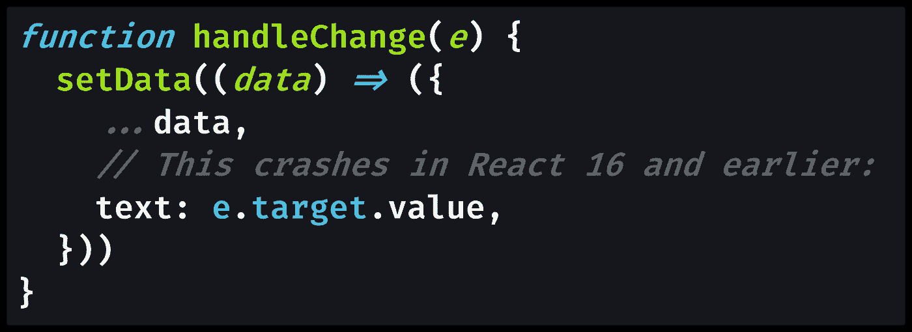

# React 17 中没有人谈论的最大变化

> 原文：<https://javascript.plainenglish.io/the-biggest-change-in-react-17-that-no-one-is-talking-about-b62905beb2d2?source=collection_archive---------9----------------------->

## 尽管 React 17“没有新功能”，但如果你是功能组件的粉丝，实际上有一个相当大的变化。**谁不是呢？😁**

Photo by [Markus Spiske](https://unsplash.com/@markusspiske?utm_source=medium&utm_medium=referral) on [Unsplash](https://unsplash.com?utm_source=medium&utm_medium=referral)

我喜欢函数组件和反应钩子。我第一篇关于 Medium [的文章用的是](https://blog.usejournal.com/2019-guide-how-to-use-react-hooks-to-create-a-toggle-switch-or-counter-dd9f5cd7062a?gi=bb38dbf9a29c) `[useState](https://blog.usejournal.com/2019-guide-how-to-use-react-hooks-to-create-a-toggle-switch-or-counter-dd9f5cd7062a?gi=bb38dbf9a29c)` [钩子](https://blog.usejournal.com/2019-guide-how-to-use-react-hooks-to-create-a-toggle-switch-or-counter-dd9f5cd7062a?gi=bb38dbf9a29c)，我还是觉得`useState`很棒。

我甚至不介意用我的大脑去缠绕`[useEffect](https://reactjs.org/docs/hooks-effect.html)`来装载数据。(当然，我们现在有了第三版的 React 查询[作为数据获取的`useEffect`的绝佳替代。)](https://react-query.tanstack.com/)

虽然有理由让你在 2021 年继续编写[类组件](https://reactjs.org/docs/react-component.html)和使用[生命周期方法](https://reactjs.org/docs/state-and-lifecycle.html#adding-lifecycle-methods-to-a-class)，但我不打算这么做。

由于我全身心投入到[函数组件](https://reactjs.org/docs/components-and-props.html)和 [React 钩子](https://reactjs.org/docs/hooks-intro.html)中，当我发现 React 17 中的一个重大变化将影响我编写的每个新组件时，我感到很惊讶。

你可能也错过了变化，因为 React 17 的标题是，我引用一下:“**没有新功能**”

> “React 17 版本不同寻常，因为它没有添加任何面向开发者的新功能。相反，这个版本主要集中在**上，使得升级 React 本身**更加容易。— [React 17 公告](https://reactjs.org/blog/2020/10/20/react-v17.html)由[丹·阿布拉莫夫](https://medium.com/u/a3a8af6addc1?source=post_page-----b62905beb2d2--------------------------------)和[雷切尔·纳伯斯](https://medium.com/u/231a32f99c21?source=post_page-----b62905beb2d2--------------------------------)发布

我甚至不是一个经常阅读发行说明的人。我更喜欢编写新的教程，以便与不断变化的几十种技术保持“同步”。写作让我专注于问题和用例，而不是被选择的悖论所淹没。

但是我很高兴我阅读了这些发行说明，因为这种变化与 React 如何在幕后工作的核心特性有关:由`import React from "react"`语句产生的 JSX 变换。

# 什么是 JSX 变换？

当您编写 [JSX 代码](https://reactjs.org/docs/introducing-jsx.html)(由 React 组件的`[render()](https://reactjs.org/docs/react-component.html#render)` [函数](https://reactjs.org/docs/react-component.html#render)返回的类似 HTML 的东西)时，React 会将代码翻译成函数调用。

具体来说，React 将 JSX 转换成对`[React.createElement()](https://reactjs.org/docs/react-without-jsx.html)`的函数调用。现在，在 React 17 中，JSX 变换已经更改为`[jsx()](https://reactjs.org/blog/2020/09/22/introducing-the-new-jsx-transform.html#whats-different-in-the-new-transform)`，而底层概念保持不变。

您实际上不需要改变任何东西来使用新的转换，但是当您从现在开始编写组件时，您可以选择做一些不同的事情。

对于函数组件，您可以通过不导入`"React"`在每个组件中节省一行代码。

在 React 17 之前，你必须在每个组件中提供对`React.createElement()`的访问，但是现在你不需要了。

# React 17 有什么新行为？

你可以在函数组件中完全删除`import`语句，但在类组件中不能。

> “[在 React 17 之前，] JSX 被编译成`React.createElement`，【所以】`React`需要在范围内如果你用 JSX 的话。[…]
> 
> 【现在我们的代码】**不再需要导入 React** 来使用 JSX 了！(但是我们仍然需要导入 React，以便使用 React 提供的钩子或其他导出。)”— [React 博客](https://reactjs.org/blog/2020/09/22/introducing-the-new-jsx-transform.html#whats-different-in-the-new-transform)作者[卢娜阮](https://twitter.com/lunaruan)

一个类组件仍然需要`import { Component } from "react"`，但是一个功能组件可能不需要导入任何东西。

当然，如果你正在使用 React 钩子，你仍然会导入它们:`import { useState, useEffect } from "react"`。

如果你已经厌倦了整天在 VS 代码中输入`imr` ( [代表`import React from "react"`的反应片段](https://marketplace.visualstudio.com/items?itemName=xabikos.ReactSnippets))，那么欢呼吧！

# 等等，还有其他好处吗？

在这一点上，你可能会认为我如此兴奋以至于可以从我的 React 代码中删除一个`[import](https://developer.mozilla.org/en-US/docs/Web/JavaScript/Reference/Statements/import)`语句是很可笑的。

但是，这难道不令人兴奋吗？毕竟，你每次都必须在每个单独的 React 组件中使用`import React from "react"`。

以下是 React 17 中新 JSX 变换的其他优势:

> “升级到新的转换是完全可选的，但它有几个好处:
> 
> 有了新的变换，你可以**使用 JSX 而不用导入 React** 。
> 
> 根据您的设置，它的编译输出可能会**稍微提高包的大小**。
> 
> T21 减少了你需要学习的概念数量，这将有助于未来的改进。”——[React 博客](https://reactjs.org/blog/2020/09/22/introducing-the-new-jsx-transform.html#whats-a-jsx-transform)

作为一名 JavaScript 教师，我期待着使用 JSX，而不要引入 React 和那些模糊的未来改进。

但是，即使您对这两种方式一点也不关心，甚至到了像以前一样继续导入 React 的程度，您至少可以为“稍微改进的包大小”而感到兴奋！

真是 ***略有改进*** ！加油！！！怎样才能让你兴奋起来？！？新功能？？？我说，他们被高估了。😂

> “我们已经**推迟了其他的变化**直到 React 17 之后。此版本的目标是实现逐步升级。如果升级到 React 17 太难，那就达不到它的目的。”— [React 17 公告](https://reactjs.org/blog/2020/10/20/react-v17.html)由[丹·阿布拉莫夫](https://medium.com/u/a3a8af6addc1?source=post_page-----b62905beb2d2--------------------------------)和[雷切尔·纳伯斯](https://medium.com/u/231a32f99c21?source=post_page-----b62905beb2d2--------------------------------)

# 潜在的突破性变化

不过，说真的，React 17 的另一个重大变化实际上相当不错:更好的事件委托。

> “在 React 17 中，React 将不再在引擎盖下的`document`级别附加事件处理程序。相反，它会将它们附加到根 DOM 容器中，React 树就呈现在这个容器中[…]
> 
> 在 React 16 和更早的版本中，React 会为大多数事件做`document.addEventListener()`。反应过来的 17 号将改叫`rootNode.addEventListener()`引擎盖下。“— [React 17 公告](https://reactjs.org/blog/2020/10/20/react-v17.html)由[丹·阿布拉莫夫](https://medium.com/u/a3a8af6addc1?source=post_page-----b62905beb2d2--------------------------------)和[雷切尔·纳伯斯](https://medium.com/u/231a32f99c21?source=post_page-----b62905beb2d2--------------------------------)

这里的要点是让 React 17 中的事件传播更接近常规 DOM。这是一个非常好的改变，因为它潜在地允许您在同一个页面上运行多个版本的 React (>React 17)，同时在需要时进行增量升级。

然而，丹和雷切尔反对渐进式改革。最好还是一次为你的应用升级 React 版本。

[React 17 的其他突破性变化](https://reactjs.org/blog/2020/08/10/react-v17-rc.html#other-breaking-changes)如下:

*   **与浏览器**保持一致——它们通过防止`onScroll`冒泡和[创建本机](https://blog.saeloun.com/2021/05/14/react-17-uses-browse-focusin-focusout-for-onfocus-onblur) `[focusin](https://blog.saeloun.com/2021/05/14/react-17-uses-browse-focusin-focusout-for-onfocus-onblur)` [和](https://blog.saeloun.com/2021/05/14/react-17-uses-browse-focusin-focusout-for-onfocus-onblur) `[focusout](https://blog.saeloun.com/2021/05/14/react-17-uses-browse-focusin-focusout-for-onfocus-onblur)` [事件](https://blog.saeloun.com/2021/05/14/react-17-uses-browse-focusin-focusout-for-onfocus-onblur)来与浏览器的工作方式保持一致。
*   [**无事件池**](https://blog.saeloun.com/2021/07/08/react-17-event-delagation) —他们移除了处理事件时常见的崩溃，就像在这个`handleChange`函数中:

Source: [https://reactjs.org/blog/2020/08/10/react-v17-rc.html#no-event-pooling](https://reactjs.org/blog/2020/08/10/react-v17-rc.html#no-event-pooling)

我亲眼目睹了这一事故，一直在挠头，所以我很高兴它被修复了。🙏

*   **效果清理定时**——你从`useEffect`返回的函数(如果有的话)就是它的清理函数。因为大多数效果不需要延迟屏幕更新，所以效果清理总是异步运行——在屏幕更新之后。这是现在普遍的行为。相比之下，`useLayoutEffect`钩子是阻止屏幕更新的同步替代物。([肯特·c·多兹](https://medium.com/u/db72389e89d8?source=post_page-----b62905beb2d2--------------------------------)最近在他的博客上写了两者的区别[。)](https://kentcdodds.com/blog/useeffect-vs-uselayouteffect/)
*   **返回未定义**的一致错误——从渲染函数返回`[undefined](https://medium.com/coding-at-dawn/how-to-check-for-undefined-in-javascript-bcedd62c8ad)`是一个错误。("`Nothing was returned from render.`")在 React 17 之前有时这不是错误，但现在它总是错误。
*   **原生组件栈** —组件栈现在从原生 JavaScript 栈生成，产生了一个新特性:**组件栈现在是可点击的**。换句话说，您可以使用本机浏览器堆栈框架像检查常规 JavaScript 错误一样检查组件。这是您一直想要的 React 的[源图，帮助您更好地调试组件。](https://en.wikipedia.org/wiki/Minification_(programming)#Source_mapping)
*   **移除私有导出**—React 原生 Web 项目中暴露的一些 React 内部构件已经被移除，对零个项目没有影响。

[发行说明](https://reactjs.org/blog/2020/08/10/react-v17-rc.html#removing-private-exports)以一个提示结尾，提醒您可以使用 [React 测试库](https://testing-library.com/docs/dom-testing-library/api-events)来触发原生浏览器事件。`**I 💘 Testing**`

**快乐编码！** **⚛** 👓💻💯🔥

德里克·奥斯汀博士是《职业规划:如何在 6 个月内成为成功的 6 位数程序员 一书的作者，该书现已在亚马逊上架。