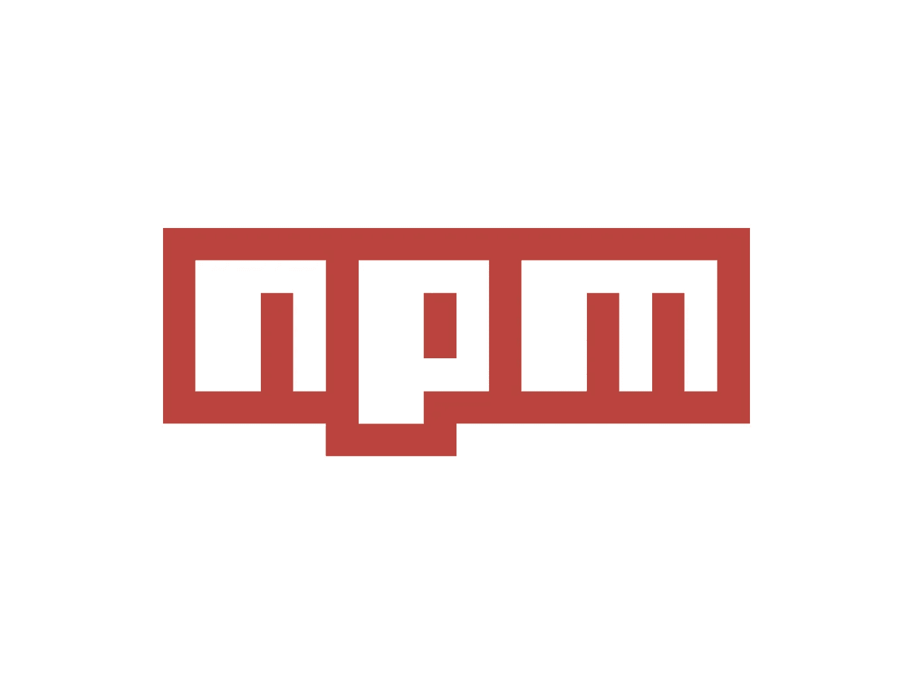

# NPM 最大的丑闻

> 原文：<https://javascript.plainenglish.io/the-biggest-scandals-of-npm-d739c11a2406?source=collection_archive---------2----------------------->

## JavaScript 世界中巨大的依赖树使得开发变得非常愉快。但有时它会淹没整个社区。



Source: the author

# 左图:互联网是如何被“破坏”的

Left-pad 是一个极其简单的 JavaScript 库，它本身只包含几行代码。

这个库的目的是从左边用空格填充一个字符串，为此，您将一个字符串传递到 **leftPad()** 函数中，然后是该字符串应该包含的字符数，包括原始内容+空格。

```
leftPad("foo", 5)
=> "  foo"leftPad("foo", 7)
=> "    foo"leftPad("foooo", 5)
=> "foooo"
```

至少这曾经是这个小而出名的库背后的好处——因为现在它被弃用了，因为有一个 JavaScript 自带函数。

但即使在 left-pad 具有巨大影响力的时候，它也引发了一场巨大的丑闻:2016 年 3 月 22 日，在与信使 Kik 发生商标纠纷后，图书馆的所有者从 NPM 撤下了他所有的 273 个包裹。

仅仅是为了抗议 NPM，他决定给信使 kik 他们自己的开源项目的包名“Kik ”,这实际上是来自 Azer Koç ulu 的许多包中的一个，他也发布了 left-pad。

由于 NPM 的这种行为，Koç ulu 非常沮丧，他从 NPM 带走了他所有的包裹，包括 left-pad。

但问题是，数以千计的其他 NPM 软件包都将-pad 作为不依赖项，所以当普通 JS 开发人员想要安装他们的 node_modules 时，它不起作用。左垫最终丢失，因此反应和巴贝尔，以及其他人，也瘫痪了。

# 事件流

因此，NPM 从之前的案例中了解到，你不能简单地删除一个现有的流行软件包，否则其他各种软件包也会受到影响。

但是如果你只是简单地把你自己的包的权利转让给别人会怎么样呢？这就把我们带到了下一个案例:**事件流**

当这个每周约有 200 万次下载的受欢迎的图书馆的实际所有者对它失去兴趣时，他通过邮件联系了一个名为“right9ctrl”的用户，并将其权利交给了他。

这位新主人所做的是添加了一个名为**平面图流**的依赖项。在官方的 [NPM 页面](https://www.npmjs.com/package/flatmap-stream)上仍然可以看到一些不太对劲的地方。

这种新的依赖关系包含恶意代码，当它被包含在比特币钱包 app [Copay](https://github.com/bitpay/copay) 的一个包中时，这些恶意代码就会变得活跃。恶意代码试图窃取钱包所有者的私钥，并将它们发送到攻击者的服务器。

这显然是一个 GitHub 用户发现的，他注意到了新的依赖性:[https://github.com/dominictarr/event-stream/issues/115](https://github.com/dominictarr/event-stream/issues/115)

现在，用户 right9ctrl 是否故意包含了 schad-dependency，或者只是偶然的，可能还不知道。

然而，这一案例应该给我们以思考。众所周知，由于 Node.js 环境，NPM 包可以轻松访问最终用户的文件系统、网络和更多内容。甚至 shell 命令也可以毫无问题地执行，正如我在[这篇文章](https://medium.com/javascript-in-plain-english/3-pretty-cool-built-in-node-js-modules-c2c3283276e6#712c)中所展示的。

问题是，在 NPM 世界，成百上千的依赖是很常见的。仅 event-stream 就有 1795 个依赖项，这意味着还有许多其他包使用 event-stream 本身。

另一个突出的例子， [**表达**](https://www.npmjs.com/package/express) **，**有 30 个从属关系。

# is-promise:有错误吗？

是的，有一个。

不久前，就在几周前，一行程序库应该得到更新，以使其能够作为 ES6 模块工作。但是这个新版本是错误的，并引起了一系列问题，巨大的软件包，甚至创建-反应-应用程序都受到了影响，正如我们在这里看到的。

在 GitHub 的几期上，出现了同样的 bug

```
Must use import to load ES Module
```

这一次也出现了愤怒的浪潮。

这个软件包的创建者写了一篇关于这个问题的“事后分析”,也可以在 JavaScript in Plain English——这个出版物中找到。此处链接:[https://medium . com/JavaScript-in-plain-English/is-promise-postal-mountain-cab 807 f18 DCC](https://medium.com/javascript-in-plain-english/is-promise-post-mortem-cab807f18dcc)

# 我们能从中学到什么

尽管像 NPM 这样的软件包管理员可以让我们愉快地完成很多工作，但他们也诱使我们把开发变得过于舒适。

有各种各样的软件包每周被下载数百万次，尽管它们通常只包含一行代码，或者更多。

包有问题甚至被滥用的危险可能永远不会被完全控制。但是最后还有一个建议:
特别是对于更大、更重要的项目，没有很多小的包可能会更好。一个可能的补救方法是在您自己的项目中实现包的代码，(包括简单的复制粘贴，是的)。

然而，这是获得安全性的唯一方法，但是当然也有更多的代码，你必须自己维护这些代码，而没有任何包所有者注意到他应该对他的代码进行合理的修改，这最终将使我们作为包用户受益。

因此，这里可能没有明确的解决方案。

## 来自简明英语团队的说明

你知道我们有四份出版物和一个 YouTube 频道吗？你可以在我们的主页 [**plainenglish.io**](https://plainenglish.io) 找到所有这些内容——关注我们的出版物并 [**订阅我们的 YouTube 频道**](https://www.youtube.com/channel/UCtipWUghju290NWcn8jhyAw) **来表达你的爱吧！**