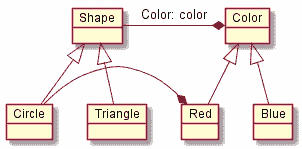

# 桥接模式——设计模式与前端相遇

> 原文：<https://javascript.plainenglish.io/the-bridge-pattern-design-patterns-meet-the-frontend-c2f09a009ab?source=collection_archive---------1----------------------->

桥梁设计模式是我最难以理解的设计模式之一。🤯*注意:本文假设了一些面向对象编程中接口的基础知识*

在本文中，我将解释这种模式是什么，如何使用它，并举例说明它目前在前端空间中的使用情况(psst Angular🚀).

我们将讨论几件事情:

*   这是什么？🤔
*   我们来分解一下😱
*   但是为什么呢？😐
*   在哪里可以找到它的作用？🚀
*   我还能在哪里使用它？🎉

# 这是什么？🤔

桥接模式可以被认为是继承复合论点的一部分。它本质上在抽象和实现之间“架起了一座桥梁”。这些术语可能会引起一些混乱，所以让我们来澄清一下。

*   实现——这是一个描述一组特定行为的接口，可以被我们代码库中的任何对象使用。它可以有多个符合接口中定义的契约的具体实现。
*   抽象——这个对象将提供一个利用底层实现的 API。它充当实现之上的一层，如果需要，可以通过继承进一步细化。

好吧，我很惊讶。🤯我知道，读起来可能有点吓人。

所以让我们快速看一下 UML 图(我知道，唉，但是它确实有帮助):

正如我们从图中看到的，模式允许我们分离两个接口，这两个接口可以定义一个对象的细节，在这种情况下是对象的形状类型和形状的颜色。

我们可以创建多种颜色，或者多种形状，而不用担心一种会影响另一种，因此增加了代码库中的松散耦合！🔥

# 我们来分解一下😱

记住上面的例子，抽象是我们的形状类，而我们的实现是颜色类。

抽象包含了通过类的属性对实现的引用(因此是继承之上的组合)，在我们的例子中，Shape 有一个颜色属性。任何实现颜色协定的类都可以由任何形状属性使用。

抽象的消费者不需要担心底层的实现，而模式本身也增加了抽象和实现之间的松散耦合。

如果你像我一样，看代码可以帮助你理清思路。让我们就这么做吧！

对于这些例子，我们将使用 TypeScript

厉害！我们可以创建任意多的`Colors`，或者任意多的`Shapes`，而不会影响任何一个。🚀🚀🚀

保持事物的简单和分离增加了我们代码的可维护性和可测试性，从而产生更好的代码！我们现在也可以很容易地扩展新的形状和颜色！

# 但是为什么呢？😐

让我们来看看为什么我们会使用这种模式的一些原因:

*   桥接模式将抽象和实现解耦，因此允许两者独立地不同。
*   它将抽象和实现保留在自己的继承层次中，允许它们在不影响对方的情况下增长。
*   抽象不需要知道具体的实现，因此它可以在运行时设置或交换，而不会破坏抽象。

太棒了，但是我能在哪里使用它？🤔

# 在哪里可以找到它的作用？🚀

好吧，桥的图案太棒了。它可以增加我们的松耦合，但是，我们*究竟在哪里*使用它呢？它在野外的什么地方被使用？

Angular 用它！*(非常感谢* [*韦斯·科普兰*](https://twitter.com/wescopeland_) *给我指出了这一点。)*

他们在自己的[表单](https://angular.io/api/forms) API 中使用它来弥合任何 [NgControl](https://angular.io/api/forms/NgControl) 和任何 [ControlValueAccessor](https://angular.io/api/forms/ControlValueAccessor) 之间的差距。

`ControlValueAccessor`是一个具有方法的接口，任何实现它的类都必须实现这些方法。Angular 提供了自己的`ControlValueAccessor`实现的具体实现，但是任何开发者都可以实现这个接口，任何`NgControl`都可以使用它！

换句话说，框架内的抽象完全可以接受 Angular 框架外的实现！🔥🔥

同样，开发人员可以创建自己的`NgControl`，Angular 提供的任何具体实现都可以使用它！💥💥

希望这可以帮助您理解桥模式背后的力量，但是如果您仍然需要自己的用例，请继续阅读！

# 我还能在哪里使用它？🚀

嗯，我发现在前端世界中，一个完美的例子是数据访问层。

您可以拥有以下内容:

*   定义实体服务的抽象，实体服务将处理与系统中的实体相关的逻辑。
*   一个定义 API 接口的实现，允许你与任何潜在的后端系统或 API 进行交互。

让我们快速看一下这一过程:

我们将从我们的实现(API 接口)开始:

接下来我们将定义我们的抽象(实体服务):

好了，我们已经建立了我们的抽象和实现。让我们把它们派上用场吧！

首先让我们创建一个用户服务来提炼我们的抽象。

现在我们有了一个精炼的抽象，让我们继续创建一个具体的实现

好了，现在让我们使用我们的具体实现和我们的精炼抽象:

厉害！我们的`UserService`不需要知道`IApiService`实现的细节，它仍然可以按预期执行。

如果以后需求改变，突然我们不能再使用`CustomApiService`了，会发生什么？😱

不用怕，桥型在这里！😍

简单地创建一个新的具体实现，并将其提供给`UserService`:

是不是很牛逼！🚀🚀🚀

希望你多学了一点(*？*)关于本文中的桥接模式，它的一个潜在用例，以及如何在 Angular 中使用它。

如有任何问题，欢迎在下方提问或在 Twitter 上联系我: [@FerryColum](https://twitter.com/FerryColum) 。

*原发布于 2019 年 12 月 4 日*[*https://dev . to*](https://dev.to/coly010/the-bridge-pattern-design-patterns-meet-the-frontend-46fc)*。*