# 用简单的英语描述画布 API 框架

> 原文：<https://javascript.plainenglish.io/the-canvas-in-plain-english-da6c95bb2bb5?source=collection_archive---------2----------------------->

## 和一个叫做 ZIM 的简单英语框架

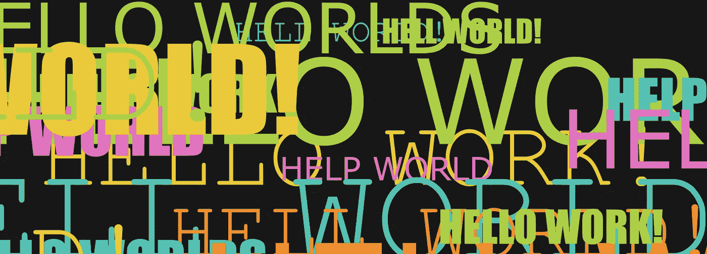

[Hello Worlds!](https://codepen.io/zimjs/pen/MWwzJwd)

任何使用单词 ***上下文*** 的代码都可以被简化。这意味着，canvas 作为一种用 JavaScript 以 HTML 制作游戏、艺术、应用程序、可视化等内容的开源方式，其最初的几行代码是一个粗略的开始:

```
var c = document.getElementById("myCanvas");
var ctx = c.getContext("2d");
ctx.beginPath();
ctx.arc(95, 50, 40, 0, 2 * Math.PI);
ctx.stroke();
```

*非常感谢 getContext("2d")*

可能使用画布的艺术家和设计师会回避这些词——我知道我做到了！还有，没人想用`document.getElementById()`来访问一个对象！这就是 jQuery 凭借其`$(selector)`变得如此受欢迎的主要原因。

# 画布框架

进入画布框架，让你的生活更轻松。另请参见◎ [选择 JavaScript 画布库或框架的指南](https://medium.com/@zim_67337/your-guide-to-selecting-a-javascript-canvas-library-or-framework-3584f4512a30)。

## p5js


[P5js port of Processing](https://p5js.org/)

[p5js 框架](https://p5js.org/)(最初在 Java 中的处理端口)提供了一个在开始时运行的 setup 函数和一个以帧速率循环的 draw 函数。在这种情况下，您可以将 circle 代码放入设置中。

```
function setup() {
  createCanvas(500, 500);
}function draw() {
  background(220);
  fill(204, 101, 192, 127);
  stroke(127, 63, 120);
  circle(100, 100, 50);
}
```

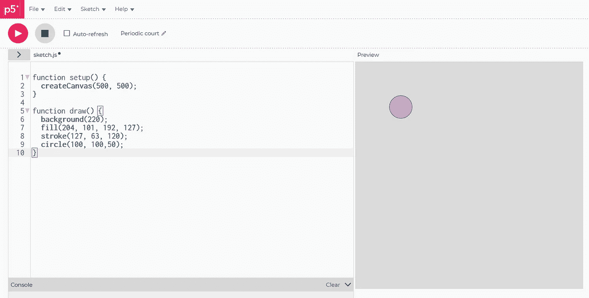

*这很简单* ***但是*** *它避免了传统的 JavaScript 事件结构。我喜欢 JavaScript 事件的多功能性——能够打开和关闭事物，从一个场景到另一个场景，等等。我们需要事件来处理组件和其他交互。P5js 的“草图”很好，但对于一般的交互媒体来说并不是最佳选择，请参见◎* [*《何时使用 JavaScript 画布库或框架指南》*](https://medium.com/@zim_67337/your-guide-to-when-to-use-a-javascript-canvas-library-or-framework-efb30d526797) *。*

## 齐姆

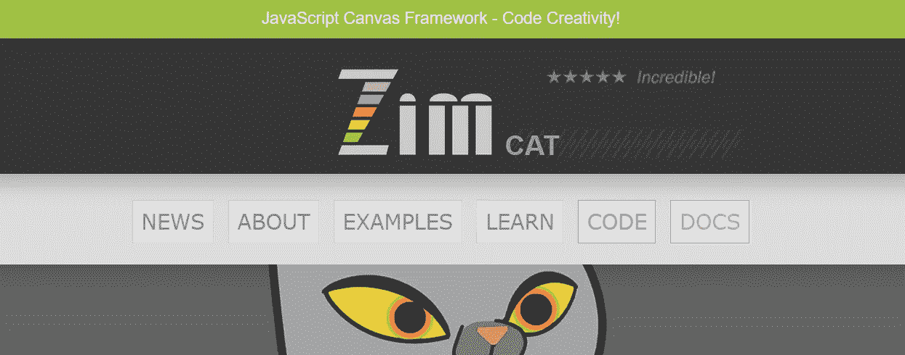

[ZIM JavaScript Canvas Framework](https://zimjs.com)

通过 [ZIM JavaScript Canvas 框架](https://zimjs.com)，保持了传统的 JavaScript 事件结构，但做了如下调整:

*addEventListener()已替换为 on()*

```
const frame = new Frame("fit", 500, 500, light);
frame.on("ready", app);function app() {
    const stage = frame.stage;
    new Circle(50, pink, purple).loc(100,100);  
    stage.update();
}
```

*“适合”将缩放画布以适合浏览器窗口。可以使用 ZIM 或传统 HTML 颜色字符串和十六进制颜色中的浅色、粉色和紫色样本颜色。我们可以为事件函数使用函数文字或箭头函数。舞台是我们展示东西的地方。loc()方法将自动添加到 stage 中，但是可以选择任何容器作为下一个参数。手动添加 stage.update()有助于节省移动设备上的电池，只要有需要绘制的更改，就应该调用它。如果我们需要一个绘制循环，我们使用 JavaScript* `*requestAnimationFrame()*` *。*

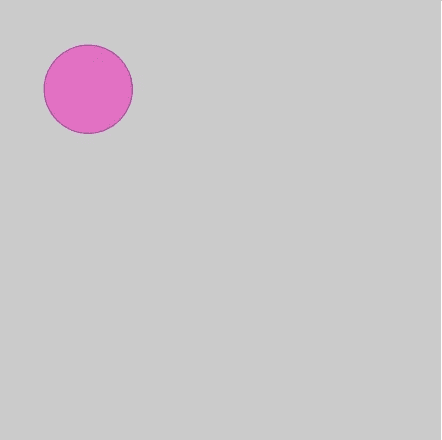

# 方便

ZIM 提供了许多便利，让从孩子到专业人士的每个人都能更容易地编写代码。更多详情，请参见[在画布上编码的便利指南](https://medium.com/@zim_67337/conveniences-when-coding-on-the-canvas-f6b0b8dd981d)。

从“简单英语”的角度来看，让我们谈谈 ZIM 版本 2 中推出的 ZIM DUO，它是一种我们可以使用传统格式的参数或作为单个参数的方法，单个参数是具有与参数名称匹配的属性的对象文字{ }。

这称为配置对象。

下面是上面使用配置对象的代码示例:

```
const frame = new Frame({
  scaling:"fit", 
  width:500, 
  height:500, 
  color:light
});
frame.on("ready", app);function app() {
    const stage = frame.stage; new Circle({radius:50, color:pink, borderColor:purple})
        .loc(100,100);

    stage.update();
}
```

现在，很容易看出参数是什么。由您决定用哪种方式提供参数。有时看到参数是好的，但有时这意味着更多的代码。在其他时候，配置对象的代码更少。例如:

```
new Rectangle(null,null,red,null,null,20).center();
// a corner of 20
new Rectangle({color:red, corner:20}).center();
```

我们需要把`null`(或者`undefined`)作为参数占位符。对于传统的参数，我们必须跟踪有多少个空值以及以什么顺序放置参数，而对于配置对象，顺序并不重要。组件和其他方法通常有许多参数，所以 ZIM 多是非常方便的。

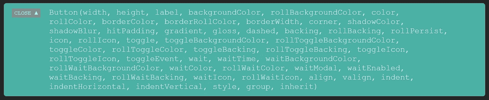

[ZIM Docs](https://zimjs.com/docs.html?item=Button) showing parameters for Button

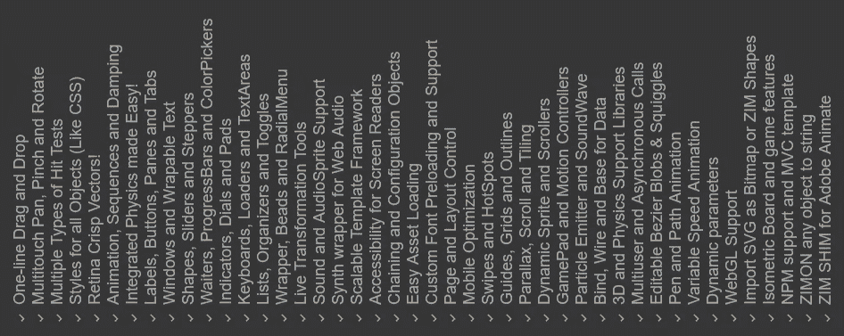

A sideways glance at further canvas conveniences

# 让我们编码

让我们一起做一点编码。更完整的介绍可以在◎ [你在画布上编码创造力的指南](https://medium.com/@zim_67337/your-guide-to-coding-creativity-on-the-canvas-ada0996298f6)中找到。

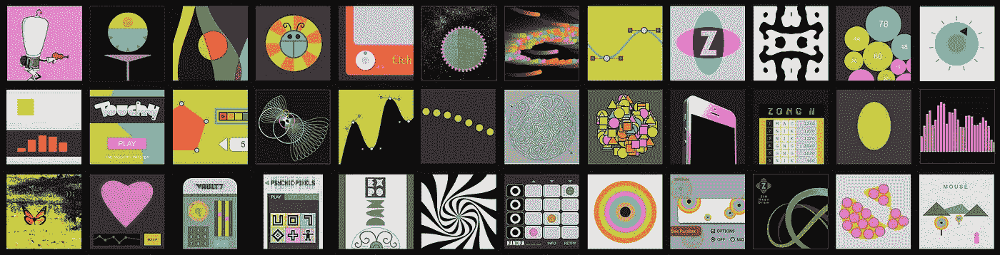

◎ [Your Guide to Coding Creativity on the Canvas](https://medium.com/@zim_67337/your-guide-to-coding-creativity-on-the-canvas-ada0996298f6)

## 第一步

我们有一个针对 ZIM 孩子的在线编辑器，当我们尝试新事物时，重新像孩子一样思考并不是一件坏事。请和我们一起探索。如果你去[在线编辑器](https://zimjs.org/kids/slate.html) [，](https://zimjs.org/kids/slate.html)键入或粘贴这段代码并按下 TEST，你会从这篇文章中得到更多:

```
new Rectangle(200,300,white)
    .center()
    .drag();
```

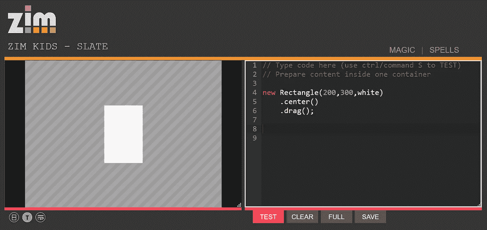

背景中的条纹只是儿童网站的背景。默认情况下，编辑器中还有框架代码和 stage.update()。请注意，我们使用链接，这允许我们在每个方法返回对象时将方法串在一起。这是 ZIM 的一个便利特性，特别是添加了短链方法，我们将在下面看到。

## 第二步

让我们假设矩形是一张我们希望能够扔进垃圾桶的纸。将代码调整为以下内容。注意短链接方法`sca()`用于缩放，`rot()`用于旋转，`pos()`用于位置。这些也可以设置为属性，如`scaleX`、`scaleY`、`rotation`、`x`和`y`，但是短链接方法非常方便！例如，如果我们接下来不需要引用这些对象，我们甚至不必将它们赋给变量。

```
const paper = new Rectangle(200,300,white)
    .center()
    .drag();

const trash = new Flare({thickness:100})
    .sca(.7)
    .rot(-90)
    .pos(50,50,RIGHT,BOTTOM); 
```

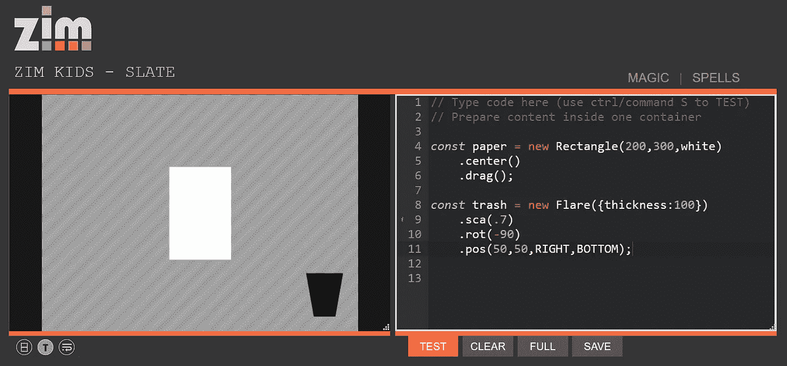

耀斑是 ZIM 独有的一种不寻常的形状，它让你可以做出像这个垃圾桶一样向外耀斑的形状。这没什么大不了的，但是下图中的形状是用火焰做成的。

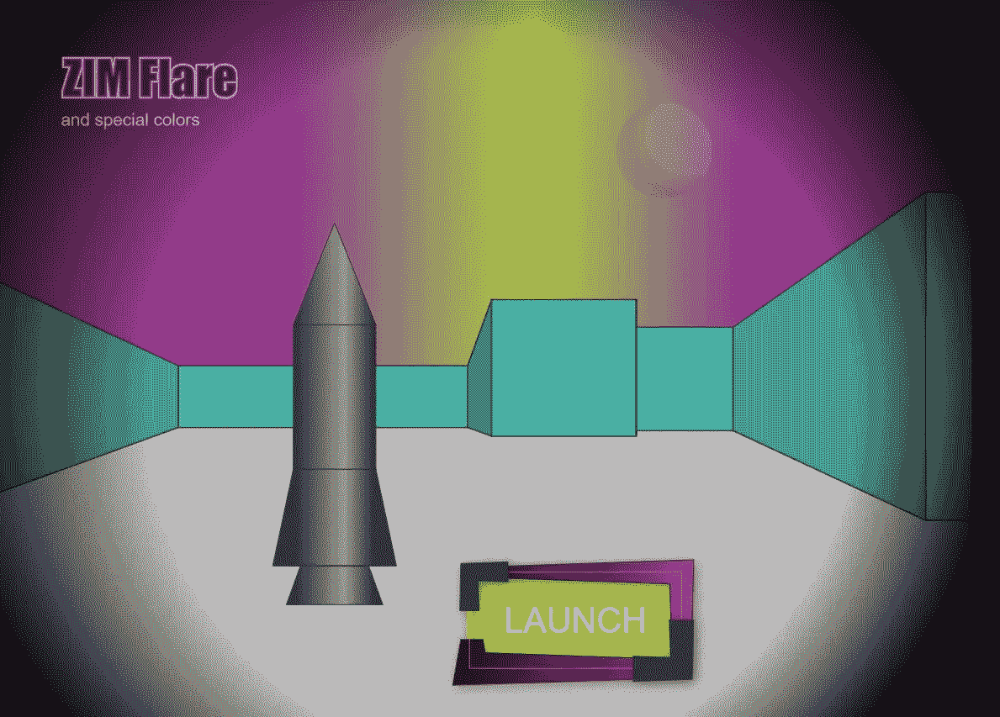

[ZIM Flare shape](https://zimjs.com/ten/flare.html)

## 第三步

我们需要弄清楚我们是否把纸扔进了垃圾桶，如果是，就把纸扔掉。我们将在`pressup`事件中测试这一点。添加以下代码。这次我们使用一个箭头函数来指定事件发生时要调用的函数。移除纸张后，请注意 stage.update()。

```
paper.on("pressup", ()=>{
    if (paper.hitTestBounds(trash)) {
        paper.removeFrom();
        stage.update();
    }   
});
```

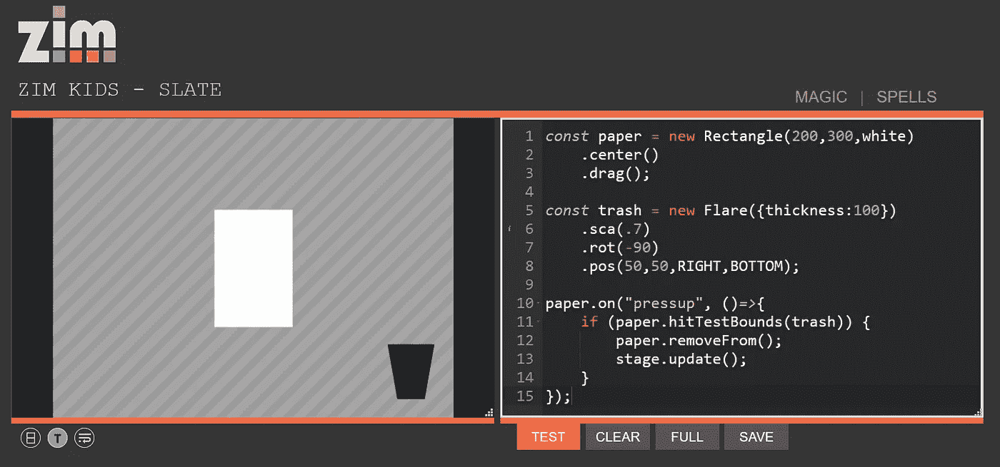

## 第四步

让我们在移除纸张时添加一个发射器。发射器对于奖励和效果来说很棒。添加暂停启动的发射器代码，然后我们在扔出纸时喷射发射器(我们不再需要 stage.update()，因为发射器为我们做了这些):

```
const emitter = new Emitter({startPaused:true});paper.on("pressup", ()=>{
    if (paper.hitTestBounds(trash)) {
        paper.removeFrom();
        emitter.loc(paper).spurt(15);
    }   
});
```

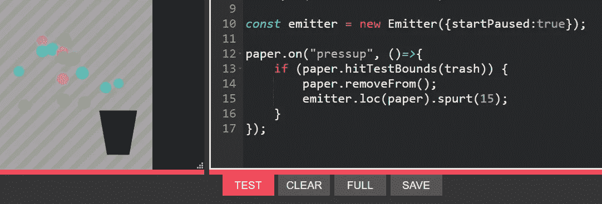

发射器位于纸张的注册点。

*配准点是对象中对象被定位的地方。它也是对象缩放和旋转的点。*

让我们通过代码调整来演示注册点:

```
new Grid({percent:false});const paper = new Rectangle(200,300,white)
    .loc(300,300)
    .outline()
    .drag();
```

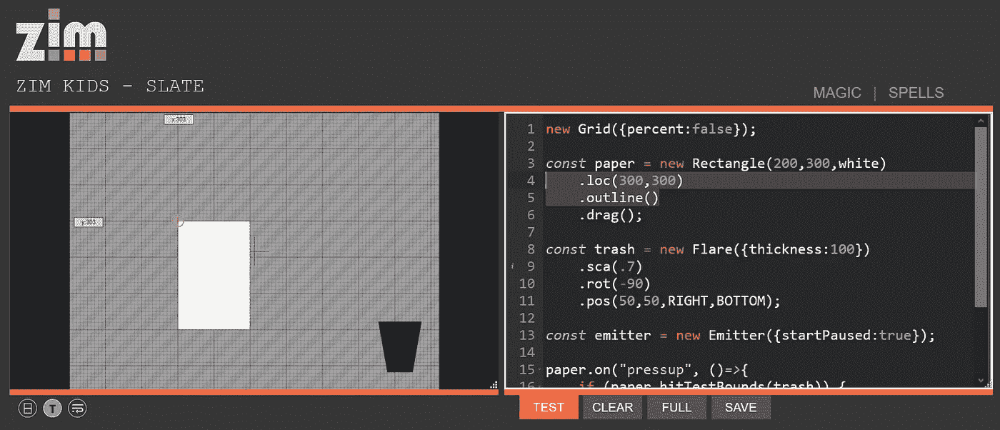

纸的左上角有一个红色的圆。这意味着注册点位于矩形和矩形对象(如按钮和图片)的左上角。(注册点位于圆形对象(如圆形和表盘)的中心。)纸张位于 300，300，这意味着对象被放置，因此其配准点位于 300，300。

让我们去掉网格，看看旋转矩形会发生什么:

```
const paper = new Rectangle(200,300,white)
    .loc(300,300)
    .outline()
    .rot(45)
    .drag();
```

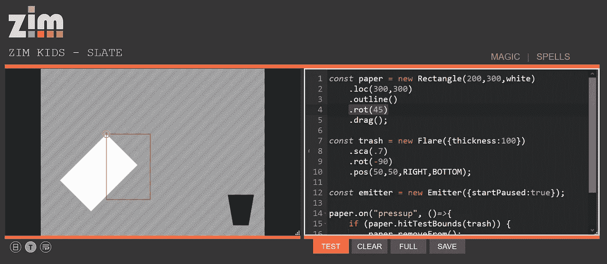

纸张围绕其注册点旋转。(Scale 的工作原理是一样的。)大纲()就像是时间的快照。它停留在制造时的位置。如果在旋转后绘制轮廓，那么轮廓将随矩形一起旋转。

我们可以使用 regX 和 regY 属性或 reg(x，y)短链方法来更改注册点，但是我们经常希望将注册点放在中心，所以我们可以只使用 centerReg()。试试这个:

```
const paper = new Rectangle(200,300,white)
    .centerReg()
    .loc(300,300)
    .outline()
    .rot(45)
    .drag();
```

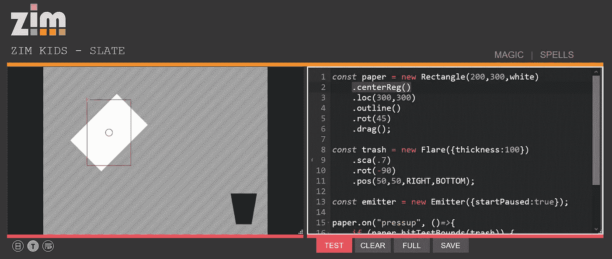

红色的圆圈现在在矩形的中间。纸张围绕其中心旋转，这通常更适合动画。纸张已经向左上方移动，因为在对象内部调整了注册点。报名点还在 300，300。

## 第五步

如果我们想让发射器出现在纸的中心，那么我们只需要`centerReg()`纸，而不是`center()`纸。调整代码。现在，当你扔掉纸的时候，发射器就在纸的中心。

```
const paper = new Rectangle(200,300,white)
    .centerReg()
    .drag();
```

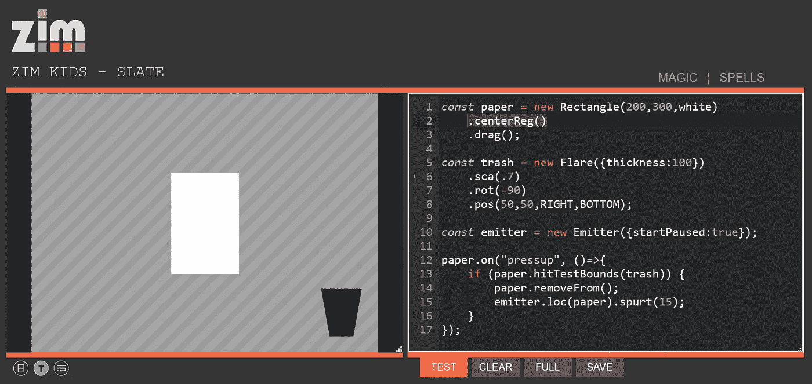

## 第六步

作为最后一步，如果纸没有被扔掉，我们将动画纸回到中心。调整 pressup 事件函数中的代码。以下是最终代码:

```
const paper = new Rectangle(200,300,white)
    .centerReg()
    .drag();

const trash = new Flare({thickness:100})
    .sca(.7)
    .rot(-90)
    .pos(50,50,RIGHT,BOTTOM);

const emitter = new Emitter({startPaused:true});paper.on("pressup", ()=>{
    if (paper.hitTestBounds(trash)) {
        paper.removeFrom();
        emitter.loc(paper).spurt(15);
    } else {
        paper.animate({
            props:{x:stageW/2, y:stageH/2, rotation:"360"},
            time:.5
        });
    } 
});
```

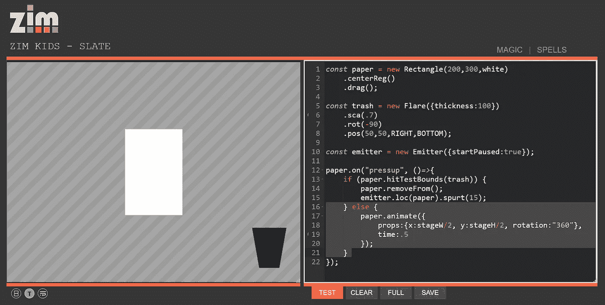

旋转用引号括起来，因为它是相对旋转。所以从当前旋转 360 度。如果我们使用 360 度，第一次它会动画到 360 度，但是第二次，它已经是 360 度了。

# 动画

在这个介绍 ZIM 的视频的最后，我们开始展示 ZIM 与其他框架的比较。ZIM 一直是美国的一半或更大。原因是我们尽可能努力使用简单的英语。

例如，这是动画:

```
new Circle(50,red).center().animate({
    props:{x:100, y:100, scale:0},
    time:1,
    loop:true,
    rewind:true
});
```

在 HTML 和 CSS 中这是一团糟。首先，没有圆形，所以您必须对 div 应用边框半径。呃。然后，您将在关键帧的单独位置应用变换，这不包括旧的浏览器修复。基本上，ZIM 是动画代码大小的 25%和 38%。

```
<style>
    #circle {
        width:100px;
        height:100px;
        border-radius:50px;
        position:absolute;
        left:300px;
        top:300px;
        background-color:red;
        animation-name: myCircle;
        animation-duration: 1s;
        animation-iteration-count: infinite;
        animation-direction: alternate;
    }
    [@keyframes](http://twitter.com/keyframes) myCircle {
        to {left:100px; top: 100px; transform:scale(0, 0);}
    }
</style>
<div id=circle></div>
```

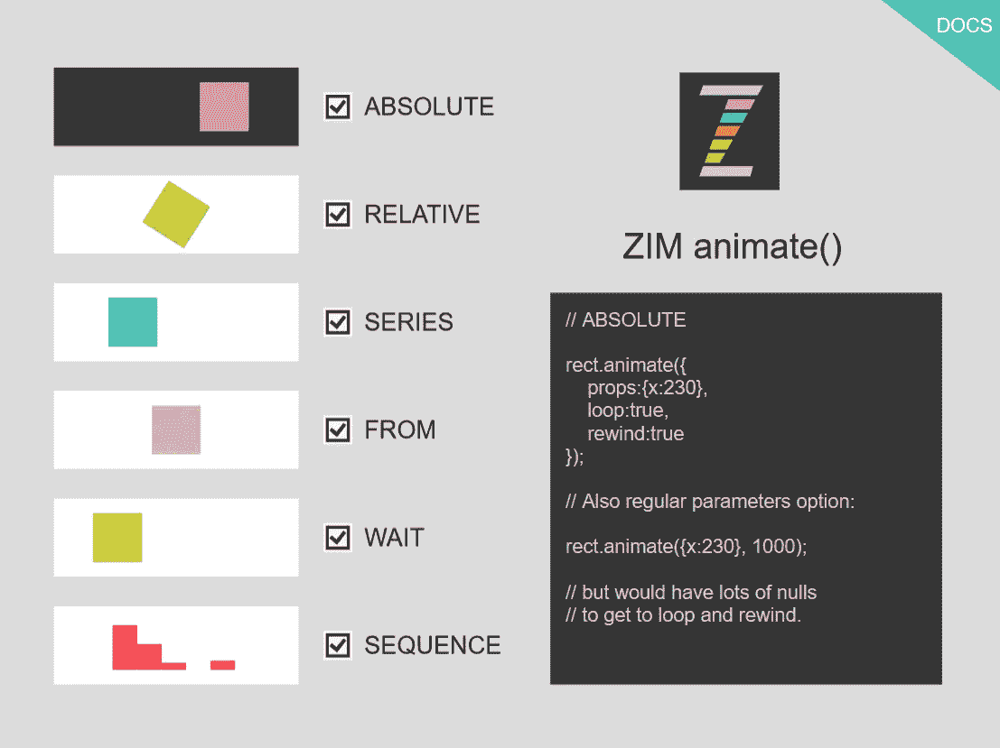

[ZIM animate()basic settings](https://zimjs.com/animation/)

当然，你可以使用 GSAP，这是一个很好的 Tween 引擎。ZIM 和 GSAP 有非常相似的动画特征。GSAP 被非最佳补间对象链接。在大多数情况下，链接到正在制作动画的对象更容易，因为我们可以展平动画命令，以便与 ZIM 二人组技术配合使用。如果需要的话，ZIM 也可以通过拖动路径来制作动画，并且路径是用户可编辑的。参见 [ZIM 简介](https://zimjs.com/intro.html)中的例子。和 [ZIM NIO](https://zimjs.com/nio/) (第 9 版)站点，以获取高级示例。

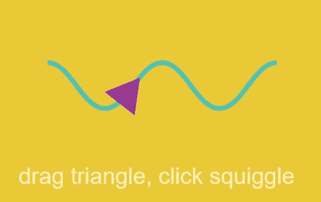

[ZIM Intro](https://zimjs.com/intro.html) animate along a user editable path

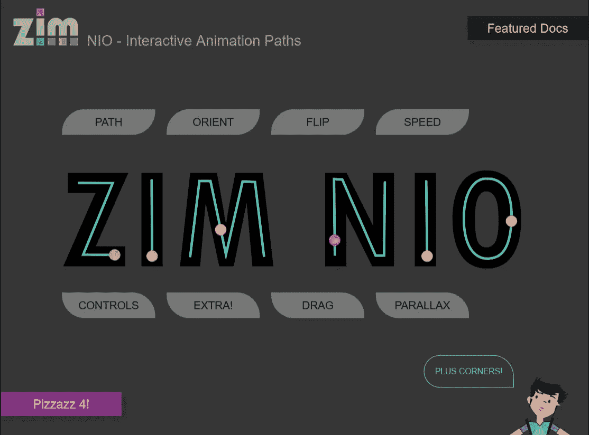

[ZIM NIO](https://zimjs.com/nio/) site for advanced path animations

# 结论

我们已经在本文中演示了简单明了的单词可以在代码中使用。这使得画布上的编码也成为学习代码的好地方。以下是一些进一步的资源:[ZIM·斯库尔](https://zimjs.org/skool)、 [ZIM 的孩子](https://zimjs.org/kids)和[用创造性编码编写 JavaScript】视频系列。](https://zimjs.org/learnjavascript.html)

其他人同意简单、清晰的代码是正确的做法:

*用这么少的代码创造美丽的互动从未如此容易过—* Iestyn Jones，eChalk 电子学习的创始人。

*ZIM 让创建非常视觉化的项目变得容易，但仍然保留了可转移技能的传统编码结构——*Rex van der Spuy，HTML5 和 JavaScript 基础游戏设计的作者

*当我向开发者 ZIM 展示时，他们说他们从未发现过如此简单易学和易于使用的平台*——在 ZIM 游戏上有超过 200 万次播放的 Ami 韩亚 CloseAppGame。

如果你想探索更多关于在画布上编码的知识，欢迎访问◎ [你的在画布上编码创意指南](https://medium.com/@zim_67337/your-guide-to-coding-creativity-on-the-canvas-ada0996298f6)。

万事如意！抽象博士。

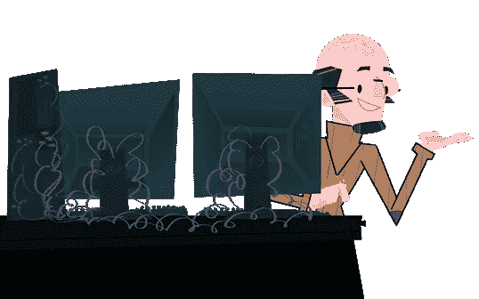

*在推特上关注我们在* [*ZIM 学习*](https://twitter.com/zimlearn) *这里是* [*ZIM 在 YouTube 上学习*](https://www.youtube.com/zimlearn) *！*