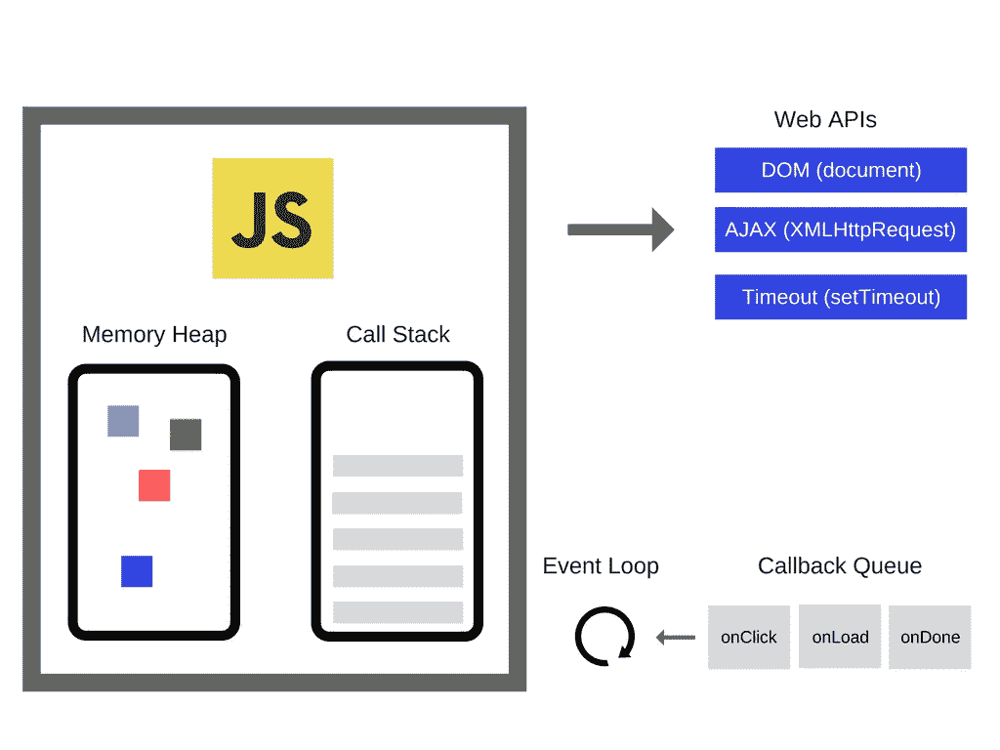
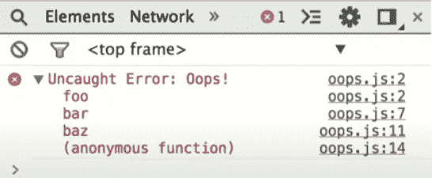

# 运行 JavaScript 代码的代码

> 原文：<https://javascript.plainenglish.io/the-code-that-runs-your-javascript-code-eec24d05dfde?source=collection_archive---------9----------------------->

## 什么是 JavaScript 运行时环境，作为一名 web 开发人员，您如何将它的知识应用到您的工作中？

您多久考虑一次代码运行的环境，以及代码运行时可用的资源？理解“运行时”环境可以帮助我们作为 JavaScript 开发人员在编写代码时做出更好的选择。

当你在你选择的编辑器中打开一个脚本，你跳进你的终端并输入`node test.js`时，到底发生了什么来允许你的代码执行？运行时环境在一瞬间为您旋转起来，它主要由“V8 引擎”和几个称为“JavaScript 运行时”的附加结构定义。它应用了 20 年来世界上最优秀的工程师的集体智慧，找到绝对最有效的方法来运行您的微不足道的小脚本，最终在您的 REPL 循环中记录“hello world”。



# 同步执行(复杂性级别 1)

为了开始检查上面的图像，让我们首先看一个非常简单的例子，其中您的脚本只包含同步函数调用。在这种情况下，您的脚本将只与 V8 引擎的调用堆栈和堆接口。现在，您可以忽略图表右侧的所有信息。

堆负责保存你在脚本中定义的函数和变量的状态，在下面的代码示例中我*将会忽略它*这样我就可以更好地关注异步编程和事件循环的话题。

所以让我们看看下面的脚本:

```
const bar = (arg) => { return arg }
const foo = (arg) => { return bar(arg) }
foo('function call')
```

运行时要做的第一件事是将 JS 源代码分解成可执行的子程序块，称为堆栈帧。堆栈帧是 CS 中常用的一个概念。考虑堆栈框架的最简单方法如下:

> 每个堆栈帧对应于一个尚未因返回而终止的函数或过程调用。对于每个函数调用，都会创建一个包含`function`的参数和局部变量的框架。[信用](https://www.cs.cmu.edu/~adamchik/15-121/lectures/Stacks%20and%20Queues/Stacks%20and%20Queues.html)

上面的脚本将生成 2 个独立的堆栈帧，第一个包含 foo 的参数和局部变量。当 foo 调用 bar 时，用 bar 的参数和局部变量创建第二个框架。这里的局部变量包括函数栏。当 bar 返回时，堆栈帧从堆栈中弹出，foo 帧将返回，最终清空堆栈。调用堆栈是一个 LIFO 数据结构，这意味着添加到堆栈中的最后一个框架将是第一个被执行的。

环境将堆栈帧一个接一个地输入 V8 引擎进行执行，V8 引擎随后执行这些堆栈帧，或者将它们交给运行时可用的其他 API。

## 单线程执行

您可能已经听说过，在 V8 JavaScript 运行时环境中只有一个堆栈。这意味着，从根本上说，JS 引擎一次只会运行一个堆栈帧。

当你展开你的程序时，你可以看到一个非常单一的堆栈跟踪，它实际上是当你展开你的代码时调用堆栈状态的冻结帧，在错误被捕获时调用堆栈的样子。



术语“吹栈”是一个不同类型的异常的术语，当调用栈变得如此之大，以至于运行时给你这个消息(比如，如果你递归地调用一个函数)。


这使我们进入了下一个复杂层次，即运行时中允许“非阻塞 IO”或编写代码以允许栈尽可能快地被清空或自由执行的范例。

# 异步/非阻塞执行(复杂性级别 2)

当我们开始思考我们正在编写的 JS 代码时，很明显，我们的 JS 运行时用例比我上面给出的愚蠢的脚本例子要复杂得多。您可能有按钮的 clickhandlers、在用户交互过程中向服务器动态运行的数据请求，或者执行一些处理器密集型任务，如文件 IO。JS 运行时处理这些更加频繁和一致的代码执行的方式是通过两个新的构造，即[事件循环](https://www.youtube.com/watch?v=cCOL7MC4Pl0&vl=en)和事件队列。

为了检查调用堆栈，让我们看下面的例子:

这个脚本将遵循与前面的同步脚本示例不同的路径。它将利用浏览器运行时中的其他构造来帮助确保程序能够以“非阻塞”的方式运行，或者换句话说，释放堆栈以允许程序继续执行功能。在这种情况下，我们将采取以下路径来执行:

1.  在任何东西移入堆栈之前，`immediateExecution`将被保存在堆中以备后用
2.  函数`ajax`将被推到调用堆栈的顶部
3.  然后函数`ajax`将执行，调用 http Web API(本质上是一个由浏览器定义的函数——完整列表可以在这里找到)
4.  web API 在回调队列中注册一个回调函数，当从`[https://example.com/api](https://example.com/api)`返回数据时，该函数将运行。
5.  然后从调用堆栈中移除该函数，清除堆栈以便执行其他重要的函数
6.  函数`immediateExecution`将被添加到调用堆栈中，并将运行，大约 500 毫秒后返回“1000000”
7.  回调队列中的 HTTP 请求 API 完成
8.  事件循环将回调函数拉回调用堆栈
9.  ajax 调用中的匿名函数运行，控制台记录`response`变量

如上所述，Ajax 函数和其他 http 请求被设计为异步运行。如果我们同步运行同一个脚本，那么我们会延迟 immediateExecution 的运行并阻塞主线程。进行以下编辑:

credit: [https://blog.sessionstack.com/how-javascript-works-event-loop-and-the-rise-of-async-programming-5-ways-to-better-coding-with-2f077c4438b5](https://blog.sessionstack.com/how-javascript-works-event-loop-and-the-rise-of-async-programming-5-ways-to-better-coding-with-2f077c4438b5)

上面的代码告诉环境将 AJAX 请求保留在主线程上，这将暂停代码执行，直到 500–1000 毫秒后返回。只有这样，immediateExecution 函数才能开始执行。

让我们来看一个有趣的动态 GIF 示例，它来自 Alexander Zlatkov 的优秀文章[,用来帮助演示异步执行。](https://blog.sessionstack.com/how-javascript-works-event-loop-and-the-rise-of-async-programming-5-ways-to-better-coding-with-2f077c4438b5)

给定以下代码块:

环境状态将经历以下 16 种状态:


从这个例子中，您可以非常清楚地看到 Web APIs 和回调队列是如何协同工作来高效地在队列中移动代码的。当您向队列中添加更多回调时，有一个可预测的方法在单线程上执行它们。

*注意:Node.js 提供了一个非常不同的运行时环境，尽管它也是由 Google Chrome 的 V8 JS 引擎支持的。Node.js 不会为您提供 DOM 树、AJAX 或其他 Web API。然而，Node.js 与这些 API 有类似的范例。Node.js APIs 定义* [*此处*](https://nodejs.org/docs/latest/api/) *。*

# 事件循环的逻辑(复杂性等级 3)

我上面画的图片是环境的简化版本，特别是当它涉及到事件循环时，这是 Web 开发人员环境中最重要的组件之一。

我在上面省略的主要组件是**渲染周期**，它在堆栈上执行的堆栈帧之间定期运行，以重新绘制应用程序的 UI，以及**微任务和宏任务**之间的差异，它们由事件循环周期在稍微不同的时间注入到调用堆栈中。我希望在接下来的帖子中写下这些概念，但是如果你好奇，我已经链接了一些我最喜欢的关于这些主题的资源。

# 编写运行时环境感知的 JavaScript

编写针对 JS 运行时优化的代码没有单一的规则，我不认为任何有真正老板的人有时间钻研并完全优化他们的代码。当你写代码时，你能做的是记住下面的一些基本概念。

## 非阻塞 IO

对于常规大小的操作，尽可能使用非阻塞函数和操作。这包括请求外部资源时的承诺或其他异步事件处理程序，如果您要处理频繁更新的连接，还包括套接字。制作动画时，要注意你的 JS 会[阻挡你的动画的渲染](https://mobiforge.com/design-development/the-guide-to-non-blocking-code)，所以使用[requestAnimationFrame()](https://developer.mozilla.org/en-US/docs/Web/API/window/requestAnimationFrame)**方法。这个方法接受一个包含所有漂亮动画的回调作为参数，然后非常礼貌地请求窗口在下一次重画之前执行动画。**

**对于大型的 CPU 密集型进程，使用额外的 web workers 来生成可以执行操作的额外线程。工作线程仍然是一个实验性的特性，这意味着在生产环境中使用它们可能不是最好的主意。这里有一个定义 web worker 的代码示例，这里有一个关于如何构建 web worker 的[简单解释](https://www.youtube.com/watch?v=pMK-jcOAYI8)。**

## **汇编**

1.  ****对象属性的顺序**:总是以相同的顺序实例化你的对象属性，这样隐藏的类和随后优化的代码就可以被共享。**
2.  ****动态属性**:在实例化后给一个对象添加属性将会强制一个隐藏的类改变，并减慢任何为之前的隐藏类优化的方法。相反，在对象的构造函数中分配对象的所有属性。**
3.  ****方法**:重复执行相同方法的代码比只执行一次不同方法的代码运行得更快(由于内联缓存)。**
4.  ****数组:**避免使用键不是递增数字的稀疏数组。不包含所有元素的稀疏数组是一个散列表**。这种数组中的元素访问起来更加昂贵。此外，尽量避免预分配大型数组。最好是边走边成长。最后，不要删除数组中的元素。它使键变得稀疏。****

# **来源**

****关于 JS 运行时环境****

**Alexander Zlatkov 的《JavaScript 如何工作:事件循环和异步编程的兴起+用 async/await 更好编码的 5 种方法》**

**[Javascript 运行时环境…还有，你知道，Javascript 是如何工作的](https://medium.com/@olinations/the-javascript-runtime-environment-d58fa2e60dd0)作者[杰米·乌塔里洛](https://medium.com/@olinations?source=post_page-----d58fa2e60dd0----------------------)**

****关于 V8 发动机****

**JavaScript 引擎——它们是怎么做到的？Franziska Hinkelmann**

**[用 V8 打破 JavaScript 速度限制](https://www.youtube.com/watch?v=UJPdhx5zTaw&t=1147s)谷歌 I/O 2012，丹尼尔·克利福德**

****关于事件循环****

**[事件循环](http://en.wikipedia.org/wiki/Event_loop)，维基百科**

**[并发模型和事件循环](https://developer.mozilla.org/en-US/docs/Web/JavaScript/EventLoop)，Mozilla**