# GitHub 开发人员完全指南

> 原文：<https://javascript.plainenglish.io/the-complete-developers-guide-to-github-31060f667002?source=collection_archive---------6----------------------->

## 深入了解最受开发人员欢迎的版本控制平台之一

Gif (Source and Credits : WiffleGifs)

你是新手开发者吗？你最近开始用 GitHub 了吗？这篇文章是写给所有想开始使用 GitHub 的新手开发者和仍然觉得 GitHub 复杂和令人困惑的有经验的开发者的。

# 其他一些最好的系列—

> [**三十天的机器学习 Ops**](https://medium.com/coders-mojo/day-1-of-30-days-of-machine-learning-ops-7c299e4b09be?sk=4ab48350a5c359fc157109e48b1d738f)
> 
> [**30 天自然语言处理(NLP)系列**](https://medium.com/coders-mojo/quick-recap-30-days-of-natural-language-processing-nlp-with-projects-series-ceb674e3c09b?sk=ca09b27b3d5867f23ab4dc367b6c0c32)
> 
> [**30 天数据工程与项目系列**](https://medium.com/coders-mojo/day-1-of-30-days-of-data-engineering-894822fcb128?sk=76ba558bfe2d9f85cbe741e505295531)
> 
> [**数据科学与机器学习研究(论文)简体**](https://medium.com/coders-mojo/day-1-data-science-and-ml-research-papers-simplified-a68b00a3b1c4?sk=56136229ff738bd734f19d2b6953f78c) ******
> 
> [**60 天数据科学与 ML 系列带项目**](https://medium.com/coders-mojo/day-1-day-60-quick-recap-of-60-days-of-data-science-and-ml-6fc021643d1?sk=4e75e043b7630a9f963562ebac94e129)
> 
> [**100 天:你的数据科学与机器学习学位系列与项目**](https://medium.com/coders-mojo/100-days-your-data-science-and-ml-degree-part-3-c621ecfdf711?sk=1a8c7b0c204d73432d56b7d1a3a26474)
> 
> [**你应该知道的 23 个数据科学技巧**](https://ai.plainenglish.io/23-data-science-techniques-you-should-know-61bc2c9d1b3a?sk=1680c36193eb22198974c9008d62a33c)
> 
> [**技术面试系列—编码问题精选清单**](https://medium.com/coders-mojo/mega-post-tech-interview-the-only-list-of-questions-you-need-to-practice-ee349ea197bb?sk=fac3614684daff4b50a70c0a71e4d528)
> 
> [**用最热门的问题系列**](https://medium.com/coders-mojo/system-design-made-easy-quick-recap-of-complete-system-design-34af7e3aedfb?sk=bdd6a19edc1f3ce4a5064923f5b68721) 完成系统设计
> 
> [**完成数据可视化及预处理系列项目**](https://medium.com/coders-mojo/complete-data-preprocessing-and-data-visualization-with-projects-mega-compilation-part-2-41584ef0920e?sk=842390da51689b8d43148c3980570db0)
> 
> [**带项目完成 Python 系列**](https://medium.com/coders-mojo/complete-python-and-projects-mega-compilation-7ec8f7adfe71?sk=ee0ecf43f23c6dd44dd35d984b3e5df4)
> 
> [**完成高级 Python 系列项目**](https://medium.com/coders-mojo/complete-advanced-python-with-projects-mega-compilation-part-6-729c1826032b?sk=7faffe20f8039fa57099f7a372b6d665)
> 
> [**Kaggle Best Notebooks，它会教你最多的东西**](https://medium.com/coders-mojo/my-list-of-kaggle-best-notebooks-topic-wise-data-science-and-machine-learning-part-2-84772863e9ae?sk=5ed02e419854a6c11add3ddc1e52947f)
> 
> [**完成《Git 开发者指南》**](https://medium.datadriveninvestor.com/the-complete-developers-guide-to-git-6a23125996e1?sk=e30479bbe713930ea93018e1a46d9185)
> 
> [**例外 Github resta**](https://medium.com/coders-mojo/6-exceptional-github-repos-for-all-developers-part-1-21e8fa04e150?sk=9140b249af6fe73d45717185fad48962)**——零件 1**
> 
> [**异常 Github resta**](https://medium.com/coders-mojo/6-exceptional-github-repos-for-all-developers-part-2-3eec9a68c31c?sk=8e31d0eb7eb1d2d0bbbcecaa66bd4e7e)**—第 2 部分**
> 
> [所有数据科学和机器学习资源](https://medium.datadriveninvestor.com/best-resources-for-data-science-and-machine-learning-full-list-5ceb9a2791bf?sk=cf85b2cef95560c58509877a794577ff)
> 
> [210 机器学习项目](https://medium.datadriveninvestor.com/210-machine-learning-projects-with-source-code-that-you-can-build-today-721b035649e0?sk=da5f593572a0261a6314afad99a0356c)

## 科技通讯——

> 如果你有兴趣，可以加入我的新闻发布会，我会通过它向 3 万多名读者提供技术采访技巧、技巧、模式、技巧——软件开发、ML、数据科学、初创公司和技术项目。你可以订阅 **Tech Brew :**

 [## Ignito

### 数据科学，ML，AI 和更多…点击阅读 Naina Chaturvedi，Substack 出版的《点燃》。推出 7 个月…

naina0405.substack.com](https://naina0405.substack.com/) 

## github——

 [## Coder-World04 —概述

### 此时您不能执行该操作。您已使用另一个标签页或窗口登录。您已在另一个选项卡中注销，或者…

github.com](https://github.com/Coder-World04) 

# 什么是 GitHub？

GitHub 是一个用于版本控制的社会化代码托管平台。例如，假设你和你的一群朋友正在建立一个新的网站，每个人都想在项目工作的同时更新他们的代码。在这种情况下，GitHub 帮助他们建立一个集中的存储库，每个人都可以上传、编辑和管理代码文件。

你可以在这里找到 GitHub:[https://github.com/](https://github.com/)

GitHub 的优势:

1.  GitHub 是一个非常通用的协作工具。它非常适合于任何规模的项目，并且可以很容易地为您喜欢的开源项目做出贡献。
2.  GitHub 为开发人员和研究人员提供了一个动态的协作环境，支持同行评审、评论和讨论。对于 web 工作流来说，这是一个非常棒的工具。
3.  这是一个为你的工作创建备份的理想平台，而不是将代码保存在桌面或任何服务器上。
4.  简历上的 GitHub 可以让你的个人资料比其他没有任何 GitHub 工作经验的人更好看。
5.  GitHub 的[帮助部分](https://help.github.com/)和[指南](https://guides.github.com/)有你能想到的几乎所有主题的文章。它有很好的文档，对开发者很有帮助。

不需要编码！

去[https://github.com/](https://github.com/)创建一个账户。

Introduction to GitHub

成功创建帐户后，您可以执行以下操作—

*   创建和使用存储库
*   开始并管理一家新的分公司
*   提交更改——对文件进行更改并将其推送到 GitHub
*   打开并合并拉式请求

# 步骤 1:创建存储库

有了储存库，你可以—

1.  组织单个项目。
2.  存储库可以包含文件夹和文件、图像、视频、电子表格和数据集等

来创建一个储存库—

如下图截图所示，在右上角，你的头像旁边点击+然后选择**新建库**。

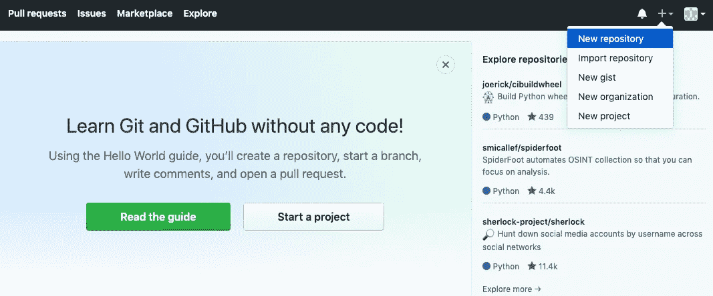

Create a new repository

将您的存储库命名为`test-repo`。

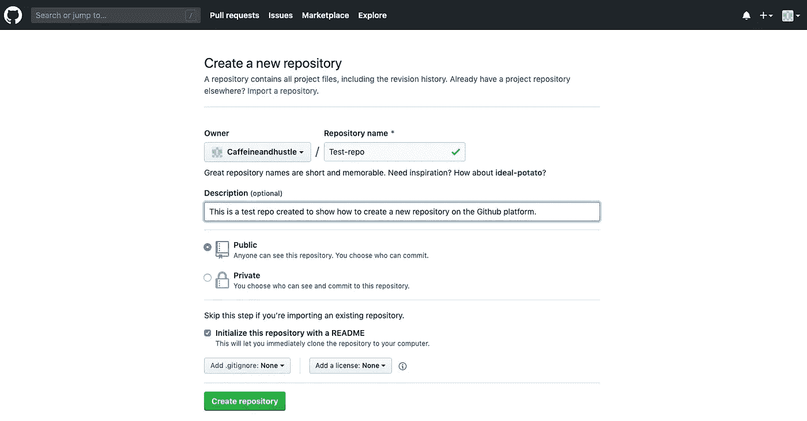

Create a repository

填写 description 部分，并选择 Initialize this repository with a README。您还可以通过选择公共和私有选项来选择谁可以查看和提交您的存储库。

# 2.创建分支

分支是大多数现代版本控制系统中都有的一个特性。

Branching (Image source and credits: Pinterest)

Git 分支实际上是一个指向开发阶段变更快照的指针。当您想要添加一个新特性或者修复一个 bug 时，您可以创建一个新的分支来封装您的更改。因此，这使得不稳定或糟糕的代码更难合并到主代码库中，并且它给了您在将代码合并到主分支之前清理代码的机会。

创建一个分支—

1.  转到您的新存储库`test-repo`。
2.  点击文件列表顶部的下拉菜单，显示**分支:主**。键入一个分支名称，也就是说，在本例中，我将名称命名为 readme-edits-branch，然后从“master”中选择并点击创建分支:readme-edits-brach，如下图所示。

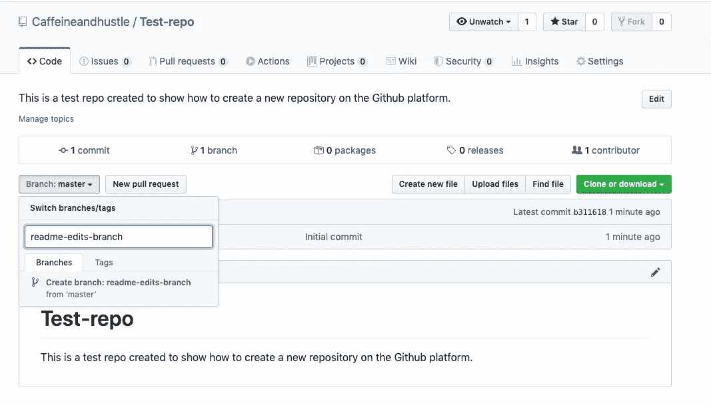

Create a branch

一旦成功完成，您可以看到两个分支(`master`和`readme-edits-branch`)，如下图所示

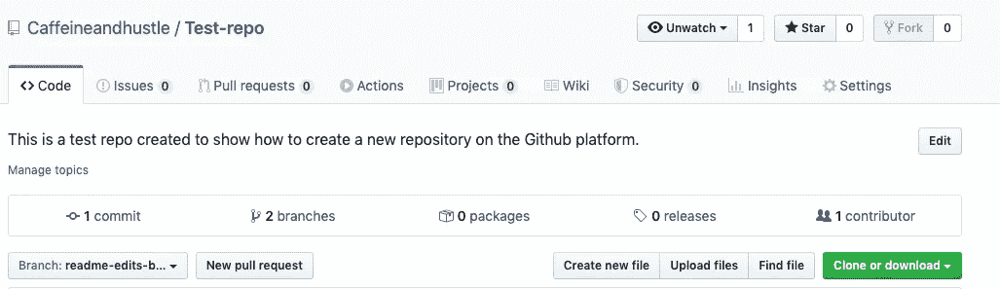

Successful branching

# 3.提交更改

提交只是保存的消息。每个提交都有一个关联的提交消息，用于捕获您的更改的历史，以便同一个项目的其他参与者可以了解已经进行了哪些更改以及原因。

做出并提交改变——

1.  点击`README.md`文件。并点击如下图所示的铅笔图标来编辑文件。

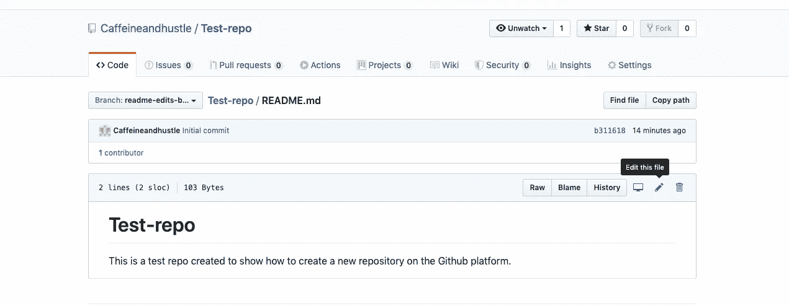

Commit Changes

写下更改，然后在底部，你可以看到提交更改，在那里你可以写下你自己和对文件所做的更改的信息/描述。

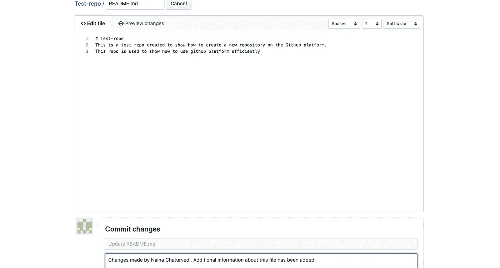

Commit Changes — Add comments/description

您还可以预览更改，然后单击提交按钮，如下面的屏幕截图所示—

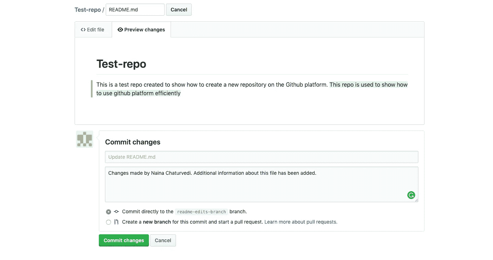

Commit Changes

一旦成功完成，这些更改将被添加到您的`readme-edit-branch`上的自述文件中

# 4.拉取请求

打开一个拉取请求—

当您打开一个拉动请求时，您就提出了您的更改，并请求某人审核和拉动您的贡献，并将它们合并到他们的分支中。在下面的屏幕截图中，您可以看到“问题”选项卡旁边的“拉式请求”选项卡。点击绿色的**新拉动请求**按钮。

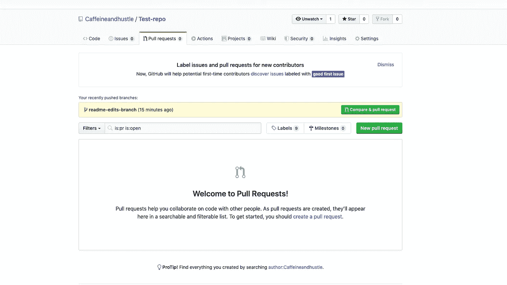

Create a new pull request

从下拉菜单中选择您制作的分支`readme-edit-branch`与`master`进行比较。

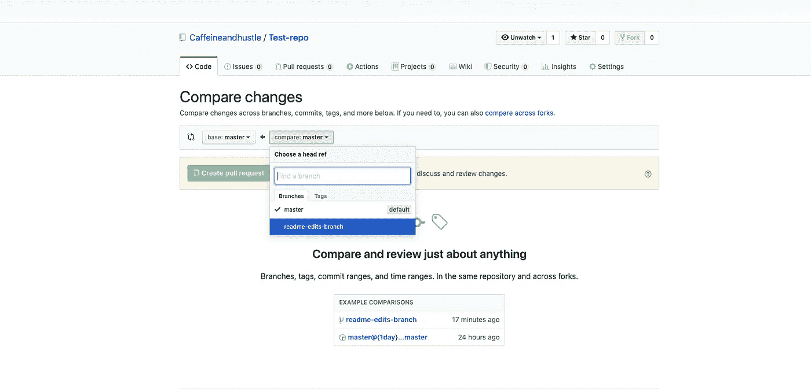

Compare changes

比较变化(绿色突出显示的变化)—

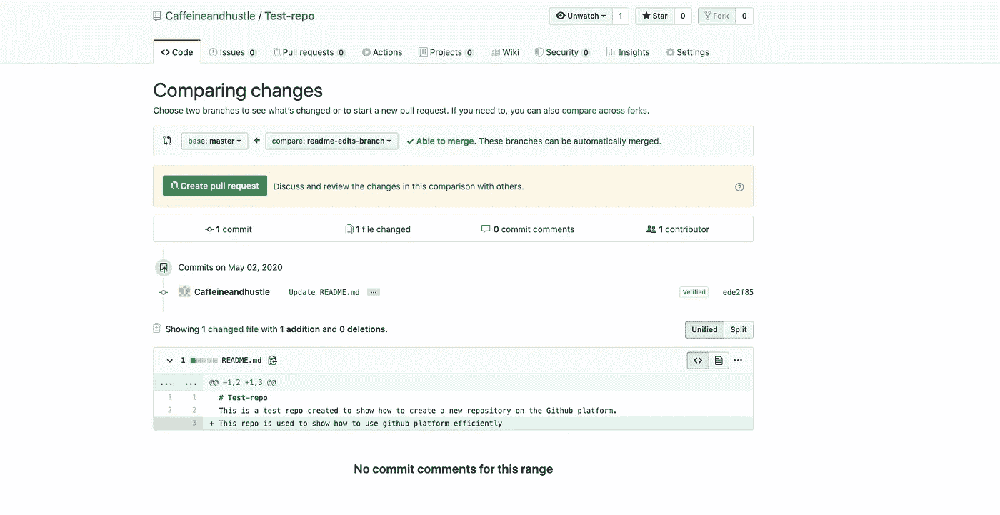

Compare Changes

对更改感到满意后，单击“创建拉式请求”按钮。点击后，您将进入请求页面—

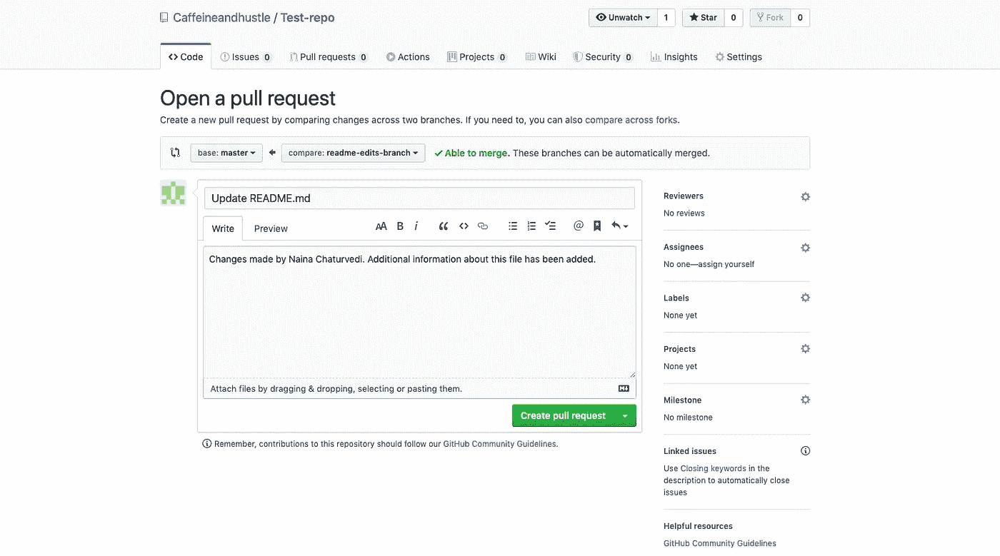

Create a pull request

您可以在这里写一些关于拉取请求的内容，如您所见，在右侧，您可以将此拉取请求分配给任何人进行审核或评论。

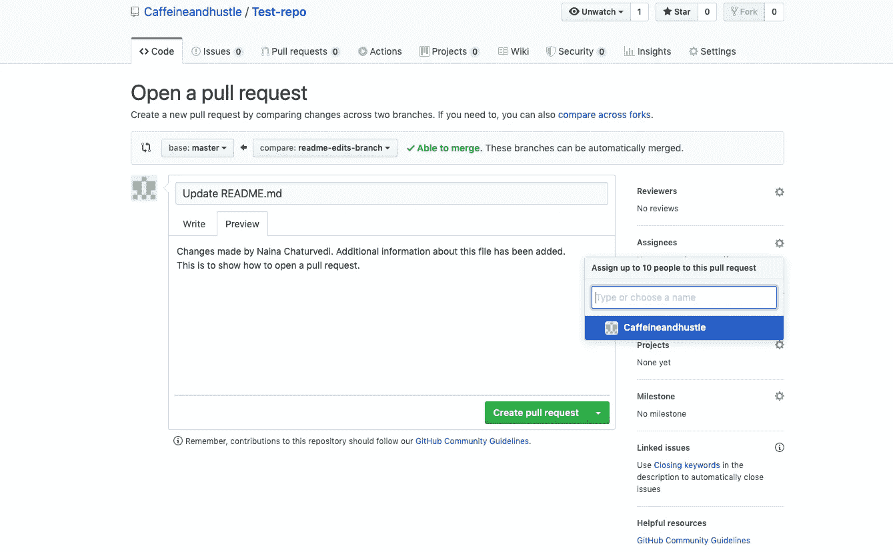

Create a pull request

完成后，单击创建拉式请求。

# 5.合并您的拉取请求

您可以合并您的更改。在本文中，我们将把`readme-edits-branch`合并到`master`分支中。

在本文前面的第 4 点中，我们打开了一个拉请求。你可以在下面的截图中看到(拉取请求 1)

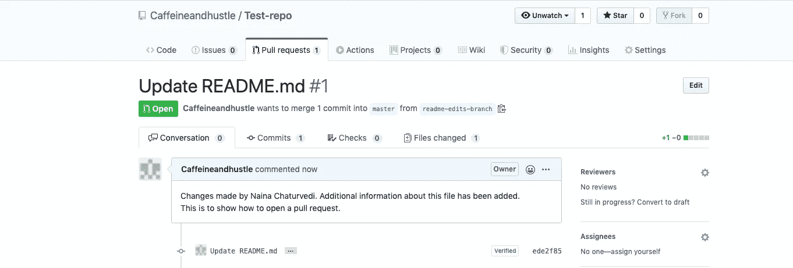

Pull Request

为了合并拉取请求，点击绿色的合并拉取请求按钮，并将更改合并到主文件中。确认后，单击确认合并。

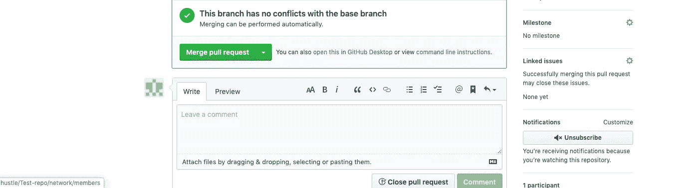

Merge Pull Request

Confirm Merge

一旦成功合并，你可以看到紫色的合并图标—

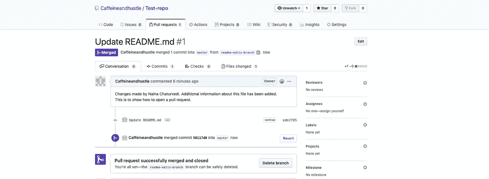

Successfully Merged

成功合并后，您可以删除该分支，因为它的更改已经被合并。点击删除分支按钮—

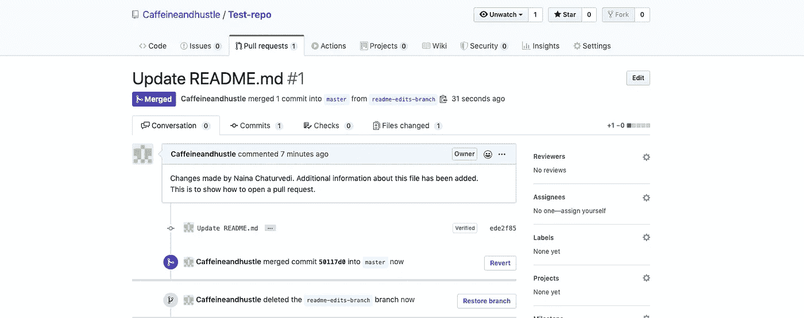

Delete the branch

成功删除分支后，可以看到`readme-edits-branch`已被删除的消息。为了以防万一，如果分支被错误地删除了，您可以通过单击 Restore Branch 按钮来恢复分支。

# 6.克隆和派生 GitHub 存储库

如果您想使用公共存储库中的代码，那么您可以通过克隆/下载来直接复制内容。

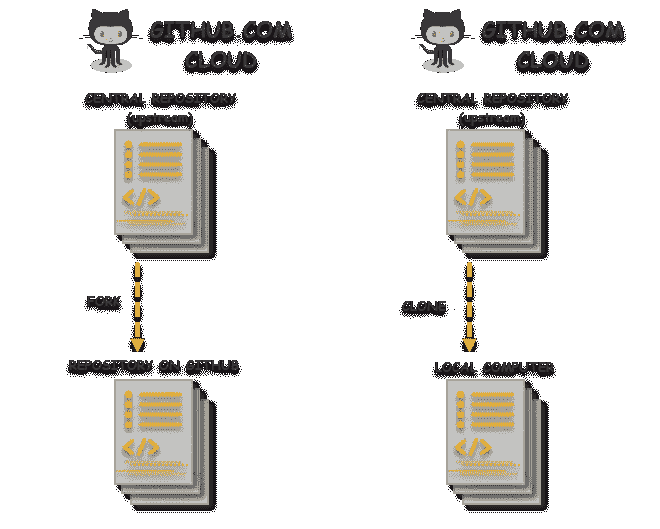

Fork and Clone illustration (Image Source and Credits: ToolsQA)

**克隆—**

只需转到所需的存储库，然后单击绿色的克隆或下载按钮。

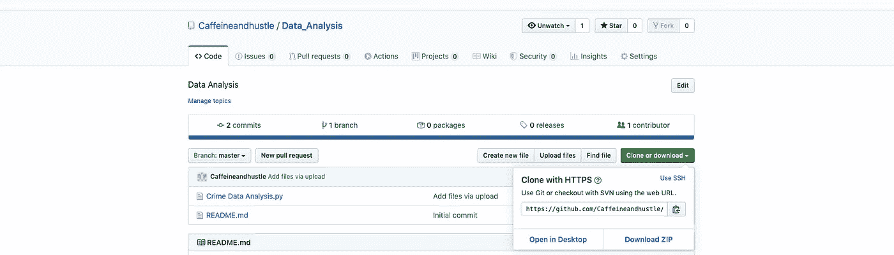

Clone

分叉只不过是创建一个存储库的副本。它允许您自由地试验更改，在不影响原始项目的情况下提供建议，并用于对其他人的项目提出建议或更改，或者使用其他人的项目来构建您的项目或将其作为起点。

**转叉—**

转到您想要分叉的存储库，例如在本文中，我正在使用右边的 fork 按钮分叉 Jupyter 存储库，如下面的截图所示—

Fork

分叉时，您会看到下面的消息屏幕—

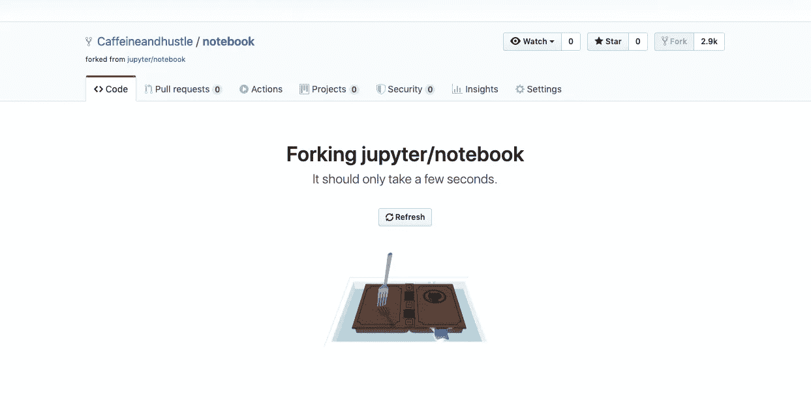

Forking in progress

一旦分叉成功完成，回到你的帐户，你可以看到一条“从 jupyter/notebook 分叉”的文本

Successfully forked

# 这里有一些每个开发者都应该知道的基本 GitHub 命令:

1.  `*git clone*` *:该命令用于从 GitHub 克隆一个现有的存储库到你的本地机器上。您可以通过复制存储库的 URL，然后运行命令* `*git clone <repository-url>*` *来克隆存储库。*
2.  `*git add*` *:该命令用于在本地存储库中暂存变更。您可以使用* `*git add <file>*` *或* `*git add .*` *暂存单个文件或整个目录。*
3.  `*git commit*` *:该命令用于在本地存储库中创建一个新的提交。提交是代码在特定时间点的快照。您应该使用* `*git commit -m "message"*` *为每个提交提供一个描述性消息。*
4.  `*git push*` *:该命令用于将您的更改从本地存储库推送到 GitHub 上的远程存储库。您可以使用* `*git push origin <branch>*` *来推送您的变更，其中* `*origin*` *是远程存储库的名称，* `*<branch>*` *是您正在推送的分支的名称。*
5.  `*git pull*` *:该命令用于从远程存储库中检索变更，并将它们合并到您的本地存储库中。您可以使用* `*git pull origin <branch>*` *提取变更，其中* `*origin*` *是远程存储库的名称，* `*<branch>*` *是您正在提取的分支的名称。*
6.  `*git branch*` *:该命令用于创建和管理您的存储库中的分支。您可以使用* `*git branch <branch-name>*` *创建一个新分支，并使用* `*git checkout <branch-name>*` *在分支之间切换。*
7.  `*git merge*` *:该命令用于将一个分支的变更合并到另一个分支。您可以使用* `*git merge <branch-name>*` *合并变更，其中* `*<branch-name>*` *是您要合并到当前分支的分支的名称。*
8.  `*git status*` *:该命令用于检查您的存储库的状态，包括暂存变更、未暂存变更和未跟踪文件的状态。*
9.  `*git log*` *:该命令用于显示您的存储库的提交历史。您可以使用* `*git log*` *来查看所有提交的列表，或者使用* `*--author*` *和* `*--grep*` *等选项来过滤列表。*
10.  `*git diff*` *:该命令用于查看两次提交之间或者工作树和索引之间的差异。您可以使用* `*git diff*` *在提交之前比较变更，或者比较不同分支中的变更。*

***来源:所有截图均来自本人 GitHub 账号。***

***演职员表:***

 [## 一起打造更好的软件

### GitHub 汇集了世界上最大的开发人员社区来发现、共享和构建更好的软件。来自…

github.com](https://github.com/) 

感谢阅读。继续学习:)

# 想看程序员幽默？

 [## 编程幽默第 2 部分

### 继续笑，因为太搞笑了…

medium.com](https://medium.com/datadriveninvestor/programming-humor-part-2-f92cf5a26f2b)  [## 史上最搞笑的代码注释

### 程序员幽默:是的，实际上是程序员写的！

medium.com](https://medium.com/datadriveninvestor/the-most-hilarious-code-comments-ever-bae3cb1030b5)  [## 编码原罪:令人捧腹的开发者自白

### “白板”是如何被嘲笑的

medium.com](https://medium.com/datadriveninvestor/coding-sins-hilarious-developer-confessions-f55eb342454e)  [## 10 个让你着迷的诙谐编程笑话

### 这些太搞笑了…

medium.com](https://medium.com/datadriveninvestor/10-witty-programming-jokes-that-will-make-you-go-rofl-a53fbfb91943) 

# 推荐文章-

 [## Python 迭代器、生成器和装饰器变得简单

### 快速实施指南

medium.com](https://medium.com/python-in-plain-english/python-iterators-generators-and-decorators-made-easy-659cae26054f)  [## 你应该知道的 23 种数据科学技术！

### 使用这些技巧来节省你的宝贵时间

medium.com](https://medium.com/ai-in-plain-english/23-data-science-techniques-you-should-know-61bc2c9d1b3a)  [## 编码原罪:令人捧腹的开发者自白

### “白板”是如何被嘲笑的

medium.com](https://medium.com/datadriveninvestor/coding-sins-hilarious-developer-confessions-f55eb342454e)  [## 面向数据科学家的 5 项酷炫先进熊猫技术

### 使用这些技巧…

medium.com](https://medium.com/datadriveninvestor/5-cool-advanced-pandas-techniques-for-data-scientists-c5a59ae0625d)  [## Stack Overflow 分析了来自 60，000 多名软件开发人员的数据，包括他们的工作时间、语言…

### 以下是他们的发现…

medium.com](https://medium.com/datadriveninvestor/stack-overflow-analyzed-data-from-60-000-software-developers-hours-they-work-languages-they-476ac6ca0197)  [## 高级 Python 变得简单—第 4 部分

### 使用这些技巧和技术…

medium.com](https://medium.com/datadriveninvestor/advanced-python-made-easy-part-4-a4996ba9fe19)  [## 高级 Python 变得简单—第 1 部分

### 使用这些技巧和技术…

medium.com](https://medium.com/datadriveninvestor/advanced-python-made-easy-part-1-ce1e2f17431e)