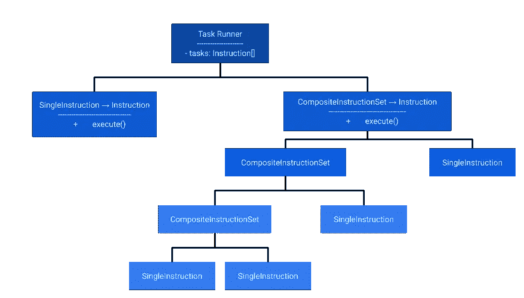

# 复合模式——设计模式满足前端

> 原文：<https://javascript.plainenglish.io/the-composite-pattern-design-patterns-meet-the-frontend-2d17e9cf2f58?source=collection_archive---------3----------------------->

复合设计模式是一种具有递归性质的结构设计模式。在这篇文章中，我们将深入研究它，希望我们不会重复自己太多。

我们将讨论几件事情:

*   这是什么？🤔
*   让我们看一个例子🚀
*   我们为什么需要它？😐
*   让我们看看一些代码！👩‍💻

# 这是什么？🤔

复合设计模式是一种结构化设计模式，用于表示数据并将系统中的对象组合成树状结构。

为了理解这种模式是如何工作的，有必要对高层次的概念进行描述。
在我们的系统中，我们将拥有单个对象或复合对象。

*单个对象*可以被认为是独立的对象，它们将实现与预定义契约相匹配的类似行为。

*复合对象*由单个对象和/或其他复合对象组成。

🤯困惑了吗？

让我们把它分解一下。假设我们在商店买了一台打印机。它装在盒子里。当我们打开盒子时，我们看到盒子里有一台打印机，但旁边还有一个盒子。此包装盒包含打印机的电源线和 USB 适配器。

我们可以认为打印机本身是一个单一的物体，而盒子是一个复合物体。它**有一个**打印机，它**有另一个**盒子。这个**嵌套的**盒子**有一根**电源线和一个 USB 适配器，两者都是单个物体，使这个盒子成为一个复合物体。

希望这已经使概念更加清晰！☀️

然后，这种结构允许我们通过单一的公共接口递归地遍历树，因为它允许我们一致地对待单一对象和对象的组合。

# 让我们看一个例子🚀

理解这种模式的最好方法肯定是看一个例子。

让我们想象一个假想的任务运行者。🤖

我们向这个任务运行者提供一组`Task Instructions`。但是每个`Task Instruction`可能有`Sub Task Instructions`，每个`Sub Task Instruction`可能有自己的`Sub Task Instructions`。

我们已经可以看到，这有可能成为一个递归结构。

我们不一定希望任务运行程序在每次执行每个`Instruction`时都必须检查它是`Composite Instruction Set`还是`Single Instruction`。

`Composite Instruction Set`应该包含任务运行者不需要知道的`Composite Instruction Set`或`Single Instruction`的子节点列表。

因此，为了解决这个问题，我们将定义一个公共的`Instruction`接口，包含一个由`Composite Instruction Set`和`Single Instruction`实现的`execute()`方法。

任务运行器将遍历调用`execute()`方法的`Instructions`列表。

`Single Instructions`将执行他们的定制逻辑，而`Composite Instruction Sets`将遍历他们的子节点并调用他们的`execute()`方法。

他们不需要知道他们的孩子是`Composite`还是`Single Instructions`，任务运行者也不需要知道它需要运行的`Instructions`的具体构成，这允许了很大的灵活性！

以下是说明上述示例的图表:

# 我们为什么需要它？😐

当我们拥有具有相似行为的不同类型的对象或者包含具有相似行为的子对象时，核心问题就出现了。

在运行所需的逻辑之前进行类型检查是不可取的，因为这将迫使客户端代码与它正在处理的对象的结构紧密耦合，如果需要的话，可能会遍历子对象。

相反，我们希望我们的对象本身知道它们自己的逻辑需要什么来执行手边的操作，从而允许我们递归地遍历树状结构，而不需要担心树中的每个叶节点是什么类型。

# 让我们看看一些代码！👩‍💻

以上面的任务运行器为例，让我们把它写成代码。

我们需要一个接口来定义`Single Instructions`和`Composite Instructions`之间的共同行为。

既然我们已经定义了接口，我们将定义我们的`SingleInstruction`和`CompositeInstructionSet`类。

我们希望我们的`SingleInstructions`具有灵活性和可扩展性，允许开发人员创建任务运行者能够理解的定制指令。

例如，让我们创建一个总是`return true`的日志记录指令，但是输出一个日志。

现在我们已经定义了任务指令的结构，让我们创建任务运行器本身。

就这么简单！任务运行程序不需要知道或关心它处理的是什么类型的指令，只要它能调用它的`execute()`方法，将繁重的工作交给指令本身！

让我们看看实际运行的代码。

希望看到这段代码后，这种特殊设计模式的威力更加突出！从购物车到递送包含包裹的包裹，它可用于所有方式的树状数据系统！

是不是很牛逼！🚀🚀🚀

希望你多学了一点(*？*)关于复合花纹出自这篇文章。

如果有任何问题，欢迎在下面提问或在 Twitter 上联系我: [@FerryColum](https://twitter.com/FerryColum) 。

*原载于 2020 年 1 月 4 日*[*https://dev . to*](https://dev.to/coly010/the-composite-pattern-design-patterns-meet-the-frontend-445e)*。*