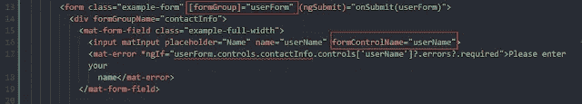
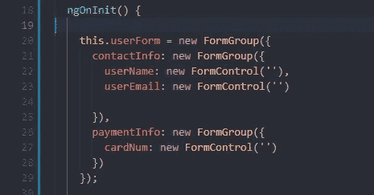
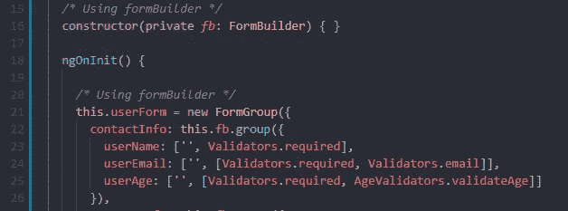
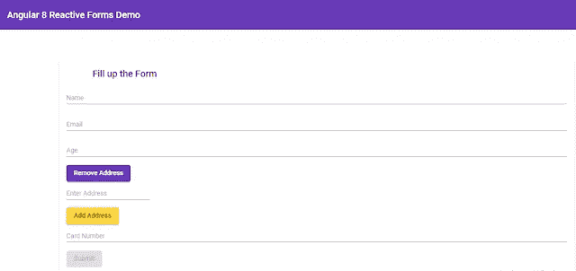
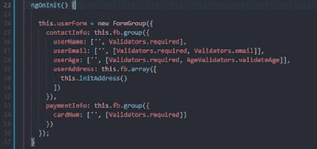
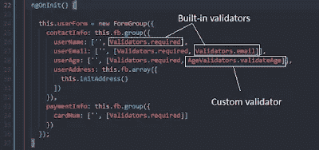
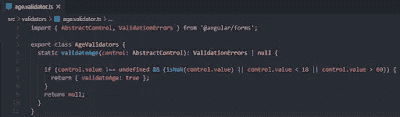
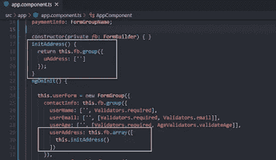
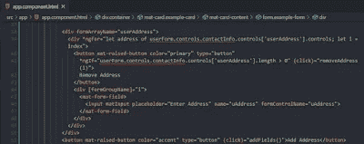
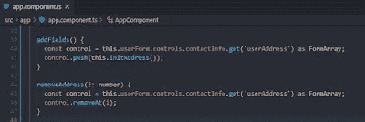

# 角度 8 反应形式综合指南

> 原文：<https://javascript.plainenglish.io/the-comprehensive-guide-to-angular-8-reactive-forms-f3c509ff9656?source=collection_archive---------1----------------------->

Photo by [Kevin Ku](https://www.pexels.com/@kevin-ku-92347?utm_content=attributionCopyText&utm_medium=referral&utm_source=pexels) from [Pexels](https://www.pexels.com/photo/coding-computer-data-depth-of-field-577585/?utm_content=attributionCopyText&utm_medium=referral&utm_source=pexels)

在构建任何类型的 web 应用程序时，表单验证都是至关重要的。根据复杂性，我们可以使用两种方法；模板驱动方法和反应式方法。这篇文章深入介绍了角度反应式，这样你就不需要在网上寻找其他教程了。

# 什么是角形反应？

如果你熟悉 angular 的模板驱动方法来验证表单，你会知道在我们在代码的模板部分(即 HTML 部分)编写代码后，angular 会自己创建 [FormControl](https://www.concretepage.com/angular-2/angular-2-formcontrol-example) 和 [FormGroup](https://www.concretepage.com/angular-2/angular-2-formgroup-example) 对象。

但是，如果我们想对我们的验证逻辑有更多的控制，那么我们应该使用反应式表单。这种方法有助于处理各种复杂的场景。例如，假设您想要构建一个表单，根据从服务器获得的数据显示输入字段，那么您只有一个选择，您必须使用反应式表单。

当我们使用反应式表单时，我们需要显式地编写代码来以编程方式处理表单验证。

# 为什么使用角反应形式？

在 angular 中使用反应式有许多优点，如下所示。

*   读取/写入任意点的输入值。(甚至在构建表单之前)
*   定义高级验证规则，支持异步验证器，这在用户填写表单的同时向服务器发送 HTTP 请求时特别有用。
*   当值发生变化时，得到通知并立即做出反应。
*   访问本机 HTML 表单元素。
*   重置表单。
*   反应型更容易测试。

# 反应形式:它们实际上是如何工作的？

为了理解反应式表单如何工作，首先你需要知道[模板驱动表单](https://www.devhelperworld.in/2019/10/know-everything-about-angular-8-template-driven-forms.html)如何工作的基础知识。在基于反应式表单的方法中，我们通过组件类中的 FormGroup 和 FormControl 实例来定义表单模型。

然后我们将模板绑定到表单模型，这意味着我们的表单没有直接修改数据模型。现在，您可能会问，如何创建表单模型？

为了创建一个表单模型，我们需要在表单的模板部分定义一个 FormGroup 指令。该表单组代表整个表单。FormGroup 包含引用表单本身状态的属性。为了表示状态，我们需要提供 FormControl 对象的实例作为 FormGroup 对象中的键值对。

下面是在组件的 HTML 文件中定义表单模型的示例。

FormControl 对象引用表单中的每个输入元素。要将输入字段与 FormControl 对象绑定，我们需要在组件的 HTML 文件中指定 FormControlName 值。然后，我们需要在组件的 typescript 文件中引用该值。

下面是在组件的 typescript 文件中定义表单模型的示例。

# FormBuilder 在 Angular 中有什么用？

有时，您需要处理大型复杂的表单，然后您需要重复键入“new FormControl(')”、“new FormGroup({})”。因此，用这种单调乏味的方式来表示如此大的表单。此外，您几乎无法阅读代码，代码调试可能需要很长时间。

幸运的是，angular 在这方面帮助了我们。您可以使用 FormBuilder 类来表示更大、更复杂的表单，以便于阅读、理解、调试和维护。

下面的屏幕截图是使用 FormBuilder 类的示例。

## 什么是正式婚姻？

根据 angular 的官方文档:*它跟踪 FormControl、FormGroup 或 FormArray 实例数组的值和有效性状态。*

让我解释一下这是什么意思。简而言之，FormArray 是一个确保 FormControl 实例放在一个数组中的类。您可以将 FormArray 类视为类似于 FormGroup 类，它保存 FormControl 实例的对象。

## 那么，FormArray 和 FormGroup 在 Angular 上有什么区别呢？

简而言之，对于管理未知数量的表单元素，FormArray 是 FormGroup 的替代方案。FormArray 和 FormGroup 都允许操作表单元素。

但是，如果我们比较它们，那么 FormArray 方法更好，因为它的方法确保控件在表单的层次结构中被正确跟踪。

需要注意的另一点是，FormArray 的数据被序列化为数组，而 FormGroup 的数据被序列化为对象。

# 角反应形式示例

让我们构建一个表单，收集用户的各种信息，如姓名、电子邮件地址、年龄、地址、卡号等。

以下是我们将创建的应用程序的屏幕截图。

如果你点击[这里](https://drive.google.com/file/d/1GsGdxgQpdFr5nVT0jxpQj6hU3dgAygMM/view?usp=sharing)下载完整的项目会更好。

# app.component.ts 文件说明

在上面的截图中，我们讨论了我们需要一个 form group 指令，在这个指令中我们可以将单个子元素放入一个对象中。在第 25 行，我们想在“contactInfo”对象下发送联系信息。这就是我们使用表单生成器对象的组功能的原因。

在该函数中，我们编写了“contactInfo”对象下的字段，例如，姓名、年龄、电子邮件、地址等。类似地，在第 33 行，我们将卡号字段放在“paymentInfo”对象下。

在上面的截图中，我们使用了 angular 已经提供给我们实现的一些内置验证器。如果这些内置的验证器对我们来说还不够，那么我们应该实现我们自己的定制验证器。

例如，我们实现了一个定制的年龄验证器，它负责验证年龄必须在 18 到 60 岁之间。实现验证器的代码片段如下所示。

为了创建一个定制的验证器，我们需要实现“ValidatorFn”接口。为此，我们在“AgeValidators”类中创建了“validateAge”静态函数。我们这样做是为了不用创建类的实例就可以轻松地调用函数。

该函数将 AbstractControl 作为参数，如果存在任何错误，则返回 ValidationErrors，如果不存在任何错误，则返回 null。为了表示“ValidationErrors”，我们需要返回一个键值对(例如，“validateAge: true”)。

我们已经编写了实现自定义验证器的逻辑，现在我们必须在用户输入不在 18 到 60 岁之间的年龄时显示错误消息。要显示该错误消息，我们需要编写如下突出显示部分所示的代码。

最后，我们添加了一些功能，以便用户可以添加多个地址。为了实现这一点，我们使用了数组。首先，我们在 FormBuilder 类下定义了形式数组。

我们需要引用 FormArray 实例，在我们的模板文件中也是如此，我们可以借助 FormArrayName 指令来做到这一点。然后，我们遍历所有动态添加的地址字段，并附加一个名为“removeAddress()”的事件来删除特定索引处的地址字段。

在循环之外，我们添加了一个执行“addFields()”事件的按钮。addFields()和 removeAddress()的代码片段如下所示。

# *遗言*

我希望在读完这篇关于角反应形式的文章后，你对它有一个坚实的理解。如果你有任何疑问，可以问我问题。如果这篇文章对你有帮助，请分享给其他人。谢谢大家！

*原载于*[*https://www . devhelperworld . in*](https://www.devhelperworld.in/2019/11/comprehensive-guide-to-angular-8-reactive-forms.html)*。*