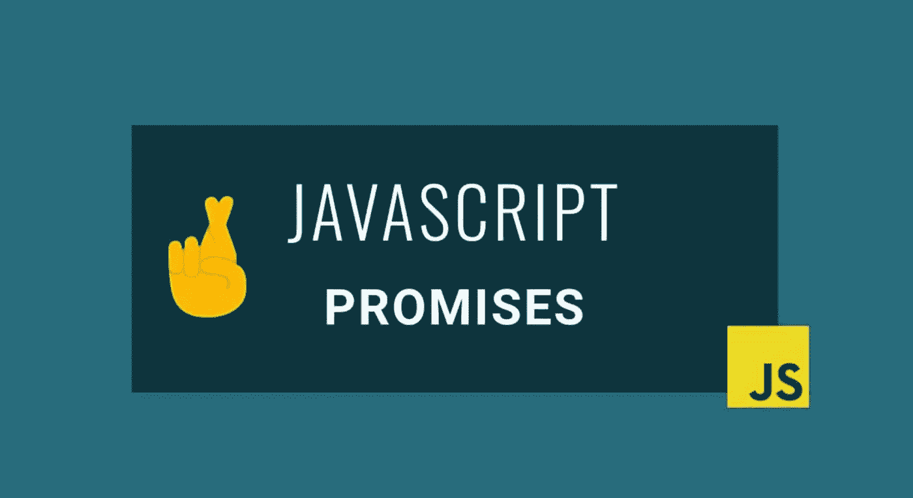

# JavaScript 中承诺的核心

> 原文：<https://javascript.plainenglish.io/the-core-of-promises-in-javascript-4e4719de6c11?source=collection_archive---------5----------------------->

我们发现面试官问的一个常见的 JavaScript 概念是承诺。“解释什么是承诺”或“让我看看承诺是如何运作的。”那时，我们可能会回想起在我们的应用程序和`.then(res => res.json())`中调用 fetch API 的场景。然而，我们当中有多少人能够真正解释什么是承诺的根源或承诺的核心基础？本博客旨在帮助所有迷失的叶。

# **什么是承诺？**

Not quite, Mike Wheeler.

承诺是表示异步操作最终完成或失败的对象。这是对未来价值的一次性保证回报。对于异步操作，我们不确定返回值是什么，也不知道它什么时候会执行完。承诺是一个占位符，代表着具体的价值。为了帮助我们想象一个承诺在现实世界中会是什么样子，让我们假设我告诉我的猫，如果他和我击掌，我可能会给它一个奖励。我并不是在那个时候请他吃饭，而是告诉他，在他与我击掌之后，我可能会在不久的将来请他吃饭。

当我们学习承诺的基础时，有两件事我们需要理解。首先是如何创造一个承诺；如何创建一个返回承诺的函数？二是如何与承诺互动。

通常，当您构建 JavaScript 应用程序时，您会向 API 发出请求。这个操作返回一个承诺，因为您正在发出一个 HTTP 请求，这需要时间。结果，你可能永远得不到它的价值，这是一个失败。或者它可能会成功，您可能会从 API 获得数据。因此，我们同时得到的返回对象是一个承诺。我们可以将回调附加到承诺上，而不是将回调传递给函数。

# **创造承诺**

让我们在这里创建一个名为 willGiveCatATreat 的承诺。

当我们创建一个承诺时，我们传入一个带有两个参数的函数: **resolve** 和 **reject** ，它们也是函数。如果我们叫“解决”，承诺将被解决，如果我们叫“拒绝”，承诺将被拒绝。如果我们既没有传递“resolve”也没有传递“reject ”,我们可以看到我们返回了一个 promise 对象，并且在第 4 行上状态被设置为“pending”。它既没有实现，也没有遭到拒绝。如果我立即调用“拒绝”，我们的承诺已经被拒绝，如第 10 行所示。如果我调用“resolve ”,我们的承诺的状态在第 16 行被设置为“resolved”。

现在，让我们让事情变得更令人兴奋一些，并在这里添加一些异步代码。我们将运行一个`setTimeout()`，在 3 秒钟后，如果`Math.random()`的结果大于 0.5，则承诺被解决。如果`Math.random()`小于 0.5，则拒绝承诺。

# **与诺言为伍**

下一个重要的步骤是我们如何与承诺互动。如果这个承诺实现了，我们如何运行代码呢？被拒绝了怎么办？这就是`.then()`的用武之地。

每个承诺都有一个**。然后()**法。。然后()接受一个回调。如果该承诺被**解决**，第 12 & 13 行将运行，并将 console.log“万岁！！你得到了奖赏！！！😻".

还有另一种方法，我们可以调用一个承诺，这是**。catch()** 。第 15 行& 16 将运行，如果承诺被**拒绝**并将 console.log“对不起，猫，我撒谎了！没有招待你😿".

正如您在上面看到的，我们首先获得一个返回的 promise 对象，其状态设置为“pending”。等了 3 秒钟，我们终于看到承诺解决了！这只猫得到了一份礼物！😸

# **从函数返回承诺**

另一件经常做的事情是从一个函数返回一个承诺，而不是像我们上面写的那样只做一个承诺。我们可以定义一个函数，`const makeCatPromise`，这个函数会返回一个承诺。这是一种常见的模式，而不是从零开始构建一个承诺并将其保存到一个变量中。

将之前的`willGiveCatATreat`函数变量改为`makeCatPromise`，如第 14 行所示。我们也可以链上`.catch()`18 号线。我们可以将`.then()`和`.catch()`链接在一起，而不需要创建一个变量，也不需要再次引用承诺。如果承诺被解决，第 16 行运行。如果承诺被拒绝，第 19 行运行。

这就是了。现在希望你能更好地谈论承诺！去参加那些技术面试吧！

## **用简单英语写的 JavaScript 笔记**

我们总是有兴趣帮助推广高质量的内容。如果你有一篇文章想用简单的英语提交给 JavaScript，用你的中级用户名发邮件到 submissions@javascriptinplainenglish.com**给我们，我们会把你添加为作者。**

**我们还推出了三种新的出版物！请关注我们的新出版物:[**AI in Plain English**](https://medium.com/ai-in-plain-english)[**UX in Plain English**](https://medium.com/ux-in-plain-english)[**Python in Plain English**](https://medium.com/python-in-plain-english)**——谢谢，继续学习！****

****Cat Tax****