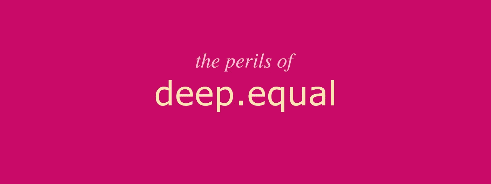

# Chai.js 中深度等同断言的危险

> 原文：<https://javascript.plainenglish.io/the-dangers-of-deep-equal-assertions-in-chai-js-f25a212f671f?source=collection_archive---------4----------------------->

## 深度等同断言实现起来更快，但通常会带来危险的注意力缺失

你的团队中有人说过这样的话吗？*单元测试涵盖了该值，但我们将其与错误值进行了比较！”*

我听到的大多数时候，都有一个深刻的平等主张。**chai . js 中的 Deep equal 断言实现起来非常简单和快速**——当我可以对一个对象进行深度比较，并且可以很容易地在测试中复制粘贴时，为什么要逐个属性地编写断言呢？— **但是这样做，开发者错过了一个机会去问自己:这个房产的价值真的是*应该的吗？***

考虑一个`person`对象，它是由一个转换函数产生的，其中包含一些业务逻辑。让我们想象一下，属性`isActive`是由该函数中的一些内部检查决定的。

通常，开发人员只是调试或`console.log`一下`person`对象的内容，然后很高兴地把它们扔进一个`deep.equal`比较中，就像这样:

Copy pasting is easy!

*“我的单元测试通过了，一切都好！”*

不幸的是，开发人员没有花任何时间去真正地考虑对象中的每一个属性。原来`isActive`应该是`true`，当团队中有人意识到错误时，伤害已经造成了。

请注意自我，也请注意你们所有人:**不要懒惰**。花点额外的时间去**真的，真的想想每一个断言**:

Spend some quality time asserting every property with care and love!

# 柴何时进行深度相等比较？

Chai.js 进行这种比较有两种方式:

*   `expect(o1).to.**eql**(o2)`:断言 *o1* 使用[自己的深度相等算法](https://github.com/chaijs/deep-eql)与 *o2* 深度相等。别名`eqls`。
*   `expect(o1).to.**deep.equal**(o2)`:和以前一样，有一个很重要的区别。这使得深度相等比较也可以用于链中的任何其他断言。

**投资好单元测试，你晚上会睡得更好！**