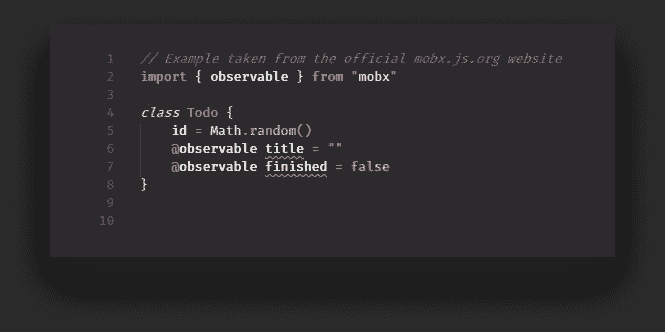
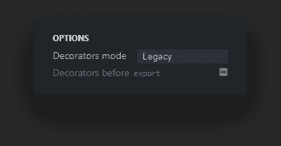
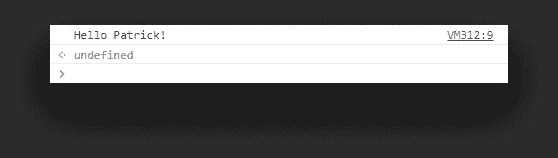
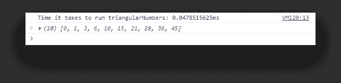
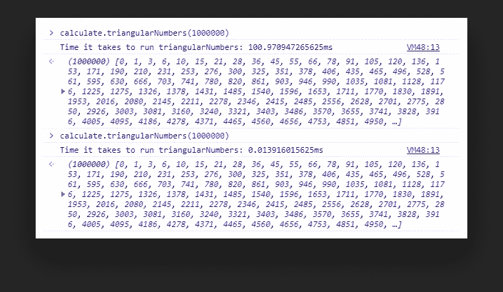

# JavaScript 中的装饰设计模式

> 原文：<https://javascript.plainenglish.io/the-decorator-design-pattern-in-javascript-6aee27837dbd?source=collection_archive---------1----------------------->

## 在装饰者的帮助下对你的代码进行基准测试和优化

Photo by [Ferenc Almasi](https://unsplash.com/@flowforfrank?utm_source=medium&utm_medium=referral) on [Unsplash](https://unsplash.com/?utm_source=medium&utm_medium=referral)

如果你以前使用过 Angular 或者 Mobx，你应该已经对 decorators 比较熟悉了，因为他们经常使用它们。他们长期以来一直是其他语言的一部分，但是他们也来到了 [JavaScript](https://github.com/tc39/proposal-decorators) 。

今天，我们已经可以将它们用于 polyfillers 或编译器，如 [Babel](https://babeljs.io/) 。如果你不熟悉装修工，我们正在谈论以下内容:

这里的`@observable`是一个装饰器，它负责用附加功能包装这两个属性。那么它们是如何被创造出来的呢？

让我们先退一步，定义一下一般的设计模式是什么。

# 什么是设计模式？

设计模式是软件开发中常见问题的测试解决方案。不同的模式可以分为三个不同的类别:创造型、结构型和行为型。

我已经写过 JavaScript 中常用的行为设计模式[PubSub 模式](https://www.webtips.dev/intro-to-design-patterns-create-your-own-pubsub-library)。现在是时候讨论一种用于向对象动态添加增强功能的结构模式了。

# 装饰模式的概念

我们已经看到了装修工的样子。它们用一个符号`@`表示，后面跟有装饰者的名字。装饰器实际上只是高阶函数的语法糖。它们本质上是将一个方法或属性包装到另一个函数中，该函数扩展了它的原始功能。

它可以简单到添加日志，也可以复杂到为用户组定义访问权限。值得一提的是，您只能将 decorators 附加到类声明、方法、属性或参数上。这就是为什么你会看到在整个教程中使用的对象。

# 创造装饰者

要使用 decorator，您需要首先用 decorator 插件设置 [Babel](https://babeljs.io/) 。它会把你的代码向下转换到 ES6，这样浏览器就能正确地解析它。如果你只想试验装修工但不想配置任何东西，可以在巴别塔官方网站上使用 [Repl](https://babeljs.io/repl/) 。

Don’t forget to set the decorators mode to legacy if using Repl

那么什么是装修工呢？—decorator 实际上只是一些函数，它们将三个参数作为参数:

*   `object`:我们要定义属性的对象
*   `property`:我们要修改的对象的属性或方法的名称
*   `descriptor`:描述新的属性或方法应该如何表现

如果你曾经使用过`[Object.defineProperty](https://developer.mozilla.org/en-US/docs/Web/JavaScript/Reference/Global_Objects/Object/defineProperty)`，你可能会发现两者之间的一些相似之处。让我们看一个非常简单的例子:

我们有一个带有`greet`方法的对象，我们想覆盖这个方法的主体。我们用装饰器对函数进行了注释。要创建这个装饰器，只需创建一个同名的函数，它带有我们讨论过的三个参数。将`descriptor.value`分配给一个新功能会覆盖原来的功能，我们会在控制台中重新获得`Hello Patrick!`。

现在让我们看两个更实际的例子:一个用于测试性能，另一个用于提高性能。

## @时间装饰者

假设我们有一个函数来获取第一个`n`三角数，我们想知道生成它们所需的时间:

我们有一个带循环的简单函数，我们想修饰它。所以我们创建了一个名为`@time`的新装饰器:

这一次，我们不想覆盖整个函数体，而是希望用附加功能来扩展它。所以我们从在`descriptor.value`中存储原始函数开始。

我们可以使用析构来获取传递给原始函数的所有可用属性，并获取函数返回值，然后存储在`originalValue`中。这是我们最终的回报。我们将所有东西包装在`console.time`中，它测量函数运行所花费的时间。

如果我们使用装饰器并调用该函数，我们会将以下内容打印到控制台:

现在想象这是用前 100 万组数字完成的。时间增加了，所以我们想用另一个装饰器来优化这个函数:

## @memoize decorator

如果你没有听说过 memoization，那就是缓存以前的结果。因此，我们可以返回缓存的值，而不是为以前的执行重新运行计算。

因此，我们再次创建了另一个名为`memoize`的函数:

在这个函数中，我们可以创建一个`cache`对象来存储以前的值。然后，我们可以根据传递给函数的参数，为名为的属性获取或分配一个新值。这将确保我们有唯一的属性，并且只有一个值将被分配给一组结果。

如果我们已经有一个缓存的值，我们返回它。否则，我们执行原始函数。

现在我们需要将两个装饰器分配给 calculate 函数:

首先，我们想调用`@time`，然后调用`@memoize`。如果我们再次运行该方法两次，我们会发现第一次运行需要大约 100 毫秒，但第二次只需要大约 0.014 毫秒，因为结果是从缓存中请求的。

This is roughly a 99.98% decrease in time.

# 摘要

当然，这样的例子不胜枚举。你可以给对象添加额外的属性，或者将它用于更复杂的情况，比如 Angular 的`@Component`或者 Mobx 的`@observable`或者`@observer`。

因为我们正在讨论函数调用，所以您也可以通过向 decorators 传递值来使用它们:

Just as Angular does for the @Component decorator

你最喜欢的装饰者的用例是什么？你以前用过吗？请在下面的评论中告诉我们。感谢您通读，编码快乐！

