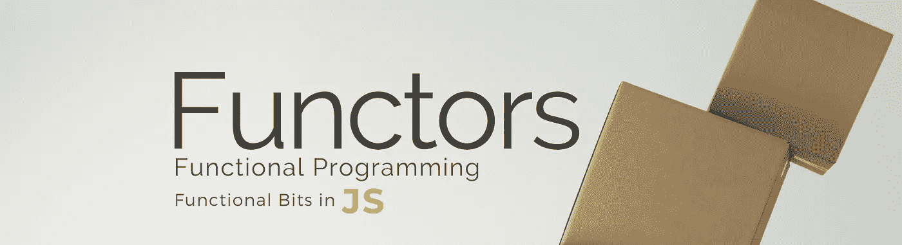
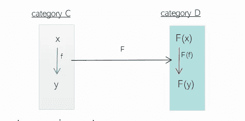
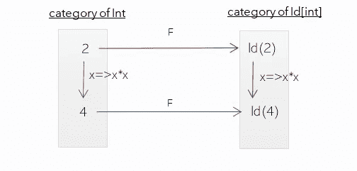
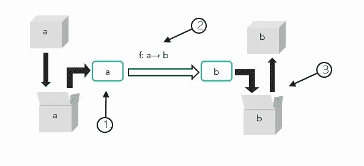

# JavaScript 中的函子介绍

> 原文：<https://javascript.plainenglish.io/the-definite-guide-to-functors-in-js-6f5e82bd1dac?source=collection_archive---------0----------------------->



## 让我告诉你什么是面向对象编程的函子:它是一个 ***容器、*和一个映射函数**。

函子是[范畴理论](https://en.wikipedia.org/wiki/Category_theory)的基础，范畴理论已经成为函数式编程范例中最有价值的工具之一。

在数学中，**函子**是[类别](https://en.wikipedia.org/wiki/Category_(mathematics))之间的映射。一个类别只是一个对象和对象之间的箭头的集合，如下图所示。类别 C 有物体 x，y 和一个从 x 到 y 的箭头 f，这就是它的基本内容。算是吧。



在编程中，一个主要的**类别是这种类型** int，bool…类型之间的箭头是函数/方法 f:*a*→b。但是因为这个概念非常广泛，所以在编程的各个领域都会出现类别。例如，如果我们得到对象是程序的类别，那么它们之间的箭头可能是**编译器**，它得到一个输入程序并给出一个不同的程序*Comp:program 1*→assembly program。]

让我们开门见山，看看 JavaScript 中的一个例子。该数组是用 [**映射**](https://developer.mozilla.org/en-US/docs/Web/JavaScript/Reference/Global_Objects/Array/map) 的方法将 与 ***联系在一起。 [**映射**](https://developer.mozilla.org/en-US/docs/Web/JavaScript/Reference/Global_Objects/Array/map) 是从初始范畴映射或者我们说提升一个函数 f 的方法。但是我们可以看看最简单的函子贝娄:***



在下面的例子中，我们有整数 2 和 4(为了简单起见，我们称之为这个例子中的整数类别)，在这个类别中还有函数 *f =x= > x*x* 将 2 映射到 4。如果我们应用新的函子()构造函数，我们可以将每个整数映射到函子对象类别，例如 2 将被映射到**新的函子(2)** 和 4 在**新的函子(4)** 唯一缺少的部分是函数 f **函子【f】**到这个新类别的正确提升。很容易看出正确的映射是:

```
this.map =  (f) => Functor(f(value));
```

# 交换图

关于**映射函数有一点很重要。**

***如果我们选择两条可能的路线中的任何一条到达那里，映射应该得到与[4]相同的结果。*** *这个意思是:*

> ***映射*** *(又名从 C 到 D 的函数提升)* **应该保留结构**


1.  我们可以先得到函子，然后映射它。这是图上的红色路径。

```
Functor(4) = Functor(2).map(f);
```

2.或者先用 f 提升 2 再得到函子。

```
Functor(4) = Functor(f(2));
```

我们说图 ***往返于*** 时就是这种情况。这意味着态射的提升(编程中的箭头或函数)保留了 c 中对象的结构。

# 将自定义承诺扩展到函子

让我们看看 JavaScript 中另一个最流行的函子。原住民的承诺。promises 的本机实现(基于 [Promises/A+](https://promisesaplus.com/) 规范)有一个通过重载`Promise.then()`方法实现的**有效映射**:

```
var thenableMapResult = 
   new Promise((resolve,reject) => resolve(5))
    .then(**x=>x+3**)           ** //** **Using then to map the x=>x+3**
    .then(console.log)       **//8**
```

运行这个: [JS 拨弄](https://jsfiddle.net/functionalCategories/2n5ug098/)

很明显，这一部分只是为了提供一些对背后机制的理解。然后作为地图。

我们已经说过，函子的通常隐喻是“容器”**一个承诺可以被看作一个容器**，它接受一个值并包装它，直到它被解析。为了将 Promise 提升为 Functor，必须有一个**映射**函数，它能够提升任何函数，并使用提升的值给出一个新的 Promise。

下面是一个可能的保持结构的映射函数:

运行这个: [JS 拨弄](https://jsfiddle.net/functionalCategories/ab5xcpyt/)

提升函数 f 的映射函数:int →int 它遵循以下步骤:



1.等待承诺的结果(因此在某种程度上解开了包含的值)`initialPromise.then()`

2.应用功能 `f : result => resolve(f(result))`

3.将结果值再次包装到一个新的承诺:`return new Promise()` 中，因为当我们实现一个**映射**，时，我们总是返回相同类型的东西，以便属于相同的类别(在本例中为类型)或承诺。