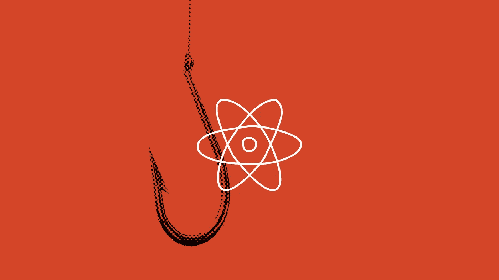
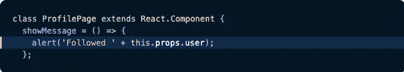
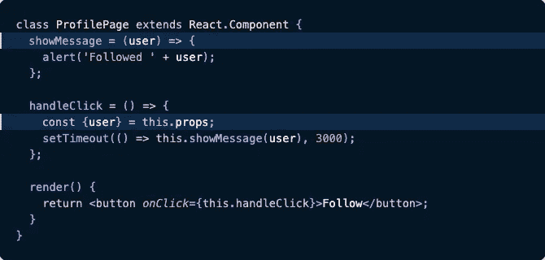
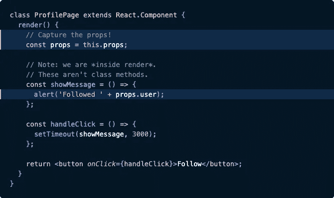
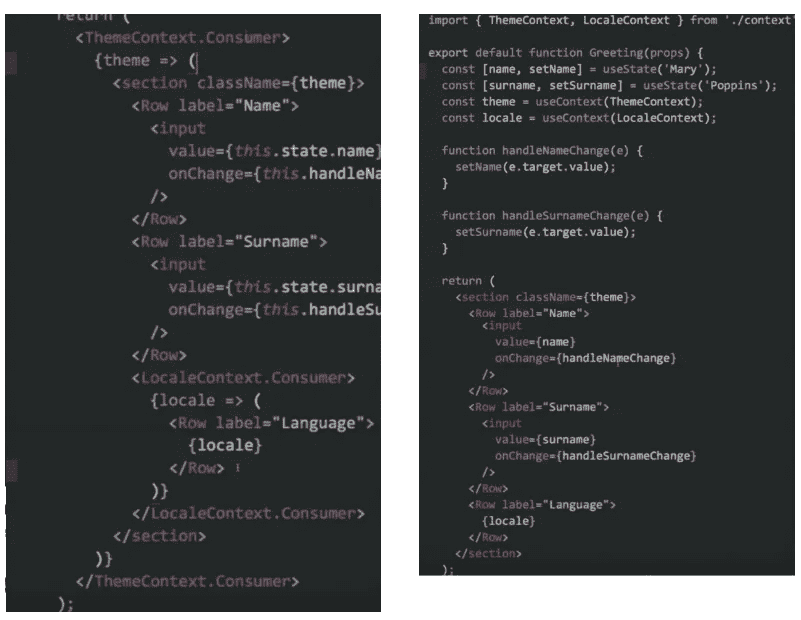
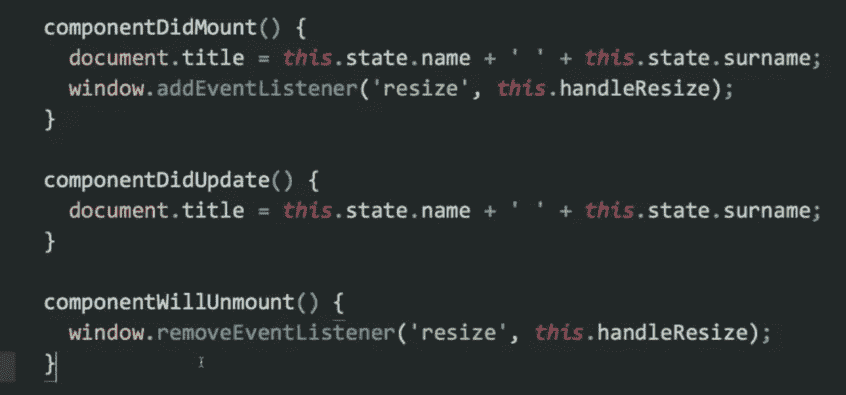
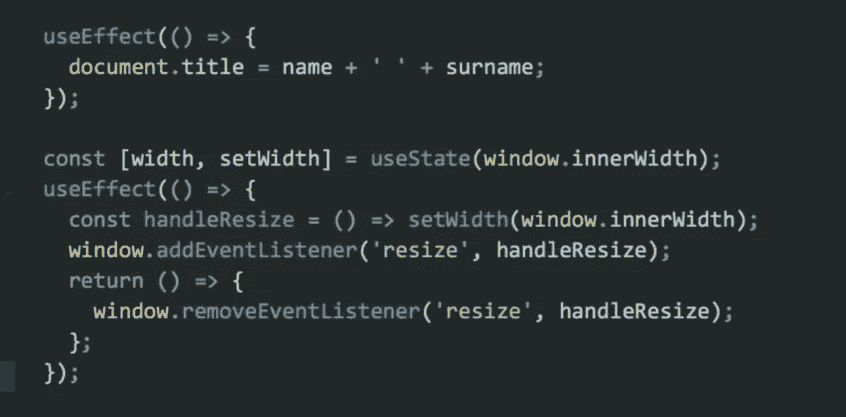
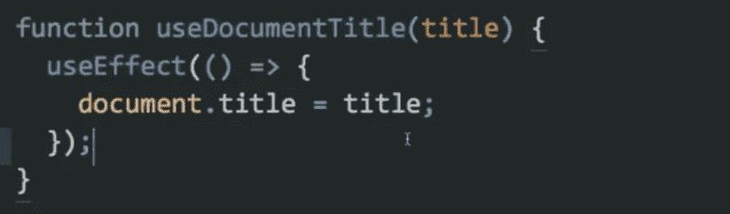
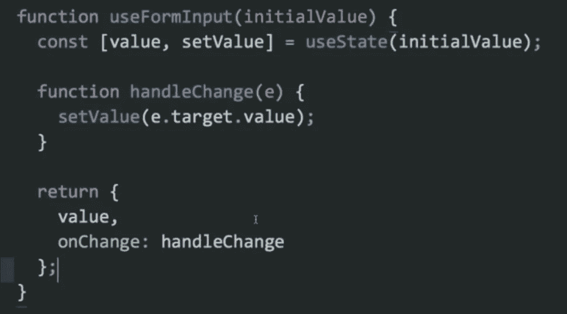
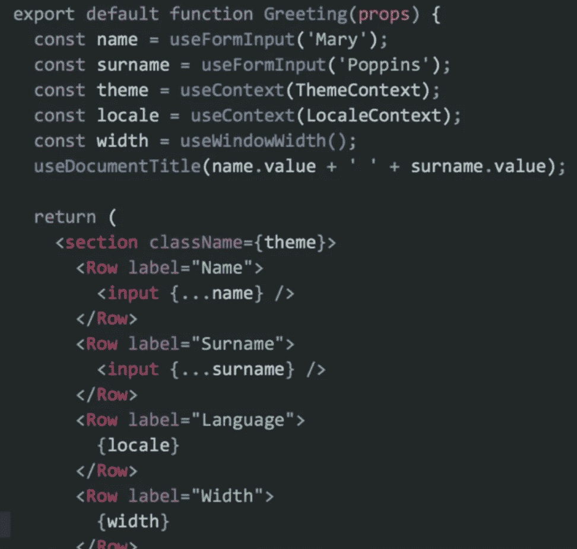

# React 类与功能组件的权威指南。

> 原文：<https://javascript.plainenglish.io/the-definitive-guide-to-react-class-vs-functional-components-481b1157ed08?source=collection_archive---------3----------------------->

** *以下信息是来自 Dan Abramov、Sophie Alpert 和 React 文档的信息汇总。***

# A.演示:类组件的主要问题

请打开此 codesandbox 链接到侧面:[https://codesandbox.io/s/classvsfunctional-0g863](https://codesandbox.io/s/classvsfunctional-0g863)并执行以下操作:

1.  在丹的个人资料中，**点击**的“关注(班级)”按钮。
2.  在 3 秒钟内，**使用页面顶部的下拉菜单将**用户资料更改为 Sophie。
3.  警告文本**错误地**显示为“跟随索菲”

如果你用“跟随(功能)”按钮重复上述步骤，警报文本应该**正确地**读作“跟随丹”

让我们仔细看看我们的类组件中的`showMessage`方法:

这个类方法从`this.props.user`中读取。道具在 React 中应该被视为不可变，不应该直接变异。然而，JavaScript 中的`this`一直是可变的。如果您回到 codesandbox 示例并查看 ProfilePageClass.js 中的构造函数，您会注意到`showMessage`函数的`this`上下文已经被绑定(因此这不是 bug 的原因)。当类组件在绑定到类组件的`this`上下文的请求完成之前重新呈现时，就会出现问题。`showMessage`回调没有绑定到任何特定的渲染，因此会丢失正确的属性。

# 这个问题可以用两种方法解决:

**选项 1)** 早读`this.props`，将提取的值显式传递给回调函数:

然而，这种方法使代码更加冗长，增加了复杂性，特别是如果`showMessage`函数还调用了`this.props`中包含的不同函数。

**选项 2)** 渲染时使用闭包捕捉道具:

通过这种方式，它里面的任何代码(包括`showMessage`)都可以保证看到特定渲染的正确道具。如果我们通过删除代码周围的类“shell”来简化代码，它就变成了:

## 类组件和功能组件的最大区别是功能组件在渲染时捕获道具。

为了使用**有状态**功能组件，需要 React 16.8+和 React 钩子的使用。

# B.对有状态组件使用钩子的优点

## 1)避免组件层次结构的不必要嵌套

(vanilla) React 中跨组件共享代码的主要模式是上下文 API、高阶组件和呈现道具模式的组合。这些模式在某些情况下很好，但是也有不好的一面，为了使用它们，你必须重组你的组件。在更复杂的情况下，这会导致“包装地狱”，组件树变得非常嵌套。这使得很难通过应用程序跟踪数据流。

下面的代码片段显示了类和功能组件的常见用例的并排比较，其中主题和区域设置被提供给组件。在类组件的例子中，每次我们通过`Context.Consumer`访问主题和区域设置时，都会出现一个额外的嵌套层(它将在整个应用程序的组件中重复)。而在功能组件的例子中，没有嵌套，因为我们现在可以使用`useContext`钩子。

## 2)更容易跨组件重用逻辑

类组件通过生命周期方法管理副作用。正因为如此，每一个单独的任务都必须被拆分成不同的生命周期方法。相比之下，我们可以根据功能组件的功能对副作用进行分组。

*管理副作用的类组件示例:*

有几点需要注意:

*   设置和更新`document.title`的代码是重复的，因为类组件迫使我们在组件生命周期中分割逻辑。
*   在`componentDidMount()`中，我们有两个不相关的方法，这使得孤立地测试它们变得更加困难。

*管理副作用的功能组件示例:*

通过使用钩子和将我们的副作用按功能分组，以上两个问题就解决了。此外，因为`useEffect()`只是一个函数，**我们现在可以提取它并创建一个定制的钩子来跨组件重用。**

通过钩子，我们还可以提取和重用常见的事件处理程序:

提取它们之后，我们现在可以在功能组件中使用它们，如下所示:

## 3)开发人员和编译器的开销更少

有了功能组件的使用，开发人员不需要像第一节中提到的那样担心在渲染时捕获道具，也不需要担心`this`上下文的改变和绑定。另外，**React 编译器不能像优化功能组件那样完全优化类组件**。虽然性能差异并不显著，但随着代码库的增长，这种差异会越来越大。其他需要注意的是，React 编译器不能完全缩小类组件，并且热重载对于类组件来说不太可靠。

# C.其他考虑

1)钩子覆盖了类的绝大多数常见用例。目前还没有与`getSnapshotBeforeUpdate()`或`componentDidCatch`生命周期方法等价的方法，但是 React 团队正在努力在不久的将来将它们包含进来。一些第三方库目前可能与钩子不兼容。但是，大多数广泛使用的库都支持钩子，因为类组件和函数组件可以在同一个应用程序中使用，所以这可能不是问题。
3)在函数组件中，所有的函数声明都是在重新呈现时重新创建的，而在类组件中，函数存储在类的原型中。这是一个可以忽略的性能差异，功能组件的整体性能比类组件略好(即使这是非常小的，性能也不是使用钩子的主要优势)。

## 建议:对于新的开发，使用功能组件代替类组件，原因如下:

*   在渲染时捕获道具
*   更扁平的组件层次结构树和更简单的组件代码
*   通过定制挂钩<= biggest benefit

For an existing codebase, it is **轻松地跨组件重用逻辑**不是高优先级将类组件转换为功能组件，除了代码库的标准化。

有关更多信息:

*   [https://overreated . io/how-are-function-components-different-from-classes/](https://overreacted.io/how-are-function-components-different-from-classes/)
*   [https://www.youtube.com/watch?v=dpw9EHDh2bM](https://www.youtube.com/watch?v=dpw9EHDh2bM)
*   [https://reactjs.org/docs/hooks-faq.html](https://reactjs.org/docs/hooks-faq.html)