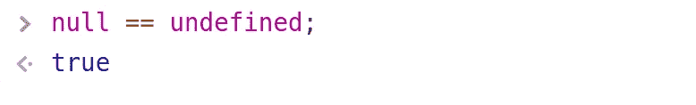
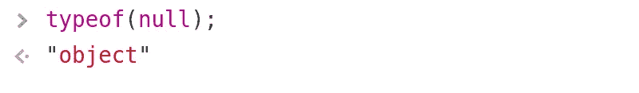
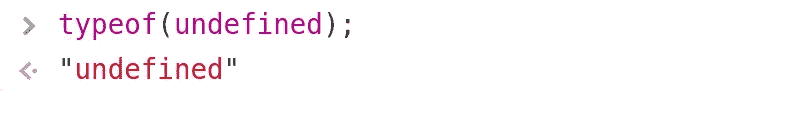
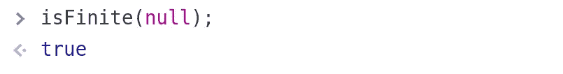
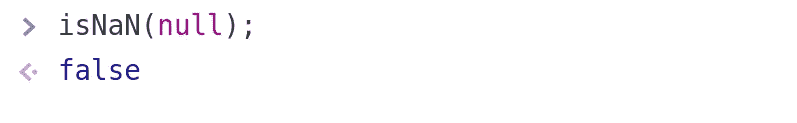
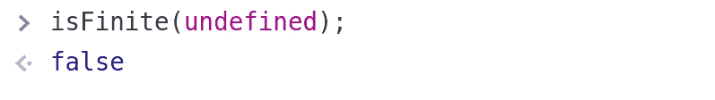
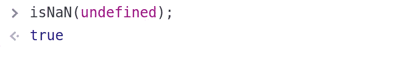

# JavaScript 中 Null 和 Undefined 的区别

> 原文：<https://javascript.plainenglish.io/the-difference-between-null-and-undefined-in-javascript-bf9ff374e544?source=collection_archive---------10----------------------->

## 空值和未定义值的比较


Photo by [Pankaj Patel](https://unsplash.com/@pankajpatel?utm_source=medium&utm_medium=referral) on [Unsplash](https://unsplash.com?utm_source=medium&utm_medium=referral)

JavaScript 是一种强大、成熟且广泛使用的语言。但它也可能以自己独特的方式变得奇怪。

这篇文章探讨了 JavaScript 中的 ***空值*** 和 ***未定义值*** 的区别。理解这些差异对于确保避免应用程序代码中的运行时错误非常重要。

# 运行代码

如果您想跟随或测试本文中的代码。你可以简单地使用你的网络浏览器的控制台来做到这一点。

在 Chrome 和 Firefox 中，你可以通过点击键盘上的`F12`按钮来访问网络浏览器控制台。

# 空值和未定义值的剖析

在 JavaScript 中， ***null*** 和 ***undefined*** 本质上是相同或相等的。什么…？是的，我知道这听起来很奇怪。

***null*** 和 ***undefined*** 在 JavaScript 中相等是因为

*   他们都是原始人
*   ***空*** 和 ***未定义*** 都是值，但没有太大的意义
*   ***null*** 用于表示某个对象值的有意缺失，而 ***undefined*** 表示一个没有值的变量。

为了测试 JavaScript 中的相等性，我们可以使用双等号`==`。

```
null == undefined; // true
```



上面的真值说明了 ***null*** 确实等于 JavaScript 中的 ***undefined*** 。

# 类型差异

除了等式运算符(双等式运算符)`==`，JavaScript 还有一个等式运算符，也称为严格等式或三等式运算符`===`。

身份运算符`===`更进一步，检查被比较值的底层类型是否相等。这实质上意味着，即使两个值相等，如果它们的基础类型不同，它们也可能不相同或严格相等。

为了测试严格的相等性，我们将使用如下的三重等号。

```
null === undefined; // false 
```


可以看到， ***上的恒等运算符 null*** 和 ***undefined*** 失败。

**外卖** : ***null*** 和 ***undefined*** 相等但不相同。

让我们找出这些值的潜在类型，这使得它们不相同。

JavaScript 提供了`typeof()`函数，可以用来查找某个值的类型。

```
typeof(null); // object
```



在 JavaScript ***中，null*** 属于类型 ***对象*** 。那么 ***未定义*** 呢？

```
typeof(undefined); // undefined 
```



输出显示 ***undefined*** 属于 ***undefined*** 类型，即值和值类型共享相同的名称。

# 数字测试

现在我们知道了一个事实，即 ***空*** 和 ***未定义*** 相等但不相同。我们还应该知道其他的区别吗？

为了探索更多的差异，我们将进行数字测试。如果一个值是一个数，就意味着我们可以对它进行数值运算。

在 JavaScript 中有两种主要的方法来测试一个值是否是一个数字。

1.  使用`isFinite()`函数——如果测试的值是一个数字，该函数返回**真**否则返回**假**。
2.  使用`isNaN()`函数——如果被测试的值是一个数字，那么它返回**假**否则它返回*s*真。

注: ***是南*** 的简称， ***是*** **不是一个数字。**

```
isFinite(null); // true
```



```
isNaN(null); // false 
```



从上面的两个测试中，我们现在知道 ***null*** 是一个数字。 ***未定义*** 呢？

```
isFinite(undefined); // false 
```



```
IsNaN (undefined); // true 
```



**事实** : ***null*** 是数字而 ***未定义*** 不是数字。这对于这两个值如何进行数学运算有很大的影响，这将引导我们进入下一节。

# 类型强制

JavaScript 是一种松散类型的语言，正因为如此，当对“*错误的*”值进行数学运算时，JavaScript 会自动将结果转换成它想要的某种类型。

不幸的是，这种自动转换，也就是通常所说的 ***型强制*** 可以随之带来很多惊喜。

看看下面的例子。

```
1 + null = 1;
3 * null = 0;1 + undefined = NaN;
3 * undefined = NaN;
```


正如您所看到的，我们可以对空值*进行一些数值运算，因为它是一个没有值的数字。因此，它被当作一个“零”。让我在这里指出 ***null 不等于零*** ，但在这种情况下不知何故就被这样处理了。*

*对 ***未定义的*** 值的数值运算导致返回的 ***是*** ***而不是一个数字*** 值，这可能是我们所不期望的。*

# *摘要*

*在本指南中，我们比较了 JavaScript 中的 ***null*** 和 ***undefined*** 值，我们发现:*

*   *两者都是原语*
*   *这两个值相等但不相同*
*   ****空*** 是数字，而**未定义**不是*
*   ****空值*** 属于对象类型，而 ***未定义*** 属于未定义类型*
*   ****null*** 适用于数值运算，而 ***未定义*** 产生 ***NaN****

*很好地理解这两个值可能会为您省去许多调试噩梦和产品代码中的错误。*