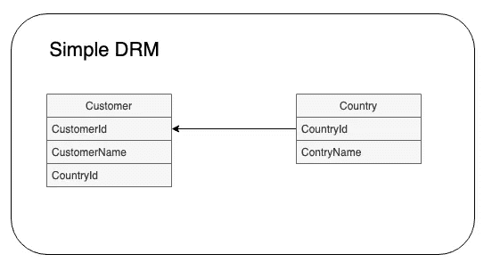
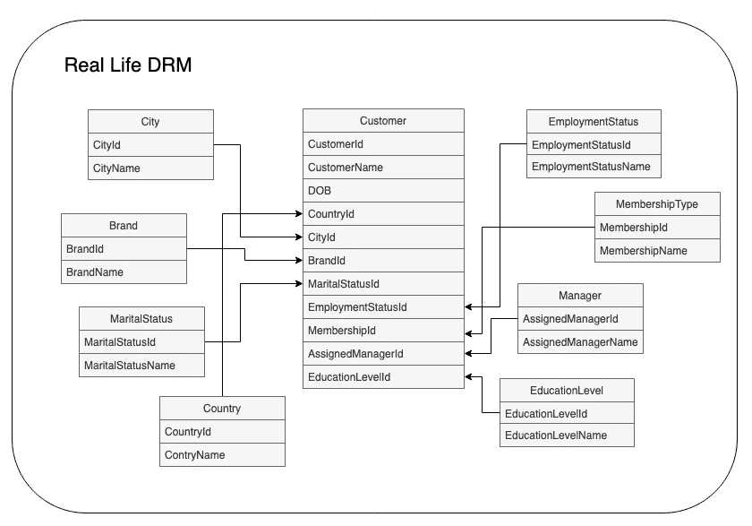
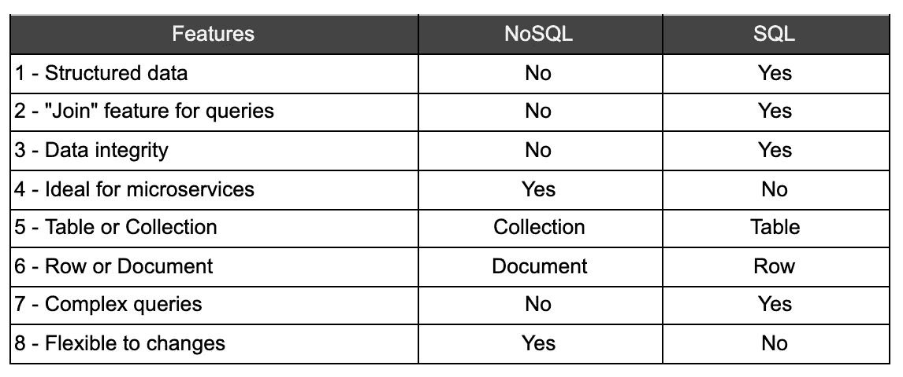

# 转向非关系数据库？作为开发人员，您应该知道以下内容

> 原文：<https://javascript.plainenglish.io/the-differences-between-relational-and-non-relational-databases-that-most-developers-dont-know-8fad25ae2575?source=collection_archive---------10----------------------->


Photo by [Valeriy Khan](https://unsplash.com/@valeriydmi?utm_source=unsplash&utm_medium=referral&utm_content=creditCopyText) on [Unsplash](https://unsplash.com/s/photos/programmer?utm_source=unsplash&utm_medium=referral&utm_content=creditCopyText)

NoSQL DBs 现在在初创企业和大公司中非常受欢迎。然而，仍然有相当多的开发人员努力去理解它是如何工作的，并且可能影响项目的架构决策。因此，我创建了一个旅程，强调数据库如何完全改变我们解决开发问题的方式，如数据结构、数据完整性、微服务、性能和查询。这个想法是为了提供一个关于 DB 的类型如何影响你的代码设计的观点。

## **SQL 数据库如何工作**

在我们讨论非关系数据库之前，让我们花点时间来理解关系数据库的概念，以及非关系模型与它有什么不同。考虑一个 DRM，其中有两个实体:客户和国家。



Academic DRM

关系非常简单:一个客户可以有一个国家，一个国家可以有很多客户。要使用此模型查询客户，您必须执行以下操作:

```
select * from customer cu, country co where cu.CountryId == co.CountryId
```

在上面的例子中，每次查询客户时，都会读取两个表:客户和国家。这是因为它们是相关的，并且国家/地区的详细信息是在国家/地区表中定义的。现在，让我们忘记技术角度，从一个不同的角度来观察这个模型:一个人一生中多久搬到一个不同的国家？我相信很少有人会说超过 4，我想现在你明白我的意思了。如果值几乎不变，我为什么要从两个表中读取呢？

如果您认为解决方案是将 CountryName 作为一个独立的字段添加到客户的表中，我相信您仍然没有理解这一点。尽管这可能是上述问题的解决方案(稍后讨论),但不幸的是，它可能会造成数据的不一致。如果您创建一个开放字段，为了按国家查询报告，您很可能会找到“AUS”、“AU”、“AUSTRALIA”、“Australia”等。肯定不是我们想要的。而且，上面的例子只是学术上的。在现实生活中，客户 DRM 看起来更像这样:



Real Life DRM 😱

这看起来像是我过度构建了上面的 DRM，但是相信我，还有更糟糕的。现在想象一下，查询所有这些表来获取一个客户的配置文件的成本。这就是关系数据库的工作方式，也是创建非关系数据库的原因之一:降低代码执行期间从不同表中查询细节的成本。另一方面，关系数据库为构建业务报表和复杂查询提供了更好的支持。

## **这个架构在非关系数据库中会是什么样子？**

在 noSQL 模型中，我们有集合而不是表，它们是不相关的。什么？😱。是的，没有关系。他们只是自己独立游荡。最重要的是，集合的文档不必维护相同的数据结构，这意味着更大的灵活性。主要区别在于，如果需要提取实体，单个集合将包含所有必要的信息。大概是这样的:

```
{
    "_id": "b28f459c-8ad3-11ea-bc55-0242ac130003",
    "name": "Test Name",
    "country": {
      "_id": "b28f459c-8ad3-11ea-bc55-0242ac130004",
      "name": "Australia"
    }
}
```

虽然我们仍然有两个集合(Customer 和 Country)，但是 Customer 的新记录不仅包含国家的 Id，还包含名称。这样，您可以轻松获得国家的名称，而无需查询其集合。

## 但是如果客户的国家名称改变了呢？

现在这开始变得有趣起来，因为没有一个数据库特性来镜像数据。对于非关系数据库，有几种方法可以解决这个问题(如果这确实是一个问题的话)，下面是一些可以根据业务决策使用的选项:

1.  不要让客户更改国家的名称，而是创建一个脚本，一次更新国家和客户。例如:

```
Customer.update(
    { "_id": "b28f459c-8ad3–11ea-bc55–0242ac130003" },
    { "country.name": "new_country_name" }
)
Country.update(
    { "_id": "b28f459c-8ad3–11ea-bc55–0242ac130004" },
    { "name": "new_country_name" }
)
```

1.  执行一个任务(cronjob、lambda 或 message queuing ),该任务将检查已更改的国家，并用该国家更新所有客户。这将保持一致性，但需要不断更新数据。
2.  保留旧数据，直到有人更新客户。这种解决方案不仅可以保持一致性，而且成本非常低。换句话说，UI 将具有新的名称，当客户被更新时，它将具有新的正确的国家名称。
3.  更新国家名称的相同代码函数也将更新客户。这将保持一致性，但 UX 的成本很高，因为用户/客户端需要等待整个后端事务完成，而且这也是一个难以维护的解决方案。
4.  忽略数据库中的数据，只在客户机上更改它。例如，如果 DB 返回“AUS”或“AU”，则显示“澳大利亚”。如果必须更改许多客户端，这种解决方案将无法保持一致性，并且成本很高。

这个想法不是告诉如何解决问题，而是强调方法如何根据 DB 类型而变化。每个选项都适用于不同的情况。例如，选项 3 可能是最好的选择，因为在 1949 年，这个国家**暹罗**变成了**泰国**，而且并不是每个人都从第一天开始就采用新名字。我相信即使是老前辈也会使用以前的名字，那么为什么要花费时间和精力这么快就改变呢？

## **好的。客户 x 国家很简单，但是在第二个复杂的例子中，客户有几个关系呢？**

实际上，在非关系架构中，由于灵活的数据结构，这些实体不太可能是数据库中的独立文档。在大多数情况下，它们只是一个带有一些预定义值的枚举。因为 noSQL DB 中的文档可以有任何结构，所以在代码级定义它的模式是很常见的。当然，如果您想让客户能够灵活地自己管理数据，这并不适用，这意味着在这种情况下，SQL DB 可能是更好的选择。如果我们考虑这个复杂的例子，ODM 看起来会像这样:

```
**var** customer = new Schema({
    name: {
        type: String
    },
    DOB: {
      type: Date,
      required: true
    },
    country: new Schema({
        name: {
            type: String
        }
    }),
    membershipType: {
        type: String,
        enum: ['Gold', 'Silver', 'Premium']
    },
    employmentStatus: {
        type: String,
        enum: ['Casual', 'Full-time', 'Part-time', 'Retired']
    },
    maritalStatus: {
        type: String,
        enum: ['Married', 'Divorced', 'DeFacto', 'Single']
    }
});
```

在这种情况下，因为选项是预定义的，所以将对任何输入值的尝试进行验证。想象一下，我们需要将事实上的**变成事实上的**和**。可以对已经存在的记录执行更新查询，并更新代码。**

> **因为 nonSQL 是灵活的，所以数据模式可以在代码级别定义，并且很容易更改、验证和重用。换句话说，没有 DB 变化。**

**对于上例中的国家/地区详细信息，从客户集合的角度来看，该数据是来自另一个集合还是任何其他来源并不重要。重要的是它需要一个代码(在创建新模式时由一些 ODM 隐式创建)和一个名称。事实上，它可能有创建日期、更新日期、客户语言、以前的国家等。你可以灵活地创造任何你想要的东西。**

## ****我会一直更新我的收藏以保持数据的一致性吗？****

**到目前为止，我们一直在谈论不同的实体以及如何保持它们的变化一致。但是如果一致性实际上意味着不改变数据呢？😕。好吧，我来解释一下。让我们考虑一个经典的产品订单，其中一个订单可能包含几个产品。在关系数据库中，它将包含:产品、客户、订单、产品订单列表等。但是，因为我们不会关联数据，所以在非关系数据库中，顺序应该是这样的:**

```
**var** Order = new Schema({
    customer: {
        customerId: UUID,
        **membershipType**: String,
        **maritalStatus**: String //or a list of predefined values
    },
    date: {
        type: Date,
        required: true
    },
    total: {
        type: Number,
        required: true
    },
    Products: [{
        productId: UUID,
        **name**: String,
        **price**: Number,
        discount: Number,
    }],
});
```

**如果你仔细观察，在上面的例子中，我突出显示了一些属性，因为实际上它们是我们不想改变的信息，以防原始源发生变化。什么🤪？是的。假设零售商根据会员资格提供折扣，有时也根据婚姻状况提供折扣。在这种情况下，我们不想让这些数据与客户的数据保持镜像，因为订单代表了客户购买时的快照，这是我们想要知道的会员信息。因此，如果客户升级他们的会员资格，我们将知道他们在以前的订单中有“基本”类型。**

**令人惊讶的是，要对关系数据库执行相同的查询，需要使用几个连接，其中包括:**

*   **拥有会员身份和婚姻身份的客户，**
*   **和有订单的客户，**
*   **Order with membershipStatus 和 with maritalStatus，(是的，我们必须复制这个关系，因为它对客户来说是不可变的)**
*   **等等**

**这只是从订单中提取客户详细信息。如果我们还需要查询其他属性的话，查询会一直持续下去。**

## **但是如果我想查询所有客户的详细信息呢？**

**相信我的写作的功效，在这一点上，我们理解目标是减少数据库查询成本。换句话说:性能。理想情况下，应该在架构设计期间检查预期要检索的数据，但是如果结论是分别从两个不同的实体收集数据，那么解决方案将是执行 2 个或更多查询。但是，如何执行查询将取决于您的代码架构。让我们看几个例子:**

*   **微服务:如果实体不属于微服务，那么，客户端 UI 将需要从每个微服务中检索数据。**
*   **Monolithic:如果这是一个非常常用的请求，并且所有数据都被消耗，那么可以创建一个端点来检索所有数据。如果不经常使用，并且存在风险，或者根据不同场合部分使用客户详细信息，则可以为每个案例创建不同的端点。**

**更重要的是，尽管 noSQL DB 没有关系概念，但 Mongoose 有一个名为[填充](https://mongoosejs.com/docs/populate.html)的特性，它允许使用与 SQL DB 相同的概念进行连接。然而，即使这个功能非常方便，也有一些人反对使用它，因为这不是一个非关系数据库应该使用的方式。**

## ****数据库的类型如何影响微服务架构？****

**[微服务](https://microservices.io/patterns/microservices.html)的一个原则就是松耦合，也就是说每个微服务都要完全独立和隔离。我不打算详细介绍这个模式(也许我应该写一整篇关于这个主题的文章)，但是我想你可以明白我的意思。每个服务都应该有自己的数据库，这些数据库不应该与其他数据库相关，这使我们得出结论，nonSQL 数据库是微服务的最佳选择。我从未在微服务中使用过 SQL DB，但我觉得复制与多个表相关的表并不有趣。此外，对所有微服务使用相同的数据库是一种反模式。如果你使用过关系数据库的微服务，请留下你的经验评论。**

> **与其他服务松散耦合:使团队能够大部分时间独立地工作于他们的服务，而不受其他服务变更的影响，也不会影响其他服务**

**不久前，我写了一篇关于在将 AWS Lambda 函数连接到数据库之前应该知道的[事情的文章，其中我强调了我选择 MongoDB 而不是 DynamoDB 作为无服务器应用程序的原因。然而，出于同样的原因，考虑到每个表都被视为完全独立的实体，DynamoDB 将是微服务的最佳调用。这将有助于保持为每个服务维护不同 DB(在 dynamoDB 中，它们是表)的模式。](https://medium.com/javascript-in-plain-english/serverless-things-i-wish-i-had-known-part-2-dynamodb-x-mongodb-x-aurora-serverless-1053cfddff36)**

## ****总而言之****

**在构建应用程序时，有几种数据库可供选择，它们基本上分为 NoSQL 和 SQL。尽管 NoSQL 已经接管了市场，但了解它如何改变我们设计应用程序、解决日常问题的方式，以及它是否满足项目的业务需求是非常重要的。**

**这里还有一个表格，总结了本文涉及的主要领域:**

****

**Main differences with the answers**

****词汇****

**DRM →数据关系模型
ODM →对象文档映射器**

****参考文献****

**[https://mongoosejs.com/docs/populate.html](https://mongoosejs.com/docs/populate.html)
https://microservices.io/patterns/microservices.html**