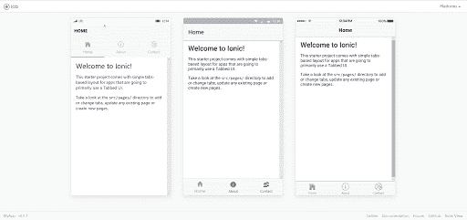
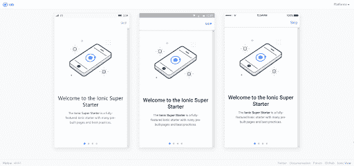
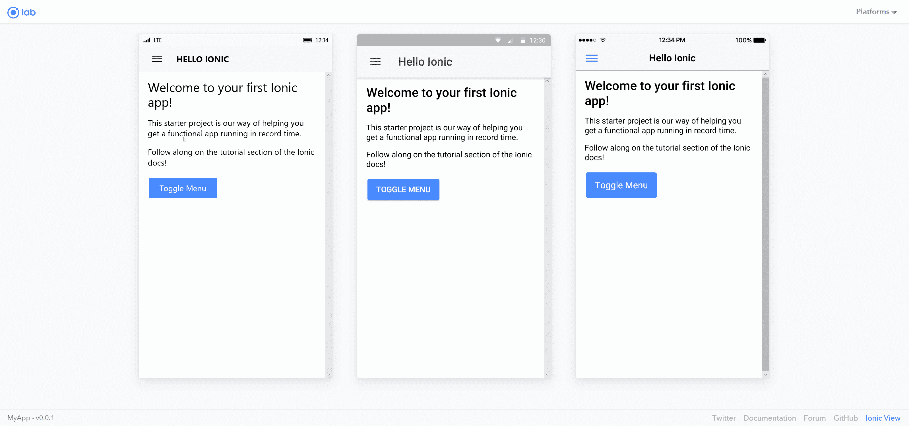

# 不同类型的离子 5 起始模板

> 原文：<https://javascript.plainenglish.io/the-different-types-of-ionic-5-starter-template-75091ae916e3?source=collection_archive---------4----------------------->

## Ionic 5 入门模板的多种类型及其作用


对于房间里已经使用 Ionic 创建了一些应用程序的开发人员来说，这篇文章就像参加一个 [2 小时的 Zoom 电话会议](https://medium.com/muddyum/asleep-employee-embarrassed-when-boss-calls-on-him-to-participate-in-zoom-meeting-d88c858b1929)一样无聊乏味。我建议更高级的人提前阅读[的下一篇文章](https://medium.com/swlh/heres-a-list-of-ideas-to-get-started-learning-ionic-5-1bd2ce0a689a)。

对于想要快速了解 Ionic 页面、外观以及它们附带的功能而不需要*实际上*单独安装、打开和运行它们的开发者来说，这篇文章就是为你准备的！

# **什么是离子？**

所以在我们进入通常使用的 Ionic 的实际页面之前，首先我们必须知道什么是 Ionic。Ionic 是一个框架，它“使得构建高性能移动和[渐进式 Web 应用](https://web.dev/what-are-pwas/)(或 PWAs)变得容易，这些应用在任何平台或设备上看起来都很漂亮”([“什么是 Ionic。”](https://ionicframework.com/what-is-ionic))。它与任何常用的 Javascript (JS)或 JS 框架(如 AngularJS、ReactJS 和 VueJS)相结合，使为 Android、iPhone 和 Windows mobile 设备创建应用程序变得简单而容易。

# 什么是渐进式网络应用？

如果你是这方面的初学者，你可能会想“什么是渐进式网络应用程序？”渐进式网络应用程序(PWAs)是经过专门设计的网络应用程序，可以充分利用网络应用程序和移动(本地)应用程序的优势。过去，所有应用程序都是原生构建的，这意味着它是用特定的编程语言为该设备编写的。在最近几年，我们已经看到了 Google Play 和苹果应用商店的 PWAs 的崛起。pwa 的两个众所周知的例子是 [Slack](https://slack.com/) 和 [Spotify](https://www.spotify.com/us/) 。

[](https://medium.com/swlh/adding-badge-notifications-with-ionic-4-and-angular-f42c4be2ff9b) [## 使用 Ionic 4 和 Angular 添加徽章通知

### 所以你有一个已经开发了一段时间的应用程序，你可以想象下一步要添加的完美项目。…的方法

medium.com](https://medium.com/swlh/adding-badge-notifications-with-ionic-4-and-angular-f42c4be2ff9b) 

# 空白模板


GIF by [Ionic Templates](http://www.blog.planetfor.us/blog/Ionic-Templates.html)

我知道这可能很难理解，但是运行下面的命令会创建…你猜对了…一个空白模板。当然，它有**<YOUR _ APP _ NAME>**的地方就是你放置项目名称的地方。

```
ionic start <YOUR_APP_NAME> blank
ionic serve --lab
```

# 选项卡模板



GIF by [Ionic Templates](http://www.blog.planetfor.us/blog/Ionic-Templates.html)

该模板创建了一个入门 Ionic 应用程序，在屏幕底部有 3 个不同的标签，用户可以点击并在页面之间切换。

```
ionic start <YOUR_APP_NAME> tabs
ionic serve --lab
```

# 超级模板



GIF by [Ionic Templates](http://www.blog.planetfor.us/blog/Ionic-Templates.html)

超级模板包括了除厨房水槽之外的所有东西(尽管我相信他们会在下一次更新中加入)🤔).我不建议你第一次潜入爱奥尼亚就从这个开始，因为它在 T2 挤满了人。

```
ionic start <YOUR_APP_NAME> super
ionic serve --lab
```

[](https://medium.com/@thetwgeorge/everybody-loves-easter-eggs-aff3a0c4b537) [## 🎉人人都喜欢复活节彩蛋

### 我相信每个人都有一个美好的回忆，自己玩自己最喜欢的游戏，并随机遇到一个…

medium.com](https://medium.com/@thetwgeorge/everybody-loves-easter-eggs-aff3a0c4b537) 

# 侧菜单模板


GIF by [Ionic Templates](http://www.blog.planetfor.us/blog/Ionic-Templates.html)

在侧边菜单模板中，你可以看到侧边栏是如何在 Ionic 应用程序中工作的。这个模板的酷之处在于，即使在桌面模式下的移动视图之外，它仍然可以工作！唯一会改变的是侧边菜单会变成静态的，你可以随时查看菜单。

```
ionic start <YOUR_APP_NAME> sidemenu
ionic serve --lab
```

# 会议模板


GIF by [Ionic Templates](http://www.blog.planetfor.us/blog/Ionic-Templates.html)

我真的很喜欢[爱奥尼亚团队](https://ionicframework.com/team)做的东西，他们对文档和例子的细节非常敏锐。他们为未来的框架和软件应用设置了很高的标准。会议应用程序通过向开发者提供一个可能用于会议的移动应用程序的运行示例，展示了他们对每件事情投入了多少关注和细节。

```
ionic start <YOUR_APP_NAME> conference
ionic serve --lab
```

# “我的第一个应用程序”模板



GIF by [Ionic Templates](http://www.blog.planetfor.us/blog/Ionic-Templates.html)

“我的第一个应用程序”模板提供了一个工作的移动应用程序，向您展示了 Ionic 应用程序可以附带的许多不同元素。以及如何设置每个元素！

```
ionic start <YOUR_APP_NAME> my-first-app
ionic serve --lab
```

[](https://medium.com/swlh/heres-a-list-of-ideas-to-get-started-learning-ionic-5-1bd2ce0a689a) [## 这里有一个开始学习 Ionic 5 的想法列表！

### 我们都经历过…学习一门新的编程语言(甚至是你的第一门编程语言),你都…

medium.com](https://medium.com/swlh/heres-a-list-of-ideas-to-get-started-learning-ionic-5-1bd2ce0a689a) 

# —参考文献

离子框架。“什么是爱奥尼亚。”*离子架构*，ionicframework.com/what-is-ionic.

如果你想看我以前写的文章或与我联系，请点击这里访问我的网站！