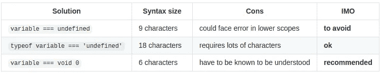
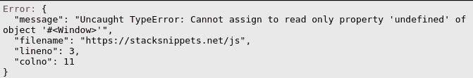
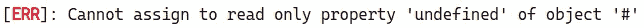

# 检查 JavaScript 中未定义的最好方法

> 原文：<https://javascript.plainenglish.io/the-different-ways-to-check-for-undefined-acaaa385a719?source=collection_archive---------5----------------------->

## 看完这个，你就再也不会用同样的方法查`undefined`了！

在 JavaScript 和 TypeScript 中，有不同的方法来检查变量是否为`undefined`。然而，有些方法比其他方法更好。看完这篇文章，你再也不会用同样的方法检查`undefined`！

yourself, seeing your new code

# 简历

# 变量===未定义

第一种解决方案，也是最常用的，直接将变量值与内置的全局标识符`undefined`进行比较，该标识符值`undefined`。

问题是有可能在更低的范围内重新声明`undefined`变量，使比较不真实。

This code display “false” when it is expected to display “true”

在现实生活中，这个问题很可能永远不会发生。

要知道 JavaScript 和 TypeScript 不允许在全局范围内改变`undefined`变量。

in JavaScript

in Typescript

# 变量的类型=== '未定义'

第二个解决方案是使用`typeof`操作符。它被广泛使用，唯一的缺点是冗长——18 个字符。

# 变量=== void 0

第三个也是最后一个解决方案是使用`void`操作符。与`0`一起使用，它允许只使用 6 个字符进行检查，而不需要知道其他的缺点。

谢谢你阅读我！如果你想到检查`undefined`的新方法，请在评论中告诉我，我会把它添加到列表中。:)

祝你愉快