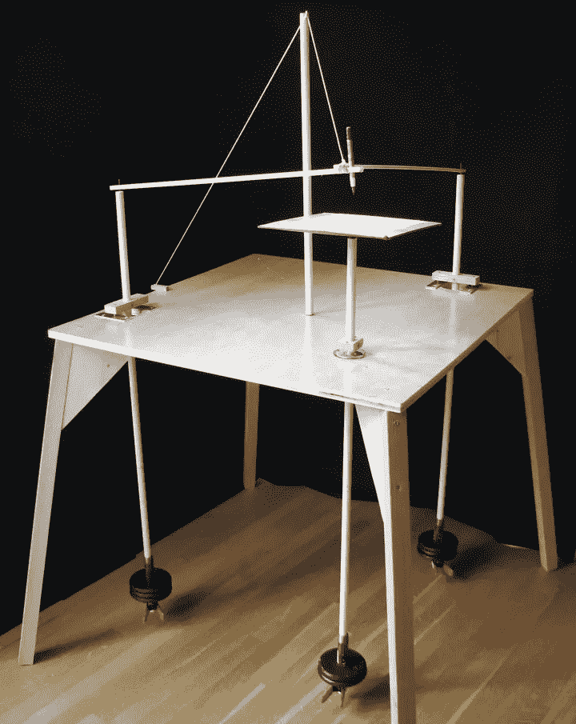
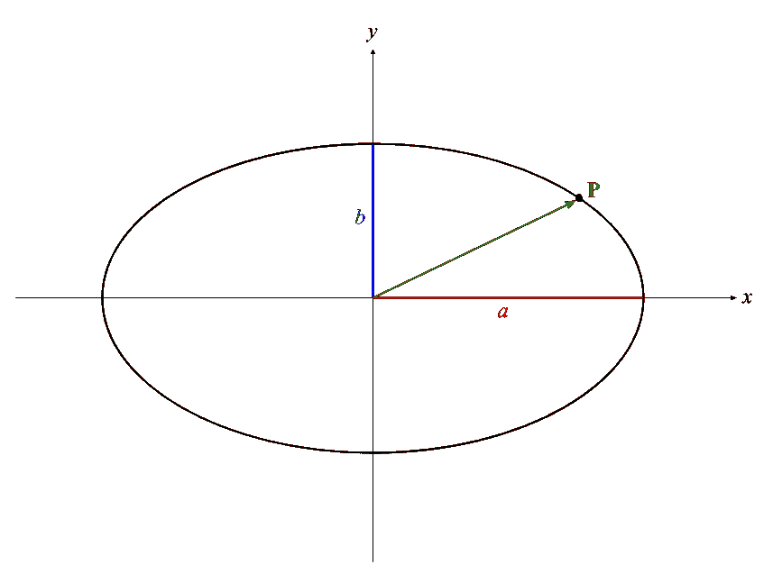
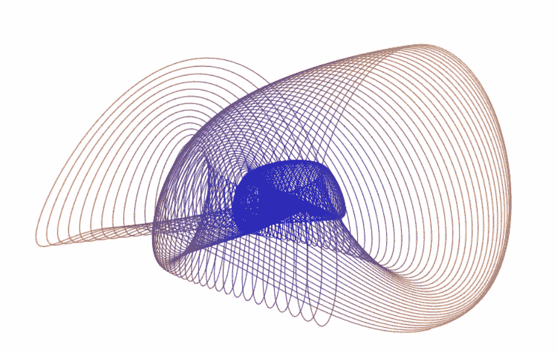

# 数字谐波记录仪

> 原文：<https://javascript.plainenglish.io/the-digital-harmonograph-b932fd3e6c2e?source=collection_archive---------2----------------------->

## 一个有趣的 JavaScript 动画，灵感来自维多利亚时代的精巧装置

最近，我了解了一种叫做[和声图](https://en.wikipedia.org/wiki/Harmonograph)的装置，这是一种 19 世纪的装置，它利用一个钟摆系统在纸上画出复杂的图案。这是一个优雅的想法，有很多种。一种常见的谐波计包括三个钟摆:一个在椭圆中移动一张纸，另外两个在纸上移动一支笔。这里有一个卡尔·西姆斯的例子，他是一位数字媒体艺术家，为建造它提供了[精彩的指导](https://makezine.com/projects/build-swinging-art-table-uniquely-hypnotic-drawings/):

[Three-pendulum rotary harmonograph by Karl Sims](https://makezine.com/projects/build-swinging-art-table-uniquely-hypnotic-drawings/) (used with permission).

我觉得用电脑模拟这种和声会很有趣。在这里，我展示了在 web 浏览器中运行的 JavaScript 代码，它根据三个相互作用的钟摆的行为来绘制图像。除了数学和物理，我们还将介绍一些关于浏览器环境中动画的有用技巧。

## 单摆的行为

在讨论多个摆的相互作用之前，理解单摆的行为是很重要的。这里介绍的算法使用简单的公式模拟单摆。这个模型很好地模拟了真实钟摆的行为。该模型有两个基本思想:

*   如果没有摩擦力，钟摆沿着重复的椭圆轨迹运动。
*   当有摩擦时，路径的半径*随时间衰减*(变小)。经过足够长的时间后，钟摆的运动变得微不足道。

## 无摩擦的钟摆

下图显示了我们如何对第一个想法建模，即点 **P** 沿完美椭圆移动:

A frictionless pendulum moves along an elliptical path.

位置向量 **P** 代表摆锤在给定时刻的位置。在这个无摩擦模型中， **P** 无限期地绕着同一个椭圆路径运行。椭圆的形状由常数 *a* (半长轴)和 *b* (半短轴)定义。在时间 *t* 时， **P** 的位置由以下一对坐标表示:

这里， *F* 是以弧度/秒为单位的旋转频率， *K* 是以弧度为单位的起始角度(或*相位*)。要明确的是，这些角度是概念性的。它们不能在所描绘的平面上进行测量，因为一般的椭圆不是正圆。重要的想法是，每次值( *Ft* + *K* )增加 2π，点 **P** 绕椭圆又转了一周。

## 给模型增加摩擦力

我们在公式中做了一个小小的改变，来模拟摩擦力是如何逐渐减慢钟摆的速度，并使其停止的。我们乘以一个指数衰减因子，以随时间逐渐降低 *x* 和 *y* 的幅度:

这里， *R* 是一个非负实数，称为*衰减常数*。如果 *R* =0，就没有摩擦力，因为 *e* ⁰=1.如果*R*0，那么随着时间 *t* 的增加，指数因子渐近地减小到零。小正值的 *R* 模拟少量摩擦，导致曲线缓慢螺旋上升。 *R* 的值越大，摩擦越大，因此向内螺旋发生得越快。

现在我们有了单摆的数学模型。我们有五个可调参数， *a* ， *b* ， *F* ， *K* 和 *R* ，可以做出各种螺旋形状。

## 组合多个摆锤

我们已经讨论过单摆的模型。但是谐波模拟包括三个钟摆。我们如何修改公式来处理三个相互作用的摆的行为？我采用的方法相当简单。每个摆都有自己的一套五个参数 *a* 、 *b* 、 *F* 、 *K* 、 *R* 。这五个参数对于三个摆锤中的每一个都是独立的，总共有 15 个可调参数。

为了描绘谐波图的形状，我们计算三个摆的三个( *x* 、 *y* )向量，然后将它们加在一起。也就是说，将三个摆锤的三个 *x* 坐标相加产生一个净 *x* 坐标，对三个摆锤各自的 *y* 坐标做同样的事情。由此产生的( *x* ， *y* )对表示在 *t* 时假想笔在假想纸上的位置。

A sample frame from the harmonograph animation.

## 动画算法

我想要一些有趣的东西来观看和互动，所以单一的静态和声图形是不够好的。正如你所看到的，上面的演示随着时间的推移而变化，并且有一些滑块可以让你交互式地调整最终的模式。(我将在下面解释滑块。)

对于每个动画帧，我按照上面概述的方法迭代一系列时间值 *t* 。因此，在动画的每一帧中，代码都绘制了一个完整的和声涂鸦，从 *t* =0 开始，将 *t* 增加一个小的量，并将连续的点与 HTML 画布上的线段连接起来。当指数衰减使得图形螺旋小于任意阈值时，绘图停止。

在随后的每个动画帧中，我以不同的线性速率改变三个相位角(常数 *K* ),这样三个钟摆以不同的相互相位开始。这导致谐波图形状随着时间逐渐变形。参见下面代码清单中的函数`MakeHarmonograph`。

动画下方的滑块允许您调整钟摆的三个频率( *F* 常量)。您会注意到，当频率比接近整数时，形状看起来更“平滑”，当频率比偏离整数时，形状看起来更“疯狂”。

真实的物理谐波图也有这种整数比趋势。它们的摆频是通过在吊杆上上下移动重物来调整的，它们需要调整才能做出令人愉悦的图案。

## 模拟器代码摘要

该代码不需要外部 JavaScript 包或框架，并且可以在任何相当现代的浏览器中运行。我在 Chrome、Safari 和 Edge 上进行了测试。

动画通过使用 [requestAnimationFrame](https://developer.mozilla.org/en-US/docs/Web/API/window/requestAnimationFrame) 函数在每次浏览器准备渲染另一帧动画时重复调度回调来进行。我的回调是函数`timerTick`，通过函数`Render`绘制一帧，然后调度自己在下一个动画帧再次被调用。

在每个动画帧中，代码创建一个`Harmonograph`对象，其构造函数接受一个任意的`Pendulum`对象列表。代码是灵活的。你可以改变它来使用任意数量的摆，而不仅仅是三个。它继续为 *t* 的增量值计算一系列笔位置，直到摩擦力使笔减速到某个小半径。

为了让颜色更有趣，我使用从红色逐渐过渡到蓝色的[径向渐变](https://developer.mozilla.org/en-US/docs/Web/API/CanvasRenderingContext2D/createRadialGradient)渲染螺旋形状。我试着用它自己计算的颜色画每一条线段，但是这极大地损害了性能。渐变要快得多，因为它们允许我只需调用一次`context.stroke()`就能画出整个形状。

## 代码列表

代码的 HTML 部分非常简单。它由一个画布和三个滑块组成:

样式表对于使画布适合浏览器的客户区很重要。它还可以防止用户在触摸屏设备上点击画布时令人讨厌的闪烁。这是:

大多数有趣的东西都在 JavaScript 文件`harmonograph.js`中:

这就是了。我希望你喜欢玩 harmonograph 模拟器，同时，我希望你能从自己有趣的项目中学习并改编代码。大家可以随意提问，我会尽力回答。

## 参考

*   GitHub 上模拟完成的[源代码。](https://github.com/cosinekitty/harmonograph)
*   在自己的网页上运行的[谐波模拟](https://doncross.net/harmonograph/)。
*   卡尔·西姆斯关于如何[打造自己的物理和谐图](http://www.karlsims.com/harmonograph/)的指导。