# Javascript 的 DOM

> 原文：<https://javascript.plainenglish.io/the-dom-of-javascript-848506ebf386?source=collection_archive---------0----------------------->

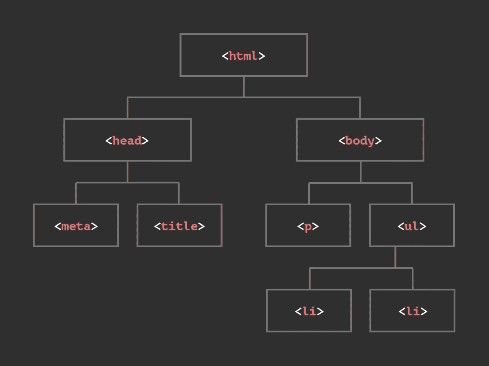

Document Object Model

# HTML DOM(文档对象模型)简介

我们将只讨论我们需要读取/更改表单元素值/设置、文档内容和文档样式属性的 DOM 方面，所以我们不会完整地讨论 DOM

文档对象模型是一个平台和语言中立的接口，它允许程序和脚本动态地访问和更新文档的内容、结构和风格。可以进一步处理该文档，并且可以将该处理的结果合并回所呈现的页面中。这是 W3C 和网络上 DOM 相关材料的概述。( [W3C](http://www.w3.org/DOM/) )

HTML DOM 模型是由浏览器创建的对象树，因此我们可以使用 JavaScript 快速找到 HTML 元素

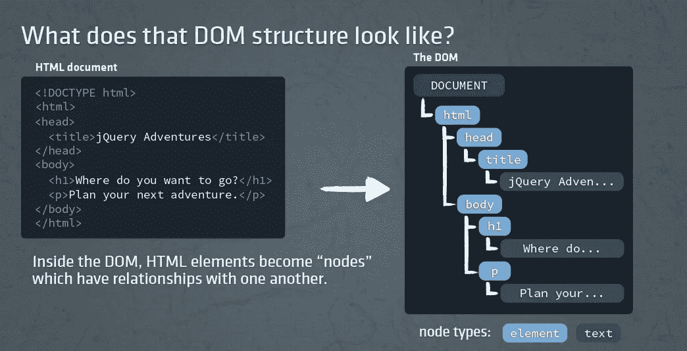

# JavaScript 和 DOM

JavaScript 可用于:

*   更改页面中的 HTML 元素
*   更改页面中的 HTML 属性
*   更改页面中的 CSS 样式
*   对页面中的事件做出反应

# 查找 HTML 元素

JavaScript 经常被用来操作 HTML 元素。

要做到这一点，你必须先找到元素。您可以通过以下方式做到这一点:

*   通过 id 查找 HTML 元素
*   通过标记名查找 HTML 元素
*   通过类名查找 HTML 元素

# 文档对象方法

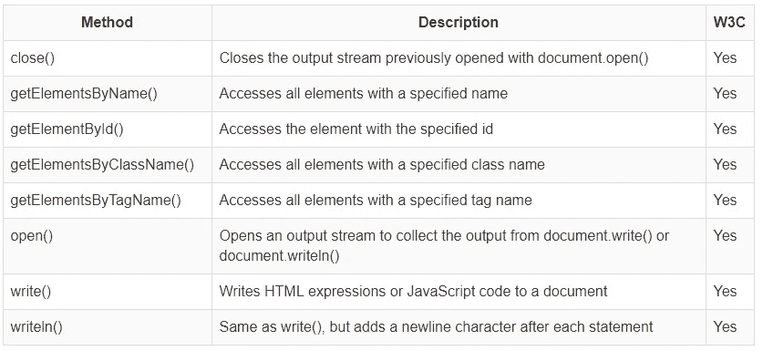

## 通过`id`查找 HTML 元素

```
var x = document.getElementById( "id1" );
```

## 通过标记名查找 HTML 元素

```
var x = document.getElementsByTagName( "p" );
```

## 通过`class`查找 HTML 元素

```
var x = document.getElementsByClassName( "myClass" );
```

# 为 HTML 元素设置样式属性

## 句法

```
document.getElementById( "id1" ).style.property = new style;
```

## 例子

```
<p id="id2">Hello World!</p><script>
document.getElementById( "id2" ).style.color = "blue";
</script>
```

如果要多次获取同一个元素，将请求的元素存储在变量中并使用该变量会更有效。

## 例子

```
<p id="id3">Hello World!</p><script>
var myParagraph = document.getElementById( "id3" );
myParagraph.style.color = "blue";
myParagraph.style.fontSize = "30";
</script>
```

# 文档对象属性

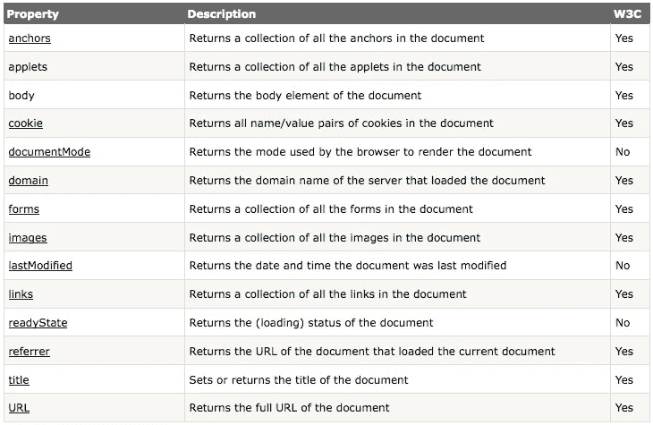

## 对象属性可以是其他对象

对象可以部分由其他对象组成，或者包含其他对象。以下是浏览器现成 JavaScript 对象层次结构的一部分:

```
window
   |
   . parent              //the "parent" window or frame
   |
   . frames              //an array of frames in the window/frame
   |
   . location            //the URL of the document in the window/frame 
   |
   . document            //the document in the window or frame
         |
         . anchors       //an array reflecting all the anchors in a document
         |
         . links         //an array reflecting all the links in a document
         |
         . forms         //an array reflecting all the forms in a document
             |
             . elements  //an array reflecting all the elements in a form
```

# 点符号

```
return = awindow.document.aform.elements[ 2 ].value;
```

像这样的语句在 JavaScript 编程中很常见。

`awindow`按名称引用一个窗口，文档是那个窗口中的`document`，`aform`是文档中一个表单的名称，`elements[ 2 ]`是指表单中的第三个元素*，而`value`将返回该元素的值。*

# 用 HTML DOM 样式对象改变 HTML 样式

# 文本属性

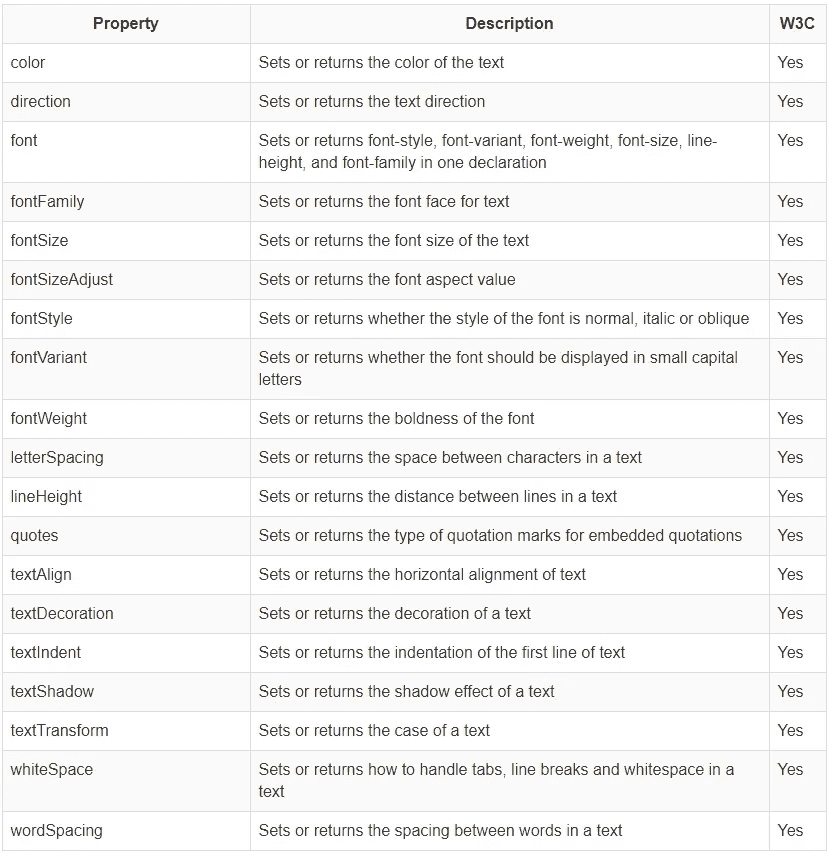

# 背景属性

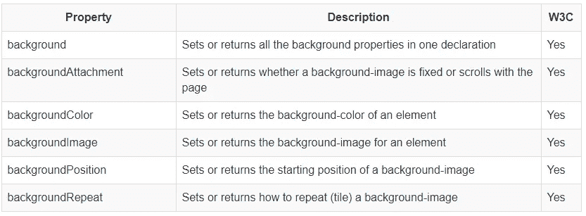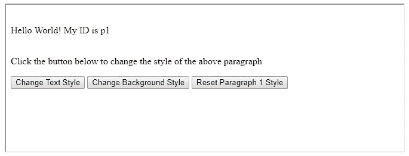

# HTML DOM 事件

HTML DOM 事件允许 JavaScript 在 HTML 文档中的元素上注册不同的事件处理程序。

事件通常与函数结合使用，在事件发生之前(例如当用户单击按钮时)，函数不会被执行。

# 事件的一些常见用法

*   当用户点击鼠标时
*   当网页被加载时
*   当图像已经被加载时
*   当鼠标移动到一个元素上时
*   当输入字段改变时
*   当提交 HTML 表单时
*   当用户敲击按键时

# 鼠标事件

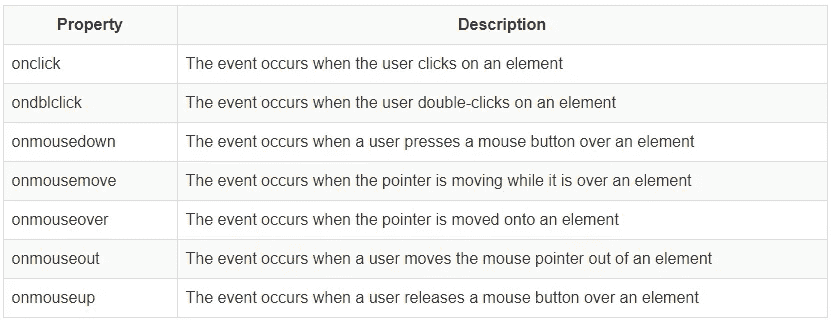

# 键盘事件

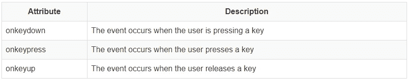

# 表单事件

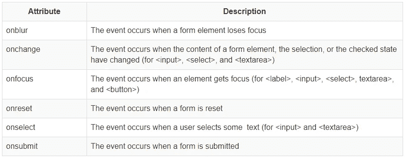

# 对象事件

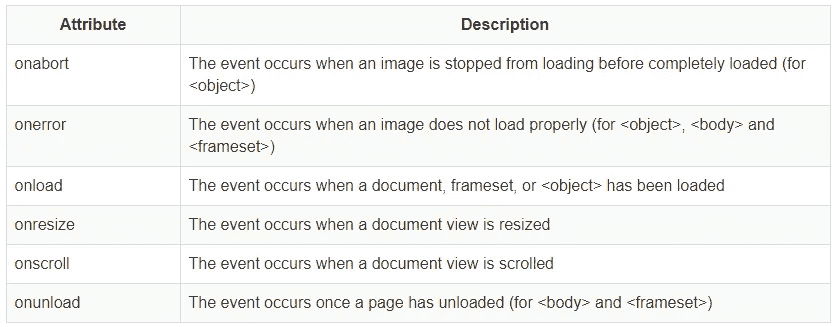

# 对事件做出反应

JavaScript 可以在事件发生时执行，比如当用户点击 HTML 元素时。

要在用户单击元素时执行代码，请将 JavaScript 代码添加到 HTML 事件属性中:

```
onclick = JavaScript
```

# 对事件做出反应—例如

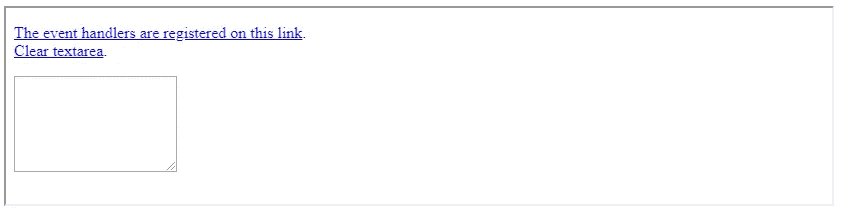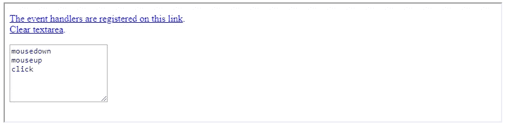

OnClick

# 图像替换

# 图像属性

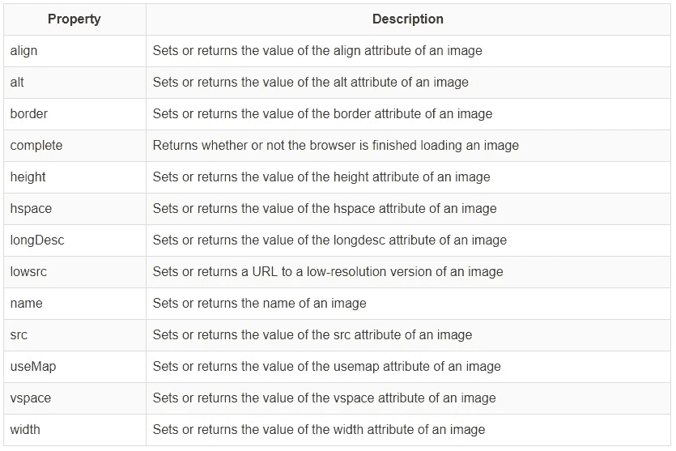

通过将图像对象的 src 属性更改为另一个图像文件的 URL 或另一个图像对象的 src，可以替换已经加载到页面上的图像。下面是两个代码示例:

```
document.images[0].src = "http://www.somehost.co.uk/images/myImg.gif";cacheimage = new Image();
cacheimage.src = "http://www.somehost.co.uk/images/myImg.gif";
firstimage = new Image();
firstimage.src = document.images[0].src;
document.images[0].src = cacheimage.src;
.
.
.
document.images[0].src = firstimage.src;
```

# 简单的例子

使用 src 属性更改图像的 URL 会导致新图像逐渐加载到页面上。替代不会立即发生。

```
<form>
<input type="button" value="simple0.jpg" onclick="document.images[0].src = 'simple0.jpg'">
<input type="button" value="simple1.jpg" onclick="document.images[0].src = 'simple1.jpg'">
</form>
```

# 将图像预加载到缓存中

使用 image 对象，可以在页面加载时开始加载两个图像。当两个图像都被加载时，页面加载变慢，因此第一个图像可能需要更长时间才能出现。一旦它们都被加载，图像替换是非常快的。

```
<script>
cache0 = new Image(257,75)
cache0.src = "cache0.jpg"
cache1 = new Image(257,75)
cache1.src = "cache1.jpg"
</script><form>
<input type="button" value="simple0.jpg" 
  onclick="document.images[0].src = cache0.src">
<input type="button" value="simple1.jpg" 
  onclick="document.images[0].src = cache1.src">
</form>
```

# 不同的语法

因为``的 name 属性设置为“sample ”,所以可以使用 document.sample 引用页面中的图像，避免使用 images 数组和索引。

# 将图像预加载到缓存中

```
<script>
cache0 = new Image(257,75)
cache0.src = "cache0.jpg"
cache1 = new Image(257,75)
cache1.src = "cache1.jpg"
</script><form>
<input type="button" value="simple0.jpg" 
  onclick="document.sample.src = cache0.src">
<input type="button" value="simple1.jpg" 
  onclick="document.sample.src = cache1.src">
</form>
```

# 简单的翻转

```
<body>

<script>
normal = new Image();
normal.src = "jsbnormal.jpg";
down = new Image();
down.src = "jsbdown.jpg";
up = new Image();
up.src = "jsbup.jpg";
over = new Image();
over.src = "jsbover.jpg";
</script>


</body>
```

# setTimeout()方法

## 句法

```
window.setTimeout( "javascript function", milliseconds );
```

这个方法可以不用窗口前缀来编写。

`setTimeout()`该方法将等待指定的毫秒数，然后执行指定的函数。

`setTimeout()`的第一个参数应该是函数。

第二个参数表示从现在开始，您希望执行第一个参数多少毫秒。

## 例子

等待 3 秒钟，然后提示“你好”:

```
setTimeout( function() { 
   alert( "Hello" ) 
   }, 3000 
);
```

# 如何停止执行？

`clearTimeout()`方法用于停止执行 setTimeout()方法中指定的函数。

## 句法

```
window.clearTimeout(timeoutVariable)
```

window.clearTimeout()方法可以在没有窗口前缀的情况下编写。为了能够使用 clearTimeout()方法，您必须在创建 Timeout 方法时使用一个全局变量:

```
myVar = setTimeout( "javascript function", milliseconds );
```

然后，如果该函数尚未执行，您将能够通过调用`clearTimeout()`方法来停止执行。

## 例子

```
var myVar;

function myFunction() {
  myVar = setTimeout( function() {
     alert( "Hello" );
  }, 3000 );
}

function myStopFunction() {
   clearTimeout( myVar );
}
```

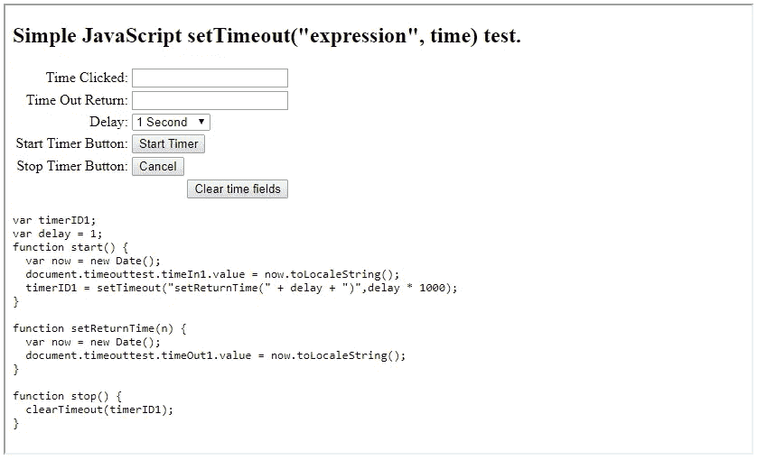